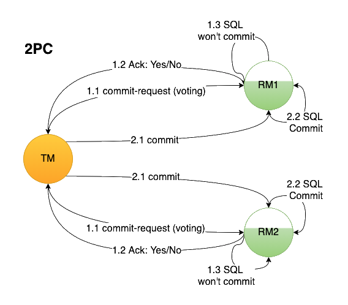

# Distributed Systems Algorithms: A Comprehensive Overview

<p align="center">
   <br/>
</p>

## Table of Contents

- [Introduction to Distributed Systems Algorithms](#introduction-to-distributed-systems-algorithms)
- [Key Challenges in Distributed Systems](#key-challenges-in-distributed-systems-at-the-algorithmic-level)
- [Overview of Prominent Algorithms](#overview-of-prominent-algorithms)
- [Placing Algorithms in Context](#placing-algorithms-in-context)
- [Conclusion](#conclusion)
- [References](#references)

---

## Introduction to Distributed Systems Algorithms

In the evolving landscape of computer science, **distributed systems** have emerged as a cornerstone for building
scalable, reliable, and efficient applications. Unlike centralized systems, distributed systems consist of multiple
independent nodes that collaborate to perform tasks, share resources, and provide services. This architectural paradigm
is fundamental to a wide array of technologies, including cloud computing, microservices, large-scale web applications,
and blockchain.

At the core of distributed systems lie **algorithms** the step-by-step procedures that govern how nodes interact, make
decisions, and maintain consistency across the network.  
These algorithms are meticulously designed to address the inherent complexities and challenges posed by distributed
environments, such as:

- Network latency.
- Partial failures.
- Absence of a global clock.

### The Role of Algorithms in Distributed Systems

Algorithms in distributed systems serve as the foundational mechanisms that ensure the seamless operation of the
network. They dictate how data is stored, replicated, and synchronized; how consensus is achieved among nodes; how
failures are detected and mitigated; and how tasks are coordinated and executed across the system. Without robust
algorithms, the distributed nature of these systems would lead to inconsistencies, inefficiencies, and vulnerabilities.

---

## Key Challenges in Distributed Systems at the Algorithmic Level

Creating algorithms for distributed systems is intrinsically difficult because of the complex nature of these
environments. The main algorithmic challenges arise from the distributed characteristics of the system, such as:

1. **Consensus and Agreement**
2. **Consistency Models**
3. **Fault Detection and Recovery**
4. **Data Replication and Synchronization**
5. **Leader Election and Coordination**
6. **Scalability and Load Balancing**
7. **Latency and Network Partitioning**

### 1. Consensus and Agreement

<p align="center">
   
</p>

**Consensus** refers to the process by which multiple nodes agree on a single data value or a course of action.
Achieving consensus is fundamental for tasks such as committing transactions, coordinating updates, and maintaining a
consistent state across the system.

**Challenges:**

- **Faulty Nodes**: Nodes may fail or behave unpredictably, making reliable agreement difficult.
- **Network Issues**: Message delays, losses, or reordering can disrupt the consensus process.
- **Scalability**: As the number of nodes increases, the complexity of achieving consensus grows exponentially.

### 2. Consistency Models

<p align="center">
   
</p>

**Consistency models** define the rules for how operations on data are observed across different nodes, balancing
trade-offs between performance, availability, and consistency.

**Common Models:**

- **Strong Consistency**: Guarantees all nodes see the same data simultaneously.
- **Eventual Consistency**: Ensures all replicas converge to the same value over time without immediate synchronization.
- **Causal Consistency**: Maintains the order of causally related operations, allowing flexibility in the visibility of
  other operations.

### 3. Fault Detection and Recovery

<p align="center">
   
</p>

In distributed systems, nodes can fail due to hardware malfunctions, software bugs, or network issues.
**Fault detection** mechanisms identify such failures promptly, while **recovery** strategies ensure the system can
continue to operate
correctly despite these failures.

**Challenges:**

- **Partial Failures**: Only a subset of nodes may fail, requiring isolation and management of affected components
  without disrupting the entire system.
- **Detection Delays**: Accurately and quickly detecting failures without generating false positives.
- **Recovery Procedures**: Implementing efficient and reliable methods to restore failed nodes or redistribute tasks.

### 4. Data Replication and Synchronization

<p align="center">
   
</p>

**Data replication** involves maintaining multiple copies of data across different nodes to enhance availability and
fault tolerance. **Synchronization** ensures all replicas remain consistent with each other.

**Challenges:**

- **Consistency Maintenance**: Balancing the need for data consistency with the performance overhead of synchronization.
- **Conflict Resolution**: Handling cases where concurrent updates lead to conflicting data states.
- **Replication Lag**: Minimizing delays between updates on different replicas to ensure timely consistency.

### 5. Leader Election and Coordination

<p align="center">
   
</p>

Many distributed algorithms rely on a **leader** node to coordinate actions, manage resources, or make decisions on
behalf of the system. **Leader election** algorithms select a leader, especially when the current leader fails or
becomes unavailable.

**Challenges:**

- **Leader Failures**: Detecting and handling the failure of a leader node without disrupting the system.
- **Election Overhead**: Minimizing the time and resources required to elect a new leader.
- **Dynamic Environments**: Adapting to changes in the network, such as nodes joining or leaving the system.

### 6. Scalability and Load Balancing

<p align="center">
   
</p>

As distributed systems grow, **scalability** ensures they can handle increased workloads by adding more nodes. **Load
balancing** distributes tasks evenly across nodes to prevent bottlenecks and ensure optimal resource utilization.

**Challenges:**

- **Dynamic Scaling**: Efficiently adding or removing nodes in response to changing demand without significant downtime.
- **Resource Allocation**: Distributing tasks to maximize performance while minimizing latency and resource contention.
- **Monitoring and Adaptation**: Continuously assessing system performance and adjusting load distribution strategies
  accordingly.

### 7. Latency and Network Partitioning

<p align="center">
   
</p>

**Latency** refers to communication delays between nodes, while **network partitioning** occurs when subsets of nodes
become isolated due to network failures.

**Challenges:**

- **Minimizing Latency**: Designing algorithms that reduce communication delays to improve system responsiveness.
- **Handling Partitions**: Ensuring the system can operate or recover gracefully when parts of the network become
  unreachable.
- **Trade-offs**: Balancing consistency and availability in the presence of latency and partitioning, as highlighted by
  the **CAP theorem**.

---

## Overview of Prominent Algorithms

To effectively address the challenges outlined above, a diverse set of algorithms has been developed. These algorithms
are categorized based on their primary functions, such as consensus, replication and leader election.
Below is an overview of some of the most influential and widely adopted algorithms in the field of distributed systems.

### 1. Consensus Algorithms

Consensus algorithms ensure that distributed nodes can agree on shared states or decisions, which is critical for
maintaining consistency and coordination.

#### 1.1 Paxos

  <p align="center">
     

- **Introduction**: Proposed by Leslie Lamport, Paxos is a foundational consensus algorithm designed for asynchronous
  environments where messages can be lost or delayed, and nodes can fail.

- **Key Concepts (Roles)**:
    - **Proposers**: Nodes that propose values to be agreed upon.
    - **Acceptors**: Nodes that vote on proposed values and contribute to reaching consensus.
    - **Learners**: Nodes that learn the chosen value once consensus is achieved.

  In many implementations, a single node can fulfill multiple roles.

- **Algorithm Workflow**:
    1. **Prepare Phase**: A proposer sends a prepare request with a unique proposal number to a majority of acceptors to
       initiate a potential decision.
       ```text
       +-----------+               +-----------+
       | Proposer  |               | Acceptor  |
       |           |               |     1     |
       |  Prepare  |-------------->|           |
       |    (n)    |               +-----------+
       |           |               +-----------+
       |           |-------------->| Acceptor  |
       |           |               |     2     |
       |           |               +-----------+
       |           |-------------->| Acceptor  |
       |           |               |     3     |
       +-----------+               +-----------+
       ```
    2. **Promise Phase**: Acceptors respond by promising not to accept lower-numbered proposals and may include the
       highest-numbered proposal they’ve previously accepted.
       ```text
       +-----------+               +-----------+
       | Acceptor  |<--------------| Proposer  |
       |     1     |  Promise(n)   |           |
       +-----------+               +-----------+
       
       +-----------+               +-----------+
       | Acceptor  |<--------------| Proposer  |
       |     2     |  Promise(n)   |           |
       +-----------+               +-----------+
       
       +-----------+               +-----------+
       | Acceptor  |<--------------| Proposer  |
       |     3     |  Promise(n)   |           |
       +-----------+               +-----------+
       ```
    3. **Accept Phase**: The proposer, after receiving promises, sends an accept request with a value (either their own
       or the highest previously accepted proposal).
       ```text
       +-----------+               +-----------+
       | Proposer  |               | Acceptor  |
       |  Accept   |-------------->|     1     |
       | (n, val)  |               +-----------+
       |           |               +-----------+
       |           |-------------->| Acceptor  |
       |           |               |     2     |
       |           |               +-----------+
       |           |-------------->| Acceptor  |
       |           |               |     3     |
       +-----------+               +-----------+
       ```
    4. **Accepted Phase**: Acceptors accept the proposal if it doesn’t conflict with any promises they have made to
       other proposers.
       ```text
       +-----------+               +-----------+
       | Acceptor  |---Accepted--->| Learners  |
       |     1     |               |           |
       +-----------+               +-----------+
       
       +-----------+               +-----------+
       | Acceptor  |---Accepted--->| Learners  |
       |     2     |               |           |
       +-----------+               +-----------+
       
       +-----------+               +-----------+
       | Acceptor  |---Accepted--->| Learners  |
       |     3     |               |           |
       +-----------+               +-----------+
       ```
    5. **Learning Phase**: Once a majority of acceptors accept a value, learners are notified, and the value is
       considered chosen by the system.
       ```text
       +-----------+               +-----------+
       | Learners  |<---Learned----| Acceptor  |
       |           |               |     1     |
       +-----------+               +-----------+
       
       +-----------+               +-----------+
       | Learners  |<---Learned----| Acceptor  |
       |           |               |     2     |
       +-----------+               +-----------+
       
       +-----------+               +-----------+
       | Learners  |<---Learned----| Acceptor  |
       |           |               |     3     |
       +-----------+               +-----------+
       ```

- **Advantages**:
    - Provides strong consistency guarantees.
    - Proven to work correctly even when some nodes fail or messages are delayed.

- **Challenges**:
    - Complex to understand and implement.
    - Requires multiple rounds of message exchanges, which can lead to inefficiency in high-latency environments.

- **Variants**:
    - **Multi-Paxos**: Optimizes Paxos for systems with continuous streams of operations by reusing leaders.
    - **Fast Paxos**: Reduces the number of message delays but requires additional coordination.

#### 1.2 Raft

<p align="center">
   
</p>

- **Introduction**: Raft is a consensus algorithm developed as an alternative to Paxos, designed to be more
  understandable while providing the same guarantees. Raft is structured around three key components: leader election,
  log replication, and safety.

- **Roles**:
    - **Leader**: Manages the replicated log and coordinates with followers.
    - **Followers**: Replicate logs from the leader and respond to client requests.
    - **Candidates**: Nodes that become candidates when the leader fails and initiate leader elections.

- **Key Components**:
    1. **Leader Election**: A new leader is elected if the current leader fails. The leader manages the replicated log
       and coordinates with followers.
    2. **Log Replication**: The leader receives client requests, appends them to its log, and replicates these logs to
       follower nodes, ensuring consistency by requiring a majority to commit a log entry.
    3. **Safety**: Ensures that once a log entry is committed, it will not be lost, and the system remains consistent
       across node failures.
- **Algorithm Workflow**:
    1. **Normal Operation**: The leader receives requests from clients, appends them to its log, and replicates these
       entries to followers.
        ```text
        +---------+           +---------+           +---------+
        | Client  |           | Leader  |           | Follower|
        |         |           |         |           |    1    |
        | Request |---------->| Append  |           |         |
        |         |           |  Entry  |           |         |
        +---------+           +---------+           +---------+
                                |
                                | AppendEntries RPC (term, entries)
                                v
                          +---------+           +---------+
                          | Follower|           | Follower|
                          |    2    |           |    3    |
                          +---------+           +---------+
                                |
                                | Acknowledgment
                                v
                          +---------+
                          | Leader  |
                          |         |
                          | Commit  |
                          | Entry   |
                          +---------+
        ```

    2. **Leader Election**: If a follower does not receive a heartbeat within a specified timeout, it becomes a
       candidate and initiates an election by requesting votes from other nodes.
        ```text
        +-----------+           +-----------+           +-----------+
        | Candidate |           |  Follower |           |  Follower |
        |           |           |     1     |           |     2     |
        | Request   |---------->|           |           |           |
        | Vote      |           |           |           |           |
        +-----------+           +-----------+           +-----------+
               |                        |                        |
               |                        |                        |
               |                        |                        |
               v                        v                        v
        +-----------+           +-----------+           +-----------+
        |  Follower |           |  Follower |           |  Follower |
        |     1     |<----------|     2     |<----------|     3     |
        | Vote      |           | Vote      |           | Vote      |
        | Granted   |           | Granted   |           | Granted   |
        +-----------+           +-----------+           +-----------+
               |
               |
               v
        +-----------+
        | Candidate |
        | Becomes   |
        | Leader    |
        +-----------+
        ```

    3. **Log Consistency**: The new leader ensures that all followers' logs match its own up to the last committed
       entry, maintaining consistency across the cluster.
        ```text
        +------------+            +----------+          +----------+
        | Leader     |            | Follower |          | Follower |
        |            |            |    1     |          |    2     |
        | Log        |----------> | Log      |          | Log      |
        | Consistency|            | Entry    |          | Entry    |
        | Check      |            | Matching |          | Matching |
        +------------+            +----------+          +----------+
              |                         |                     |
              |                         |                     |
              |                         |                     |
              v                         v                     v
        +------------+            +---------+           +---------+
        | Leader     |            | Follower|           | Follower|
        | Apply      |<---------- | Apply   |<----------| Apply   |
        | Entries    |            | Entries |           | Entries |
        +------------+            +---------+           +---------+
              |                   
              |                   
              v                   
        +------------+            
        | Commit     |            
        | Entries    |            
        +------------+            
        ```

- **Advantages**:
    - Simplicity and understandability compared to Paxos.
    - Efficient leader election and log replication mechanisms.
    - Easier to implement correctly.
- **Challenges**:
    - Handling network partitions and ensuring availability can be challenging.
    - The leader-centric approach may introduce bottlenecks under high load.

- **Use Cases**: Widely used in distributed databases (e.g., etcd, CockroachDB), key-value stores, and service discovery
  systems (e.g., Consul).

#### 1.3 Byzantine Fault Tolerance (BFT) Algorithms

<p align="center">
   
</p>

- **Introduction**: BFT algorithms are designed to handle scenarios where nodes may act maliciously or fail in
  unpredictable ways, known as Byzantine faults. **Practical Byzantine Fault Tolerance (PBFT)** is a well-known example
  that can tolerate up to one-third faulty nodes.

- **Key Concepts**:
    - **Primary (Leader)**: A leader node that coordinates the protocol.
    - **Replicas**: Nodes that follow the leader and help in reaching consensus.
    - **View Changes**: Mechanism to handle a faulty leader by electing a new one.

- **Algorithm Workflow**:
    1. **Pre-Prepare Phase**: The primary (leader) broadcasts a request to all replicas.
    2. **Prepare Phase**: Replicas verify the (primary) request and broadcast a prepare message.
    3. **Commit Phase**: If a replica receives enough prepare messages (usually the majority), it broadcasts a commit
       message.
    4. **Reply Phase**: Replicas send the result back to the client after committing.

- **Advantages**:
    - High fault tolerance, suitable for blockchain and financial applications.
    - Can handle malicious behavior and arbitrary failures.
- **Challenges**:
    - High communication overhead due to multiple message exchanges.
    - Complexity in implementation and ensuring security against various attack vectors.
- **Variants**:
    - **Tendermint BFT**: Optimizes PBFT for blockchains with better efficiency.
    - **HotStuff**: An asynchronous BFT consensus algorithm designed for better scalability and performance.

### 2. Replication and Consistency Algorithms

These algorithms manage how data is replicated across nodes and ensure all replicas remain consistent, even in the face
of failures.

#### 2.1 Two-Phase Commit (2PC) and Three-Phase Commit (3PC)

<p align="center">
   
   
</p>

- **Introduction**: These are classic protocols for achieving atomic commitment across distributed databases.
- **Two-Phase Commit (2PC)**:
    - **Prepare Phase**: The coordinator asks all participant nodes to prepare to commit.
        - **Commit Phase**: If all participants agree, the coordinator commits the transaction.
- **Three-Phase Commit (3PC)**:
    - Adds a third phase to improve fault tolerance over 2PC.
        - **CanCommit Phase**: Coordinator sends a "Can Commit?" message to participants.
    - **PreCommit Phase**: If all agree, the coordinator sends a "PreCommit" message.
    - **Commit Phase**: Upon receiving acknowledgments, the coordinator commits the transaction.

- **Advantages**:
    - Ensures atomic transactions across distributed systems.

- **Challenges**:
    - **2PC** is a blocking protocol; if the coordinator fails, participants may be left waiting indefinitely.
    - **3PC** increases complexity and communication overhead.

- **Use Cases**: Used in distributed databases and transaction management systems.

#### 2.2 Conflict-Free Replicated Data Types (CRDTs)

<p align="center">
   
</p>

- **Introduction**: CRDTs provide a way to achieve eventual consistency without complex coordination, allowing for
  automatic conflict resolution.

- **Key Features**:
    - **Commutative Operations**: Operations can be applied in any order and still achieve the same result.
    - **Conflict Resolution**: Conflicts are resolved automatically based on predefined rules.
- **Types of CRDTs**:
    - **Counters**: G-Counter (Grow-only Counter), PN-Counter (Positive-Negative Counter).
    - **Registers**: LWW-Register (Last-Write-Wins Register).
    - **Sets**: G-Set (Grow-only Set), OR-Set (Observed-Remove Set).

- **Advantages**:
    - Suitable for collaborative applications where eventual consistency is acceptable.
    - Reduces the need for complex synchronization mechanisms.

- **Challenges**:
    - Limited types of operations and data structures.
    - Potential for increased storage requirements due to metadata overhead.

- **Use Cases**: Real-time collaborative editing, distributed caching, synchronization in weakly connected environments.

### 3. Leader Election Algorithms

Leader election algorithms are essential for selecting a coordinator node that manages specific tasks within the system.

#### 3.1 Bully Algorithm

<p align="center">
   
</p>

- **Introduction**: The Bully Algorithm is a leader election algorithm used in distributed systems where nodes have
  unique identifiers.

- **Key Features**:
    - **Election Process**: The node with the highest ID becomes the leader.
    - **Election Messages**: Nodes send election messages to higher ID nodes; the highest ID node declares itself the
      leader.

- **Advantages**:
    - Simple to implement.
    - Guarantees that the highest ID node becomes the leader.
- **Challenges**:
    - High communication overhead due to multiple message exchanges.
    - Does not handle network partitions well.
    - Potential delays in leader election in large networks.

#### 3.2 Ring Algorithm

<p align="center">
   
</p>

- **Introduction**: The Ring Algorithm is a leader election algorithm where nodes are arranged in a logical ring.

- **Key Features**:
    - **Token Passing**: A token is passed around the ring; the node with the highest ID becomes the leader.
        - **Resilience**: Handles failures more gracefully by allowing the ring to reorganize.
- **Advantages**:
    - Efficient in terms of message passing, as each node communicates only with its neighbors.
        - Better handles dynamic membership changes compared to the Bully Algorithm.
- **Challenges**:
    - Complexity in handling dynamic membership changes and maintaining the ring structure.
    - Potential delays in leader election if the token is lost or delayed.

---

## Summary of Key Distributed Systems Algorithms

| **Algorithm**                                   | **Type**                    | **Key Features**                                                     | **Advantages**                                                | **Challenges**                                                   | **Use Cases**                                        |
|-------------------------------------------------|-----------------------------|----------------------------------------------------------------------|---------------------------------------------------------------|------------------------------------------------------------------|------------------------------------------------------|
| **Paxos**                                       | Consensus                   | Proposers, Acceptors, Learners; multi-phase process                  | Strong consistency; Proven correctness                        | High complexity; Inefficient due to multiple message rounds      | Distributed databases, coordination services         |
| **Raft**                                        | Consensus                   | Leader election, log replication, safety                             | Simplicity and understandability; Efficient leader election   | Handling network partitions; Leader-centric bottlenecks          | etcd, Consul, CockroachDB, service discovery         |
| **Practical Byzantine Fault Tolerance (PBFT)**  | Byzantine Fault Tolerance   | Primary-Replica model; View changes                                  | High fault tolerance; Handles malicious nodes                 | High communication overhead; Complex implementation              | Blockchain, financial systems                        |
| **Two-Phase Commit (2PC)**                      | Replication and Consistency | Coordinator and participants; Prepare and Commit phases              | Ensures atomic transactions                                   | Blocking protocol; Not fault-tolerant against network partitions | Distributed databases, transaction systems           |
| **Three-Phase Commit (3PC)**                    | Replication and Consistency | Adds CanCommit and PreCommit phases to avoid blocking                | Improved fault tolerance over 2PC                             | Higher complexity; Increased latency                             | Distributed databases, transaction systems           |
| **Conflict-Free Replicated Data Types (CRDTs)** | Replication and Consistency | Commutative operations; Automatic conflict resolution                | Eventual consistency; Suitable for collaborative applications | Limited operation types; Increased metadata storage              | Real-time collaborative editing, distributed caching |
| **Bully Algorithm**                             | Leader Election             | Highest ID node becomes leader; Election messages to higher ID nodes | Simple implementation; Guarantees highest ID leader           | High communication overhead; Poor handling of network partitions | Simple distributed systems                           |
| **Ring Algorithm**                              | Leader Election             | Logical ring structure; Token passing                                | Efficient message passing; Better handles dynamic membership  | Complexity in maintaining ring structure; Token loss handling    | Distributed systems with dynamic membership          |

## Placing Algorithms in Context

Understanding where each algorithm fits within the broader landscape of distributed systems is crucial for selecting the
right tool for the job. Different algorithms are tailored to address specific challenges and requirements, and their
applicability varies based on the system's goals and constraints.

- **Consensus Algorithms**: Paxos and Raft are essential for scenarios requiring strong consistency and coordination
  among nodes. While Paxos offers a robust and theoretically sound approach, its complexity can be a barrier to
  implementation. Raft provides similar guarantees with a more approachable design, making it a preferred choice for
  many modern systems. BFT algorithms are vital in environments where security against malicious actors is paramount,
  such as in blockchain technologies.

- **Replication and Consistency Algorithms**: CRDTs are particularly useful in applications where eventual consistency
  is acceptable, such as collaborative editing tools.

- **Leader Election Algorithms**: The Bully Algorithm and Ring Algorithm offer different approaches to electing a
  leader, each with its strengths and trade-offs. The choice depends on factors like network size, node reliability, and
  the desired efficiency of the election process.

**Integrated Use of Algorithms**

In real-world distributed systems, multiple algorithms often work in tandem to address various challenges. For instance,
a distributed database might use Raft for consensus or CRDTs for conflict-free data replication.
This integrated approach ensures the system achieves high availability, consistency, and fault tolerance while
maintaining scalability and efficiency.

---

## Conclusion

Distributed systems rely on a variety of algorithms to ensure reliability, consistency, fault tolerance, and
scalability. Understanding these algorithms and their trade-offs provides valuable insights for designing robust
distributed systems. Each algorithm has its strengths and weaknesses, and the choice depends on the specific
requirements and constraints of the system.

By comprehensively analyzing these algorithms—including their design principles, operational workflows, advantages,
challenges, and real-world applications—developers and engineers can make informed decisions that enhance system
performance and reliability.

---

## References

- [Paxos Made Simple](https://lamport.azurewebsites.net/pubs/paxos-simple.pdf)
- [In Search of an Understandable Consensus Algorithm (Raft)](https://raft.github.io/raft.pdf)
- [Practical Byzantine Fault Tolerance (PBFT)](http://pmg.csail.mit.edu/papers/osdi99.pdf)
- [Conflict-Free Replicated Data Types (CRDTs)](https://crdt.tech)
- [Leader Deputies Algorithm for Leader Election in Distributed Systems](https://www.researchgate.net/publication/346932388_Leader_Deputies_Algorithm_for_Leader_Election_in_Distributed_Systems)
- [Leader Election](https://en.wikipedia.org/wiki/Leader_election)

## Simulators

- [Paxos Demo](https://echentw.github.io/paxos-demo)
- [Raft Simulator](https://raft.github.io)
