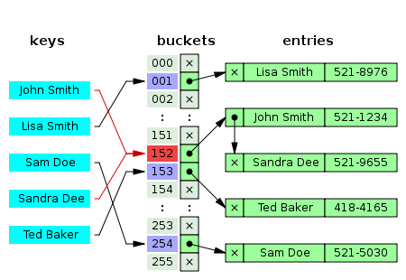
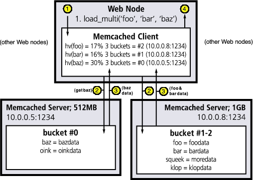
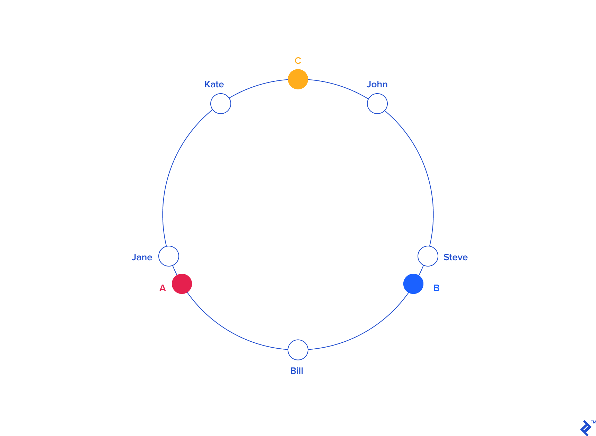
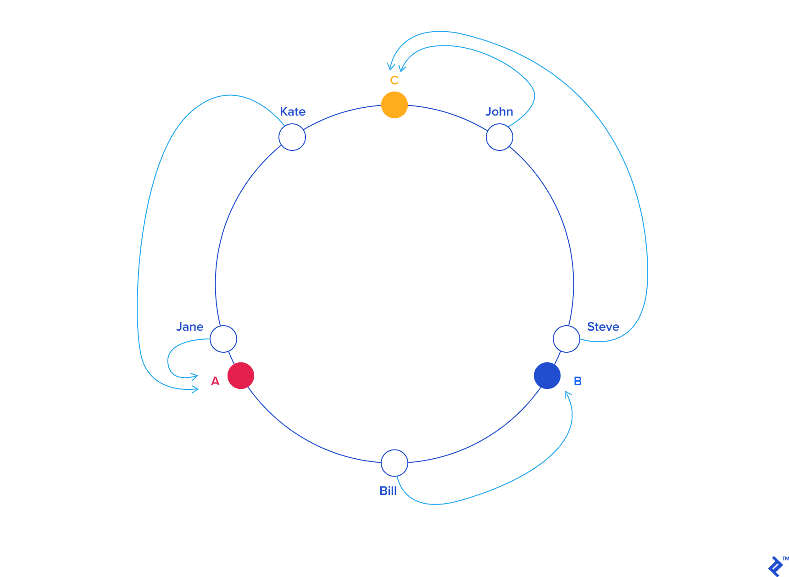
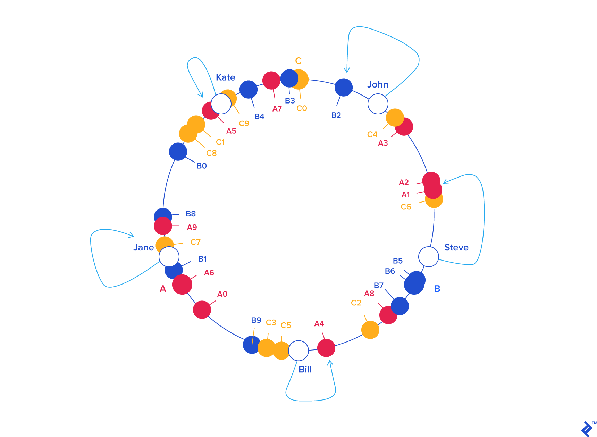
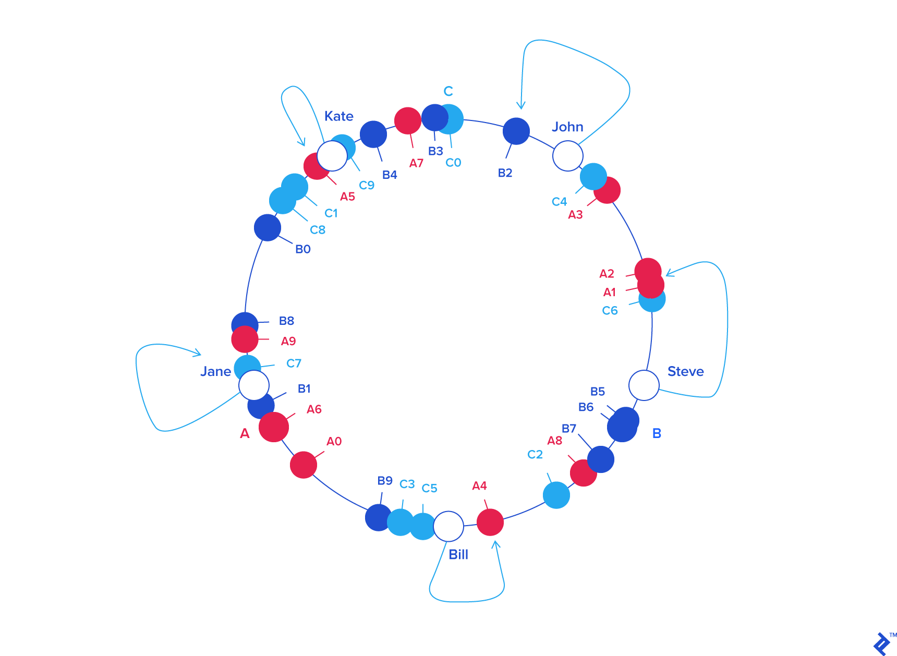
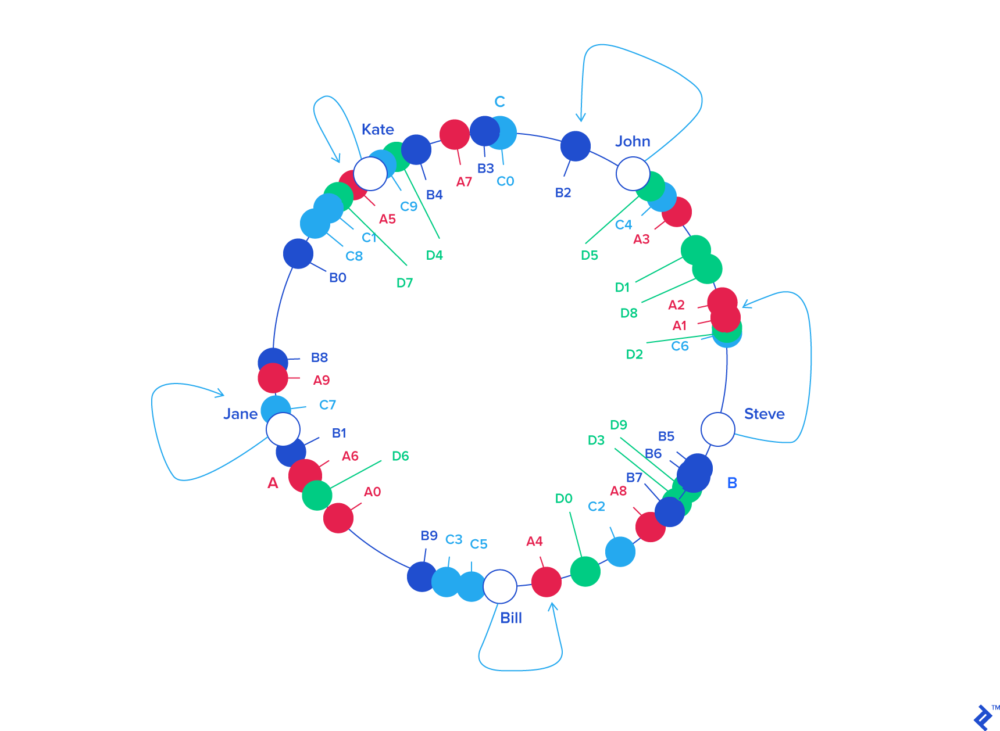

# Consistent Hashing

## Hash Tables

* Goal: Efficiently store and search data
* Naive approach: Array or linked list
    * Search by iterating elements → **O(n)** complexity
    * Fast for small lists, slow for large datasets

* Hash Functions:
  * Map arbitrary data → integer index
  * Allows near-constant time access for non-sequential or random keys
  * Formula: `index = hash(object) mod N`
      * N = array size (practical, usually ~2× expected elements)

---

## Handling Collisions

* Multiple objects can map to the same index → **collisions**
* Typical solution: **buckets**

    * Each array entry points to a list of objects
    * Insert: add to bucket if not present
    * Search: check bucket for object
* Complexity: ~**O(N/k)**, with k = number of buckets



---

## Distributed Hash Tables & Key Distribution

* **Motivation:**

    * Split a hash table across multiple servers to bypass memory limits
    * Enable arbitrarily large hash tables

* **How It Works:**

    * Objects and keys are distributed among several servers → **Distributed Hash Table (DHT)**
    * Typical use case: **in-memory caches** (e.g., **Memcached**)

        * Pool of servers stores key/value pairs
        * Provides fast access to frequently used data

## Cache Workflow

1. Application queries the cache first
2. If **cache miss**, fetch from database/source
3. Store result in cache for future access

* **Key Distribution:**

    * Strategy determines **which keys go to which servers**
    * Crucial for **load balancing, scalability, and reliability**



---

## Key Distribution via Hash Modulo

* Formula:

  ```
  server_index = hash(key) mod N
  ```

    * N = number of servers
    * Client computes hash → modulo → contacts server
    * Same hash function across clients is required

---

## Example Setup

* Servers: **A, B, C** (N = 3)
* Keys and their hashes:

| KEY   | HASH       | HASH mod 3 |
| ----- | ---------- | ---------- |
| john  | 1633428562 | 2          |
| bill  | 7594634739 | 0          |
| jane  | 5000799124 | 1          |
| steve | 9787173343 | 0          |
| kate  | 3421657995 | 2          |

| A     | B    | C    |
| ----- | ---- | ---- |
| bill  | jane | john |
| steve |      | kate |

---

## The Rehashing Problem

* Simple modulo-based distribution works **until the number of servers changes**
* Problem occurs when:

    * A server crashes or becomes unavailable
    * New servers are added to the pool
* Most keys need to be **rehased** because `hash(key) mod N` changes

---

## Example: Removing Server C

* Previous pool: 3 servers (A, B, C)
* Remove server C → N = 2
* Recompute server index: `server_index = hash(key) mod 2`

| KEY   | HASH       | HASH mod 2 |
| ----- | ---------- | ---------- |
| john  | 1633428562 | 0          |
| bill  | 7594634739 | 1          |
| jane  | 5000799124 | 0          |
| steve | 9787173343 | 1          |
| kate  | 3421657995 | 1          |


| A    | B     |
| ---- | ----- |
| john | bill  |
| jane | steve |
|      | kate  |

* **Observation:** All key locations changed, not just those on removed server

---

## Consequences for Caching

* Most queries result in **cache misses**
* Data must be fetched again from the source
* Heavy load on origin servers (e.g., databases)
* Can severely **degrade performance** or cause **server crashes**

---

## The Solution: Consistent Hashing

* Problem: Modulo-based distribution requires massive rehashing when servers change
* Solution: **Consistent Hashing** (Karger et al., 1997)
* Minimizes key relocation when servers are added or removed

---

## Hash Ring Concept

* Map the hash output range to a circle:

    * 0 → 0°
    * INT_MAX → 360°
    * All other hashes → intermediate angles
* Keys and servers are placed on the same circle by hashing their values

---

## Example: Keys on the Circle

| KEY   | HASH       | ANGLE (DEG) |
| ----- | ---------- | ----------- |
| john  | 1633428562 | 58.8        |
| bill  | 7594634739 | 273.4       |
| jane  | 5000799124 | 180         |
| steve | 9787173343 | 352.3       |
| kate  | 3421657995 | 123.2       |

* Servers are also hashed to angles:

| SERVER | HASH       | ANGLE (DEG) |
| ------ | ---------- | ----------- |
| A      | 5572014558 | 200.6       |
| B      | 8077113362 | 290.8       |
| C      | 2269549488 | 81.7        |



---

## Mapping Keys to Servers

* Rule: **Each key goes to the first server clockwise after its angle**
* Example assignments:



---

## Balancing Load: Virtual Nodes

* Assign multiple **labels/angles per server** (virtual nodes)
* Example: A0..A9, B0..B9, C0..C9
* Adjust weight per server for load balancing:

    * More powerful servers → more virtual nodes



---

## Resilience to Server Changes

* **Server removal:** only keys mapped to removed server labels are reassigned
* **Server addition:** only keys near new server labels are reassigned
* Keys for other servers **remain unchanged**
* Result: **minimal remapping** → avoids massive cache misses





---

## Replication Factor

* Store each key on **k different servers**
* Ensures **fault tolerance**: data available if a server fails
* Example: Replication factor = 3 → key `john` on B, C, and A


## Resources
- https://www.linuxjournal.com/article/7451
- https://www.toptal.com/developers/big-data/consistent-hashing


