# Raft Consensus Algorithm – Theory

Raft (Replicated and Fault-Tolerant) is a consensus algorithm designed to manage replicated logs across a cluster of nodes. Unlike other consensus algorithms such as **Paxos**, Raft emphasizes **understandability**, making it easier for developers to implement and reason about. Its primary goal is to ensure that all nodes in a distributed system agree on a shared state, even in the presence of failures.

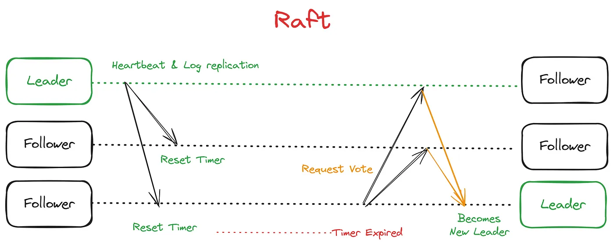  
*Figure 1: Overview of the Raft Consensus Process*

Raft achieves consensus through three core components:

- **Leader Election** – Selecting a single node as leader, responsible for log management and coordination.
- **Log Replication** – Ensuring the leader’s log entries are consistently replicated to followers.
- **Safety** – Guaranteeing that committed entries remain durable and consistent across all nodes.

---

## Key Components

### Leader Election

Leader election is the process by which Raft selects a single leader from the cluster. The leader handles client interactions, manages log replication, and maintains the system’s state. If the current leader fails or becomes unreachable, Raft initiates a new election.

**Process:**

1. **Election Timeout** – Each follower starts an election timer. If no heartbeat (AppendEntries RPC) is received, it becomes a candidate.
2. **Becoming a Candidate** – The candidate increments its term and requests votes from other nodes via RequestVote RPCs.
3. **Voting** – Nodes respond based on their current term and log state. A candidate needs majority votes to become the leader.
4. **Leader Declaration** – Once a candidate receives majority votes, it becomes the leader and sends heartbeats.

---

### Log Replication

Once a leader is elected, it manages the replicated log. Client requests are appended to the leader’s log and replicated to followers.

**Process:**

1. **Appending Entries** – Leader appends client commands to its log and sends AppendEntries RPCs to followers.
2. **Acknowledgments** – Followers append the entries and acknowledge receipt.
3. **Commitment** – After a majority acknowledgment, the leader commits the entry, applies it to its state machine, and instructs followers to commit.
4. **Consistency** – If a follower’s log is inconsistent, the leader overwrites it to maintain uniformity.

---

### Safety

Raft ensures committed entries remain consistent and cannot be lost.

**Safety Properties:**

- **Election Safety** – Only one leader per term, avoiding split-brain.
- **Log Matching** – Logs with the same index and term are identical up to that point.
- **Leader Append-Only** – Leaders never overwrite or delete entries, maintaining history integrity.

---

## Detailed Mechanisms

### Election Process

Leader election ensures only one authoritative leader exists.

**Steps:**

1. **Start as Follower** – Nodes wait for heartbeats.
2. **Timeout and Candidate State** – Follower times out and becomes a candidate.
3. **Request Votes** – Candidate increments term and requests votes.
4. **Voting Criteria**:
    - Candidate term ≥ voter term
    - Candidate log ≥ voter log
5. **Majority Vote** – Candidate becomes leader with majority votes.
6. **Split Votes** – Randomized timeouts reduce repeated split votes.

---

### Phases of Leader Election

1. **Initialization** – All nodes are followers, waiting for heartbeats.  
   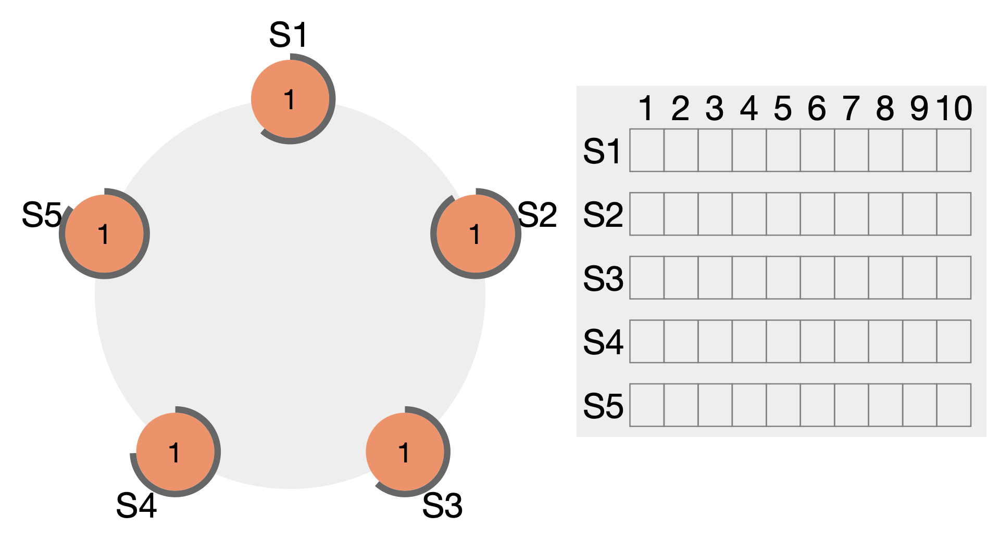  
   *Figure 2: Nodes waiting with varying timeouts*

2. **First Candidate Timeout** – First node times out, votes for itself, and sends candidacy.  
   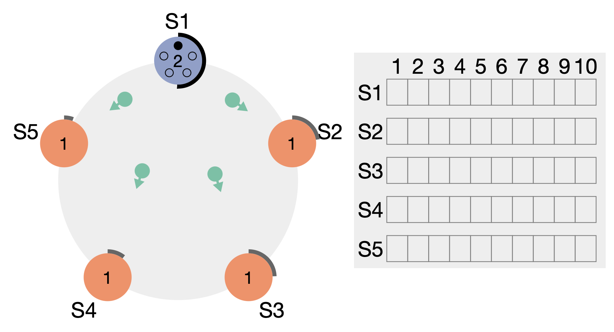  
   *Figure 3: Candidate sends requests and votes for itself*

3. **Subsequent Timeouts and Voting** – Other nodes timeout and vote for the first candidate.  
   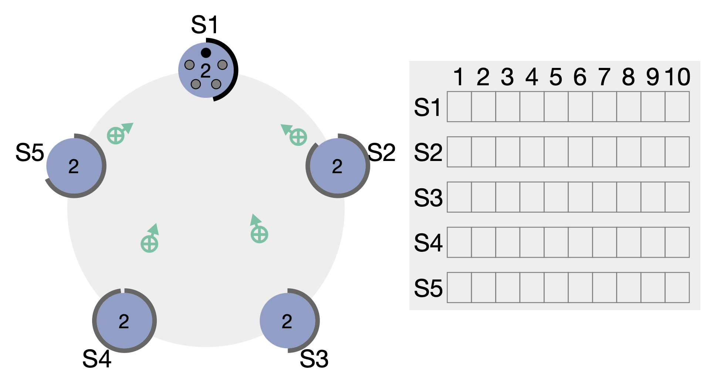  
   *Figure 4: Votes sent to the first candidate*

4. **Leader Declared** – Candidate becomes leader and sends heartbeats.  
   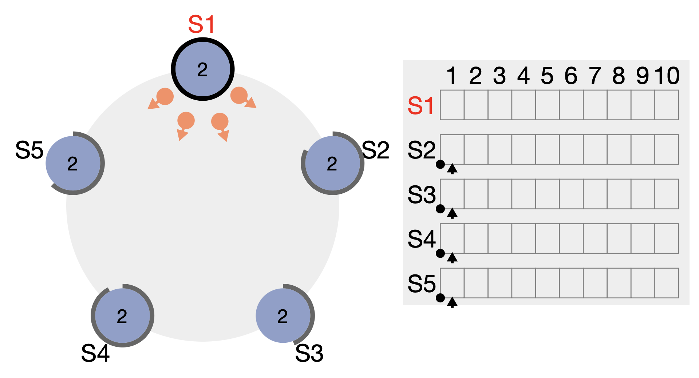  
   *Figure 5: Leader starts heartbeats*

5. **Heartbeat Acknowledgments** – Followers acknowledge heartbeats.  
   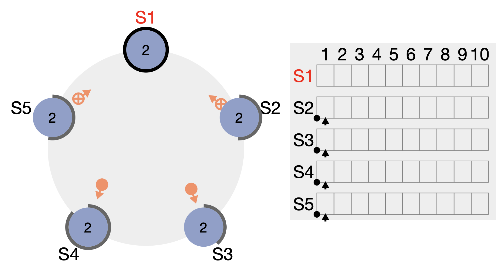  
   *Figure 6: Followers confirm heartbeats*

6–7. **Continued Heartbeats** – Heartbeats and acknowledgments continue.  
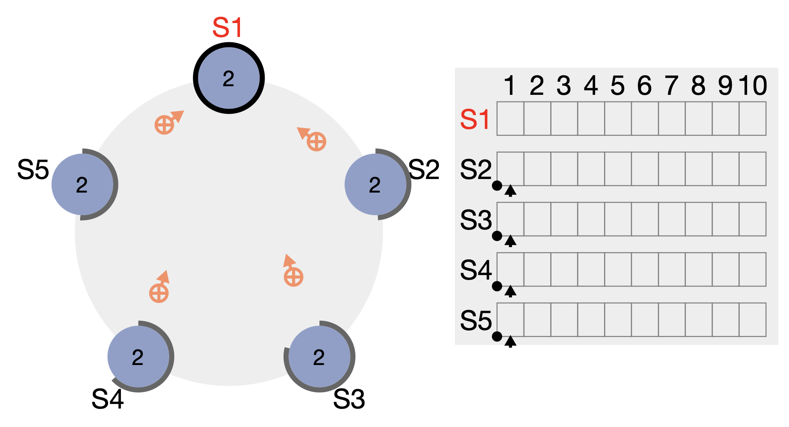  
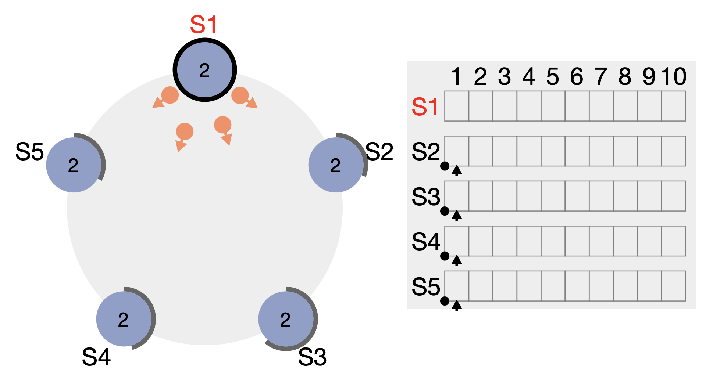

8. **Leader Failure** – Leader stops; followers wait.  
   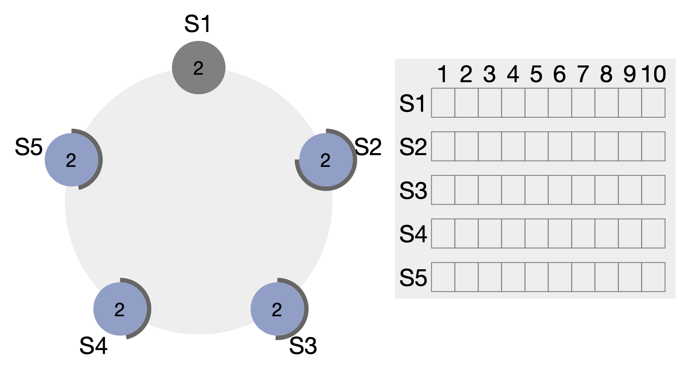

9. **New Election Initiated** – Followers timeout and start new elections.  
   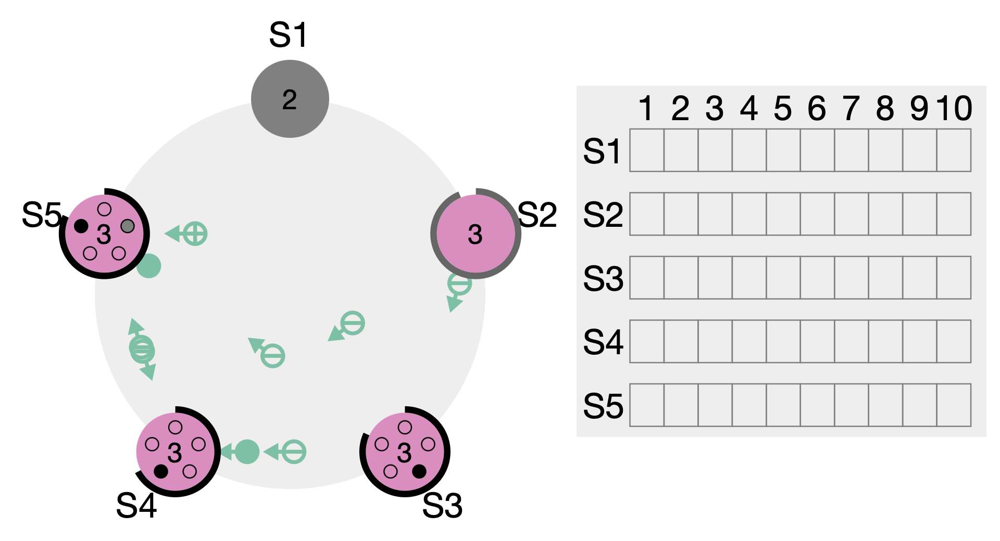

10. **New Leader Elected** – Majority votes elect a new leader.  
    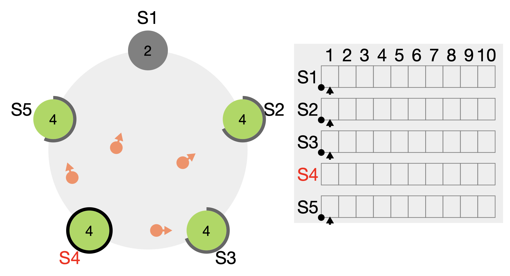

---

### Handling Failures

- **Leader Failures** – Followers detect missing heartbeats and elect a replacement.
- **Network Partitions** – Only a majority leader can operate; split-brain is prevented.
- **Old Leader Rejoining** – Rejoining leader steps down if a current leader with higher term exists.

---

### Log Consistency

- **Log Matching** – Same index and term → logs identical up to that entry.
- **Conflict Resolution** – Leader overwrites inconsistent follower logs.
- **Commit Index** – Leader tracks highest committed entry for durability and uniform application.

---

## References

- https://thesecretlivesofdata.com/raft/
- https://raft.github.io/
