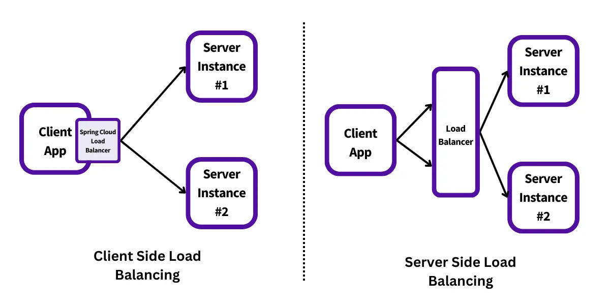

# Service Discovery

In a distributed architecture, locating the IP addresses of services for communication is essential. This process, known as **service discovery**, has been a fundamental concept in distributed computing since its inception.

Service discovery is essential for two key reasons:

- **Horizontal Scaling:** Microservices architectures require dynamic adjustments, such as scaling out by adding more service instances (e.g., additional containers). This capability shifts development teams away from vertical scaling, enabling a more resilient and scalable approach.

- **Resiliency:** To prevent failures from propagating to dependent services, microservices architectures must handle unhealthy or unavailable instances effectively. Service discovery engines continuously monitor service health and remove failed instances from the registry, ensuring that traffic is rerouted to healthy instances, minimizing disruption.


## The problem with DNS-based service discovery
In the non-cloud world, service location resolution was often solved through a combination of a DNS and a network load balancer.


While this type of model works well with applications with a relatively small number of services running on a group of static servers, it doesn't work well for microservice architectures. The reasons for this include the following:
* Traditional load balancers are **statically managed**. They aren’t designed for fast registration and de-registration of services. In a traditional load balancer scenario, **the registration of new service instances is not done when a new service instance starts**. Below an example nginx configuration managing a set of three replicas. It's static nature is self-evident.

```text
worker_processes auto;

events {
    worker_connections 1024;
}

http {
    upstream mathservice {
        server math-service-1:8080;
        server math-service-2:8080;
        server math-service-3:8080;
    }

    server {
        listen 8080;

        location /primes {
            proxy_pass http://mathservice;
        }

        location / {
            return 200 'Welcome to the Frontend!\n';
            add_header Content-Type text/plain;
        }
    }
}
```
* Centralizing your services behind a single cluster of load balancers **limits your ability to scale horizontally** (all traffic is routed through a single dispatching point).
* While the load balancer can be made highly available, it’s a **single point of failure for your entire infrastructure**. 


## Cloud-native service discovery

A robust service discovery mechanism ensures that services dynamically indicate their physical location instead of requiring manual DNS or load balancer configuration. To achieve this, service discovery must be:

- **Highly available** – Supports clustering to enable seamless failover if a node becomes unavailable.
- **Peer-to-peer** – Shares service health information across nodes, often using gossip-style protocols for efficient data propagation.
- **Load balanced** – Distributes requests evenly across all service instances.
- **Resilient** – Caches service information locally, allowing continued operation even if the discovery service becomes unavailable.
- **Fault-tolerant** – Automatically detects and removes unhealthy service instances without manual intervention.

Key components of service discovery include:

- **Service registration** – As instances start, they register their physical location (IP/port) for accessibility.
- **Information sharing** – Each service registers with one discovery node, which propagates data to all nodes in a peer-to-peer manner.
- **Health monitoring** – Instances continuously update their status, and failing services are removed from the pool.


## Load Balancing and Service Discovery

Load balancing ensures that requests to a service are distributed evenly among multiple instances to prevent overloading any single instance. It improves both scalability and fault tolerance.

There are two types of load balancing in microservices:
- **Client-side load balancing**: The client selects an instance from the available ones, often using a round-robin, random, or least-connections strategy. In this case, the client needs to have access to the service registry.
- **Server-side load balancing**: A dedicated load balancer sits between the client and service instances. It handles the distribution of incoming requests to service instances based on various policies.



### Client-Side Load Balancing
In Client-side Load Balancing, **the logic of Load Balancer is part of the client itself**, and it carries the list of services and determines to which service a particular request must be directed based on some algorithm.


* No more single point of failure in Client Side Load Balancer.
* Less network latency as the client can directly call the backend servers.
* Cost Reduction as there is no need for dedicated hardware/software.
* More complex client (discovery code mixed with service code)
* Implementations: **Netflix Eureka**

### Server-Side Load Balancing
If you are keeping the load balancer on the server side, then it’s called **Server-Side Load Balancing**. In Server-side load balancing, the instances of the service are deployed on multiple locations and then a load balancer is placed in front of them. Firstly, all the incoming requests come to the load balancer which acts as a middle component. Then it determines to which server a particular request must be directed based on some algorithm.

* Single point of failure.
* Increased network latency.
* Implementations: **Spring Cloud Gateway, nginx**

## Resources
- Spring Microservices in Action (Chapter 6)
- Microservices with Spring Boot 3 and Spring Cloud (Chapter 9)
