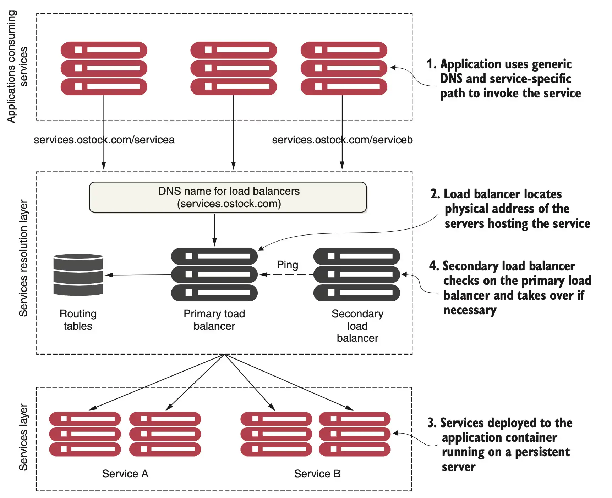
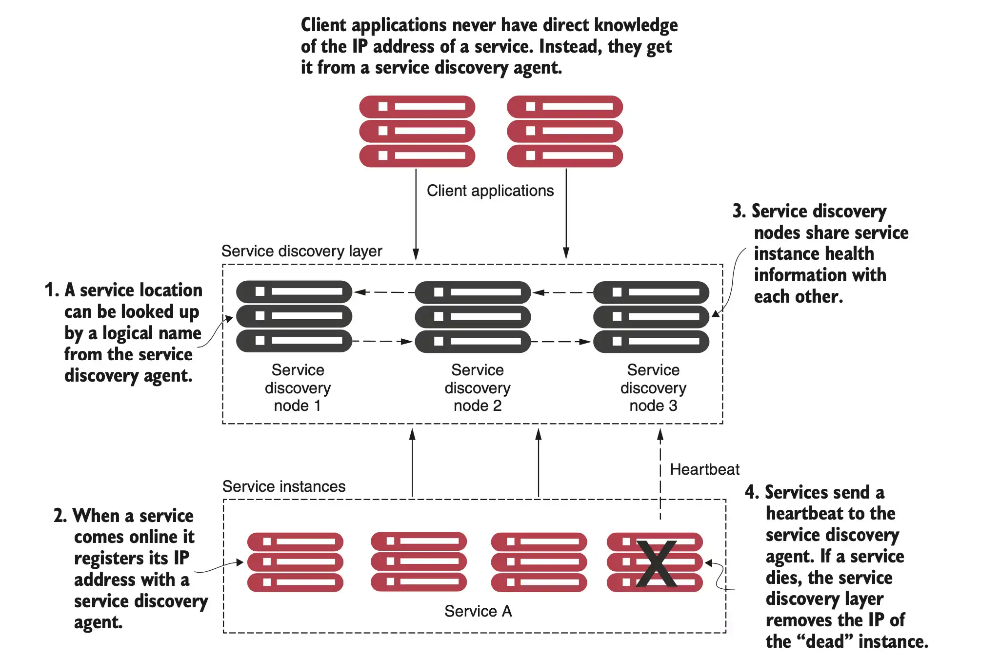
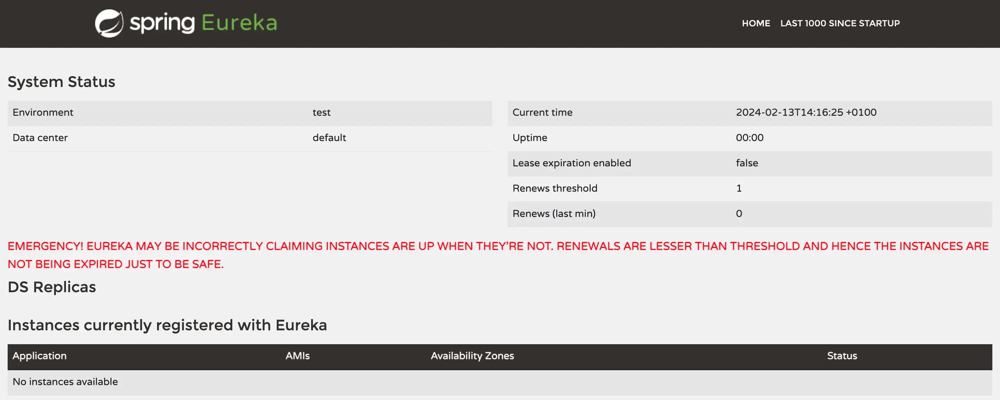
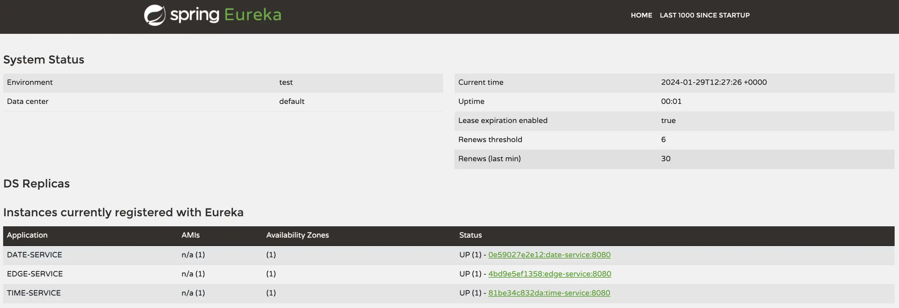

# Service Discovery

In any distributed architecture, we need to find the hostname or IP address of where a machine is located. This concept has been around since the beginning of distributed computing and is known formally as *service discovery*.

Service discovery is critical to microservices for two key reasons:
* **Horizontal scaling:** **Microservice architectures need adjustments in the application architecture, such as adding more instances of a service (i.e., more containers)**. This ability to quickly scale services can move a development team that’s used to building monolithic applications away from vertical scaling to
the more robust approach of horizontal scaling.

* **Resiliency:** Microservice architectures have to be designed to prevent a problem in a single service from cascading up to its consumers. **When a microservice instance becomes unhealthy or unavailable, service discovery engines have to remove that instance from the list of available services**. The damage is thus minimized because the service discovery engine routes consumers around the unavailable service.

You might be wondering why we can’t use known approaches such as DNS or load balancers to facilitate service discovery.


## The problem with DNS-based service discovery
If you have an application that calls resources spread across multiple servers, it needs to find the physical location of those resources. In the non-cloud world, service location resolution was often solved through a combination of a DNS and a network load balancer.



While this type of model works well with applications with a relatively small number of services running on a group of static servers, it doesn't work well for microservice architectures. The reasons for this include the following:
* While the load balancer can be made highly available, it’s a **single point of failure for your entire infrastructure**. 
* Centralizing your services behind a single cluster of load balancers **limits your ability to scale horizontally** (all traffic is routed through a single dispatching point). 
* Most traditional load balancers are statically managed. They aren’t designed for fast registration and de-registration of services. In a traditional load balancer scenario, **the registration of new service instances is not done when a new service instance starts**.


## Cloud-native service discovery

The principal objective of service discovery is to **have an architecture where services indicate where they are physically located instead of having to manually configure a load balancer**. Key steps are:
* **Service registration:** As service instances start, they’ll register their physical location (ip and port) that can be used to access them.
* **Information sharing:** A service usually only registers with one service discovery service instance. Most service discovery implementations use a peer-to-peer model of data propagation, where the data around each service instance is communicated to all the other nodes in the cluster.
* **Health monitoring:** A service instance pushes to or pulls from its status by the service discovery service. Any services failing to return a good health check are removed from the pool of available service instances.
* **Client lookup of service address**: There are two ways to load balance clients requests to services. One involving a third component (Server-Side Load Balancer), the other involving only the client and the service (Client-Side Load Balancer).



The solution for a cloud-based microservice environment is to use a service discovery mechanism that is:
* **Highly available** Service discovery needs to support a “hot” clustering environment where service lookups can be shared across multiple nodes in a service discovery cluster. If a node becomes unavailable, other nodes in the cluster should be able to take over.
* **Peer-to-peer** Service discovery nodes share service instance health information with each other. If you are interested in gossip-style protocols for information propagation, you can have a look at [The Gossip Protocol](https://www.consul.io/docs/internals/gossip.html) or [SWIM: The scalable membership protocol](https://www.brianstorti.com/swim/) articles.
* **Load balanced** Service discovery needs to load balance requests across all service instances. This ensures that the service invocations are spread across all the service instances.
* **Resilient** The service discovery’s client should cache service information locally. Local caching allows for gradual degradation of the service discovery feature so that if the service discovery service becomes unavailable, applications can still function with local information.
* **Fault-tolerant** Service discovery needs to detect when a service instance isn't healthy and remove it from the list of available services without any human intervention.


## Load Balancing and Service Discovery

Service discovery allows microservices to find each other dynamically without hard-coding network locations (IP addresses, ports). In a typical microservices environment, services are often distributed across multiple instances or containers, which can be created or destroyed dynamically. Load balancing ensures that requests to a service are distributed evenly among multiple instances to prevent overloading any single instance. It improves both scalability and fault tolerance.

There are two types of load balancing in microservices:
- **Client-side load balancing**: The client selects an instance from the available ones, often using a round-robin, random, or least-connections strategy. In this case, the client needs to have access to the service registry.
- **Server-side load balancing**: A dedicated load balancer sits between the client and service instances. It handles the distribution of incoming requests to service instances based on various policies.

### Client-Side Load Balancing
If you are keeping the load balancer on the client side and giving the load balancing responsibility to the client, then it’s called **Client-Side Load Balancing**. In Client-side Load Balancing, the logic of Load Balancer is part of the client itself, and it carries the list of services and determines to which service a particular request must be directed based on some algorithm.


* No more single point of failure in Client Side Load Balancer.
* Less network latency as the client can directly call the backend servers.
* Cost Reduction as there is no need for server-side load balancing.
* Additional complexity because microservice code is combined with the load balancer logic.
* Implementations: **Netflix Eureka**

### Server-Side Load Balancing
If you are keeping the load balancer on the server side, then it’s called **Server-Side Load Balancing**. In Server-side load balancing, the instances of the service are deployed on multiple locations and then a load balancer is placed in front of them. Firstly, all the incoming requests come to the load balancer which acts as a middle component. Then it determines to which server a particular request must be directed based on some algorithm.

* Single point of failure.
* Increased network latency.
* Implementations: **Spring Cloud Gateway, Apache ZooKeeper**


## Netflix Eureka

Netflix Eureka is a highly configurable discovery server that can be set up for a number of different use cases, and it provides robust, resilient, and fault-tolerant runtime features. One downside of this flexibility and robustness is that it has an almost overwhelming number of configuration options. Fortunately, Netflix Eureka comes with good default values for most of the configurable parameters.

The Eureka server does not have a centralized backend store, instead (in a fully peer-to-peer way) the service instances in the registry all have to send heartbeats to keep their registrations up to date (so this can be done in memory). Clients also have an in-memory cache of Eureka registrations (so they do not have to go to the registry for every request to a service).

## Netflix Eureka server

### Maven dependencies

To include Netflix Eureka in our project, we need to add the *spring-cloud-starter-netflix-eureka-server* dependency as shown below.

```
    <properties>
        <java.version>21</java.version>
        <spring-cloud.version>2023.0.0</spring-cloud.version>
    </properties>
    
    <dependencies>
    ...
        <dependency>
            <groupId>org.springframework.cloud</groupId>
            <artifactId>spring-cloud-starter-netflix-eureka-server</artifactId>
        </dependency>
    ...
    </dependencies>
    <dependencyManagement>
        <dependencies>
            <dependency>
                <groupId>org.springframework.cloud</groupId>
                <artifactId>spring-cloud-dependencies</artifactId>
                <version>${spring-cloud.version}</version>
                <type>pom</type>
                <scope>import</scope>
            </dependency>
        </dependencies>
    </dependencyManagement>
```

### Server code
Add the _@EnableEurekaServer_ annotation to the application main class.

```java
@EnableEurekaServer
@SpringBootApplication
public class EurekaServerApplication {
	public static void main(String[] args) {
		SpringApplication.run(EurekaServerApplication.class, args);
	}
}
```

### Configuration
By default, every Eureka server is also a Eureka client and requires (at least one) service URL to locate a peer. If you do not provide it, the service runs and works, but it fills your logs with a lot of noise about not being able to register with the peer.

The combination of the two caches (client and server) and the heartbeats make a standalone Eureka server fairly resilient to failure, as long as there is some sort of monitor or elastic runtime (such as [Cloud Foundry](https://www.cloudfoundry.org/)) keeping it alive.

In standalone mode, you might prefer to switch off the client side behavior so that it does not keep trying and failing to reach its peers. The following example shows how to switch off the client-side behavior:

```yaml
server:
  port: 8761
  
eureka:
  instance:
    hostname: localhost
  client:
    registerWithEureka: false
    fetchRegistry: false
    serviceUrl:
      defaultZone: http://${eureka.instance.hostname}:${server.port}/eureka/
  server:
    waitTimeInMsWhenSyncEmpty: 0
    response-cache-update-interval-ms: 5000
```

1. **Server Port Configuration (`server.port: 8761`)**:
    - The application is configured to run on port 8761, which is the default port for a Eureka server. This is where the Eureka server will be accessible for service registration and discovery.

2. **Eureka Instance Configuration (`eureka.instance.hostname: localhost`)**:
    - Specifies the hostname of the Eureka server. In this case, it is set to `localhost`, which means the Eureka server is running locally (commonly for development purposes).

3. **Eureka Client Configuration**:
    - **`registerWithEureka: false`**:
        - Indicates that this Eureka instance will not register itself as a client. This is common for standalone Eureka servers.
    - **`fetchRegistry: false`**:
        - Disables the Eureka server from fetching the service registry from other Eureka servers. This is used when this instance is the only Eureka server and there is no need to synchronize with other servers.
    - **`serviceUrl.defaultZone: http://${eureka.instance.hostname}:${server.port}/eureka/`**:
        - Specifies the URL where other services can register with the Eureka server. This URL is dynamically constructed using the hostname (`localhost`) and the port (`8761`), creating a service URL of `http://localhost:8761/eureka/`.

4. **Eureka Server Configuration**:
    - **`waitTimeInMsWhenSyncEmpty: 0`**:
        - Configures the server not to wait if the service registry is empty when synchronizing. This setting is typically used to speed up the initial startup process.
    - **`response-cache-update-interval-ms: 5000`**:
        - Defines the interval (in milliseconds) at which the Eureka server updates its response cache. This is set to 5 seconds, ensuring that the cache is regularly refreshed, improving performance when responding to requests for service registry information.

Refer to [this guide](https://cloud.spring.io/spring-cloud-netflix/reference/html/) for more details on the configuration. After startup, we can connect to the Spring Eureka Dashboard at http://localhost:8761/. There are no registered clients!



### Docker configuration
Add a _Dockerfile_ to containerize the service and edit the _docker-compose.yml_ file to include the service within your ecosystem.

```yaml
eureka:
    build: eureka-server
    mem_limit: 512m
    ports:
      - "8761:8761"
```

## Netflix Eureka clients

Spring Cloud comes with an abstraction of how to communicate with a discovery service called _DiscoveryClient_. Implementations of the _DiscoveryClient_ interface are capable of registering a Spring Boot application with the discovery server.

### Maven dependencies
We only need to bring in a dependency on the corresponding implementation to connect to a discovery server. In our case, _spring-cloud-starter-netflix-eureka-client_.

```
    <properties>
        <java.version>21</java.version>
        <spring-cloud.version>2023.0.0</spring-cloud.version>
    </properties>
    <dependencies>
    ...
        <dependency>
            <groupId>org.springframework.cloud</groupId>
            <artifactId>spring-cloud-starter-netflix-eureka-client</artifactId>
        </dependency>
    ...
    </dependencies>
    <dependencyManagement>
        <dependencies>
            <dependency>
                <groupId>org.springframework.cloud</groupId>
                <artifactId>spring-cloud-dependencies</artifactId>
                <version>${spring-cloud.version}</version>
                <type>pom</type>
                <scope>import</scope>
            </dependency>
        </dependencies>
    </dependencyManagement>
```

### Client code
Spring Cloud comes with an abstraction called _LoadBalancerClient_ allowing clients to make requests (to registered services) through a client-side load balancer. The standard HTTP client, _WebClient_, can be configured to use a _LoadBalancerClient_ implementation. This function can be enabled by adding the _@LoadBalanced_ annotation to a _@Bean_ declaration that returns a _WebClient_.

```java
@SpringBootApplication
public class CompositeApplication {

	@Bean
	@LoadBalanced
	public WebClient.Builder loadBalancedWebClientBuilder() {
		return WebClient.builder();
	}

	public static void main(String[] args) {
		SpringApplication.run(CompositeApplication.class, args);
	}
}
```

To actually make a request to a registered service, it is enough to mention the services *by name* as reported in the Spring Eureka Dashboard. In our example, the *composite-service* in the example below connects to both a _TIME-SERVICE_ and a _DATE-SERVICE_.

```java
    @GetMapping(value = "/datetime")
    public Mono<LocalDateTime> dateTime() throws InterruptedException {
        String urlTime = "http://TIME-SERVICE/time";
        String urlDate = "http://DATE-SERVICE/date";

        LOG.info("Calling time API on URL: {}", urlTime);
        Mono<LocalTime> localTimeMono = webClient.get().uri(urlTime).retrieve().bodyToMono(LocalTime.class);

        LOG.info("Calling time API on URL: {}", urlDate);
        Mono<LocalDate> localDateMono = webClient.get().uri(urlDate).retrieve().bodyToMono(LocalDate.class);

        return Mono.zip(localDateMono, localTimeMono,
                (localDate, localTime) -> LocalDateTime.of(localDate, localTime));
    }
```

### Configuration
Client microservices have the following configuration:

```yaml
server.port: 8080
spring.application.name: service-name

eureka:
  client:
    serviceUrl:
      defaultZone: http://localhost:8761/eureka/
    initialInstanceInfoReplicationIntervalSeconds: 5
    registryFetchIntervalSeconds: 5
  instance:
    leaseRenewalIntervalInSeconds: 5
    leaseExpirationDurationInSeconds: 5

---
spring.config.activate.on-profile: docker
server.port: 8080
eureka.client.serviceUrl.defaultZone: http://eureka:8761/eureka/
```

1. **Server Port Configuration (`server.port: 8080`)**:
    - The application will run on port 8080. This is the default port where the service will be accessible.

2. **Spring Application Name (`spring.application.name: service-name`)**:
    - Defines the name of the Spring Boot application. This name will be used to identify the service when it registers with Eureka.

3. **Eureka Client Configuration**:
    - **`eureka.client.serviceUrl.defaultZone`**:
        - Defines the URL of the Eureka server that this service will use to register itself and communicate with. Here, it is pointing to a local Eureka server running on `http://localhost:8761/eureka/`.
    - **`initialInstanceInfoReplicationIntervalSeconds: 5`**:
        - Specifies how frequently (in seconds) the initial instance information is replicated to the Eureka server. In this case, it will replicate every 5 seconds.
    - **`registryFetchIntervalSeconds: 5`**:
        - Defines how often (in seconds) the service fetches registry information from the Eureka server. It will fetch the updated registry every 5 seconds to get a fresh list of available services.

4. **Eureka Instance Configuration**:
    - **`leaseRenewalIntervalInSeconds: 5`**:
        - Sets the interval (in seconds) at which this service renews its lease with the Eureka server. The service will send heartbeat signals every 5 seconds to indicate it is still healthy and available.
    - **`leaseExpirationDurationInSeconds: 5`**:
        - Defines how long the Eureka server will wait (in seconds) before expiring the service instance if it does not receive a lease renewal (heartbeat). If no heartbeat is received within 5 seconds, the instance is considered expired.


### Docker configuration
Add a _Dockerfile_ to containerize the service and edit the _docker-compose.yml_ file to include the service within your ecosystem.

```yaml
services:
  eureka:
    build: eureka-server
    mem_limit: 512m
    ports:
      - "8761:8761"

  composite:
    build: composite-service-end
    mem_limit: 512m
    ports:
      - "8080:8080"
    environment:
      - SPRING_PROFILES_ACTIVE=docker

  date:
    build: date-service-end
    mem_limit: 512m
    environment:
      - SPRING_PROFILES_ACTIVE=docker

  time:
    build: time-service-end
    mem_limit: 512m
    environment:
      - SPRING_PROFILES_ACTIVE=docker

```

Once everything is set up, we can run the example project with:

```
$ mvn clean package
$ docker compose build 
$ docker compose up --detach
```

Now, we can connect to the Spring Eureka Dashboard at http://localhost:8761/ to observe the registered services.




## Resources
- Spring Microservices in Action (Chapter 6)
- Microservices with Spring Boot 3 and Spring Cloud (Chapter 9)
