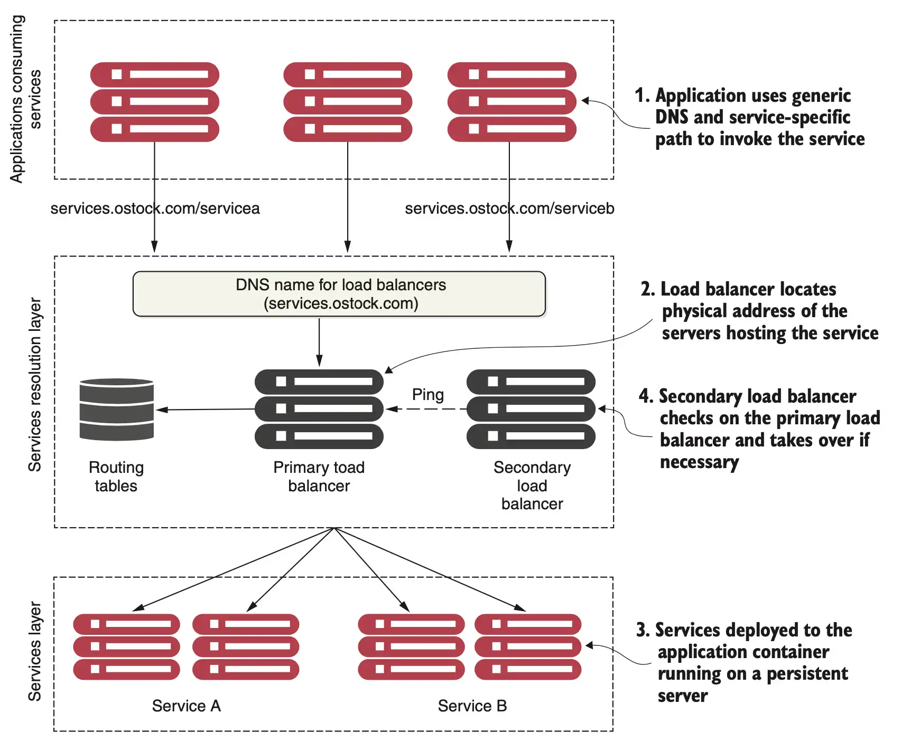
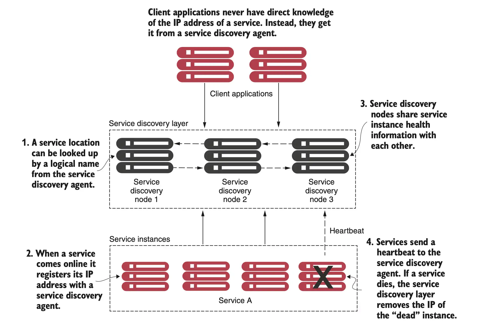
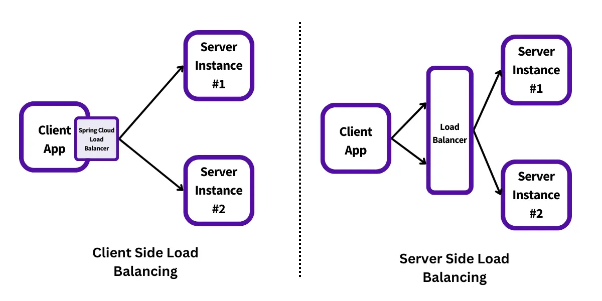
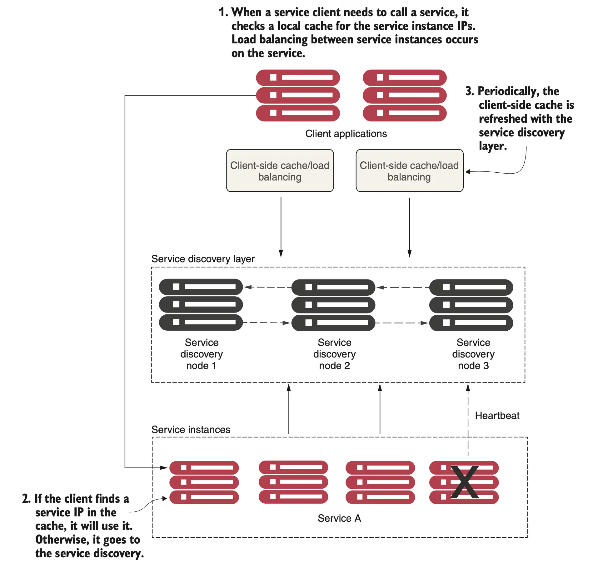

# Service Discovery

In distributed systems, services must be able to **locate each other’s network address** to communicate.
This process is known as **service discovery**.

* **Horizontal Scaling**

    * New service instances can be **added or removed dynamically** (e.g., containers).
    * Service discovery allows clients to **automatically find available instances**.
    * Workload can be **distributed across multiple instances**.

* **Fault Tolerance**

    * Service instances may **fail or become unavailable**.
    * Discovery systems **monitor service health**.
    * Unhealthy instances are **removed from the registry**, ensuring requests are routed only to healthy services.

## DNS-based service discovery
In the non-cloud world, service location resolution was often solved through a combination of a DNS and a network load balancer.



While this model works well for applications with a relatively small number of services running on a set of static servers, it is less suited for microservice architectures. The limitations include:

* Traditional load balancers are **statically managed**, making them inflexible in dynamic environments.
* The registration of new service instances is **not dynamic**, so adding or removing services requires manual intervention.
* Centralizing services behind a single cluster of load balancers **restricts horizontal scalability**, as all traffic must pass through a single dispatching point.
* Even if the load balancer is made highly available, it remains a **single point of failure for the entire infrastructure**.


Below an example nginx configuration managing a set of three replicas. It's static nature is self-evident.

```text
worker_processes auto;

events {
    worker_connections 1024;
}

http {
    upstream mathservice {
        server math-service-1:8080;
        server math-service-2:8080;
        server math-service-3:8080;
    }

    server {
        listen 8080;

        location /primes {
            proxy_pass http://mathservice;
        }

        location / {
            return 200 'Welcome to the Frontend!\n';
            add_header Content-Type text/plain;
        }
    }
}
```


## Cloud-native service discovery

A robust service discovery mechanism ensures that services dynamically indicate their physical location instead of requiring manual DNS or load balancer configuration.
Key components of cloud-native service discovery include:

* **Service Registration** – When a service instance starts, it registers its network location (IP address and port) with the service discovery system so that other services can locate and communicate with it.

* **Information Sharing** – In distributed discovery systems, each service typically registers with one discovery node. The registration information is then propagated to the other nodes in the cluster, often through a peer-to-peer synchronization mechanism, ensuring that all nodes maintain a consistent view of available services.

* **Health Monitoring** – Service instances periodically report their health status to the discovery system. If an instance becomes unhealthy or stops responding, it is automatically removed from the registry, preventing traffic from being routed to failed services.




Cloud native service discovery is:

- **Highly available** – Supports clustering to enable seamless failover if a node becomes unavailable.
- **Load balanced** – Distributes requests evenly across all service instances.
- **Fault-tolerant** – Automatically detects and removes unhealthy service instances without manual intervention.
- **Peer-to-peer** – Shares service health information across nodes, often using gossip-style protocols for efficient data propagation.
- **Resilient** – Caches service information locally, allowing continued operation even if the discovery service becomes unavailable.


## Cloud-native load balancing

Load balancing ensures that requests to a service are distributed evenly among multiple instances to prevent overloading any single instance. It improves both scalability and fault tolerance.

There are two types of load balancing in microservices:
- **Server-side load balancing**: A dedicated load balancer sits between the client and service instances. It handles the distribution of incoming requests to service instances based on various policies.
- **Client-side load balancing**: The client selects an instance from the available ones, often using a round-robin, random, or least-connections strategy. In this case, the client needs to have access to the service registry.



### Client-Side Load Balancing
In Client-side Load Balancing, **the logic of Load Balancer is part of the client itself**, and it carries the list of services and determines to which service a particular request must be directed based on some algorithm.



* No more single point of failure in Client Side Load Balancer.
* Less network latency as the client can directly call the backend servers.
* Cost Reduction as there is no need for dedicated hardware/software.
* More complex client (discovery code mixed with service code)
* Implementations: **Netflix Eureka**

### Server-Side Load Balancing
If you are keeping the load balancer on the server side, then it’s called **Server-Side Load Balancing**. In Server-side load balancing, the instances of the service are deployed on multiple locations and then a load balancer is placed in front of them. Firstly, all the incoming requests come to the load balancer which acts as a middle component. Then it determines to which server a particular request must be directed based on some algorithm.

* Single point of failure.
* Increased network latency.
* Implementations: **Spring Cloud Gateway, nginx, traefik**

## Netflix Eureka

Netflix Eureka is a highly configurable discovery server that can be set up for a number of different use cases, and it provides robust, resilient, and fault-tolerant runtime features.

The Eureka server **does not have a backend store**:
* service have to send heartbeats to keep their registrations up to date (can be done in memory);
* clients also have an in-memory cache of Eureka registrations (they do not have to go to the registry for every request to a service).

### Netflix Eureka server

#### Maven dependencies

To include Netflix Eureka in our project, we need to add the *spring-cloud-starter-netflix-eureka-server* dependency as shown below.

```
    <properties>
        <java.version>21</java.version>
        <spring-cloud.version>2025.1.0</spring-cloud.version>
    </properties>
    
    <dependencies>
        <dependency>
            <groupId>org.springframework.cloud</groupId>
            <artifactId>spring-cloud-starter-netflix-eureka-server</artifactId>
        </dependency>
    </dependencies>
    
    <dependencyManagement>
        <dependencies>
            <dependency>
                <groupId>org.springframework.cloud</groupId>
                <artifactId>spring-cloud-dependencies</artifactId>
                <version>${spring-cloud.version}</version>
                <type>pom</type>
                <scope>import</scope>
            </dependency>
        </dependencies>
    </dependencyManagement>
```

#### Server code
Add the _@EnableEurekaServer_ annotation to the application main class.

```java
@EnableEurekaServer
@SpringBootApplication
public class EurekaServerApplication {
	public static void main(String[] args) {
		SpringApplication.run(EurekaServerApplication.class, args);
	}
}
```

#### Configuration
By default, every Eureka server is also a Eureka client and requires (at least one) service URL to locate a peer. If you do not provide it, the service runs and works, but it fills your logs with a lot of noise about not being able to register with the peer.

In standalone mode, you might prefer to switch off the client side behavior so that it does not keep trying and failing to reach its peers. The following example shows how to switch off the client-side behavior:

```yaml
server:
  port: 8761
  
eureka:
  instance:
    hostname: localhost
  client:
    registerWithEureka: false
    fetchRegistry: false
    serviceUrl:
      defaultZone: http://${eureka.instance.hostname}:${server.port}/eureka/
  server:
    waitTimeInMsWhenSyncEmpty: 0
    response-cache-update-interval-ms: 5000
```

- **`eureka.instance.hostname: localhost`**:
  - Specifies the hostname of the Eureka server. In this case, it is set to `localhost`, which means the Eureka server is running locally (commonly for development purposes).
- **`registerWithEureka: false`**:
  - Indicates that this Eureka instance will not register itself as a client. This is common for standalone Eureka servers.
- **`fetchRegistry: false`**:
  - Disables the Eureka server from fetching the service registry from other Eureka servers. This is used when this instance is the only Eureka server and there is no need to synchronize with other servers.
- **`serviceUrl.defaultZone: http://${eureka.instance.hostname}:${server.port}/eureka/`**:
  - Specifies the URL where other services can register with the Eureka server. This URL is dynamically constructed using the hostname (`localhost`) and the port (`8761`), creating a service URL of `http://localhost:8761/eureka/`.
- **`waitTimeInMsWhenSyncEmpty: 0`**:
  - Configures the server not to wait if the service registry is empty when synchronizing. This setting is typically used to speed up the initial startup process.
- **`response-cache-update-interval-ms: 5000`**:
  - Defines the interval (in milliseconds) at which the Eureka server updates its response cache. This is set to 5 seconds, ensuring that the cache is regularly refreshed, improving performance when responding to requests for service registry information.

### Netflix Eureka clients

#### Maven dependencies
We only need to bring in a dependency to connect to a discovery server called _spring-cloud-starter-netflix-eureka-client_.

```
    <properties>
        <java.version>21</java.version>
        <spring-cloud.version>2025.1.0</spring-cloud.version>
    </properties>
    
    <dependencies>
        <dependency>
            <groupId>org.springframework.cloud</groupId>
            <artifactId>spring-cloud-starter-netflix-eureka-client</artifactId>
        </dependency>
    </dependencies>
    
    <dependencyManagement>
        <dependencies>
            <dependency>
                <groupId>org.springframework.cloud</groupId>
                <artifactId>spring-cloud-dependencies</artifactId>
                <version>${spring-cloud.version}</version>
                <type>pom</type>
                <scope>import</scope>
            </dependency>
        </dependencies>
    </dependencyManagement>
```

#### Client code
Spring Cloud comes with an abstraction allowing clients to make requests (to registered services) through a client-side load balancer. The standard HTTP client, _RestClient_, can be configured to use a load balanced implementation. This function can be enabled by adding the _@LoadBalanced_ annotation to a _@Bean_ declaration that returns a _RestClient_.

```java
@Configuration
public class RestClientConfig {
  @Bean
  @LoadBalanced
  public RestClient.Builder lbRestClientBuilder() {
    return RestClient.builder();
  }

  @Bean
  @Primary
  public RestClient.Builder restClientBuilder() {
    return RestClient.builder();
  }
}
```

To actually make a request to a registered service, it is enough to **mention the services by name as reported in the Spring Eureka Dashboard**. In our example, the *datetime-composite-service* connects to a set of *datetime-service* replicas.

```java
@RestController
public class CompositeController {
  private static final Logger LOG = LoggerFactory.getLogger(CompositeController.class);
  private final RestClient.Builder restClientBuilder;

  public CompositeController(@LoadBalanced RestClient.Builder restClientBuilder) {
    this.restClientBuilder = restClientBuilder;
  }

  @GetMapping(value = "/datetime")
  public LocalDateTimeWithTimestamp dateTime() {
    RestClient restClient = restClientBuilder.build();
    String urlTime = "http://datetime-service/time";
    String urlDate = "http://datetime-service/date";

    LOG.info("Calling time API on URL: {}", urlTime);
    LocalTime localTime = restClient.get()
            .uri(urlTime)
            .retrieve()
            .body(LocalTime.class);

    LOG.info("Calling time API on URL: {}", urlDate);
    LocalDate localDate = restClient.get()
            .uri(urlDate)
            .retrieve()
            .body(LocalDate.class);

    return new LocalDateTimeWithTimestamp(localDate, localTime, LocalDateTime.now());
  }
}

```

#### Configuration
Client microservices have the following configuration:

```yaml
server.port: 8080
spring.application.name: composite-service

eureka:
   client:
      serviceUrl:
         defaultZone: http://localhost:8761/eureka/
      initialInstanceInfoReplicationIntervalSeconds: 5
      registryFetchIntervalSeconds: 5
   instance:
      leaseRenewalIntervalInSeconds: 5
      leaseExpirationDurationInSeconds: 5

---
spring.config.activate.on-profile: docker
server.port: 8080
eureka.client.serviceUrl.defaultZone: http://eureka:8761/eureka/


```

* `spring.application.name: service-name`:
  - Defines the name of the Spring Boot application. This name will be used to identify the service when it registers with Eureka.
* `eureka.client.serviceUrl.defaultZone`:
  - Defines the URL of the Eureka server that this service will use to register itself and communicate with. Here, it is pointing to a local Eureka server running on `http://localhost:8761/eureka/`.
* `initialInstanceInfoReplicationIntervalSeconds: 5`:
  - Specifies how frequently (in seconds) the initial instance information is replicated to the Eureka server. In this case, it will replicate every 5 seconds.
* `registryFetchIntervalSeconds: 5`:
  - Defines how often (in seconds) the service fetches registry information from the Eureka server. It will fetch the updated registry every 5 seconds to get a fresh list of available services.
* `leaseRenewalIntervalInSeconds: 5`:
  - Sets the interval (in seconds) at which this service renews its lease with the Eureka server. The service will send heartbeat signals every 5 seconds to indicate it is still healthy and available.
* `leaseExpirationDurationInSeconds: 5`:
  - Defines how long the Eureka server will wait (in seconds) before expiring the service instance if it does not receive a lease renewal (heartbeat). If no heartbeat is received within 5 seconds, the instance is considered expired.

### Try it

```bash
export COMPOSE_FILE="docker-compose-cslb.yml"
mvn clean package -Dmaven.test.skip=true
docker compose up --build --detach
```

## Resources
- Spring Microservices in Action (Chapter 6)
- Microservices with Spring Boot 3 and Spring Cloud (Chapter 9)

