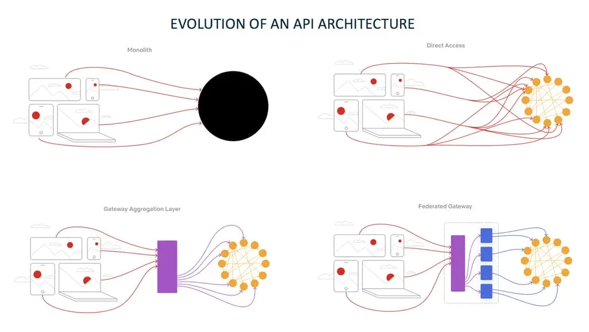
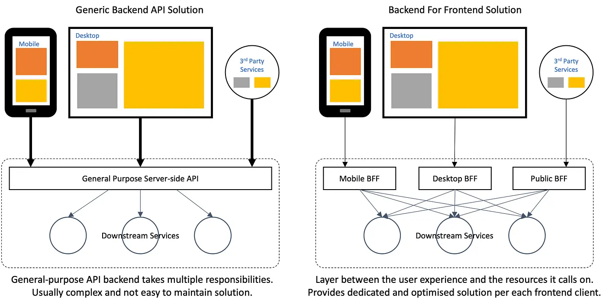

# Service Routing

## API Gateway Pattern

The **API Gateway** is a design pattern commonly used in microservices architectures to **handle incoming requests from clients and route them to the appropriate backend microservices**. It serves as a reverse proxy that consolidates requests, performing functions such as authentication, routing, load balancing, and request transformation. The API Gateway acts as a single entry point into the system, abstracting the complexity of individual microservices from the client.

Without API Gateway:

* **Clients Must Handle Multiple Endpoints**: Without an API gateway, clients must directly communicate with each individual microservice. This increases complexity, as clients need to be aware of the exact URLs of multiple services. If a service changes—such as adopting a new version, running on a different port, or scaling across multiple instances—clients must update their configurations accordingly.

* **Difficult API Composition**: Many applications require aggregating data from multiple services. Without a gateway, clients must make multiple requests and manually merge the responses. This increases both latency and implementation complexity.

* **Cross-Cutting Concerns**: Without an API gateway, each microservice must individually implement cross-cutting concerns such as authentication, authorization, logging, monitoring, rate limiting, and request validation. This leads to duplicated effort, inconsistent security policies, and increased maintenance overhead. An API gateway centralizes these responsibilities, ensuring uniform enforcement across all services.

### Nginx as an API Gateway
Nginx is a high-performance, lightweight reverse proxy and load balancer. It can be configured as an API Gateway by handling request routing, load balancing, and SSL termination. Best suited for **simple API Gateway scenarios** with **static routing**, or when running in **non-Java environments**.

**Pros**
- **Performance & Scalability**: Highly optimized for speed and low resource usage.
- **Simple Configuration**: Uses a straightforward configuration file to define routes.
- **Non-Java Environments**: Due to its language-agnostic nature, Nginx is a strong choice for non-Java environments or polyglot architectures. 

**Cons**
- **Limited Dynamic Routing**: Routing logic is static and not application-aware.
- **No Built-in Service Discovery**: Must be manually updated when backend services change.
- **Lack of Deep API Management Features**: No built-in authentication, circuit breakers, or request transformations (requires extra modules or Lua scripting).

### Spring Cloud Gateway as an API Gateway
Spring Cloud Gateway is a Java-based API Gateway built on Spring Boot. Best suited for **microservices architectures** where **dynamic routing, service discovery, and request transformations** are needed, particularly in **Spring-based** environments.

**Pros**
- **Dynamic Routing**: Routes can be dynamically updated using Spring configurations or discovery services.
- **Service Discovery Integration**: Works seamlessly with **Eureka**, **Consul**, or **Kubernetes**.
- **Powerful Request Processing**: Supports request/response transformations, filtering, and authentication.
- **Built-in Resilience Patterns**: Supports **circuit breakers** (via Resilience4J), **rate limiting**, and **retries**.

**Cons**
- **Higher Resource Consumption**: Requires a JVM-based runtime, which can increase memory and CPU usage.
- **More Complex Configuration**: More overhead compared to a simple Nginx setup.
- **Performance Overhead**: While efficient, it may not match Nginx in raw throughput.

### Traefik as an API Gateway

Traefik is a modern, cloud-native reverse proxy and load balancer designed for **dynamic, containerized environments**. It can serve as an API Gateway by automatically discovering services, routing requests, handling SSL termination, and providing observability. Best suited for **microservices architectures**, **containerized deployments**, and **dynamic environments** where services frequently scale or change.

**Pros**

* **Dynamic Service Discovery**: Integrates seamlessly with **Docker**, **Kubernetes**, **Eureka**, **Consul**, and other discovery backends.
* **Automatic Routing & Load Balancing**: Routes requests automatically to available service instances and balances load across replicas.
* **Cloud-Native Friendly**: Designed for container orchestration platforms, supporting labels, entrypoints, and automated SSL via Let's Encrypt.
* **Built-in Observability**: Offers metrics, dashboards, and tracing integration out-of-the-box.
* **Middleware Support**: Supports authentication, rate-limiting, retries, header/path transformations, and more without custom code.

**Cons**

* **Learning Curve**: Configuration and routing rules (labels, entrypoints, middlewares) can be complex for beginners.
* **Potential Overhead in Large-Scale Dynamic Environments**: While efficient, managing very large numbers of routes or complex rules may require careful configuration.

### Implementing Cross-cutting concerns with a shared library
In microservice architectures, usually comes a point where we’ll need to ensure that critical *cross-cutting concerns* are **consistently enforced across all services** without the need for each team to build their own solution:

* **Authentication and authorization** Because all service calls route through a service gateway, the service gateway is a natural place to check whether the callers of a service have authenticated themselves.
* **Metric collection and logging** A service gateway can be used to collect metrics and log information as a service call passes through it. 

While it’s possible to **use a shared library for embedding these capabilities into all services**, the more capabilities we build into a common framework shared across all our services, the more **difficult it is to change or add behavior in our common code without having to recompile and redeploy all our services**.

## Backend for Frontends (BFF) Pattern

The **Backends for Frontends (BFF)** pattern is a variation of the API Gateway pattern that provides specialized backends for different types of clients (e.g., web, mobile, IoT devices). Instead of having a single, monolithic API Gateway, the BFF pattern creates a separate backend tailored to the specific needs of each frontend application. This allows the backend to serve optimized responses that fit the specific requirements of different client types.

**Advantages:**
- **Customization for Each Client:** Each frontend receives data in a format that is most useful to it, leading to better performance and a more efficient user experience.
- **Reduced Latency for Frontends:** Because the BFF is tailored to specific clients, it can pre-aggregate data from various microservices, reducing the number of round trips between the client and backend.
- **Decoupled Frontend Development:** Teams can develop and evolve frontend applications independently, without worrying about impacting other clients.

**Challenges:**
- **Increased Maintenance:** Managing multiple backends for different clients can introduce more complexity and increase the overhead of maintaining different APIs.
- **Redundancy of Logic:** Certain business logic might need to be replicated across different BFFs, leading to code duplication.

**Differences from API Gateway:**
- **Granularity:** The API Gateway is a single entry point for all clients, while BFFs provide multiple, client-specific entry points.
- **Client Optimization:** BFFs are focused on optimizing for the needs of specific clients (e.g., mobile vs. desktop), whereas the API Gateway is a more general-purpose solution.
- **Complexity:** The API Gateway provides a unified control point, while BFFs offer more flexibility at the cost of increased backend complexity.

The **BFF pattern** is particularly useful in scenarios where different types of clients require different types of data or functionality, allowing for more efficient and customized interactions.

## Resources
- Spring Microservices in Action (Chapter 8)
- Microservices with Spring Boot 3 and Spring Cloud (Chapter 10)