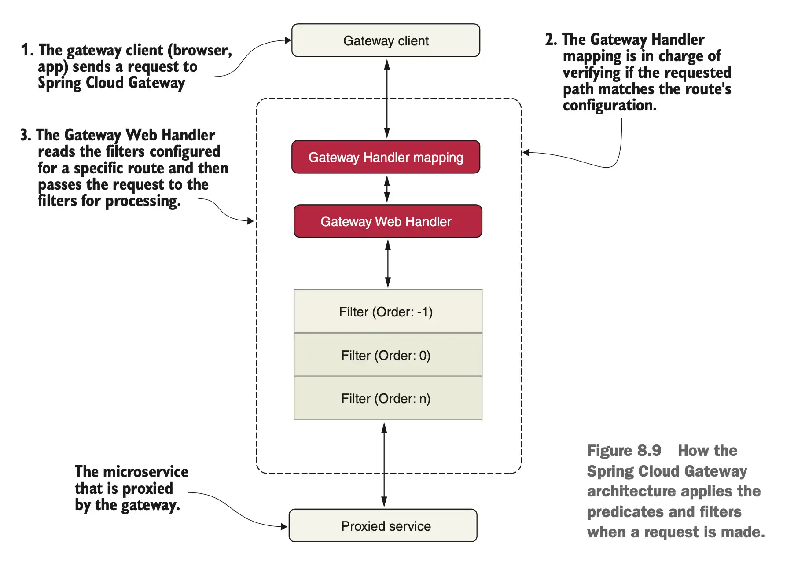

# Service Routing (Spring Cloud Gateway)

Spring Cloud Gateway aims to provide a simple, yet effective way to route to APIs and provide cross-cutting concerns such as: security, monitoring/metrics, and resiliency.

In this example, our ecosystem consists of three key services: **Users, Posts, and Comments**. We will use **Nginx** and **Spring Cloud Gateway** to route incoming requests to the appropriate internal services.

### Maven dependencies

```text
<properties>
    <java.version>21</java.version>
    <spring-cloud.version>2024.0.0</spring-cloud.version>
</properties>

<dependencies>
    <dependency>
        <groupId>org.springframework.cloud</groupId>
        <artifactId>spring-cloud-starter-gateway</artifactId>
    </dependency>
</dependencies>

<dependencyManagement>
    <dependencies>
        <dependency>
            <groupId>org.springframework.cloud</groupId>
            <artifactId>spring-cloud-dependencies</artifactId>
            <version>${spring-cloud.version}</version>
            <type>pom</type>
            <scope>import</scope>
        </dependency>
    </dependencies>
</dependencyManagement>
```

### Configuration

```yaml
server.port: 7004

spring.application.name: gateway-service

eureka:
  client:
    serviceUrl:
      defaultZone: http://localhost:8761/eureka/
    initialInstanceInfoReplicationIntervalSeconds: 5
    registryFetchIntervalSeconds: 5
  instance:
    leaseRenewalIntervalInSeconds: 5
    leaseExpirationDurationInSeconds: 5

management:
  endpoints:
    web:
      exposure:
        include: "health,info,gateway"
  endpoint:
    gateway:
      access: read_only
      
---
spring.config.activate.on-profile: docker
server.port: 8080

eureka:
  client:
    serviceUrl:
      defaultZone: http://eureka:8761/eureka/
```

### Routing rules
When it comes to configuring Spring Cloud Gateway, the most important thing is setting up the routing rules. Setting up routing rules can be done in two ways:
* programmatically, using a Java DSL (Domain Specific Language)
* by configuration

For most use cases, it is convenient to declare the routes in the configuration file. **Separating the routing rules from the Java code makes it possible to update the routing rules without having to deploy a new version of the microservice**.

Clients make requests to Spring Cloud Gateway. If the Gateway Handler Mapping determines that a request matches a route, it is sent to the Gateway Web Handler. This handler runs the request through a filter chain that is specific to the request.




### Routing requests

A route is defined by the following:
* **ID**, the name of the route
* **Destination URI**, which describes where to send a request
* **Predicates**, which select a route based on information in the incoming HTTP request
* **Filters**, which can modify both the request and/or the response


```yaml
spring.cloud.gateway.routes:
  - id: bff-service
    uri: lb://bff-service
    predicates:
      - Path=/bff/**
  - id: user-service
    uri: lb://user-service
    predicates:
      - Path=/users/**
  - id: post-service
    uri: lb://post-service
    predicates:
      - Path=/posts/**
  - id: comment-service
    uri: lb://comment-service
    predicates:
      - Path=/comments/**
```
** matches zero or more elements in the path

### Routing requests with predicates and filters
To learn a bit more about the routing capabilities in Spring Cloud Gateway, we will use the hostname of the incoming request to determine where to route the request. We will use a website for testing HTTP codes: http://httpstat.us/.

A call to http://httpstat.us/${CODE} returns a response with the ${CODE} HTTP code and a response body, also containing the HTTP code, and a corresponding descriptive text. For example:

```bash
curl http://httpstat.us/200 -i  
```

```bash
HTTP/1.1 200 OK
Content-Length: 6
Content-Type: text/plain
Date: Sun, 12 May 2024 15:39:57 GMT
Server: Kestrel
Set-Cookie: ARRAffinity=984be3d3ba9615669dc57bb8932bb241f00dc260a93772a8c4fefb6be05aa32c;Path=/;HttpOnly;Domain=httpstat.us
Request-Context: appId=cid-v1:3548b0f5-7f75-492f-82bb-b6eb0e864e53

200 OK%     
```

Assume that we want to route calls to the `/headerrouting` endpoint as follows:
* Calls from the *i.feel.lucky* host should return *200*
* Calls from the *im.a.teapot* host should return *418*
* Calls from all other hostnames should return *501*

To implement these routing rules in Spring Cloud Gateway, we can use the Host route predicate to select requests with specific hostnames, and the SetPath filter to set the desired HTTP code in the request path. This can be done as follows:

```yaml
spring.cloud.gateway.routes:
    - id: host_route_200
      uri: http://httpstat.us
      predicates:
      - Host=i.feel.lucky
      - Path=/headerrouting/**
      filters:
      - SetPath=/200
    - id: host_route_418
      uri: http://httpstat.us
      predicates:
      - Host=im.a.teapot
      - Path=/headerrouting/**
      filters:
      - SetPath=/418
    - id: host_route_501
      uri: http://httpstat.us
      predicates:
      - Path=/headerrouting/**
      filters:
      - SetPath=/501
```

You can now test the configuration:

```bash
curl http://localhost:8080/headerrouting -H "Host: i.feel.lucky"
```

```bash
curl http://localhost:8080/headerrouting -H "Host: im.a.teapot"
```

```bash
curl http://localhost:8080/headerrouting
```

Refer to the official documentation for the full list of [predicates](https://cloud.spring.io/spring-cloud-gateway/reference/html/#gateway-request-predicates-factories) and [filters](https://cloud.spring.io/spring-cloud-gateway/reference/html/#gatewayfilter-factories).

If we want to see the routes managed by the Gateway server, we can list the routes via the *actuator/gateway/routes* endpoint on the Gateway server. This will return a:

```bash
curl http://localhost:8080/actuator/gateway/routes | jq
```

```json
[
  {
    "predicate": "Paths: [/bff/**], match trailing slash: true",
    "route_id": "bff-service",
    "filters": [],
    "uri": "lb://bff-service",
    "order": 0
  },
  {
    "predicate": "Paths: [/users/**], match trailing slash: true",
    "route_id": "user-service",
    "filters": [],
    "uri": "lb://user-service",
    "order": 0
  },
  {
    "predicate": "Paths: [/posts/**], match trailing slash: true",
    "route_id": "post-service",
    "filters": [],
    "uri": "lb://post-service",
    "order": 0
  },
  {
    "predicate": "Paths: [/comments/**], match trailing slash: true",
    "route_id": "comment-service",
    "filters": [],
    "uri": "lb://comment-service",
    "order": 0
  },
  {
    "predicate": "(Hosts: [i.feel.lucky] && Paths: [/headerrouting/**], match trailing slash: true)",
    "route_id": "host_route_200",
    "filters": [
      "[[SetPath template = '/200'], order = 1]"
    ],
    "uri": "http://httpstat.us:80",
    "order": 0
  },
  {
    "predicate": "(Hosts: [im.a.teapot] && Paths: [/headerrouting/**], match trailing slash: true)",
    "route_id": "host_route_418",
    "filters": [
      "[[SetPath template = '/418'], order = 1]"
    ],
    "uri": "http://httpstat.us:80",
    "order": 0
  },
  {
    "predicate": "Paths: [/headerrouting/**], match trailing slash: true",
    "route_id": "host_route_501",
    "filters": [
      "[[SetPath template = '/501'], order = 1]"
    ],
    "uri": "http://httpstat.us:80",
    "order": 0
  }
]
```

### Gateway Code

The main class just declares a load balanced _RestClient.Builder_ and launches the application:

```java
@SpringBootApplication
public class App {

    @Bean
    @LoadBalanced
    public RestClient.Builder loadBalancedRestClientBuilder() {
        return RestClient.builder();
    }

    public static void main(String[] args) {
        SpringApplication.run(App.class, args);
    }
}
```

### Docker configuration

You can find three examples that can be run using three different Docker Compose files:
1. The first exposes services directly without any gateway.

```bash
export COMPOSE_FILE="docker-compose-nogateway.yml"
mvn clean package -Dmaven.test.skip=true
docker compose up --build --detach
```

2. The second uses Nginx as a gateway.

```yaml
  nginx:
    image: nginx:latest
    volumes:
      - ./nginx/nginx.conf:/etc/nginx/nginx.conf
    ports:
      - "8080:8080"
    depends_on:
      user-service:
        condition: service_healthy
      post-service:
        condition: service_healthy
      comment-service:
        condition: service_healthy
```

```bash
export COMPOSE_FILE="docker-compose-nginx.yml"
mvn clean package -Dmaven.test.skip=true
docker compose up --build --detach
```

3. The third leverages Spring Cloud Gateway as a gateway.

```yaml
  gateway-service:
    build: gateway-service
    environment:
      - SPRING_PROFILES_ACTIVE=docker
    ports:
      - "8080:8080"
    healthcheck:
      test: [ "CMD-SHELL", "curl -f http://localhost:8080/actuator/health" ]
      interval: 10s
      timeout: 5s
      retries: 5
```

```bash
export COMPOSE_FILE="docker-compose-gateway.yml"
mvn clean package -Dmaven.test.skip=true
docker compose up --build --detach
```

## Resources
- Spring Microservices in Action (Chapter 8)
- Microservices with Spring Boot 3 and Spring Cloud (Chapter 10)