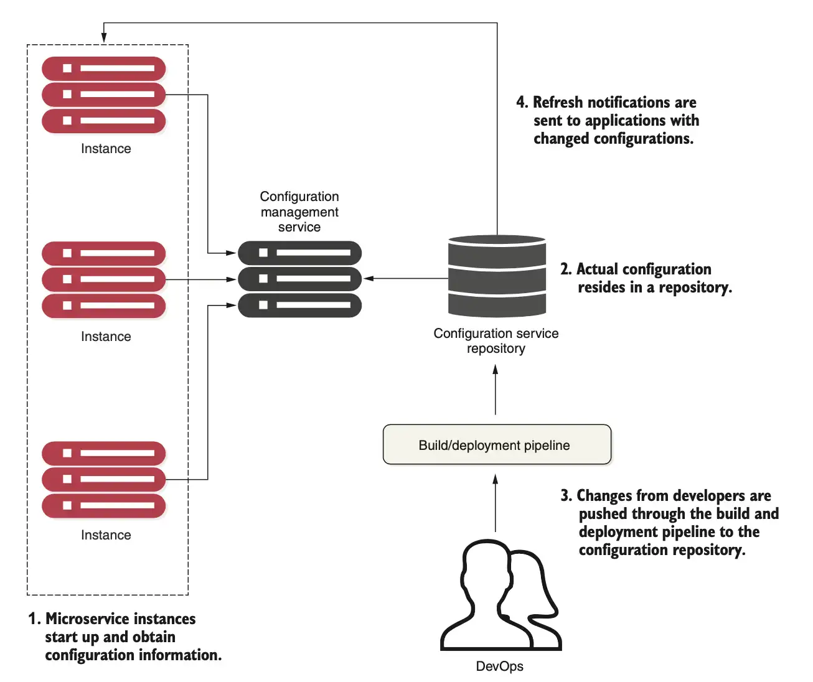

# Centralized Configuration

## Introduction

**Completely separating the configuration information from the application code allows developers and operations teams to make changes to their configurations without going through a recompile process**. It also introduces complexity, because now developers have another artifact to manage and deploy with the application.

**Many developers turn to property files** to store their configuration information. Configuring your application in these files becomes a simple task, so easy that most developers never do more than placing their configuration file under source control.

**This approach might work with a small number of applications, but it quickly falls apart when dealing with hundreds of microservices**. It might also represent a security concern. To avoid this issues, developers should follow these key principles:

* **Segregate**: Application configuration shouldn’t be deployed with the service instance. Instead, configuration information should either be passed as environment variables or read from a centralized repository when the service starts.
* **Centralize**: Because a cloud-based application might literally have hundreds of services, it’s critical to minimize the number of different repositories used to hold configuration data. Centralize your application configuration into as few repositories as possible.
* **Abstract**: We also need to abstract access to configuration data behind a service interface. Instead of writing code that directly reads the service repository, we should use a REST-based JSON service to retrieve the application’s configuration data.
* **Harden**: Because your application configuration information is going to be completely segregated from your deployed service and centralized, it’s critical that the solution you utilize and implement be highly available and redundant.

## Configuration management architecture

1. **When a microservice instance comes up, it calls a service endpoint to read its configuration information**, which is specific to the environment it’s operating in. The connection information for the configuration management (connection credentials, service endpoint, ...) is passed into to the microservice as it starts.
2. Based on the implementation of your configuration repository, **you can choose different ways to hold your configuration data**. This can include files under source control, relational databases, key-value data stores, etc. 
3. **Changes to configuration management are typically handled through the build and deployment pipeline**, where modifications can be tagged with version information and deployed through the different environments (development, staging, production, and so forth). 
4. When the configuration management changes, the services must be notified of the alteration and refresh their copy of the application data.

## Implementation choices

[Spring Cloud Configuration Server](https://docs.spring.io/spring-cloud-config/docs/current/reference/html/) - Offers a general configuration management solution with different backends.

* **Non-distributed key-value store**
* Can use multiple backends for storing configuration data including filesystem, Consul, Git, Redis etc.

[etcd](https://github.com/etcd-io/etcd) - Kubernetes' backing store for all key-value data management. Uses the raft protocol (https://raft.github.io/, https://thesecretlivesofdata.com/raft/) for its distributed computing model.

* Very fast and scalable
* Easy to use and set up

[Apache Zookeeper](https://zookeeper.apache.org/) - Key-value data management solution.

* Oldest, most battle-tested of the solutions 
* Most complex to use. Can be used for configuration management, but consider only if you’re already using it in other pieces of your architecture

## Resources
- Spring Microservices in Action (Chapter 5)
- Microservices with Spring Boot 3 and Spring Cloud (Chapter 12)

