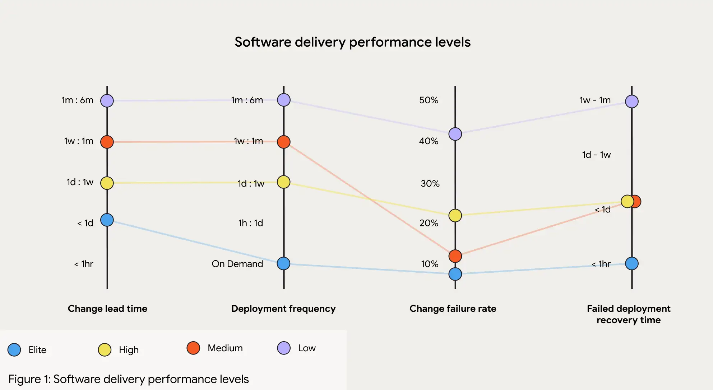
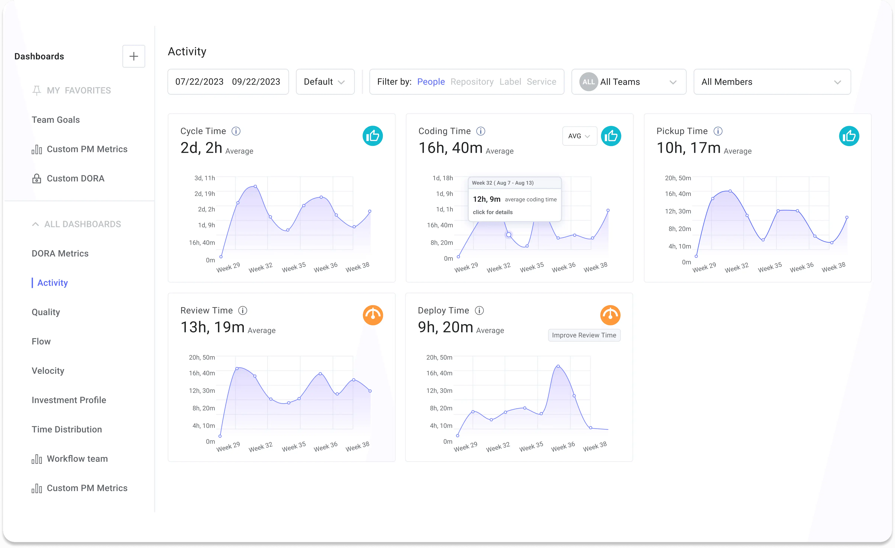

# DevOps, DevSecOps

## Key Performance Indicators (KPIs)

**Deployment Frequency**: Measures how often updates are released to production. 

**Change Failure Rate**: Tracks the percentage of deployments that need immediate fixes or rollbacks. 

---

**Lead Time**: The total time from request to full deployment of a product or feature, encompassing the entire development and delivery workflow. A key indicator of organizational efficiency.

**Cycle Time**: The time it takes to complete a specific part of the workflow, from development start to task completion. This metric highlights team productivity and potential bottlenecks.

**Lead Time for Changes**: Measures the time from a code commit to deployment in production. Short lead times indicate efficient automated workflows.

---

- **Mean Time Between Failures (MTBF)**: The average time between successive system failures. A high MTBF suggests system stability, while low MTBF calls for improvements in reliability and fault tolerance.

- **Mean Time to Detect (MTTD)**: The average time to identify a failure, performance issue, or security problem. Low MTTD ensures quick response to minimize impact on users and business.

- **Mean Time to Recovery (MTTR)**: The average time needed to restore a service after a failure. A low MTTR reflects efficient incident response, with practices like continuous monitoring and automated recovery.

- **Availability**: $$Availability = \frac{\text{MTBF}}{\text{MTBF} + \text{MTTR}}$$

## The DORA metrics
The DORA metrics were developed by the DevOps Research and Assessment (DORA) organization, which spent years studying engineering teams and their DevOps processes. They also deliver an interesting [annual report](../../../books/dora-report-2024.pdf).

These metrics are valuable because:
* they **correlate with business outcomes** and employee satisfaction, offering industry standards for benchmarking. 
* push teams to focus on **continuous improvement**.
* **only four key metrics are needed** to differentiate elite engineering teams from mediocre ones.

How to improve DORA metrics within an organization?

1. **Monitor**  
   

   [LinearB Dashboard](https://linearb.io/blog/dora-metrics)

1. **Reduction of Codebase Size**  
   Reducing size/complexity of the codebase (e.g., microservices) improves **Change Failure Rate**, **Time to Restore Service**, and **Deployment Frequency**.

2. **Automate CI/CD Pipelines**  
   Automating continuous integration/delivery pipelines reduces manual errors, accelerates testing and deployment processes improving both **Deployment Frequency** and **Lead Time for Changes**.

3. **Reduction of PR Size**  
   Smaller pull requests are easier to review, merge, and test, reducing the risk of issues and speeding up the overall development process, which directly impacts **Lead Time for Changes**.

4. **Implement Deployments Strategies**  
   Deployment strategies reduce the impact of failed releases by gradually introducing changes to a small subset of users before improving both **Change Failure Rate** and **Time to Restore Service**.

## Resources
