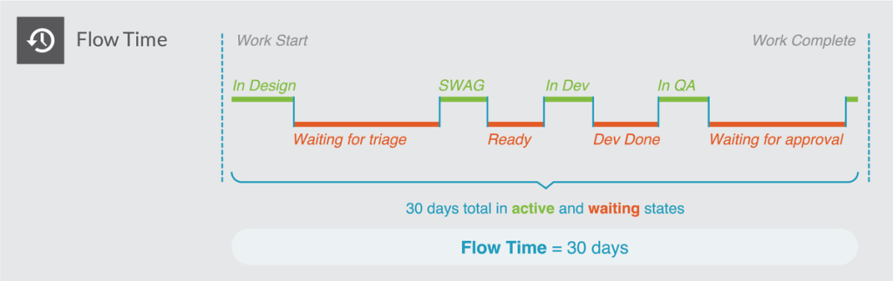
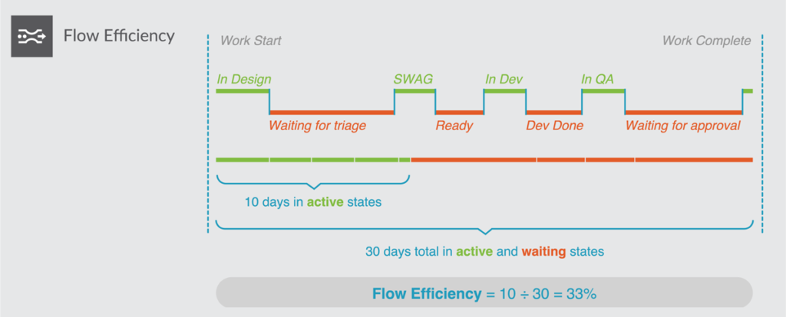
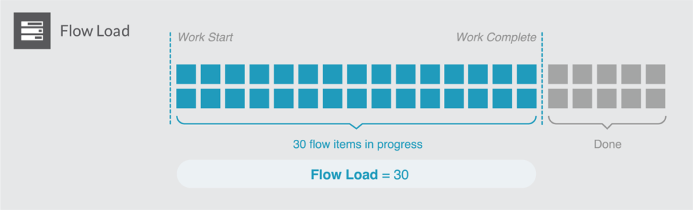
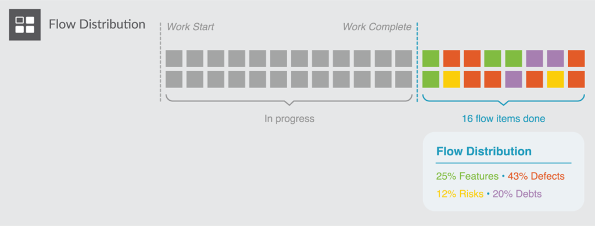
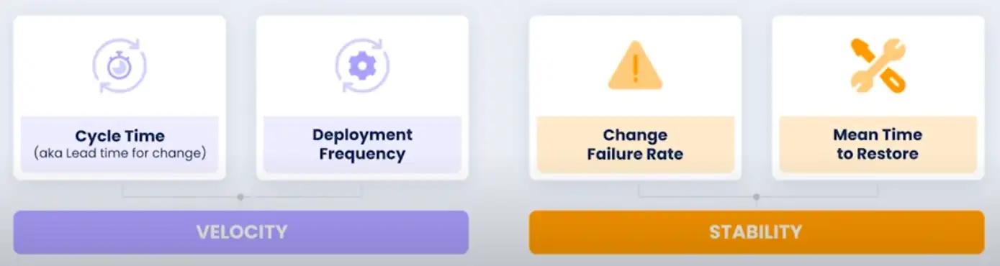
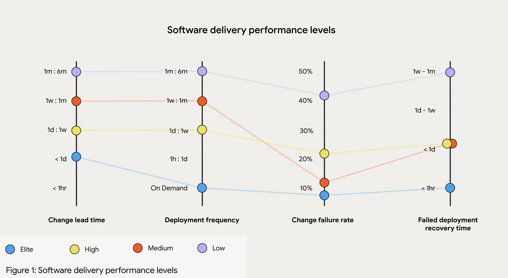
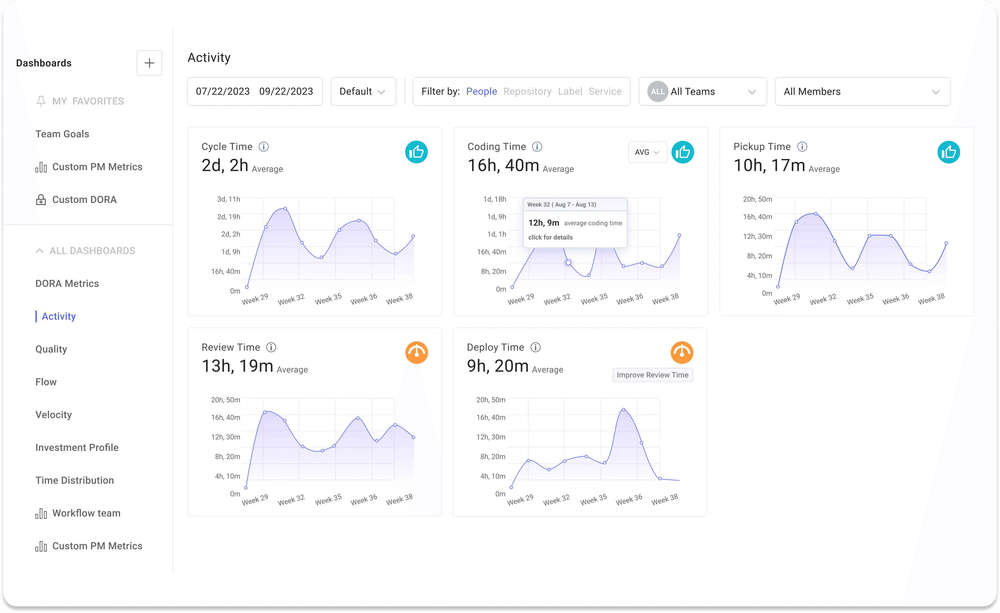

# Software metrics

## Delivery Metrics

**Deployment Frequency**: Measures how often updates are released to production.

**Lead Time**: The total time from request to full deployment of a product or feature, encompassing the entire development and delivery workflow. A key indicator of organizational efficiency.

**Cycle Time**: The time it takes to complete a specific part of the workflow, from development start to task completion. This metric highlights team productivity and potential bottlenecks.

**Lead Time for Changes**: Measures the time from a code commit to deployment in production. Short lead times indicate efficient automated workflows.

## Stability Metrics
**Change Failure Rate**: Tracks the percentage of deployments that need immediate fixes or rollbacks.

**Mean Time Between Failures (MTBF)**: The average time between successive system failures. A high MTBF suggests system stability, while low MTBF calls for improvements in reliability and fault tolerance.

**Mean Time to Detect (MTTD)**: The average time to identify a failure, performance issue, or security problem. Low MTTD ensures quick response to minimize impact on users and business.

**Mean Time to Recovery (MTTR)**: The average time needed to restore a service after a failure. A low MTTR reflects efficient incident response, with practices like continuous monitoring and automated recovery.

## Flow Metrics

**Flow Metrics** (introduced by the *Flow Framework* by Mik Kersten) help teams understand the **efficiency of the software delivery process itself** — identifying bottlenecks, handoff delays, and waste in the value stream. They measure how work items (features, bugs, risks, technical debts) flow from idea to production. The main Flow Metrics are:

**Flow Time**: Measures the total time it takes for a work item to go from “start” (when development begins) to “finish” (when value is delivered to users).
* Indicates how long customers wait for value.
* Related to DORA’s *Cycle Time*, but considers the *entire value stream*, not just code-to-deploy.

**Flow Efficiency**: The ratio between *active time* (when work is progressing) and *total flow time* (including waiting).
* Highlights process inefficiencies, approval delays, and overburdened teams.
* High variability or low efficiency signals bottlenecks or context switching.

**Flow Load**: The total number of active work items in progress.
* Helps manage team capacity and prevent overload.
* Strongly correlates with *cycle time* and *quality* — when load is too high, delivery slows and error rates rise.

**Flow Distribution**: Tracks the proportion of different types of work (e.g., features, defects, technical debt, risks).
* Balancing these categories ensures sustainable development — too little time on debt and risk reduction leads to long-term fragility.

**Flow Velocity**: The number of work items completed per unit of time.
* Measures delivery throughput.
* Should be analyzed together with Flow Time and Efficiency to avoid focusing solely on output.

## DORA metrics
The  [DORA metrics]((https://linearb.io/blog/dora-metrics)) were developed by the DevOps Research and Assessment (DORA) organization, which spent years studying engineering teams and their DevOps processes. They also deliver an interesting [annual report](../../../books/dora-report-2024.pdf).

These metrics are valuable because:
* they **correlate with business outcomes** and employee satisfaction, offering industry standards for benchmarking. 
* push teams to focus on **continuous improvement**.
* **only four key metrics are needed** to differentiate elite engineering teams from mediocre ones.

## How to improve metrics within an organization?

* **Monitor**
* **Reduction of Codebase Size (also PR size)**
* **Automation (CI/CD Pipelines, Deployments Strategies)**  

## Resources
- https://www.youtube.com/watch?v=H3nlvHQHb5E
- https://www.youtube.com/watch?v=7d5Sah0M6Zg
