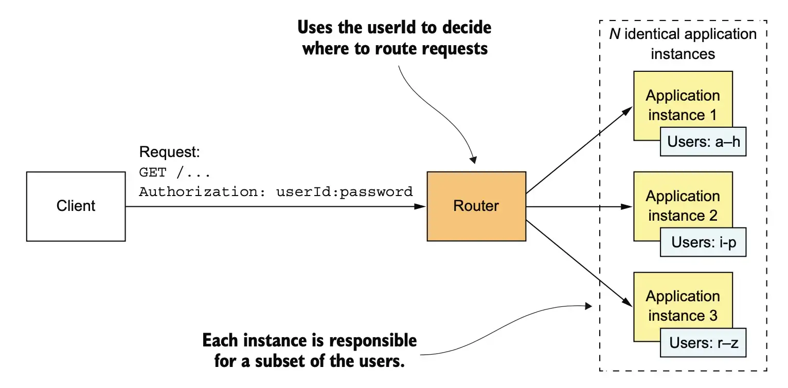

# Software Architectures

## What is Software Architecture?

Architecture defines **components, connectors, and constraints** that shape how systems are organized.
Different styles change **local complexity** (inside modules) and **global complexity** (system-wide).

---

## Monolithic Architectures

A **single, unified application** where all parts run in one process.

**Pros**

* Simple development tools
* Straightforward testing
* Easy deployment
* Fast in-process communication

**Cons**

* Tends toward a *big ball of mud*
* Slow builds and startup
* Hard to refactor
* Tech lock-in
* Can't scale or deploy individual pieces

**When Monoliths Grow**

* Slow development loops
* Heavy end-to-end testing
* Long, risky deployments
* *Big Ball of Mud*

---

## Multi-Layered (N-tier) Architecture

Application split into technical layers (UI → business → data).

**Pros**

* Clear separation of concerns
* Easy for teams to work on different layers
* Familiar and well-supported

**Cons**

* Vertical features require changes across layers
* Inefficient message flow through layers
* Harder to refactor around domain boundaries

**Use**

* Simple applications
* Technically structured teams

---

## Clean Architecture

Domain and use-cases at the center; frameworks and infrastructure at the edges.

**Pros**

* Strong decoupling
* Easy to test business logic
* Swap DB/UI/frameworks without touching core logic

**Cons**

* More abstraction and indirection
* Requires architectural discipline

**Use**

* Systems expected to evolve for years
* Applications with complex business rules

---

## Modular Monolithic Architecture

Organize code by **business modules**, not layers.

**Pros**

* Strong domain encapsulation
* Good consistency (single database)
* Natural path toward microservices

**Cons**

* No independent deployment
* No technology polyglot
* Scaling still applies to entire app

**Use**

* Domain-oriented teams
* Large monoliths undergoing modernization
* Workloads requiring strong consistency

---

## Scaling Monoliths — The Scale Cube

### X-axis Scaling

Clone the entire application behind a load balancer.

### Z-axis Scaling

Shard by data (e.g., userId).

### Y-axis Scaling

Split the application by function.

---

# Distributed Architectures

Applications composed of multiple components running on different machines, communicating over RPC.

**Pros**

* Independent deployment
* Independent scaling
* Smaller units → lower local complexity

**Cons**

* High global complexity (APIs, retries, consistency)
* Requires service discovery, tracing, logging
* Risk of a *distributed monolith*

---

## Service-Oriented Architecture (SOA)

*Dumb services, smart pipes.*
Often built around shared enterprise services and protocols like SOAP.

**Pros**

* Good for integrating heterogeneous systems
* Reusable, discoverable services

**Cons**

* Heavy protocols
* Shared services become bottlenecks
* Slow adaptation to change

**Use**

* Large enterprises with legacy systems
* Cross-system workflows

---

## Microservices Architecture

*Smart services, dumb pipes.*
Each service owns its data and is deployed independently.

**Pros**

* High evolvability
* Independent deploy and scale
* Technology freedom
* Team autonomy

**Cons**

* Operational complexity
* Harder debugging and monitoring
* Many small services/databases to manage

**Use**

* Complex systems with fast evolution
* Teams experienced in distributed systems

---

## Resources

* *Fundamentals of Software Architecture* — Richards & Ford
* Mark Richards – YouTube channel
