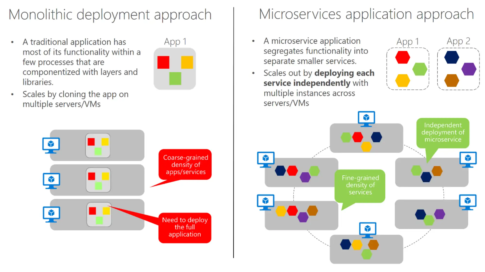
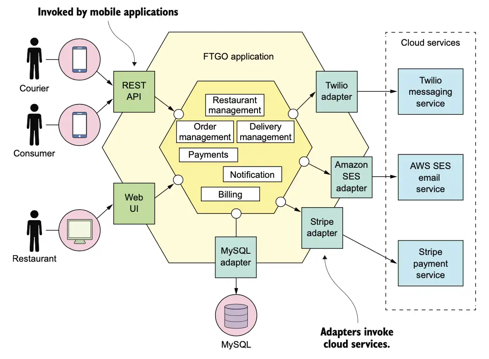
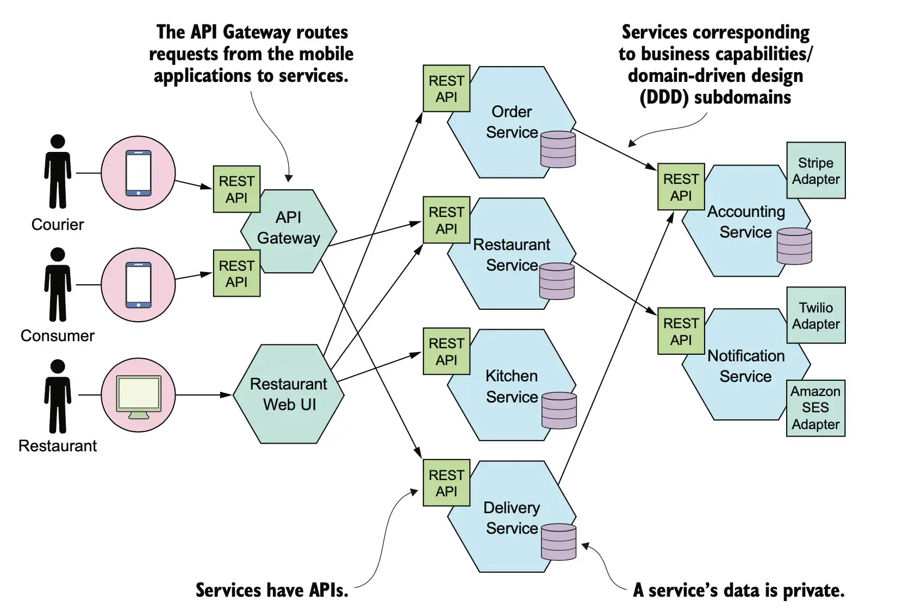
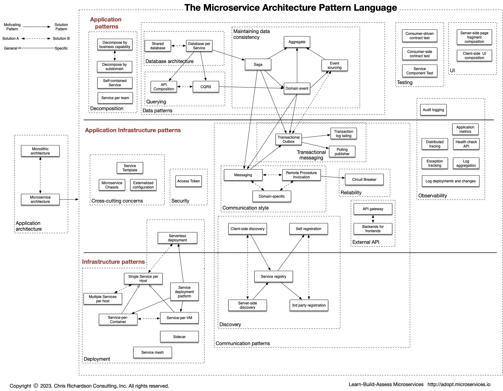

# Introduction to Microservices

As the name implies, a microservices architecture is an approach to building a server application as a set of small services. That means a microservices architecture is mainly oriented to the back-end, although the approach is also being used for the front end. 

* **Each microservice runs in its own process and communicates with other processes** using protocols such as HTTP/HTTPS, WebSockets, or AMQP.
* Each microservice implements a specific end-to-end domain or business capability within a certain context boundary, and each **must be developed autonomously and be deployable independently**. 
* **Each microservice own its related domain data model and domain logic** and could be based on different data storage technologies
(SQL, NoSQL) and different programming languages.

Why a microservices architecture? 

* **Development**. Microservices enable better maintainability in complex, large, and highly-scalable systems by letting you create applications based on many independently deployable services that each have granular and autonomous lifecycles. 
  * **Maintainability**: Smaller services are easier to maintain and update.
  * **Independent Deployment**: Services can be deployed independently, minimizing downtime.
  * **Team Autonomy**: Teams can operate independently, fostering innovation.
  * **Adoption of New Technologies**: Easier to experiment with and integrate new technologies.
  * **Fault Isolation**: Issues in one service "do not" impact others.
* **Scalability**. Instead of having a single monolithic application that you must scale out as a unit, you can instead scale out specific microservices. That way, you can scale just the functional area that needs more processing power or network bandwidth to support demand, rather than scaling out other areas of the application that don’t need to be scaled. That means cost savings because you need less hardware.

## Challenges

While microservice architecture offers flexibility, scalability, and resilience, it introduces several key challenges, especially as systems grow in size and complexity. Here are some of the primary difficulties:

### Dependency on Containerization and Orchestration

Microservices rely on containerization for isolated and consistent environments. However, containerization adds layers of operational and security complexity that require specialized skills.

- **Container Management:** Each service needs container images, which require careful building, versioning, and storage management.
- **Orchestration Complexity:** Platforms like Docker and Kubernetes are essential for managing containerized services at scale, but they introduce complexity in deployment, scaling, resource allocation, and monitoring.
- **Resource and Network Optimization:** Fine-tuning container resource limits and managing secure inter-service networking are critical but complicated tasks.
- **Security Concerns:** Containers add potential attack surfaces, requiring ongoing vulnerability management for each image.

## Communication Patterns

Microservices communicate over the network, which introduces latency, potential failures (total or partial), and complexities not present in monolithic approaches:

- **Synchronous vs. Asynchronous Communication:** Choosing between synchronous (REST, gRPC, GraphQL) or asynchronous communications (Kafka, RabbitMQ) affects latency, coupling, and complexity.
- **Data Serialization:** Serialization protocols (JSON, Protobuf) need to be carefully chosen for efficiency, interoperability, and backward compatibility.

## Cross-Cutting Concerns

Microservices introduce shared concerns that each service must address:

- **Service Discovery:** Services need to dynamically locate and communicate with each other. Service discovery enables this by maintaining a registry of available services and their instances.
- **Service Routing:** Once services are discovered, requests must be efficiently routed to the appropriate service instances. Service routing ensures load balancing, failover handling, and API gateway functionalities. 
- **Configuration Management:** Managing configurations across tens or hundreds of services requires secure and centralized configuration management.

## Resiliency Strategies

Microservices must be designed to handle failures gracefully, ensuring system stability and fault tolerance:

- **Fault Isolation and Containment:** Failures in one service should not propagate to others. Patterns like bulkheads, service isolation, and fallback mechanisms help contain failures.
- **Self-Healing and Recovery:** Automated recovery techniques, such as retries, circuit breakers, and failover strategies, improve system resilience.

## Observability

Monitoring the health and performance of many services is a challenge:

- **Centralized Logging:** Logs need to be centralized, parsed, and correlated across services to provide a unified view.
- **Distributed Tracing:** Tracking requests across services requires specialized tracing tools to understand request flow, latency issues, and dependencies.
- **Metrics Collection:** Each service should emit metrics (e.g., latency, error rates) that can be collected, visualized, and used for alerting.

## Data Consistency and Management

Unlike monolithic architectures, where a single database can enforce data consistency, microservices often have separate databases:

- **Distributed Data Management:** Each microservice might own its data store, which can result in duplicated data and inconsistencies.
- **Eventual Consistency Challenges:** Achieving real-time consistency across services is difficult, and event-based consistency models require design strategies like the **SAGA pattern** or **CQRS pattern**.

## Automation

- **DevOps:** Ensures seamless collaboration between development and operations through CI/CD, automation, and infrastructure as code (IaC). It enables efficient **configuration and deployment** of microservices.

- **MLOps:** Extends DevOps to ML model lifecycle management, handling **versioning, deployment, and monitoring**. Tools like Kubeflow, MLflow, and TFX automate training, deployment, and scaling of models in production.

## Microservices Architecture Language Pattern

The [Microservices Architecture Language Pattern](https://microservices.io/patterns/) is a structured framework that provides a common vocabulary for designing and implementing microservices, addressing the challenges of distributed systems. Aligned with the principles of the [12-Factor App](https://12factor.net/), it emphasizes modularity, scalability, and the separation of concerns. The pattern offers solutions for service decomposition, communication, data management, and resiliency, ensuring that services remain loosely coupled but highly cohesive. By incorporating principles like configuration management, dependency isolation, and statelessness, the language pattern helps ensure that microservices are resilient, easy to scale, and maintainable, supporting cloud-native and continuously deployed applications.

