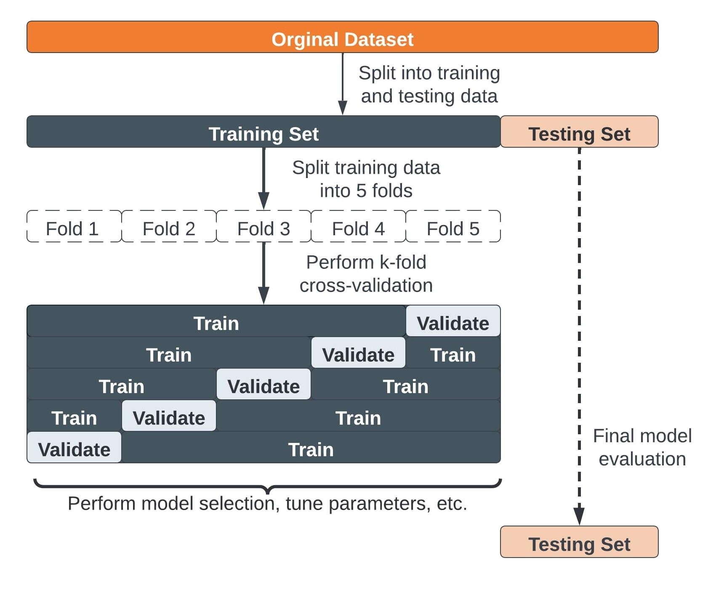
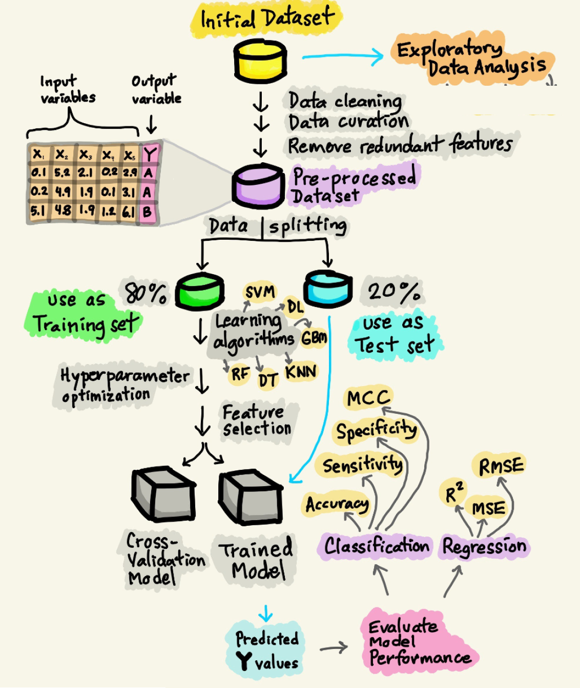

# Introduction to ML and MLOps

## What is a machine learning model?

Machine Learning models are computer algorithms that use data to make predictions or decisions. Unlike traditional algorithms, which are manually updated by developers to improve performance, Machine Learning models improve automatically by learning from data to perform a specific task more effectively.


## Machine Learning Workflow

The process of developing an ML-based solution consists of three stages: 
* Data Preparation
* Model Development
* Model Deployment

## Data Preparation

Data is essential to the success of a machine learning solution. Model performance depends as much on data quality as on the algorithm itself. As a result, data preparation is a critical phase—often taking up to 80% of the project time—and includes steps like collecting, cleaning, and transforming data.

* Data Collection
* Data Preprocessing
* Data Augmentation
* Data Analysis

### Data Collection

* **First step** in building any ML model: gather and organize data from various sources.
* **Challenge:** discovering what data exists and ensuring it’s accessible and relevant.

* **Data types:**
  * *Structured*: e.g., databases (easier to work with).
  * *Unstructured*: e.g., text, images, logs (requires more preprocessing).

* **Key concern:** **Data quality**
  * Reliable, consistent, and up-to-date data is crucial.
  * Poor-quality data leads to biased or inaccurate models.

### Data Preprocessing

* **Goal:** Clean and transform raw data into a usable format for modeling.
* **Typical tasks:**

  * Handle missing values and correct errors.
  * Normalize/scale data to ensure balanced feature influence.
  * Simplify structures and convert formats.
  * Remove duplicates and handle outliers.

* **Challenges:**
  * Integrating data from **heterogeneous sources** with different formats/schemas.
  * Ensuring **consistency** across systems (e.g., naming, encoding).
  * Maintaining **data quality** despite noise, redundancy, and incompleteness.

### Data Augmentation

* **Goal:** Increase the **quantity** and **diversity** of data to improve model training.
* Especially valuable when labeled data is **scarce** or **expensive** to obtain.

* **Why it's important:**
  * Supervised ML requires large labeled datasets.
  * Manual labeling is time-consuming and costly.
  * Helps prevent **overfitting** by exposing the model to more varied examples.

* **Techniques:**
  * For images: rotation, flipping, cropping, color shift.
  * For text: synonym replacement, back translation.
  * For synthetic data: use of simulation, generative models (e.g., GANs).

### Data Analysis

* **Goal:** Understand the data’s structure, quality, and potential biases before modeling.
* Helps identify issues that could compromise model performance.

* **Key activity: Data Profiling**
  * Assess **data quality**, **completeness**, and **consistency**.
  * Detect **missing values**, **outliers**, and unexpected distributions.
  * Validate assumptions and hypotheses about the dataset.

* **Challenges:**
  * **Visualization and profiling tools** are often limited or fragmented.
  * Difficult to detect subtle issues, especially in large or complex datasets.
  * Poor analysis can lead to flawed insights and reduced model accuracy.


## Model Development

**Model Learning** is the phase of the deployment workflow in which machine learning models are developed and trained to solve specific problems. This process involves:
* Model selection
* Model training
* Model validation

### Model Selection

* **Goal:** Choose the appropriate model based on the problem type and data available. When choosing a model, it is important to consider complexity and interpretability. Simple models may offer advantages in computational resources and ease of interpretation, while more complex models may improve performance but require more resources.

* **Supervised Learning:**

  * **Use case:** When you have labeled data.
  * **Models:** Linear regression, decision trees, support vector machines (SVMs), neural networks.

* **Unsupervised Learning:**

  * **Use case:** When you have unlabeled data and need to find hidden patterns.
  * **Models:** K-means, hierarchical clustering, PCA, autoencoders.

* **Reinforcement Learning:**

  * **Use case:** When you need to train an agent to make sequential decisions.
  * **Models:** Q-learning, Deep Q-Networks (DQN), policy gradient methods.

* **Deep Learning:**

  * **Use case:** For complex data types like images, text, or speech, where feature extraction is difficult.
  * **Models:** Convolutional Neural Networks (CNNs), Recurrent Neural Networks (RNNs), transformers.


### Model Training

To build a **machine learning model that generalizes well**, we must carefully manage data.  If we train and test on the same data, the model may just **memorize** instead of learning useful patterns.

**1. Training Set**

- Used to **train** the model by adjusting internal parameters.
- The model learns patterns and relationships in the data.
- Usually the **largest portion** of the dataset (e.g., **60-80%**).

**2. Validation Set**

- Used to **tune hyperparameters** and prevent overfitting.
- Helps in **model selection** (e.g., choosing learning rate, number of layers).
- The model **does not learn** from this set; it's only used for evaluation.
- Typically **10-20%** of the dataset.
- Prevents the risk of overfitting to the test set.

**3. Test Set**

- Used for **final evaluation** after training and validation.
- Provides an **unbiased assessment** of the model’s real-world performance.
- Should **never** be used during training or validation.
- Typically **10-20%** of the dataset.

### Model Validation

- **K-Fold Cross Validation** is a technique used to assess how well a machine learning model generalizes to unseen data.
- The dataset is **split into K subsets** (or "folds"). The model is trained on (K-1) folds and validated on the remaining fold. This process is repeated K times, each time using a different fold as the validation set.
- **Benefits:**
  - **Reduces Bias**: Every observation is used for both training and testing, ensuring a less biased performance estimate.
  - **Maximizes Data Usage**: Especially useful when the dataset is small, as each data point gets to be in both training and validation sets.
  - **Reliable Performance Estimate**: By averaging over multiple folds, we get a more stable estimate of model performance.






## Model Deployment

Deploy machine learning models to production while ensuring effective integration, monitoring, and updating.
  
### Model Formats

**Distributing trained machine learning models** requires standardized formats that ensure portability, interoperability, and performance across different environments. These formats are typically supported by **inference engines**, which load and execute models efficiently in production.

* **ONNX (Open Neural Network Exchange):**

  * Open standard supported by many frameworks (PyTorch, TensorFlow, etc.).
  * Enables interoperability and hardware acceleration.

* **SavedModel (TensorFlow):**

  * TensorFlow’s native format for saving complete models, including weights and computation graph.

* **TorchScript (PyTorch):**

  * Serialized version of PyTorch models that can run independently from Python code.

* **PMML (Predictive Model Markup Language):**

  * XML-based format for traditional ML models (e.g., decision trees, regressions).

* **HDF5 (.h5):**

  * Popular format for storing Keras/TensorFlow models, includes architecture and weights.

### Inference Engines

* **TensorFlow Serving:**
  Production-ready server for TensorFlow models with REST/gRPC APIs.

* **TorchServe:**
  PyTorch-native model serving tool, supports multi-model deployment.

* **ONNX Runtime:**
  Cross-platform, high-performance engine for ONNX models.

* **OpenVINO:**
  Optimized for Intel hardware, supports inference across edge and cloud.

* **NVIDIA TensorRT:**
  High-performance inference for deep learning models on NVIDIA GPUs.

### Integrating Inference within a software architecture

1. **Export/Load the Trained Model**

* Use a supported format (e.g. ONNX, TensorFlow SavedModel).
* Load it into your inference engine (e.g. ONNX Runtime, TensorFlow Serving, TorchServe).

2. **Wrap Inference Logic in a Web Service**

* Accepts **user input** via an HTTP request (e.g., JSON, form data, image upload).
* **Preprocesses** the input (e.g., normalization, tokenization).
* Passes it to the inference engine to **generate predictions**.
* **Postprocesses** and returns the results (e.g., label mapping, confidence scores).

3. **Expose via a Web Framework**

* **Python:** Flask, FastAPI, Django
* **Java:** Spring Boot
* **Node.js:** Express

**Example (Python + FastAPI + ONNX Runtime):**

```python
import onnxruntime as ort
from fastapi import FastAPI, Request
import numpy as np

app = FastAPI()
session = ort.InferenceSession("model.onnx")

@app.post("/predict")
async def predict(request: Request):
    data = await request.json()
    inputs = np.array(data["inputs"]).astype(np.float32)
    result = session.run(None, {"input": inputs})
    return {"prediction": result[0].tolist()}
```

4. **Deploy the Web Service**

* **Containerize** using Docker (optional but common).
* Deploy to a server, cloud service (AWS, Azure, GCP), or edge device.
* Expose via HTTPS with API authentication if needed.
* Use load balancers or autoscaling if expecting high traffic.

5. **Monitor and Scale**

* Add logging and error handling.
* Use tools like Prometheus/Grafana for performance monitoring.
* Track key metrics: input data, prediction bias, and overall performance (the ML community is still defining which metrics are most critical).

6. **Update**

* Update models to reflect recent data trends and tackle concept drift.
* Implement scheduled retraining or continual learning.
* Continuous delivery of models is complex as code, model, and data all evolve simultaneously.


## Issues of deployed models

- Data drift
- Concept drift


## What is MLOps?

**MLOps (Machine Learning Operations) extends DevOps principles to address the unique workflows and challenges associated with machine**. Specifically, it is tailored to manage the complexities of integrating ML models into production environments.

MLOps is a set of practices that combines machine learning (ML) model development with operations (Ops), aiming to **automate and streamline the entire lifecycle of ML models**. This lifecycle includes stages such as:
* data preparation
* model development
* model deployment
* model monitoring

Through a set of practices, MLOps helps ensure that **models remain effective, scalable, and adaptable to changing production environment conditions**.


## Key Practical Needs Behind MLOps

* **1. Scalability:**

  * Ability to deploy and manage machine learning models at large-organization scale, supporting multiple environments and large datasets.

* **2. Automation:**

  * Automating workflows for model training, testing, deployment, and monitoring to increase deployment frequency.

* **3. Accountability:**

  * Keeping track of changes in code, models, data, and experiments to ensure accountability.

* **4. Continuous Integration/Continuous Deployment (CI/CD):**

  * Implementing automated pipelines to deploy new versions of models and code seamlessly without downtime.

* **5. Model Monitoring and Management:**

  * Ongoing tracking of model performance and detection of issues like **concept drift** or **data drift**, ensuring models stay effective over time.

* **6. Collaboration Between Teams:**

  * Bridging the gap between data scientists, engineers, and operations teams for smoother workflows and shared responsibilities.

* **7. Reproducibility:**

  * Ensuring that models can be reliably retrained and tested with the same parameters and data, fostering consistency across teams.

* **8. Governance and Compliance:**

  * Establishing frameworks for monitoring, auditing, and ensuring models comply with industry regulations and ethical standards.

## MLOps Maturity

### MLOps Level 0

* **Model Registry**: Centralized storage for trained models, including metadata, lineage, and deployment tags (e.g., staging, production).

* **Manual Model Training**: Data scientists train models manually on local machines or scripts without automated workflows. Training and evaluation are driven by notebooks or loosely organized Python scripts, often lacking proper software engineering practices.

* **No Versioning**: Models, data, and code are often not versioned properly, making it difficult to reproduce results or track changes.

* **No Continuous Integration or Deployment (CI/CD)**: There is no automation; model deployment (if any) is done manually, often by copying files or manually editing APIs.

* **Inconsistent Environments**: Models may work in development but fail in production due to inconsistent libraries, dependencies, or hardware setups.

* **Lack of Monitoring**: Once deployed, models are rarely monitored. No logging, alerts, or performance tracking in place.


### MLOps Level 1

* **Basic Automation of ML Pipelines**: Some stages of the ML workflow are automated (e.g., well-written scripts), but the process is still not hands-free.

* **Model Monitoring in Production**: Tools or scripts monitor deployed models for issues like data drift, prediction errors, and performance degradation.

* **Scheduled Model Retraining**: Retraining is done more frequently than Level 0, typically on a fixed schedule (e.g., weekly or monthly), not dynamically triggered.


### MLOps Level 2

* **Full CI/CD Automation**: Code changes, data updates, or model improvements automatically trigger retraining, testing, validation, and deployment pipelines.

* **Data and Model Versioning**: All datasets, models, and configurations are versioned for full reproducibility (e.g., using tools like DVC or MLflow).

* **Modular Pipelines**: The ML lifecycle is split into reusable components (training, evaluation, deployment) using tools like Kubeflow, Airflow, or TFX. Docker/Kubernetes ensure consistent behavior across dev, test, and prod environments.

* **Monitoring and Alerting**: Real-time monitoring of model performance, prediction drift, and data quality; alerts are triggered on anomalies.

* **Scalability**: Pipelines and inference services scale horizontally using distributed training or GPU-backed clusters.


### MLOps Level 3

* ML pipelines are **fully integrated into the CI/CD process**, covering data validation, model testing, and automated retraining.
* **Continuous Integration (CI)** includes building, testing, and packaging both ML components and application code.
* **Continuous Delivery (CD)** automates deployment of retrained models to production alongside software updates.
* Ensures **robust, scalable, and adaptive** ML systems through tight DevOps alignment and infrastructure automation.
* Supports rapid iteration and safe deployment by treating code, data, and models as first-class, versioned assets.


