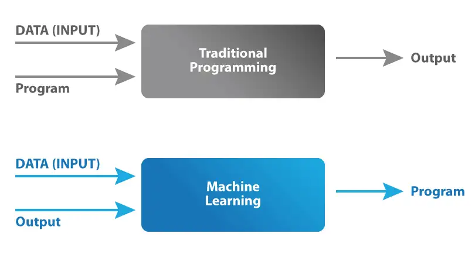
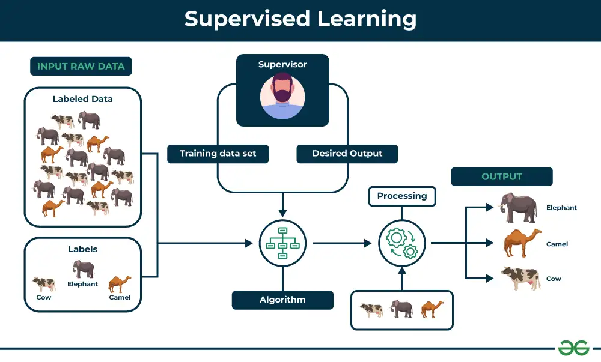
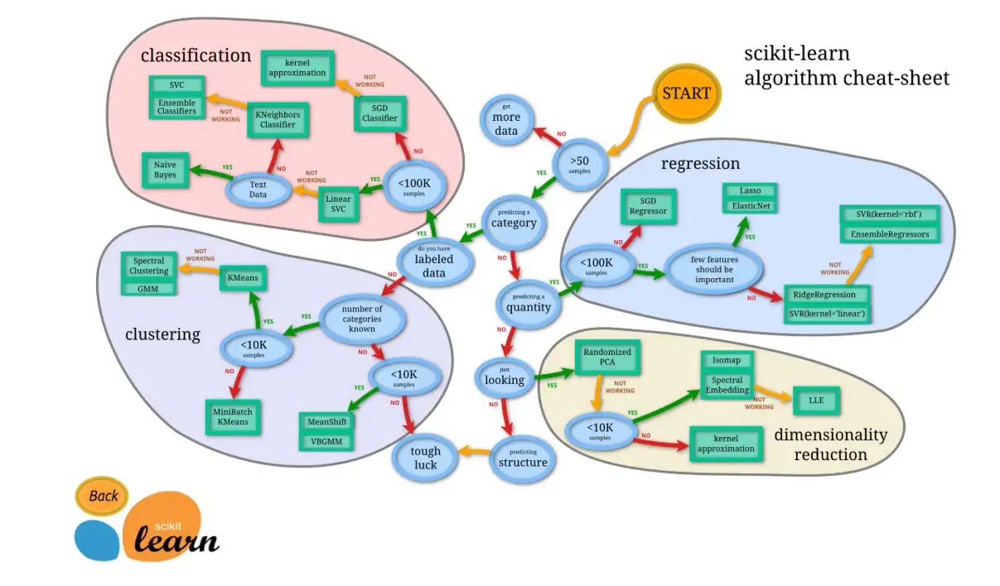
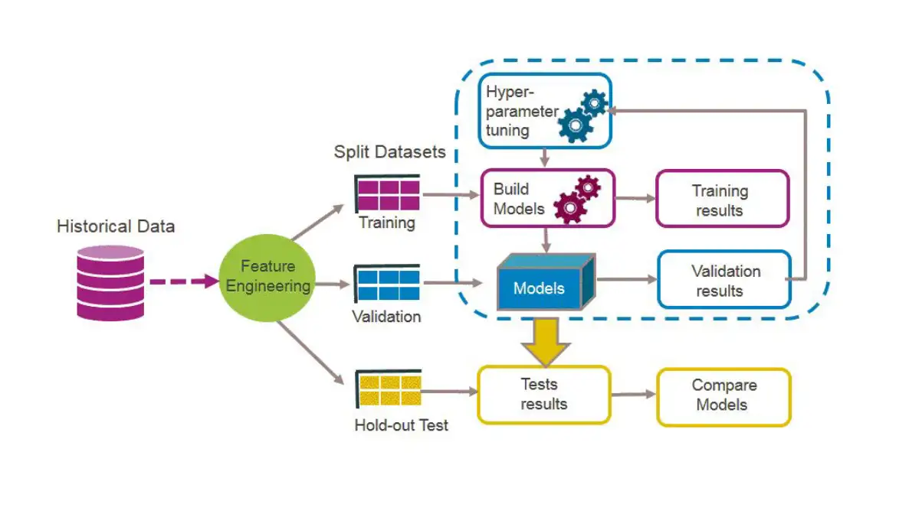

# Introduction to Machine Learning and Model Deploying

## What is a machine learning model?

Machine Learning models are computer algorithms that use data to make estimates (reasoned guesses) or decisions. Machine Learning models differ from traditional algorithms in the way they are designed. When a traditional computer software needs to be improved, users modify it. In contrast, a Machine Learning algorithm uses data to improve a specific task.

---

## Types of Machine Learning

Machine learning can be divided into several main categories, depending on how systems gather information and learn from it:

### 1. Supervised Learning
In supervised learning, the system receives a set of labeled data, that is, with input (features) and output (target variables) already defined. The goal is for the model to learn the relationship between input and output so that it can apply it to new, unseen data. Common applications include classification (predicting categories) and regression (predicting continuous values).

### 2. Unsupervised Learning
In unsupervised learning, the system receives a set of unlabeled data, i.e., only inputs without any predefined outputs. The model's task is to identify hidden patterns or structures in the data without external guidance. Common applications include clustering (grouping similar data points) and dimensionality reduction (simplifying data while preserving important information).

### 3. Reinforcement Learning
In reinforcement learning, an agent learns by interacting with an environment through a series of actions. The agent receives feedback in the form of rewards or penalties based on its actions, and aims to learn a policy that maximizes cumulative rewards over time. This approach is particularly useful for sequential decision-making problems, such as game playing, robotics, and autonomous systems.

### 4. Deep Learning
Deep learning is a subset of machine learning that uses artificial neural networks with multiple layers (deep neural networks). It can be applied to supervised, unsupervised, and reinforcement learning problems. Deep learning excels at automatically learning hierarchical representations from raw data, making it particularly powerful for complex tasks like image recognition, natural language processing, and speech recognition.

---

## Machine Learning Deployment Workflow

The process of developing an ML-based solution consists of four stages: Data Management, Model Learning, Model Verification, and Model Deployment.

### 1. Data Management

Data is a key element in achieving good performance in machine learning solutions. In fact, the overall effectiveness of the solution depends as much on the training and testing data as on the algorithm itself. Therefore, it is critical to emphasize this phase, which focuses on preparing the data needed to build a machine learning model. Typically, data preparation accounts for about 80 percent of the time spent on a machine learning project and involves several steps: Data Collection, Data Preprocessing, Data Augmentation, and Data Analysis.

- **Data Collection** is the foundational step in building any machine learning model. It involves identifying, gathering, and organizing data from various sources. One of the biggest challenges in this phase is data discovery: determining what data exists and ensuring it is accessible and relevant to the task at hand. In many cases, especially in large organizations, data can be scattered across different systems, services, or departments, making it difficult to locate.

  Data can come in different formats—structured, such as databases with clear schemas, or unstructured, like text documents, images, or logs. Structured data is easier to work with as it follows defined formats, while unstructured data, though more flexible, often requires additional preprocessing to be useful for machine learning models.

  Another key aspect of data collection is ensuring that data sources are reliable and of high quality. The credibility of the source impacts the accuracy and trustworthiness of the model's predictions. Inconsistent, incomplete, or outdated data can lead to biased or faulty models, which is why it's important to carefully evaluate the data's provenance.

- **Data Preprocessing** is a crucial phase in the lifecycle of a machine learning project. It includes various data cleaning and transformation activities, such as handling missing values, correcting errors, simplifying data structure, and converting raw data into formats more suitable for the model. During this stage, the dataset is prepared to ensure it is homogeneous, error-free, and ready for analysis or training.

  A particularly important aspect of preprocessing is data normalization or scaling, which ensures that features have equal weight in the model and prevents variables with wider ranges from disproportionately affecting results. Additionally, handling outliers or anomalies is necessary to prevent distortion of model outcomes.

  One of the key challenges in preprocessing is integrating data from multiple heterogeneous sources, which may use different schemas and conventions. For example, databases may represent the same data type with different encodings or inconsistent field names, requiring reconciliation and standardization.

  Data quality is another common challenge. Data collected from various sources often contains errors or duplicates, requiring actions such as duplicate removal, missing value imputation, and format harmonization. When data is dispersed across multiple silos or log files, ensuring that all relevant information is properly retrieved and organized becomes critical.

- **Data Augmentation** focuses on increasing the quantity and quality of available data, particularly to address the lack of labeled data essential for supervised machine learning. Manual labeling becomes complex and expensive when dealing with large volumes of data, such as in network traffic analysis, where millions of packets must be labeled. In contexts like medical image analysis, the scarcity of available experts to label large datasets can further limit this process.

- **Data Analysis** involves examining the data for potential biases or unexpected variations in distribution. A crucial aspect of this phase is data profiling, which includes activities such as checking data quality, identifying missing values and inconsistencies, and validating hypotheses about the data. While effective visualization and profiling tools are essential for detecting problems in data structure, they remain scarce. This scarcity makes it difficult for data scientists to address data quality challenges, potentially undermining the overall success of a machine learning project.

- **Division of Data**: A crucial step in data preparation is dividing the dataset into three main parts: **Training**, **Validation**, and **Test**. 

  - **Training Set**: This portion is used to train the model. It contains the data from which the model learns the relationships between independent (input) and dependent (output) variables. The size of this set must be large enough for effective learning.

  - **Validation Set**: This set is used to optimize the model's hyperparameters and perform tuning without interfering with training. Validation helps monitor the model's performance during training and prevent overfitting, allowing parameters to be adjusted and the model's accuracy to be improved.

  - **Test Set**: The test set is a portion of data never used during training or validation. It is used exclusively to evaluate the final performance of the model, providing an unbiased measure of its ability to generalize to unseen data.

  This subdivision is essential to ensure that the model can not only learn from the data but also generalize correctly to new data, avoiding the risk of overfitting.

## 2. Model Learning

**Model Learning** is the phase of the deployment workflow in which machine learning (ML) models are developed and trained to solve specific problems. This process involves choosing the appropriate model, training the model, and optimizing hyper-parameters, each of which plays a crucial role in determining the effectiveness of the final model.

### Model Selection

Model **selection** is a critical step that depends on the specific goal of the application. There are several types of models that can be considered:

- **Regression models**: used to predict continuous values, such as house prices.
- **Classification models**: used to assign categories to discrete data, as in the case of classifying emails as spam or non-spam.
- **Clustering models**: used to group similar data without predefined labels, as in the case of user behavior analysis.
- **Dimensional reduction**: a technique that simplifies data representation while retaining the most meaningful information; useful for improving model performance and facilitating visualization.

When choosing a model, it is important to consider complexity and interpretability. Simple models may offer advantages in computational resources and ease of interpretation, while more complex models may improve performance but require more resources.

### Training

Model **training** is the process by which the selected model is fed a **training dataset** to learn patterns and relationships. During this phase, the model optimizes its internal parameters to minimize the error in predictions based on the training data. However, training requires significant computational resources, and the quality of the training dataset is crucial; poor data can compromise the performance of the model. In addition, the training process must be mindful of privacy issues, especially when using sensitive data.

### Hyper-parameter Selection

The **selection of hyper-parameters** is another important step in model learning. Hyper-parameters are parameters that are not learned during training but must be set before the learning process begins, such as the depth of a decision tree or the number of neurons in a neural network.

To identify the best hyper-parameters, a **validation dataset** is often used. This dataset is separate from the training and test datasets and serves to evaluate the model's performance during the hyper-parameter tuning process without introducing bias. By using a validation set, practitioners can effectively assess how different hyper-parameter configurations influence model performance and avoid overfitting to the training data.

Techniques such as **grid search** are used to systematically explore different combinations of hyper-parameters, testing each configuration on the validation dataset. Other techniques, such as **random search** and **Bayesian optimization**, can also be employed to quickly find optimal settings, reducing the computational time required to be compared to grid search.

## 3. Model Verification

Model verification is a crucial step in the software development cycle, particularly for machine learning (ML) models. It ensures the quality and reliability of the model, verifying that it can generalize correctly to unseen data and satisfy all functional requirements.

The verification process has three main stages: requirements coding, formal verification, and test-based verification.

- In the **requirements coding** phase, it is essential to define clear, industry-specific metrics that reflect business objectives and user expectations. Choosing the right metrics is crucial, as measuring model accuracy alone is insufficient; other relevant metrics must be considered to ensure the model produces useful and relevant results.

- **Formal verification** focuses on ensuring that the model meets established requirements. This includes setting quality standards that the model must achieve to comply with industry regulations and best practices.

- In the **test-based verification** phase, a test dataset is used to evaluate how the model performs with previously unseen data. This phase is crucial to ensure that the model not only performs well during training but also generalizes effectively in real-world situations. Continuous data validation is essential to identify and correct any errors that could affect the model's performance over time.

### 4. Model Deployment

Model deployment is a crucial phase for machine learning systems in production, as these systems are complex and require ongoing maintenance. This phase presents challenges that are both shared with traditional software services and unique to machine learning. Applying **DevOps** principles to these systems is essential, despite the specific challenges associated with productionizing ML models.

The deployment process consists of three main steps: **integration**, **monitoring**, and **updating**.

1. **Integration**: This step involves building the necessary infrastructure to run the model and implementing it in a consumable form. Code and data reuse are essential for saving time and resources. Collaboration between researchers and engineers throughout the development process is important, as their responsibilities often overlap.

2. **Monitoring**: Monitoring is critical for maintaining machine learning systems. The ML community is still in the early stages of understanding which key metrics to monitor. Tracking evolving input data, prediction bias, and overall model performance is necessary. Managing feedback loops presents another challenge, as models in production can influence their own behavior over time.

3. **Updating**: After the initial deployment, it is often necessary to update the model to reflect the most recent trends in data. While techniques such as scheduled retraining and continual learning are useful, they must address practical considerations. A critical issue is **concept drift**, which refers to changes in data distribution that can adversely affect model performance. Detecting concept drift is essential for maintaining model effectiveness over time. Additionally, implementing **continuous delivery** practices is complex for ML models because changes affect code, model, and data simultaneously. It is crucial to ensure that model updates do not compromise user trust in the system.

Further exploration of **MLOps** will be covered in the subsequent module.