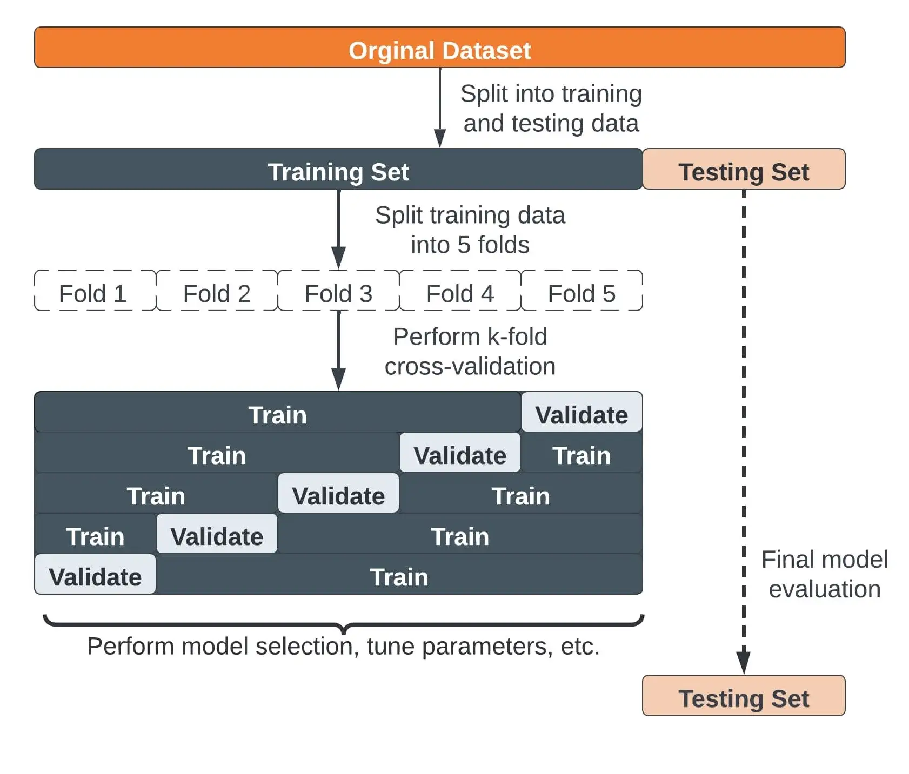

# Introduction to ML and MLOps

## What is a machine learning model?

Machine Learning models are computer algorithms that use data to make predictions or decisions. Unlike traditional algorithms, which are manually updated by developers to improve performance, Machine Learning models improve automatically by learning from data to perform a specific task more effectively.


## Machine Learning Workflow

The process of developing an ML-based solution consists of three stages: 
* Data Preparation
* Model Development
* Model Deployment

## Data Preparation

Data is essential to the success of a machine learning solution. Model performance depends as much on data quality as on the algorithm itself. As a result, data preparation is a critical phase and includes steps like collecting, cleaning, and transforming data.

- **Collection**
- **Integration**
- **Cleaning**
- **Normalization**
- **Aggregation**
- **Conversion**
- **Discretization**
- **Analisys**

### Collection

* **First step** in building any ML model: gather and organize data from various sources (files, database, live data flowing on Spark/RabbitMQ, etc.).
* **Challenge:** discovering what data exists and ensuring it's accessible and relevant.

* **Data types:**
  * *Structured*: e.g., databases (easier to work with).
  * *Unstructured*: e.g., text, images, logs (requires more preprocessing).

* **Key concern:** **Data quality**
  * Reliable, consistent, and up-to-date data is crucial.
  * Poor-quality data leads to biased or inaccurate models.

### Integration
Combining data from multiple sources into a unified dataset.
* Combine several different data sources
* Convert one format into another
* Select or sample data, if necessary
* Handle units of measurement
* Remove duplicates

### Cleaning
Data cleaning is an essential step to ensure high-quality, consistent data for model training. It involves handling various data issues such as missing values, inconsistencies, and outliers.

- **Handle Heterogeneous Values**:  
  Standardize formats (e.g., "P.za Roma" vs. "Piazza Roma") to ensure consistency across records.
- **Handle Missing Data**:
  - **Ignore**: Some models/algorithms can handle missing data natively (e.g., decision trees, random forests).
  - **Remove**: Drop examples or attributes that have excessive missing values.
  - **Substitute**: Fill missing values with appropriate substitutes, like the **mean**, **median**, or **mode** of the feature.
- **Check for Inconsistent Data**:  
  For example, ensure that a **city** matches the correct **zipcode**. Invalid combinations could indicate entry errors.
- **Check for Outliers**:  
  Identify extreme values that could result from mistakes or unusual circumstances (e.g., an age of 200 years).

Example:

Mario Rossi
P.za Roma 16
50400 Firenze (Italy)

Transformed in:

- Name: Mario Rossi
- Address: Piazza Roma, 16
- Zipcode: **50100**
- City: Firenze
- Country: Italy

### Normalization

Some machine learning algorithms (e.g., SVM, Ridge/Lasso regressions) require input data to be within a specific range of values, such as [0,1] or [-1,1].

It's generally a good practice to **re-scale attribute values** so that all features are in similar ranges. This ensures that no single feature dominates due to its larger numerical scale. (Avoid situations where one attribute is **too small** or **too large** compared to others, which can affect model performance.)

For example, imagine a dataset with one feature representing income (ranging from 10,000 to 1,000,000) and another representing age (ranging from 18 to 100). Without normalization, the model may give more weight to income because it spans a much larger range.

Example:

* **Min-Max Normalization** rescales the data to a specific range, typically [0, 1]. It is useful when you want features on the same scale without altering their distribution.
* **Z-score Normalization** transforms data to have a **mean of 0** and a **standard deviation of 1**. Useful when the data follows a **Gaussian distribution**, or when you need to compare features with different units or scales. **May not be ideal for highly skewed or non-Gaussian data, as it doesn't address skewness**.

### Aggregation
Combining multiple pieces of information into a single value. This is often used for summarizing or consolidating data.

Example:
- **Customer spending**: Aggregating multiple transactions from the same customer into a single feature representing **total spending** for that customer.
- **Sales data**: Calculating daily or weekly sales totals by grouping the data by date.

### Conversion
Changing data types or formats to make them suitable for analysis or machine learning algorithms.

Example:

- **Date to Unix timestamp**: Converting a date (e.g., "2025-01-01") into a Unix timestamp (e.g., 1672531200) for use in time-series analysis.
- **Categorical to Numerical**: Converting categorical features (e.g., "Red", "Blue", "Green") into numerical values (e.g., 1, 2, 3) using encoding techniques like **Label Encoding** or **One-Hot Encoding**.

Let’s say we have a feature "City" with the following values: ["New York", "London", "Paris", "New York", "Paris"]. We can create a new binary feature for each unique category:

| Index | City     | New York (OHE) | London (OHE)| Paris (OHE)| Label Encoded |
|-------|---------|----------|--------|-------|---------------|
| 1     | New York | 1        | 0      | 0     | 2             |
| 2     | London   | 0        | 1      | 0     | 0             |
| 3     | Paris    | 0        | 0      | 1     | 1             |
| 4     | New York | 1        | 0      | 0     | 2             |
| 5     | Paris    | 0        | 0      | 1     | 1             |

- The model can now handle categorical features, especially for algorithms like **linear regression**, **SVMs**, or **neural networks**, which require numerical input.
- **One-Hot Encoding removes ordinal relationships** (e.g., New York is not "greater" or "lesser" than Paris or London).

This method works well when the number of unique categories (cardinality) is not too high. For features with many categories, **embedding techniques** or **target encoding** may be better alternatives.

### Discretization
Converting continuous features into discrete categories or bins. This is useful for:
* **algorithms that work better with categorical data** (e.g., Decision Trees, Random Forests, and Gradient Boosting).
* **reduce the impact of outliers**.

Example:

- **Age ranges**: Converting a continuous age feature into age groups:
  - 0-18 → "Child"
  - 19-35 → "Young Adult"
  - 36-60 → "Adult"
  - 60+ → "Senior"


### Analysis

* **Goal:** Understand the data’s structure, quality, and potential biases before modeling.
* Helps identify issues that could compromise model performance.

* **Key activity: Data Profiling**
  * Assess **data quality**, **completeness**, and **consistency**.
  * Detect **missing values**, **outliers**, and unexpected distributions.
  * Validate assumptions and hypotheses about the dataset.

* **Challenges:**
  * **Visualization and profiling tools** are often limited or fragmented.
  * Difficult to detect subtle issues, especially in large or complex datasets.
  * Poor analysis can lead to flawed insights and reduced model accuracy.

### Cost of Data Preparation

Data preparation is often the **most time-consuming and resource-intensive** phase in machine learning. Studies suggest it can take **50-80%** of the total ML project effort (read: [Machine Learning:
The High-Interest Credit Card of Technical Debt](https://static.googleusercontent.com/media/research.google.com/en//pubs/archive/43146.pdf)). The cost of data preparation can be broken down into several factors:

**Computational Cost**
- **Storage Costs**: Storing raw and processed data in databases, data lakes, or cloud storage (e.g., AWS S3, Google Cloud Storage).
- **Processing Power**: High computational costs for large-scale datasets, especially for distributed computing frameworks (e.g., Spark, Dask).

**Human Cost**
- **Data Scientists & Engineers**: Skilled professionals are needed to clean and preprocess data.
- **Domain Experts**: Required for labeling data, especially in specialized fields like healthcare and finance.
- **Annotation Teams**: Crowdsourcing or hiring dedicated annotators for image, video, and text datasets.

**Compliance Cost**
- **Bias Checks**: Ensuring unbiased datasets to prevent model discrimination.
- **Regulatory Compliance**: GDPR, HIPAA, and other regulations require proper handling of sensitive data.

## Model Development

**Model Learning** is the phase of the deployment workflow in which machine learning models are developed and trained to solve specific problems. This process involves:
* Model selection
* Model training
* Model validation

### Model Selection

* **Goal:** Choose the appropriate model based on the problem type and data available. Complex models may improve performance but require more resources.

* **Supervised Learning:**

  * **Use case:** When you have labeled data.
  * **Models:** Linear regression, decision trees, support vector machines (SVMs), neural networks.

* **Unsupervised Learning:**

  * **Use case:** When you have unlabeled data and need to find hidden patterns.
  * **Models:** K-means, hierarchical clustering, PCA, autoencoders.

* **Reinforcement Learning:**

  * **Use case:** When you need to train an agent to make sequential decisions.
  * **Models:** Q-learning, Deep Q-Networks (DQN), policy gradient methods.

* **Deep Learning:**

  * **Use case:** For complex data types like images, text, or speech, where feature extraction is difficult.
  * **Models:** Convolutional Neural Networks (CNNs), Recurrent Neural Networks (RNNs), transformers.


### Model Training

To build a **machine learning model that generalizes well**, we must carefully manage data.  If we train and test on the same data, the model may just **memorize** instead of learning useful patterns.

**1. Training Set**

- Used to **train** the model by adjusting internal parameters.
- The model learns patterns and relationships in the data.
- Usually the **largest portion** of the dataset (e.g., **60-80%**).

**2. Test Set**

- Used for **final evaluation** after training and validation.
- Provides an **unbiased assessment** of the model’s real-world performance.
- Should **never** be used during training or validation.
- Typically **10-20%** of the dataset.

**3. Validation Set**

- Used to **tune hyperparameters** and prevent overfitting.
- Helps in **model selection** (e.g., choosing learning rate, number of layers).
- The model **does not learn** from this set; it's only used for evaluation.
- Typically **10-20%** of the dataset.
- Prevents the risk of overfitting to the test set.

**Overfitting**

- Machine learning systems are **trained** to minimize a specific cost (or loss) function, which measures how well the model predicts the target values.
- The goal is to **reduce error** on the training examples, which sounds intuitive: *Lower error on the training set means the model is performing well during training.*
- **Overfitting occurs when the model perfectly learns the training data but fails to generalize to new, unseen examples.**
- The model becomes **too complex** and “memorizes” the training set, capturing even the **noise** or irrelevant patterns in the data.


### Model Validation

- **K-Fold Cross Validation** is a technique used to assess how well a machine learning model generalizes to unseen data.
- The dataset is **split into K subsets** (or "folds"). The model is trained on (K-1) folds and validated on the remaining fold. This process is repeated K times, each time using a different fold as the validation set.
- **Benefits:**
  - **Reduces Bias**: Every observation is used for both training and testing, ensuring a less biased performance estimate.
  - **Maximizes Data Usage**: Especially useful when the dataset is small, as each data point gets to be in both training and validation sets.
  - **Reliable Performance Estimate**: By averaging over multiple folds, we get a more stable estimate of model performance.



## The Complete Workflow


## Model Deployment

Model deployment is the process of **making a trained ML model available** to receive **inference requests** from external applications.

* **Batch serving**: Predictions on large datasets, processed periodically.
* **Online serving**: Real-time predictions via an API.

1. **Export/Load the Trained Model**

* Use a supported format
  * ONNX (Open Neural Network Exchange)
  * SavedModel (TensorFlow)
  * TorchScript (PyTorch)
  * PMML (Predictive Model Markup Language)
  * HDF5 (.h5)
* Load it into your inference engine (e.g. ONNX Runtime, TensorFlow Serving, TorchServe).

2. **Wrap Inference Logic in a Web Service**

* Accepts **user input** via an HTTP request (e.g., JSON, form data, image upload).
* **Preprocesses** the input (e.g., normalization, tokenization).
* Passes it to the inference engine to **generate predictions**.
* **Postprocesses** and returns the results (e.g., label mapping, confidence scores).

**Example (FastAPI + ONNX Runtime):**

```python
import onnxruntime as ort
from fastapi import FastAPI, Request
import numpy as np

app = FastAPI()
session = ort.InferenceSession("model.onnx")

@app.post("/predict")
async def predict(request: Request):
    data = await request.json()
    inputs = np.array(data["inputs"]).astype(np.float32)
    result = session.run(None, {"input": inputs})
    return {"prediction": result[0].tolist()}
```

4. **Deploy the Web Service**

* **Containerize** using Docker (optional but common).
* Deploy to a server, cloud service (AWS, Azure, GCP), or edge device.
* Add logging/Prometheus/Grafana for performance monitoring.
* Use load balancers or autoscaling if expecting high traffic.

6. **Update**

* Update models to reflect recent data trends and tackle concept drift.
* Implement scheduled retraining or continual learning.
* Continuous delivery of models is complex as code, model, and data all evolve simultaneously.

## Resources