# Introduction to MLOps

## Issues of Production Models

* Machine learning models are **not "set it and forget it"**.
* Models are trained on **specific historical datasets**.
* Real-world data is **dynamic** — new products, customer behavior, and market conditions evolve.
* **Data drift** and **concept drift** are natural over time.

**Key Actions for Maintenance**

1. **Retrain models regularly** on updated data.
2. Design a **model update and retraining schedule**.
3. Implement **model monitoring** to track performance between updates.

### Data Drift

**Definition:** Data drift refers to a change in the statistical properties and characteristics of the input data over time.

**Cause:** It occurs when a machine learning model in production encounters data that deviates from the data it was trained on or earlier production data.

**Impact:**

* The model may struggle to make accurate predictions when the data distribution changes.
* Models are designed to perform well on data similar to what they were trained on but fail when exposed to new, unseen data.

**Why it matters:** Detecting and addressing data drift is vital to maintaining model reliability in dynamic environments.

### Example of Data Drift

**Scenario:** Imagine a retail chain that uses machine learning to predict how many products to stock in each of their stores. The model was trained using historical sales data, mostly from physical store sales.

**Problem:**

* The retailer ran a marketing campaign that shifted a significant portion of sales to their new mobile app, increasing online sales.
* The model, trained on in-store data, didn’t perform well for online sales because the training data lacked sufficient online sales information.

**Impact:**

* The model’s performance dropped, especially in forecasting demand for online sales.
* With the surge in online shopping, inventory management became more challenging.

### Data Drift vs. Concept Drift

**Concept Drift**

* Refers to changes in the relationship between input features and model outputs (i.e., the target variable).
* Example: A new competitor’s discounts change consumer behavior, leading to a decrease in average sales in physical stores.

**Difference:**

* **Data drift**: Shifts in input feature distributions (e.g., sales data changes due to shifting shopping preferences).
* **Concept drift**: Shifts in the relationship between inputs and outputs (e.g., new market conditions lead to a change in consumer behavior).

**Similarity:**

Both can cause model quality degradation and often occur together. Monitoring data drift can be a symptom of concept drift.

### Data Drift vs. Prediction Drift

**Prediction Drift**

* Refers to changes in the **model outputs** (predictions).
* Example: A fraud detection model starts predicting fraud more frequently, or a pricing model outputs significantly lower prices.

**Difference:**

* **Data drift**: Shifts in input data distributions.
* **Prediction drift**: Shifts in the model's predictions or outputs.

**Similarity:**

Both **data drift** and **prediction drift** are important techniques for monitoring models in production. They can signal a change in the model’s environment or data, and both can help track model performance in the absence of ground truth.

### Feedback Delay

* **Definition**: Time gap between model prediction and receiving the true outcome.
* **Challenge**: Hinders **real-time monitoring** of model performance.

**Real-World Examples**

* **Recommender systems**: Did the user click or buy?
* **Fraud detection**: Was the transaction actually fraudulent?

Feedback can take **seconds... or months** to arrive.

### Data Drift vs. Data Quality

**Data Quality Issues**

* Refer to **corrupted**, **incomplete**, or **incorrect** data.
* Often caused by bugs in data pipelines or manual errors.
* Examples:

  * Missing values
  * Unexpected nulls
  * Incorrect feature scales
  * Schema mismatches

**Difference:**

* **Data quality** = data is broken or malformed.
* **Data drift** = data is valid but changes over time.

**Similarity:**

* Both affect **model performance**.
* Both refer to **changes in data**.
* Data drift detection can **reveal quality issues**.

### Data Drift vs. Training-Serving Skew

**Training-Serving Skew**

* Happens when there’s a **mismatch** between the data used to train the model and the data seen in production.

**Difference:**

* **Training-serving skew**: Appears **immediately** after deployment due to discrepancies between training and live data.
* **Data drift**: Develops **over time** as production data distribution evolves.

**Similarity:**

Both involve changes in input data and can be detected using **distribution comparison techniques** between training and production data.

## How to Detect Drifts

**Summary Statistics**

* Track shifts in **mean, median, variance**, quantiles, etc.
* Monitor **min-max compliance** to catch unexpected values.
* Simple but can be noisy with many features.

**Statistical Tests**

* Use tests like **Kolmogorov-Smirnov** (numerical) and **Chi-square** (categorical).
* Result: **p-value** indicating if changes are statistically significant.
* May detect minor, insignificant shifts in large datasets.

**Distance Metrics**

* Quantify how far distributions diverge using:

  * **Wasserstein Distance**
  * **Jensen-Shannon Divergence**
  * **Population Stability Index (PSI)**
* Use as a continuous “drift score.”

**Rule-Based Checks**

-   The share of the predicted "fraud" category is over 10%.
-   A new categorical value appears in a feature "location" or "product type."
-   More than 10% of the feature "salary" values are out of the defined min-max range.

While such checks do not directly measure drift, they can serve as good alerting heuristics to notify about likely meaningful changes to investigate further.

## MLOps

**MLOps (Machine Learning Operations) extends DevOps principles to address the unique workflows and challenges associated with machine**. Specifically, it is tailored to manage the complexities of integrating ML models into production environments.

MLOps is a set of practices that combines machine learning (ML) model development with operations (Ops), aiming to **automate and streamline the entire lifecycle of ML models**. This lifecycle includes stages such as:
* data preparation
* model development
* model deployment
* model monitoring

Through a set of practices, MLOps helps ensure that **models remain effective, scalable, and adaptable to changing production environment conditions**.

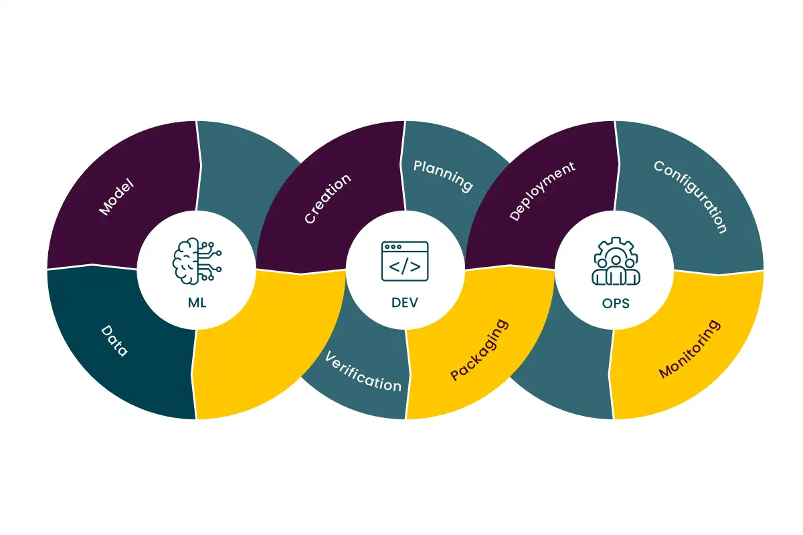

### MLOps Benefits

* **1. Scalability:**

  * Ability to deploy and manage machine learning models at large-organization scale, supporting multiple environments and large datasets.

* **2. Automation:**

  * Automating workflows for model training, testing, deployment, and monitoring to increase deployment frequency.

* **3. Accountability:**

  * Keeping track of changes in code, models, data, and experiments to ensure accountability.

* **4. Continuous Integration/Continuous Deployment (CI/CD):**

  * Implementing automated pipelines to deploy new versions of models and code seamlessly without downtime.

* **5. Model Monitoring and Management:**

  * Ongoing tracking of model performance and detection of issues like **concept drift** or **data drift**, ensuring models stay effective over time.
  
* **6. Reproducibility:**

  * Ensuring that models can be reliably retrained and tested with the same parameters and data, fostering consistency across teams.

* **7. Governance and Compliance:**

  * Establishing frameworks for monitoring, auditing, and ensuring models comply with industry regulations and ethical standards.

## MLOps Implementation

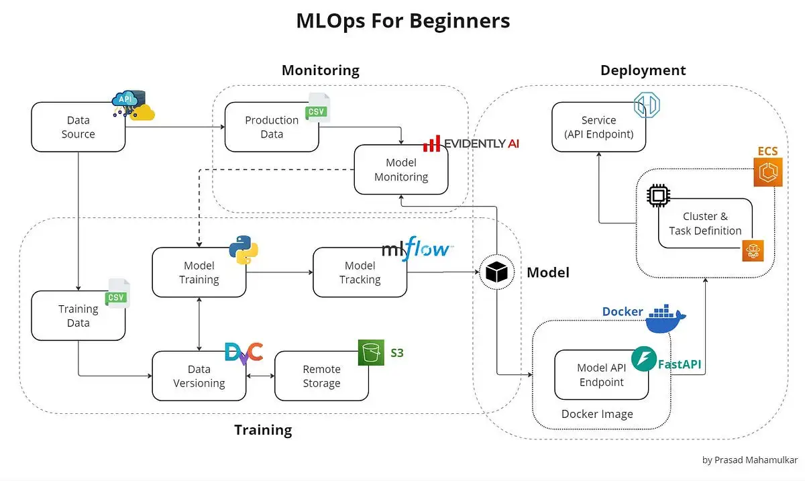

1. **Training Data**: The dataset used to train machine learning models. It should be curated and representative of the problem domain.

2. **Data Versioning**: Training data must be versioned to ensure reproducibility and traceability across model iterations.

3. **Model Training**: The process of building the machine learning model using the training data. This should be integrated with CI/CD pipelines to align with application development workflows.

4. **Model Tracking**: Tools and practices to track experiments, including hyperparameters, training metrics, and outcomes, enabling comparison and reproducibility.

5. **Model Artifact**: The trained model, typically stored in a model registry or object store, ready for deployment or further evaluation.

6. **Model Monitoring**: In-production monitoring to detect data drift, concept drift, or performance degradation based on real-time or batch inference data.

7. **Production Data**: New data collected during model operation, often including ground truth labels, used for monitoring and retraining purposes.

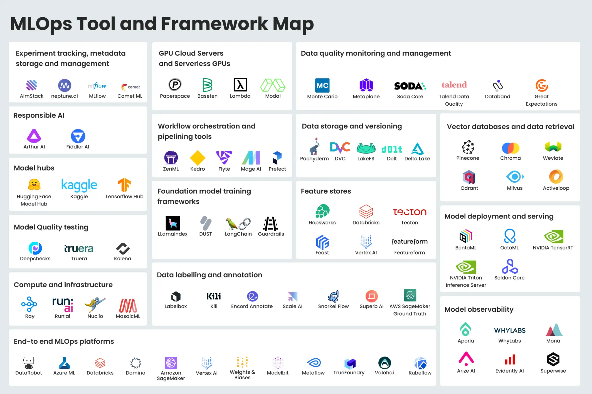

###  Data Versioning
* Track and manage dataset versions
* Tools: DVC, LakeFS, Delta Lake

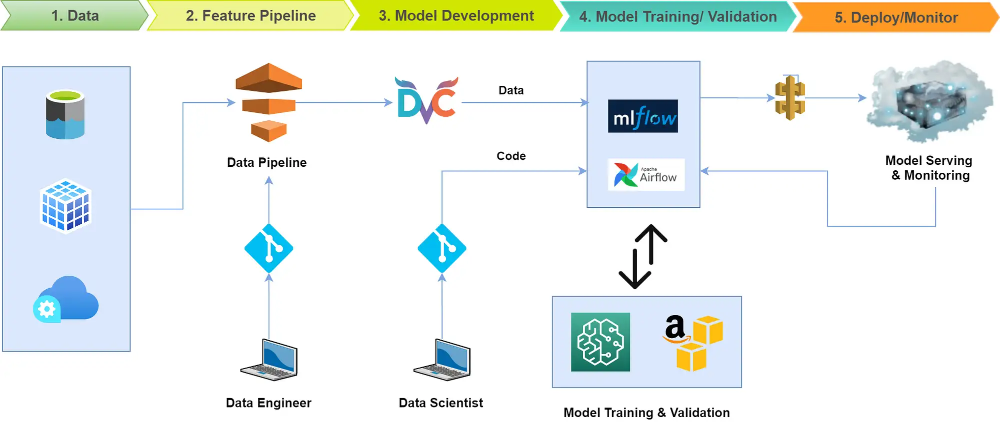

### Feature Store
* Serve consistent features for training and inference
* Tools: Feast, Tecton, Hopsworks

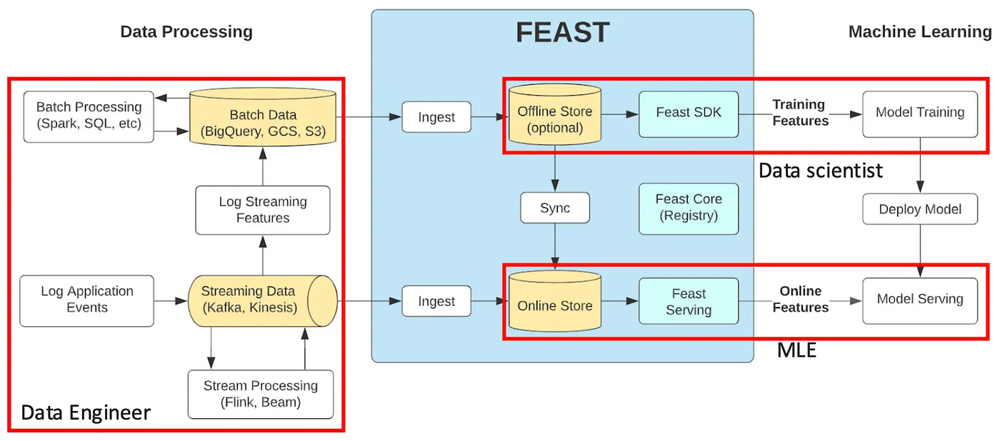

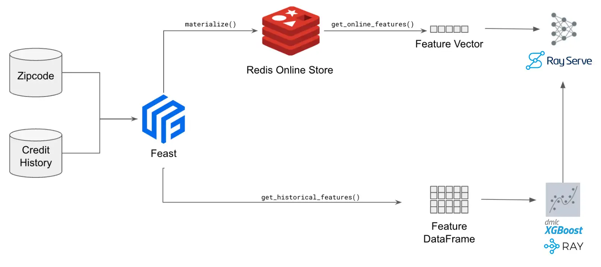

### Experiment Tracking
* Log and compare training runs
* Tools: MLflow, Weights & Biases, Neptune.ai

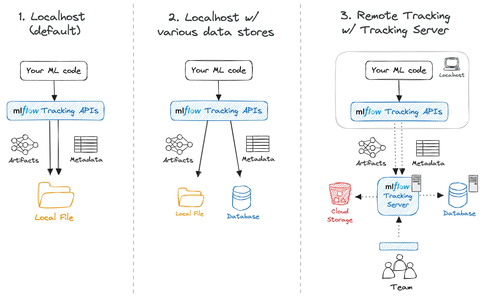
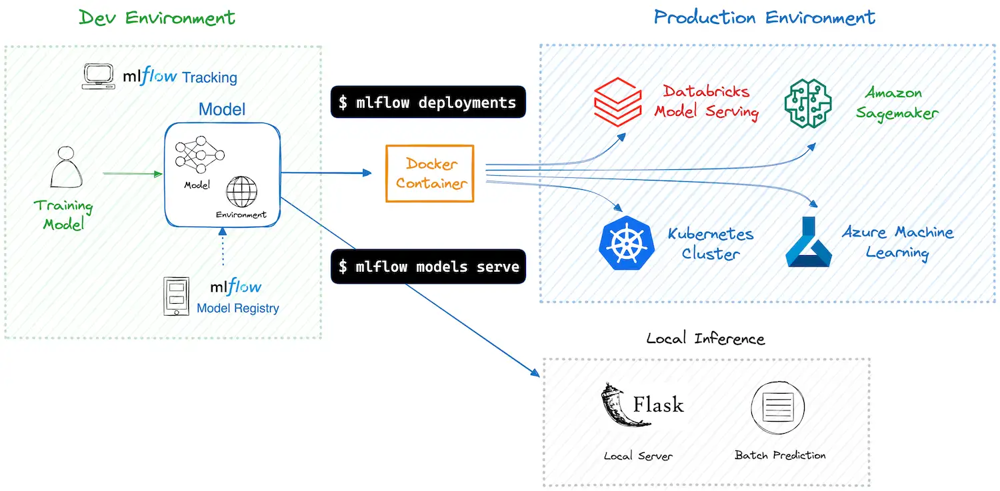
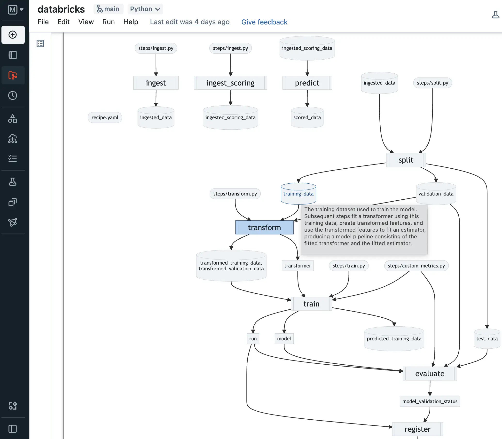

### Automated Pipelines
* Automate ML workflows end-to-end
* Tools: Kedro, ZenML, Airflow, Kubeflow Pipelines

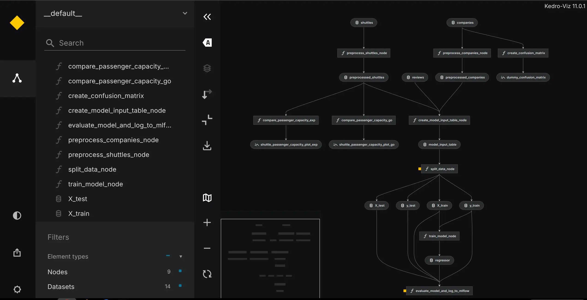

### Model Registry (Object Store)
* Manage model versions and lifecycle
* Tools: MLflow Model Registry, Minio, Hugging Face Hub

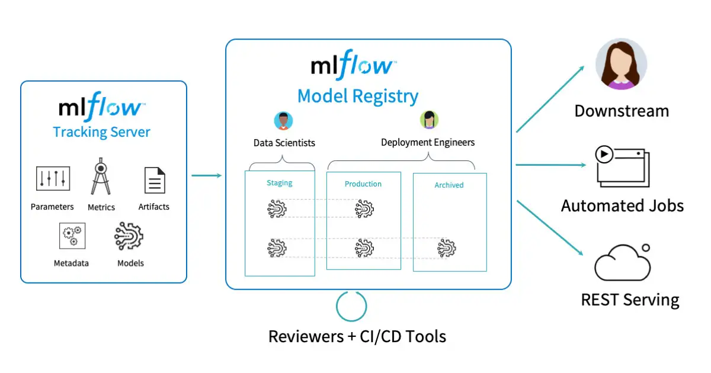

### Model Serving
* Deploy models for inference
* Tools: BentoML, Seldon Core, TensorFlow Serving, TorchServe

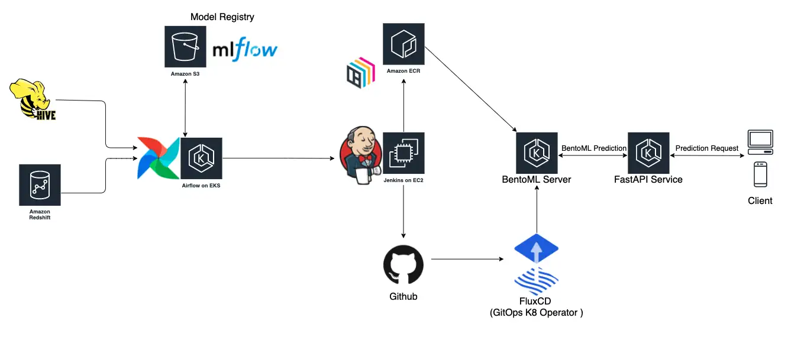

### Model Monitoring
* Track performance, drift, and anomalies
* Tools: Evidently, Arize AI, Fiddler

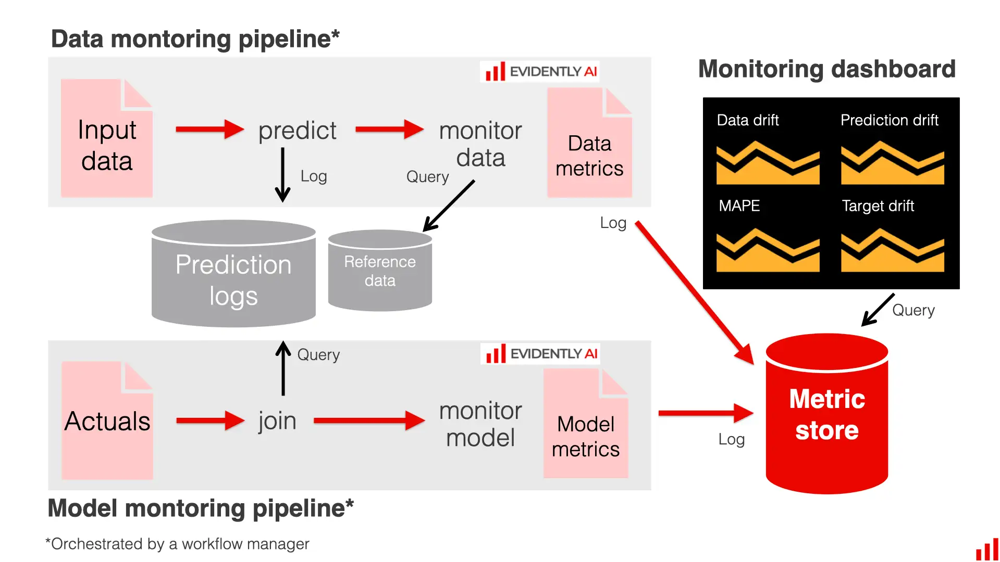

## MLOps Maturity

### MLOps Level 0

* **Model Registry**: Centralized storage for trained models, including metadata, lineage, and deployment tags (e.g., staging, production).

* **Manual Model Training**: Data scientists train models manually on local machines or scripts without automated workflows. Training and evaluation are driven by notebooks or loosely organized Python scripts, often lacking proper software engineering practices.

* **No Versioning**: Models, data, and code are often not versioned properly, making it difficult to reproduce results or track changes.

* **No Continuous Integration or Deployment (CI/CD)**: There is no automation; model deployment (if any) is done manually, often by copying files or manually editing APIs.

* **Inconsistent Environments**: Models may work in development but fail in production due to inconsistent libraries, dependencies, or hardware setups.

* **Lack of Monitoring**: Once deployed, models are rarely monitored. No logging, alerts, or performance tracking in place.

### MLOps Level 1

* **Basic Automation of ML Pipelines**: Some stages of the ML workflow are automated (e.g., well-written scripts), but the process is still not hands-free.

* **Model Monitoring in Production**: Tools or scripts monitor deployed models for issues like data drift, prediction errors, and performance degradation.

* **Scheduled Model Retraining**: Retraining is done more frequently than Level 0, typically on a fixed schedule (e.g., weekly or monthly), not dynamically triggered.

### MLOps Level 2

* **Full CI/CD Automation**: Code changes, data updates, or model improvements automatically trigger retraining, testing, validation, and deployment pipelines.

* **Data and Model Versioning**: All datasets, models, and configurations are versioned for full reproducibility (e.g., using tools like DVC or MLflow).

* **Modular Pipelines**: The ML lifecycle is split into reusable components (training, evaluation, deployment) using tools like Kubeflow, Airflow, or TFX. Docker/Kubernetes ensure consistent behavior across dev, test, and prod environments.

* **Monitoring and Alerting**: Real-time monitoring of model performance, prediction drift, and data quality; alerts are triggered on anomalies.

* **Scalability**: Pipelines and inference services scale horizontally using distributed training or GPU-backed clusters.

## Resources
