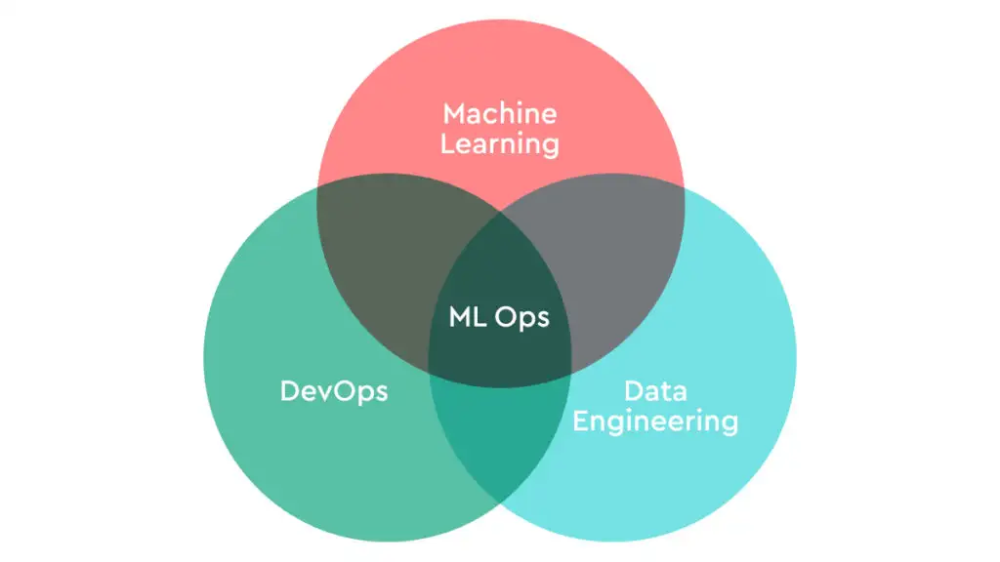
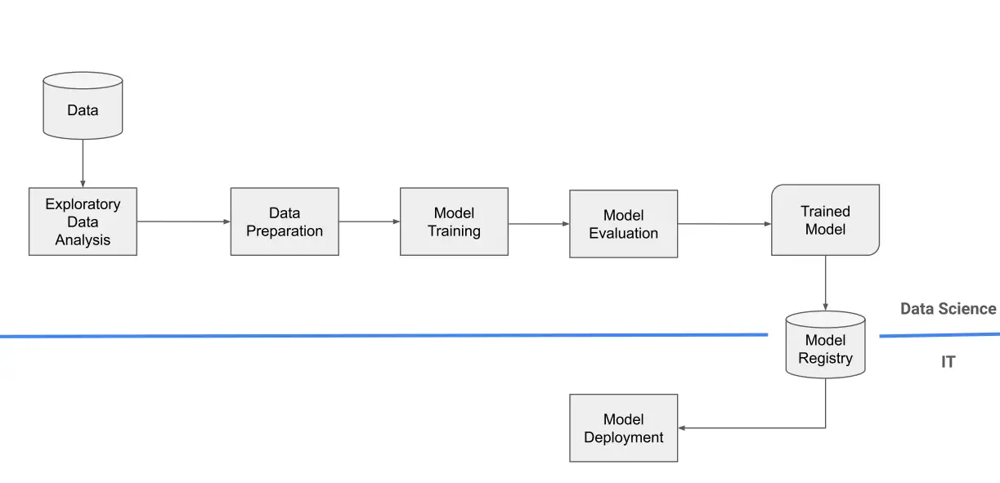
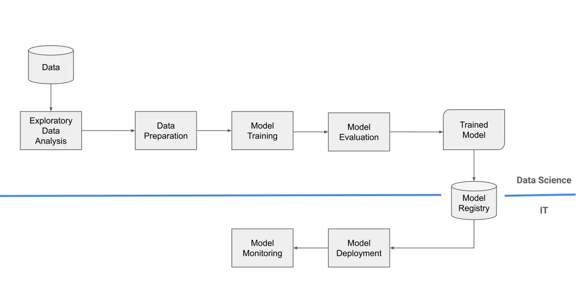
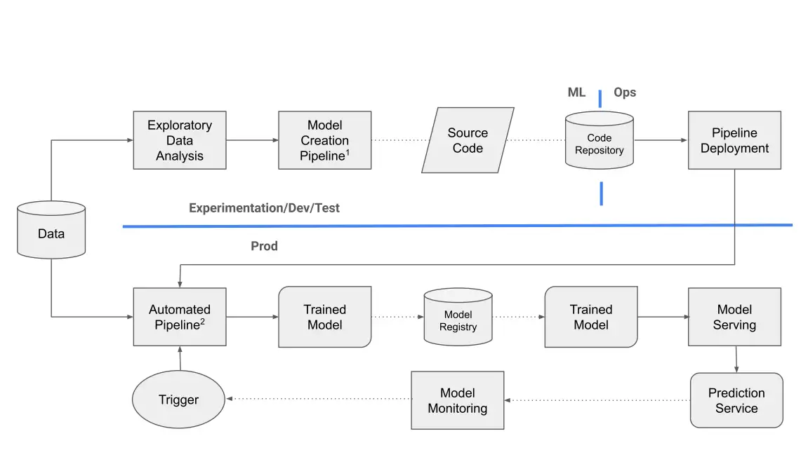
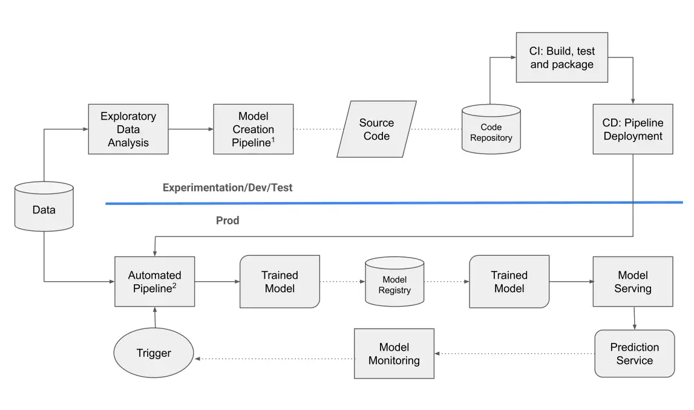

# Introduction to MLOps

MLOps (Machine Learning Operations) extends DevOps principles to address the unique workflows and challenges associated with machine learning (ML). While similar to DevOps in its focus on improving collaboration between development and operations teams, MLOps is specifically tailored to manage the complexities of integrating ML models into production environments.

---

## What is MLOps?

MLOps is a set of practices that combines machine learning (ML) model development with operations (Ops), aiming to automate and streamline the entire lifecycle of ML models. This lifecycle includes stages such as data collection, model training, deployment, and continuous monitoring in production.

Building upon DevOps core principles, MLOps addresses machine learning's specific challenges through integrated automation, collaboration, and continuous feedback loops. It ensures that ML systems are developed, deployed, and maintained efficiently, emphasizing continuous delivery and improvement of machine learning models. Through these practices, MLOps helps ensure that models remain effective, scalable, and adaptable to changing production environment conditions.

### Industry Definitions

- **MLOps**, as defined by Google Cloud, refers to the process of managing the machine learning lifecycle, from development to deployment and monitoring. It encompasses tasks such as experiment tracking, model deployment, model monitoring, and model retraining.
  
- **MLOps**, according to AWS, is an ML culture and practice that unifies ML application development (Dev) with ML system deployment and operations (Ops).
  
- **MLOps**, as described by Microsoft, is a practice that streamlines the development and deployment of ML models and AI workflows.

---

## Why is MLOps required?

- **Complex Lifecycle Management**: The machine learning lifecycle involves many complex steps (data acquisition, preparation, training, monitoring, etc.), making collaboration between teams crucial.

- **Data and Model Versioning**: MLOps ensures that changes to data and models are tracked and managed systematically.

- **Data Drift**: Models can become less effective as data changes over time, a challenge that MLOps helps monitor and address.

- **Integration with CI/CD**: Models are treated as integral assets in CI/CD pipelines, ensuring smoother releases.

- **Continuous Experimentation**: MLOps supports rapid and iterative experimentation cycles, reducing model implementation time.

---

## Principles of MLOps

This section covers the key concepts and core values of MLOps necessary for successful implementation.

### 1. Automation

The goal is to automate as many processes as possible to reduce human intervention and accelerate development and deployment.
This includes all stages from data ingestion through preprocessing, model training, and validation to deployment.

Several factors can trigger automated model training and deployment:
 
- **Messaging**: Automation can be triggered by messages or notifications from monitoring or orchestration systems. For instance, when the system detects a drop in model performance, it can automatically trigger a new training phase to improve the model.
Example: A data drift warning triggers the training of a new model using updated data.

- **Monitoring or Calendar Events**:
Training and deployment pipelines can be scheduled to perform automatic checks or updates at predetermined intervals or in response to monitoring events. This ensures models remain current and perform optimally.
Example: A scheduled trigger performs weekly or monthly model retraining, or monitoring systems detect an increase in predictive anomalies.

- **Data Changes**:
New datasets or updated data sources can automatically trigger model retraining. The automation system detects these changes and initiates the pipeline without manual intervention.
Example: New customer data triggers a model training iteration to update purchase behavior predictions.

- **Model Training Code Changes**:
Updates to model training code, such as hyperparameter adjustments or architecture changes, can trigger a new training phase to validate and optimize the model.
Example: An update implementing a new neural network architecture requires a new training and testing phase.

- **Application Code Changes**:
Changes to applications that use the models, such as new features or API modifications, may necessitate model updates to ensure compatibility. This can automatically initiate model retraining or deployment.
Example: When an e-commerce application updates its recommendation engine, it triggers retraining of the prediction models based on user behavior.

### 2. Continuous Integration (CI)
In the context of MLOps, Continuous Integration (CI) significantly extends beyond the traditional DevOps concept. It encompasses not only software component testing but also data and model validation within the machine learning pipeline. This means that alongside application code verification, the processes for validating data and model quality are also automated.

CI in MLOps ensures that every pipeline component—whether code, data, or models—undergoes rigorous and continuous testing, preventing any changes from compromising the production system's reliability.

### 3. Continuous Delivery (CD)
Continuous Delivery (CD) extends beyond deploying single packages or services to encompass the entire training pipeline. This approach automates the release of newly trained models and associated prediction services, ensuring changes can be implemented in production quickly and safely.

In this context, CD ensures seamless integration and deployment of all updates, whether they involve new models, data changes, or business logic improvements, enhancing the system's overall flexibility and responsiveness.

### 4. Continuous Monitoring (CM)
Continuous Monitoring involves constant surveillance of machine learning models in production to detect issues such as data drift, performance degradation, and other anomalies. This process monitors both data and models using business-oriented metrics.

- **Data Monitoring**: Tracks changes in incoming data to ensure consistency with training data. Significant deviations may indicate data drift—changes in statistical properties over time that reduce model effectiveness.

- **Model Monitoring**: Measures model performance over time using metrics such as accuracy, precision, and relevant business metrics. Performance degradation below defined thresholds may trigger model retraining or modifications.

### 5. Continuous Training (CT)

Continuous Training automates model retraining to maintain accuracy and performance over time. This approach preserves model quality through an ongoing cycle of monitoring, retraining, and deployment.

The process encompasses both automated retraining and model deployment. When data changes or drift occurs, the system automatically retrains the model and deploys an updated version to maintain optimal performance.

### 6. Model Management and Version Control

Model management in MLOps oversees the complete lifecycle of machine learning models, from development through deployment and monitoring. Effective version control is essential for maintaining model effectiveness in production environments. This system tracks all changes to models, training data, and code, ensuring reproducibility and accountability.

Key aspects include:

- **Model Versioning**: Tracks each model version to ensure reproducibility of the exact combination of data, parameters, and code used in training.

- **Model Governance**: Implements review, validation, and approval processes to assess fairness, bias, and ethical considerations before deployment.

- **Auditability**: Documents all model changes for compliance with business and regulatory requirements.

- **Collaboration**: Enables effective communication between data scientists, engineers, and stakeholders through comprehensive version control documentation.

- **Reproducibility**: Ensures consistent replication of results using identical datasets, code, and model configurations.

## Benefits of MLOps

MLOps provides a range of tangible benefits that enhance the efficiency, scalability, and reliability of machine learning (ML) projects. Through MLOps adoption, organizations can streamline their workflows, reduce risks, and improve team collaboration. Here are the key benefits:

### 1. Improved Efficiency
MLOps automates many stages of the ML lifecycle, from data preprocessing to model deployment, significantly reducing development and deployment time. Through streamlined processes, organizations can move from model development to production faster, optimizing time-to-market and reducing operational costs. This enhanced efficiency enables data scientists to focus on higher-value tasks, such as improving model performance and generating business insights.

### 2. Increased Scalability
MLOps enables organizations to scale their machine learning operations to handle larger datasets and more complex models. Through integrated workflows like continuous integration and continuous deployment (CI/CD), teams can efficiently manage thousands of models. This scalability is crucial for enterprises that need to apply machine learning across different domains or manage rapid data growth. The framework ensures that models can be trained, deployed, and maintained at scale while maintaining quality and performance.

### 3. Improved Model Accuracy
Through continuous monitoring of deployed models, organizations can ensure their predictions remain accurate and relevant. MLOps helps maintain ML model performance over time by automatically detecting issues such as data drift—when new data diverges from training data. Automated retraining mechanisms further enhance model accuracy by updating models in response to new data or business requirements, keeping predictions aligned with evolving trends.

### 4. Enhanced Collaboration
MLOps promotes stronger collaboration among data scientists, software engineers, and operations teams. Through standardized processes and tools, teams can work together effectively, reducing silos and misunderstandings. This improved collaboration creates a more cohesive development process, where teams can align on goals, track experiments, and ensure smooth transitions from development to deployment.

### 5. Reduced Risk of Errors
Through automation of repetitive tasks and continuous monitoring, MLOps reduces human error throughout the ML lifecycle. Automated workflows ensure thorough testing, validation, and deployment of models without manual intervention. This approach not only minimizes production errors but also increases confidence in model reliability and performance, facilitating compliance with regulatory standards.

### 6. Mitigation of Data Drift
Data drift, a common challenge in machine learning, occurs when incoming data diverges from the original training data, leading to declining model performance. MLOps addresses this through continuous monitoring of data and models, identifying and correcting data drift early to maintain consistent model performance. Automated retraining processes help counteract data drift, keeping models current and relevant.

### 7. Faster Time to Market
MLOps accelerates the journey from model development to deployment. Through automated infrastructure provisioning, model training, and deployment pipelines, organizations can achieve faster go-to-market times. This increased agility enables businesses to respond more quickly to market changes and opportunities, providing a competitive advantage.

### 8. Cost Reduction
The automation and optimization of the ML lifecycle minimize the need for manual intervention, reducing operational costs. By streamlining processes such as model retraining, monitoring, and deployment, MLOps frees up organizational resources. Efficient management of infrastructure and model workflows through MLOps results in long-term cost savings and improved resource allocation.

## Levels of MLOps Implementation

Organizations implement MLOps at different levels, depending on their automation maturity.

### MLOps Level 0

- All steps are manual, including data preparation, ML training, and model validation. Transitions between phases require manual intervention at every step.
- Data scientists deliver trained models as artifacts to the engineering team for deployment.
- A clear separation exists between data scientists who create models and engineers who deploy them.
- Model retraining occurs infrequently, typically only a few times per year.
- No CI/CD pipeline integration exists for ML models, and active performance monitoring is absent.

---

### MLOps Level 1

- Level 1 introduces **basic automation**. While ML pipeline steps remain partially manual, monitoring systems track deployed model performance.
- **Model monitoring** detects issues such as data drift, performance degradation, and anomalies.
- Some **continuous integration** automation exists for software components, though ML model training and deployment remain semi-manual.
- Model retraining occurs more frequently than in Level 0, but still follows a scheduled basis.

---

### MLOps Level 2

- Level 2 implements **ML pipeline automation**. Both **continuous monitoring (CM)** and **continuous training (CT)** ensure consistent model retraining with new data.
- The pipeline automatically triggers when new data arrives or when specific thresholds (e.g., data drift) are reached.
- ML pipelines utilize reusable and composable modular code components, creating a more **scalable** and **consistent** structure.
- Identical pipeline implementation across development, pre-production, and production environments ensures consistency and reduces errors.

---

### MLOps Level 3

- Level 3 achieves **full integration** of the ML pipeline into the **CI/CD process**, extending DevOps concepts to encompass model testing, data validation, and retraining.
- **Continuous Integration (CI)** encompasses building, testing, and packaging both application code and ML models.
- **Continuous Delivery (CD)** fully automates deployment, from model retraining to production deployment alongside application code, ensuring optimal model performance.
- This level enables the most **robust**, **scalable**, and **adaptive** machine learning operations.

