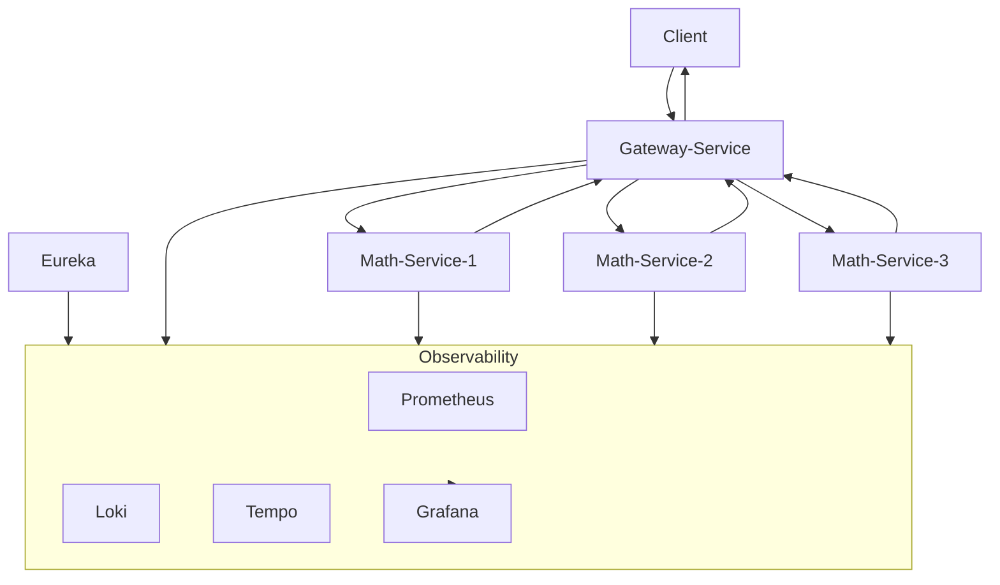

# Labs

## Lab 1: Observability

1. Implement a `math-service` exposing an API to compute the prime divisors of a given number.
    - `GET /divisors?n=<value>&times=<values>&faults=<value>` → Returns the prime divisors of the specified number. The divisors are computed `times` times and errors are returned with `faults` percent probability.

2. Implement a `gateway-service` acting as an API gateway and routing requests to multiple instances of `math-service`.
    - `GET /divisors?n=<value>&times=<values>&faults=<value>` → Delegates the request to a healthy instance of `math-service` and returns the response.

3. Introduce resiliency patterns to improve system reliability and fault tolerance:
    - Use Eureka for service discovery and client-side load balancing to distribute requests across available `math-service` instances.
    - Configure retry logic within `gateway-service` to attempt failed requests to `math-service` up to 3 times before propagating the error.
    - Implement a circuit breaker in `gateway-service` that opens when 50% of recent requests to `math-service` fail, triggering a fail-fast fallback response.
    - Integrate Redis in `gateway-service` using the *cache-aside* pattern to cache successful responses from `math-service` and reduce load on backend services.

4. Enable distributed observability through automatic (zero-code) OpenTelemetry instrumentation of `eureka-service`, `gateway-service`, and `math-service`. Configure a monitoring stack based on:
    - Prometheus (metrics)
    - Loki (logs)
    - Tempo (traces)
    - Grafana (visualization)

5. Evaluate and validate the effectiveness of the implemented resilience mechanisms by analyzing metrics, logs, and traces in Grafana dashboards.

## Questions
1. What is observability, and why is it important in microservices architectures?
2. Explain the distinct role of metrics, logs, and traces in observability.
3. Signals, sources, agents, destinations are the components of observability architectures. Describe their role and mutual interactions.
4. What is defined as telemetry in the context of observability? In this context, describe the role of OpenTelemetry and its advantages over previous approaches.
5. What is the *Business Logic to Instrumentation* ratio? Describe the key observability-related costs.
6. Java provides a form of automatic, zero-code instrumentation. Describe it, and its advantages compared to manual alternatives.
7. What is Prometheus, and how does it facilitate metrics collection in applications? Which is its primary approach to metrics collection?
8. Describe the process of exposing application metrics using both Spring Boot Actuator and the Prometheus endpoint.
9. What is the ELK stack? Describe its architecture and key components.
10. Describe distributed tracing, traces, spans.
11. What is OpenTelemetry, how does its collector works?

