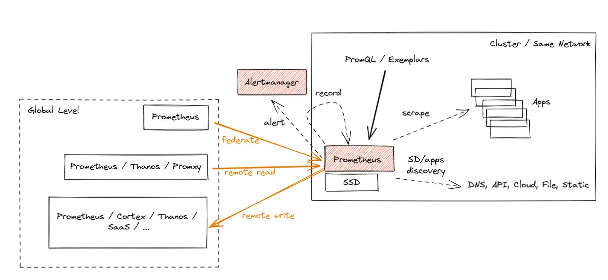
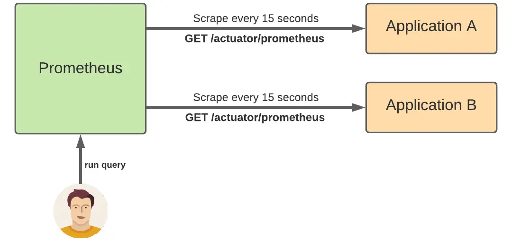
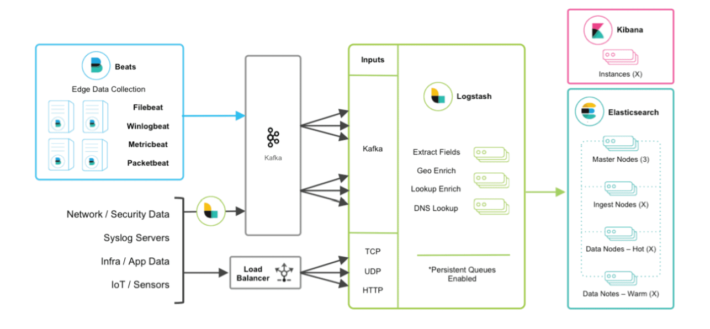
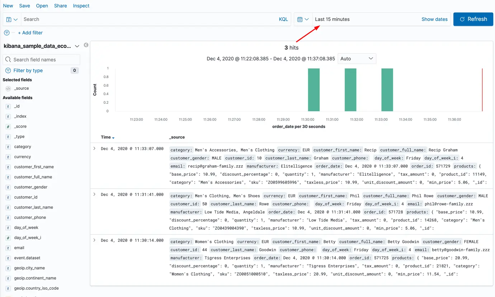
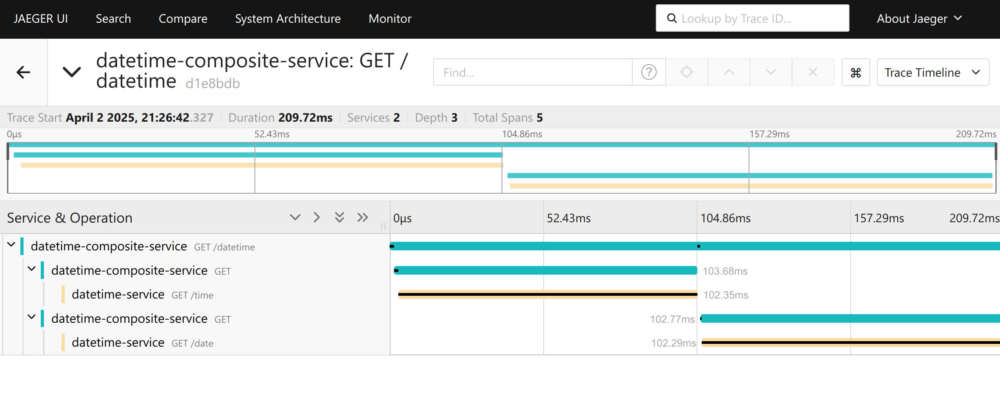
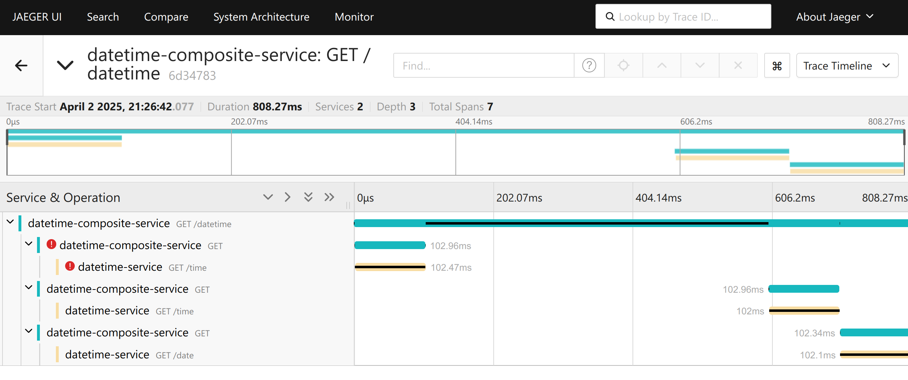
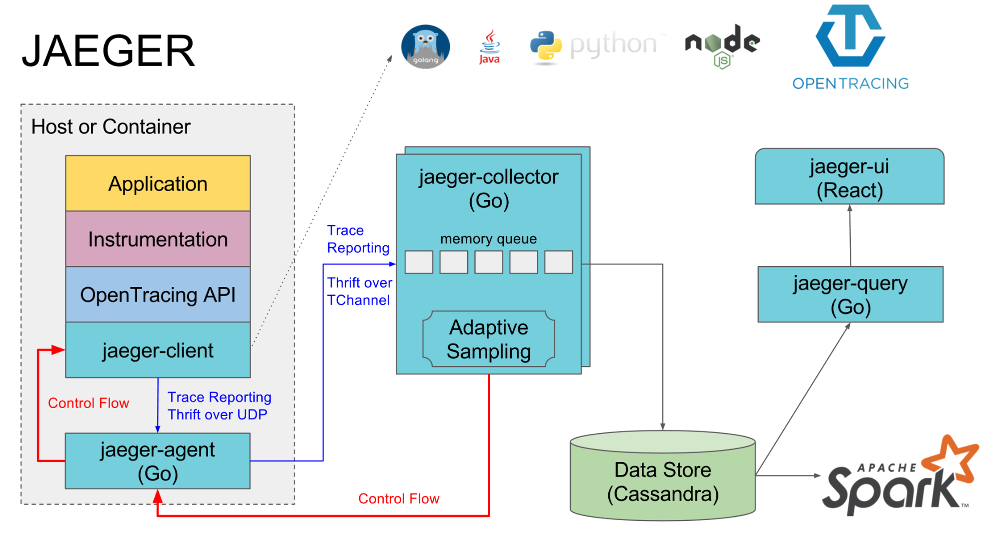
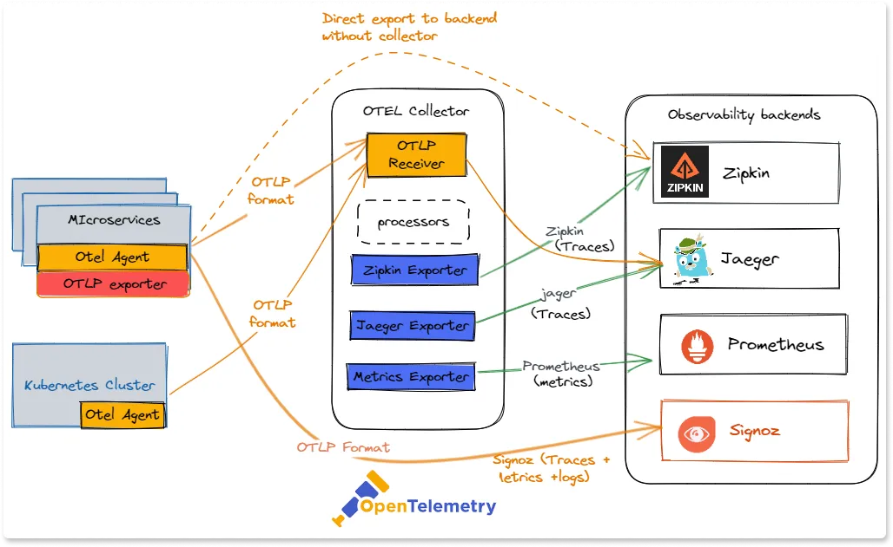
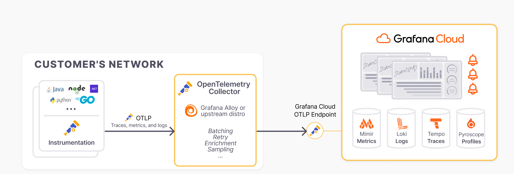
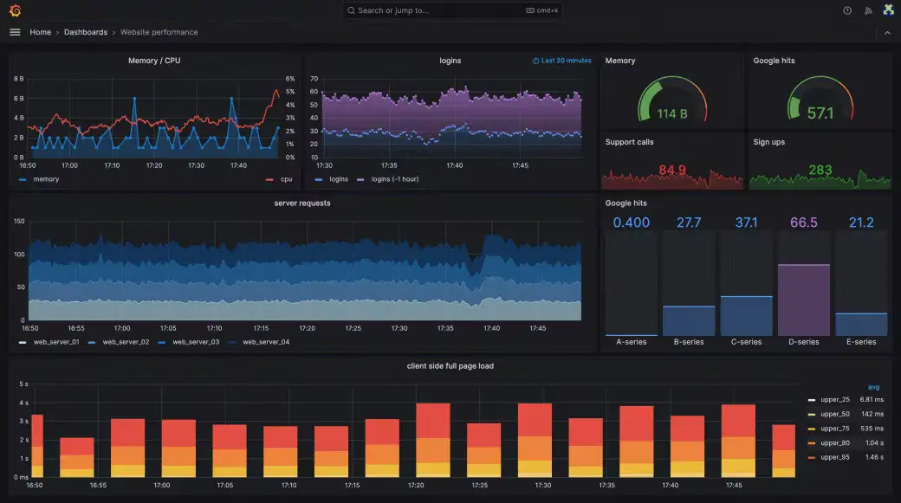

# Observability

When your systems are distributed, **things will break**. And when they do, you want to be able to identify and fix the problem as soon as possible before it alters the entire system’s performance, or affects your organization’s reputation.

People have varying knowledge of what observability means: 
* For some engineers, it’s the old wine of [monitoring](https://iamondemand.com/blog/how-to-properly-monitor-your-k8s-clusters-and-pods/) in a pristine bottle.
* Honeycomb, in its [Guide to Achieving Observability](https://www.honeycomb.io/wp-content/uploads/2018/07/Honeycomb-Guide-Achieving-Observability-v1.pdf), defines observability as the ability to ask arbitrary questions about your production environment.

Despite the variability in these definitions, **the overarching goal of observability is to achieve better visibility into systems:** 
* Observability is a property enabling you to understand what’s happening inside your software, from the outside.
* An observable system provides all the information you need to address day-to-day questions about a system. It also enables you to navigate into the system’s failure modes and **trace issues to their root cause**.

An effective observability solution may address questions like:

* Why is “y” broken?
* What went wrong during the release of feature “x”?
* Why has system performance degraded over the past few days?
* What did my service look like at point “y”?
* Is this system issue affecting specific users or all of them?

## Pillars of Observability

* **Sources**: Part of the infrastructure and application layer, such as a microservice, a device, a database, a message queue, or the operating system. They typically must be instrumented to emit signals.
* **Signals**: Information emitted by sources. There are different signal types, the most common are logs, metrics, and traces.
* **Agents**: Responsible for signal collection, processing, and routing. 
* **Destinations**: Where you consume signals, for different reasons and use cases. These include visualizations (e.g., dashboards), alerting, long-term storage (for regulatory purposes), and analytics (finding new usages for an app). 
* **Telemetry**: The process of collecting signals from sources, routing or preprocessing via agents, and ingestion to destinations.


## Sources
We categorize sources using a simple and widely used trichotomy: **compute**, **storage**, and **network**. This broad categorization helps understand where issues arise, how they propagate through the system, and what steps to take to maintain health of distributed architectures.

| **Category**  | **Description** | **Specific Metrics**                                                                                                                                                                                                                                                                     |  
|--------------|---------------|------------------------------------------------------------------------------------------------------------------------------------------------------------------------------------------------------------------------------------------------------------------------------------------|  
| **Compute**  | The runtime environments where code executes, including VMs, containers, and serverless functions. | - **Container-level metrics**: CPU, memory from Docker/Kubernetes.  <br> - **Function invocation times**: Execution time, cold start duration, and memory usage for AWS Lambda/Google Cloud Functions.                                                                                   | 
| **Storage**  | Components responsible for persisting and managing data, such as databases, file systems, and object stores. | - **DB Metrics**: Queries per second (QPS), read/write latency, connection pool size, rollback rates.  <br> - **Object Storage Metrics**: S3 `GetObject` latency, `PutObject` success/failure rates.                                                                                     |  
| **Network**  | Ensures smooth communication between microservices by monitoring connectivity, throughput, and latency. | - **API Gateway Metrics**: Request/response latency, success/failure rates, throttled requests.  <br> - **Load Balancer Metrics**: AWS ELB `RequestCount`, `HTTPCode_ELB_5XX_Count` (errors), `Latency`.  <br> - **Network Traffic**: Data transfer rates, packet loss, bandwidth usage. |


## Signals
The three pillars of observability—**metrics**, **logs**, and **traces**—play a vital role in providing insights into the system’s behavior and performance. 


## Metrics
Metrics are numerical values that capture key performance indicators (KPIs) about your system over time. They are typically aggregated and provide an overview of system health and performance.

- **Quantitative Data**: Metrics are quantitative and can be counted or measured (e.g., CPU, memory, disk, threads, latency, etc.).
- **Time-Series Nature**: Metrics are usually collected as time-series data and plotted on dashboards to show trends over time.

**Types**:
  - **Counter** – A monotonically increasing value that resets only on restart. It is used for counting occurrences, such as the number of HTTP requests or errors.
  - **Gauge** – A value that can increase or decrease, used for measuring things like memory usage or temperature.
  - **Histogram** – A metric that samples observations and counts them in configurable buckets, used for tracking request durations or response sizes. It also provides a total count and sum of values.
  - **Summary** – Similar to a histogram but provides precomputed quantiles (e.g., 50th, 90th percentile) instead of bucketed counts. Useful for monitoring latency percentiles.

**Use Cases**:
  - **Monitoring**: Continuous monitoring of performance indicators like latency, error rates, and resource consumption.
  - **Alerting**: Alerts can be set when metrics exceed predefined thresholds (e.g., high CPU usage or request errors).
  - **Capacity Planning**: Helps in predicting future resource needs based on trends in usage patterns.

```text
# HELP http_server_requests_seconds  
# TYPE http_server_requests_seconds summary
http_server_requests_seconds_count{error="none",exception="none",method="GET",outcome="SUCCESS",status="200",uri="/actuator"} 1
http_server_requests_seconds_sum{error="none",exception="none",method="GET",outcome="SUCCESS",status="200",uri="/actuator"} 0.01236351
http_server_requests_seconds_count{error="none",exception="none",method="GET",outcome="SUCCESS",status="200",uri="/actuator/health"} 4
http_server_requests_seconds_sum{error="none",exception="none",method="GET",outcome="SUCCESS",status="200",uri="/actuator/health"} 0.016967813
http_server_requests_seconds_count{error="none",exception="none",method="GET",outcome="SUCCESS",status="200",uri="/actuator/prometheus"} 10
http_server_requests_seconds_sum{error="none",exception="none",method="GET",outcome="SUCCESS",status="200",uri="/actuator/prometheus"} 0.14632263
```

**Cardinality Explosion**:

**Cardinality** refers to the number of unique combinations of label values (or dimensions) associated with a particular metric. Each unique combination creates a time series that must be stored and tracked over time.

Consider a metric that tracks the latency of API requests. It might have the following labels (dimensions):
- `endpoint`: The specific API endpoint being accessed (e.g., `/users`, `/orders`).
- `nodeid`: The id of the server (e.g., `node-567`, `node-343`).
- `region`: The geographical location of the server (e.g., `us-east-1`, `eu-west-1`).

For each unique combination of these labels, a new time series is created:

| **endpoint**  | **nodeid**   | **region**     | **Latency (ms) - T1** | **Latency (ms) - T2** |  
|--------------|-------------|---------------|----------------|----------------|  
| `/users`     | `node-567`  | `us-east-1`   | 120            | 130            |  
| `/users`     | `node-343`  | `us-east-1`   | 135            | 140            |  
| `/orders`    | `node-567`  | `us-east-1`   | 200            | 210            |  
| `/orders`    | `node-343`  | `us-east-1`   | 220            | 225            |  
| `/users`     | `node-567`  | `eu-west-1`   | 180            | 185            |  
| `/orders`    | `node-567`  | `eu-west-1`   | 190            | 195            |  

If we have **1,000 endpoints** running on **100 nodes** distributed across **3 regions**, we could end up collecting **300,000 time series** at each time step.

If we were to replace `nodeid` with `user_id`, the number of unique label combinations would **skyrocket**, potentially overwhelming the monitoring system.

### Prometheus

[Prometheus](https://prometheus.io/) is an open-source monitoring and alerting toolkit widely used for recording real-time metrics and generating alerts. Prometheus was developed at [SoundCloud](https://soundcloud.com/) in 2012 and later became a standalone project under the umbrella of the [Cloud Native Computing Foundation](https://www.cncf.io/).

- **Service Discovery**: Automatically detects and scrapes targets using mechanisms like Kubernetes, Eureka, static configs (easy replica management).
- **Scraping Metrics**: Collects data from targets (applications, services, systems) via HTTP at set intervals.
- **Query Language**: Provides **PromQL** for querying and analyzing time-series data.
- **Alerting**: Supports rule-based alerts, sending notifications.





- **Client Libraries**: Enable applications to expose custom metrics using libraries for Go, Java, Python, and more.
- **Prometheus Server**: Core component that collects, stores, and queries metrics.
- **Data Storage**: Uses a built-in time-series database (TSDB) for efficient metric storage and retrieval.
- **Alertmanager**: Manages, deduplicates, and routes alerts to notification channels.


## Logs
Logs are detailed, unstructured or semi-structured textual records that describe events that occurred in the system. Logs capture the full context of operations and are the most granular observability data.

- **Rich Detail**: Logs provide detailed information about the system’s state and operations, often including error messages, stack traces, and debug information.
- **Time-Stamped Events**: Each log entry is typically associated with a timestamp, allowing you to track events in chronological order.

**Use Cases**:
  - **Debugging**: Logs are essential for troubleshooting errors and understanding the state of an application at specific points in time.
  - **Auditing**: Logs can be used to track access, changes, and interactions within the system for compliance and security purposes.
  - **Incident Investigation**: In the case of system failure or unexpected behavior, logs provide the information needed to reconstruct the chain of events leading to the issue.

```
[INFO] 2024-10-19 10:15:03 - Service 'OrderService' started successfully on port 8080.
[ERROR] 2024-10-19 10:16:25 - Failed to connect to the database. Error: ConnectionTimeoutException: Database not reachable at db-host:5432.
[WARN] 2024-10-19 10:18:45 - Memory usage is above the threshold (90%). Current usage: 95%.
[DEBUG] 2024-10-19 10:19:07 - Processing request for user ID 12345. Request payload: { "orderId": "9876", "product": "Laptop", "quantity": 2 }.
[TRACE] 2024-10-19 10:19:12 - Sending HTTP request to PaymentService. Endpoint: /api/payment. CorrelationId: abcd-1234-efgh-5678.
```

### ELK Stack

The **ELK stack** is a popular set of tools used for managing and analyzing large volumes of data, particularly logs.

- **Centralized Logging**: The ELK stack allows organizations to centralize logs from multiple sources, making it easier to manage and analyze log data.
- **Flexible Visualization**: Kibana’s visualization tools help users present data in various formats, enabling better decision-making based on insights derived from the data.
- **Scalability**: The distributed nature of Elasticsearch allows the ELK stack to scale with the growth of data, making it suitable for small to large enterprises.



[Logstash](https://www.elastic.co/logstash) is a data pipeline that collects, transforms, and routes logs and events to destinations like Elasticsearch. It supports **multiple input sources** (e.g., files, Kafka), **filter plugins** for data processing (e.g., parsing, enrichment), and **output plugins** to forward processed data. 

[Elasticsearch](https://www.elastic.co/elasticsearch) is a distributed search and analytics engine built on Apache Lucene, enabling real-time data indexing, searching, and analysis. As the core of the ELK stack, it scales horizontally using **sharded architecture**, ensuring fault tolerance and high availability. It provides a **RESTful API** for easy integration and supports **JSON-based indexing**, allowing fast full-text searches and aggregations.

[Kibana](https://www.elastic.co/kibana) is a **visualization and analytics tool** for exploring Elasticsearch data. It allows users to create **interactive dashboards** with charts and graphs, apply **search and filtering**, and monitor logs, metrics, and traces. 




## Traces
Traces track the path of a request as it moves through various services in a distributed system. They help visualize how requests propagate across different components (a sort of distributed [stack trace](https://en.wikipedia.org/wiki/Stack_trace)).

- **Distributed Context**: Traces are particularly valuable in distributed architectures where a request can span multiple services, databases, and external APIs.
- **Span and Trace IDs**: Traces are composed of spans, which represent a single operation within a service. Each span contains a unique ID, and all spans related to a single request share the same trace ID.
- **End-to-End Latency**: Traces provide visibility into the time taken by each service involved in processing a request.





**Use Cases**:
  - **Performance Optimization**: Traces help identify bottlenecks by showing how long each service takes to process a request.
  - **Root Cause Analysis**: Tracing allows you to pinpoint which service is causing slowdowns or errors.
  - **Dependency Visualization**: Traces give a clear picture of how services interact, making it easier to understand complex dependencies in a microservice architecture.


### Traces: Jeager/Zipkin

[Jaeger](https://www.jaegertracing.io/) and [Zipkin](https://zipkin.io/) are an open-source end-to-end distributed tracing system designed for monitoring and troubleshooting the performance of microservices-based architectures.



- **Distributed Context Propagation**: Jaeger tracks requests as they propagate through multiple services, providing visibility into the interactions between them.
- **Latency Analysis**: Users can analyze the timing of requests, helping to identify performance bottlenecks and optimize service interactions.
- **Root Cause Analysis**: It assists in pinpointing the root causes of performance issues by visualizing the path and duration of requests across services.
- **Service Dependency Graphs**: Jaeger generates visual representations of service dependencies, helping teams understand the architecture and relationships between services.
- **Storage Options**: Supports various storage backends, such as MySQL, Cassandra, and Elasticsearch, allowing teams to choose their preferred data storage solution.


## Combining Metrics, Logs, and Traces
Although each pillar serves a different purpose, they complement one another to provide full visibility into system health:
- **Metrics** indicate **what** is happening, such as high CPU usage or slow response times.
- **Logs** provide the **why** by capturing detailed event data preceding or occurring during an issue.
- **Traces** illustrate the **how** by mapping request flows across system components, enabling the identification of performance bottlenecks or failures.

By integrating these observability pillars with specialized tools—such as Prometheus for metrics, the ELK stack for logs, and Jaeger for tracing—teams can gain comprehensive visibility into system behavior. This integration is crucial for effective monitoring, debugging, and optimization of modern software systems.

## Instrumentation

Instrumentation in microservices refers to the process of collecting metrics, logs, and traces to monitor, diagnose, and improve performance. Instrumenting microservices involves costs in terms of resource consumption, performance overhead, and engineering effort.

### The B2I (Business Logic to Instrumentation) ratio

To calculate the B2I ratio, determine the number of lines of code (LOC) before adding an instrumentation (adding code for emitting signals for a signal type), and then determine the LOC after the instrumentation. The B2I ratio is then:

> B2I = LOC_AFTER_INSTRUMENTATION / LOC_BEFORE_INSTRUMENTATION

In an ideal world, the B2I ratio would be 1, representing zero instrumentation costs in the code. However, in reality, the more LOC you dedicate to instrumentation, the higher the B2I ratio is. For example, if your code has 3800 LOC and you added 400 LOC for instrumentation (say, to emit logs and metrics), then you’d end up with a B2I ratio of 1.105, from (3800 + 400) / 3800.

### Manual instrumentation

**Metrics**

[Micrometer](https://micrometer.io/) is a popular metrics collection library in the Spring ecosystem, often used with Prometheus or other monitoring tools. 

```java
import io.micrometer.core.instrument.MeterRegistry;
import io.micrometer.core.instrument.Counter;
import org.springframework.web.bind.annotation.GetMapping;
import org.springframework.web.bind.annotation.RestController;

@RestController
public class ExampleController {

    private final Counter requestCounter;

    public ExampleController(MeterRegistry meterRegistry) {
        this.requestCounter = meterRegistry.counter("http.requests.count");
    }

    @GetMapping("/hello")
    public String hello() {
        requestCounter.increment();  // Increment the metric counter
        return "Hello, World!";
    }
}
```

**Logs**

[SLF4J (Simple Logging Facade for Java)](https://www.slf4j.org/) is a popular logging abstraction in the Java ecosystem, commonly used with logging frameworks like **Logback** or **Log4j** to provide a flexible and consistent logging API.

```java
import org.slf4j.Logger;
import org.slf4j.LoggerFactory;
import org.springframework.web.bind.annotation.GetMapping;
import org.springframework.web.bind.annotation.RestController;

@RestController
public class LoggingController {

    private static final Logger logger = LoggerFactory.getLogger(LoggingController.class);

    @GetMapping("/data")
    public String fetchData() {
        logger.info("Fetching data...");
        // Simulate data retrieval
        return "Data retrieved!";
    }
}
```

The logging system has to be configured to send logs remotely.

```xml
<?xml version="1.0" encoding="UTF-8"?>
<configuration>

    <appender name="STDOUT" class="ch.qos.logback.core.ConsoleAppender">
        <encoder>
            <pattern>%d{dd-MM-yyyy HH:mm:ss.SSS} [%thread] %-5level %logger{36}.%M - %msg%n</pattern>
        </encoder>
    </appender>

    <appender name="FILE" class="ch.qos.logback.core.FileAppender">
        <file>logs/application.log</file>
        <encoder>
            <Pattern>%d{dd-MM-yyyy HH:mm:ss.SSS} [%thread] %-5level %logger{36}.%M - %msg%n</Pattern>
        </encoder>
    </appender>

    <appender name="LOKI" class="com.github.loki4j.logback.Loki4jAppender">
        <http>
            <url>${LOKI_ENDPOINT}</url>
        </http>
        <format>
            <label>
                <pattern>app=datetime-service,host=${HOSTNAME}</pattern>
            </label>
            <message>
                <pattern>%-5level [%.5(${HOSTNAME})] %.10thread %logger{20} | %msg %ex</pattern>
            </message>
        </format>
    </appender>

    <root level="INFO">
        <appender-ref ref="STDOUT"/>
        <appender-ref ref="FILE"/>
        <appender-ref ref="LOKI"/>
    </root>
</configuration>
```

**Traces**

[OpenTelemetry](https://www.slf4j.org/) is a widely adopted observability framework that provides **tracing, metrics, and logging** capabilities.

```java
import io.opentelemetry.api.trace.Span;
import io.opentelemetry.api.trace.Tracer;
import org.springframework.web.bind.annotation.GetMapping;
import org.springframework.web.bind.annotation.RestController;

@RestController
public class TracingController {

    private final Tracer tracer;

    public TracingController(Tracer tracer) {
        this.tracer = tracer;
    }

    @GetMapping("/process")
    public String processRequest() {
        Span span = tracer.spanBuilder("processRequest").startSpan();  // Start tracing span
        try {
            // Simulate some business logic
            Thread.sleep(500);
            return "Processed";
        } catch (InterruptedException e) {
            span.recordException(e);
            return "Failed";
        } finally {
            span.end();  // End the span
        }
    }
}
```

### Zero-code instrumentation

**Zero Code Instrumentation** refers to a technique where no code changes are required to instrument an application for monitoring, observability, or performance tracking. This is typically achieved through automatic instrumentation provided by agents (such as [OpenTelemetry Java agent](https://opentelemetry.io/docs/zero-code/java/agent/)) or frameworks.

A **Java agent** is a special type of Java program that can modify the behavior of Java bytecode at runtime. It leverages the Java Instrumentation API, allowing developers or tools to inject custom behavior into Java classes before they are loaded into memory by the JVM.

```bash
java -javaagent:/path/to/agent.jar -jar your-application.jar
```


## OpenTelemetry Collector (Universal Telemetry Agent)



The **OpenTelemetry collector** is a versatile, open-source tool designed to collect, process, and export telemetry data, including **logs**, **metrics**, and **traces**. 

- **Vendor-Neutral**: OpenTelemetry aims to standardize how telemetry is collected, providing flexibility and portability. 
- **Unified Data Collection**: The collector supports receiving telemetry data from different sources (metrics, logs, traces) and exporting them to various backends, making it a single agent that replaces multiple specialized agents.
- **Scalability and Flexibility**: The collector can be deployed as an agent (running locally alongside applications) or as a central service that aggregates telemetry from multiple agents across the infrastructure.
- **Extensible Pipeline**: The collector follows a pipeline architecture consisting of **receivers**, **processors**, and **exporters**:
  - **Receivers**: Ingest telemetry data from various sources (e.g., Jaeger, Prometheus, LogStash, instrumented services).
  - **Processors**: Enrich, filter, batch, or transform data before exporting.
  - **Exporters**: Send the processed data to backends like Prometheus, Elasticsearch, Grafana, or third-party observability platforms (Datadog, New Relic).

## OpenTelemetry Ecosystems

### Grafana



The [Grafana ecosystem](https://grafana.com/) started as a data visualization tool and has evolved into a comprehensive monitoring solution when combined with other tools in the Grafana stack.



**Grafana** is an open-source analytics and monitoring platform designed for visualizing metrics and logs from various data sources. (see [here](https://grafana.com/blog/2021/06/22/grafana-dashboard-showcase-visualizations-for-prometheus-home-energy-usage-github-and-more/) a curated list of dashboards).

**Tempo** is a distributed tracing backend designed to collect and store trace data generated by applications. 

**Mimir** is a metrics store designed for high-performance metrics collection and retrieval. It is particularly useful for storing large volumes of time-series data and is often seen as a scalable solution for organizations with extensive observability needs.

**Loki** is a log aggregation system designed to collect, store, and query log data from various sources. Unlike traditional log management systems, Loki is optimized for ease of use and integrates tightly with Grafana.

### Signoz
[SigNoz](https://signoz.io/) is an open-source observability platform designed for monitoring, tracing, and logging in cloud-native applications.

* SigNoz is OpenTelemetry-native, built to support this open standard from day one. 
* Grafana uses different backends for different signal types. SigNoz uses a single data store (ClickHouse), a columnar database known for fast ingestion and aggregation. Signoz is generally faster and more efficient for ingestion and queries ([here](https://signoz.io/blog/logs-performance-benchmark/?utm_source=github-readme&utm_medium=logs-benchmark) a detailed comparison).
* SigNoz is generally easier to self-host compared to Grafana, which requires managing multiple backends and configurations.

### OpenObserve
[OpenObserve](https://openobserve.ai/) is an open-source observability platform that provides a unified solution for logs, metrics, and traces, optimized for cost-efficiency and scalability.

* OpenObserve is designed for high ingestion performance and low resource usage, using a Rust-based engine and object storage (like S3 or MinIO) as its primary backend.
* Unlike traditional stacks that require separate systems for each signal type, OpenObserve offers a unified and lightweight architecture that simplifies deployment and maintenance.
* It supports OpenTelemetry and integrates seamlessly with cloud-native environments, offering a modern alternative to solutions like Grafana and ELK with a strong focus on ease of use and minimal operational overhead.

## Observability Costs

- **Data Ingestion**: High-frequency metrics, logs, and traces increase ingestion costs, especially in real-time monitoring.
- **Storage**: Storing high-cardinality and high-volume data can be expensive; retention policies and compression help manage costs.
- **Compute**: Querying, aggregations, and anomaly detection require processing power, increasing costs in large-scale systems.
- **Networking**: Cross-region data transfers, streaming analytics, and API requests can lead to significant network costs.
- **Licensing & Tooling**: Proprietary tools add licensing fees, while open-source solutions require infrastructure and maintenance costs.
- **Optimization Strategies**: Reducing data collection frequency, filtering unnecessary logs, and optimizing queries can control costs while maintaining visibility.

## Resources
- Cloud Observability in Action, Hausenblas