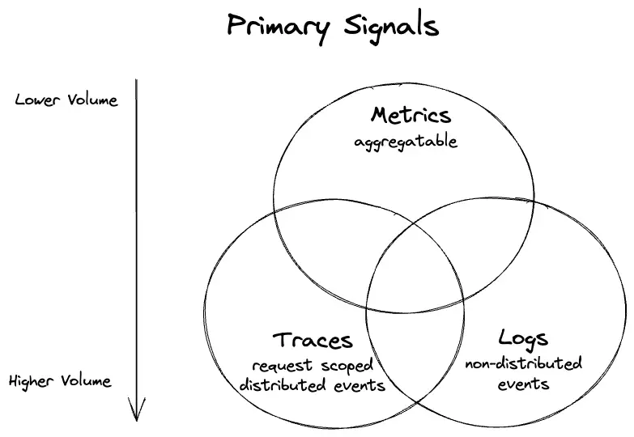
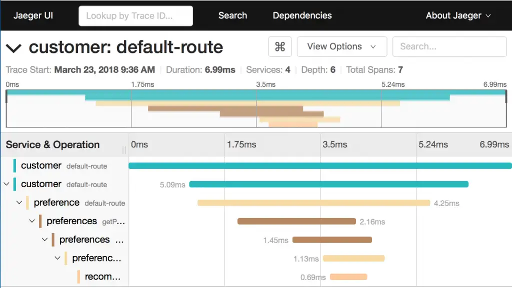
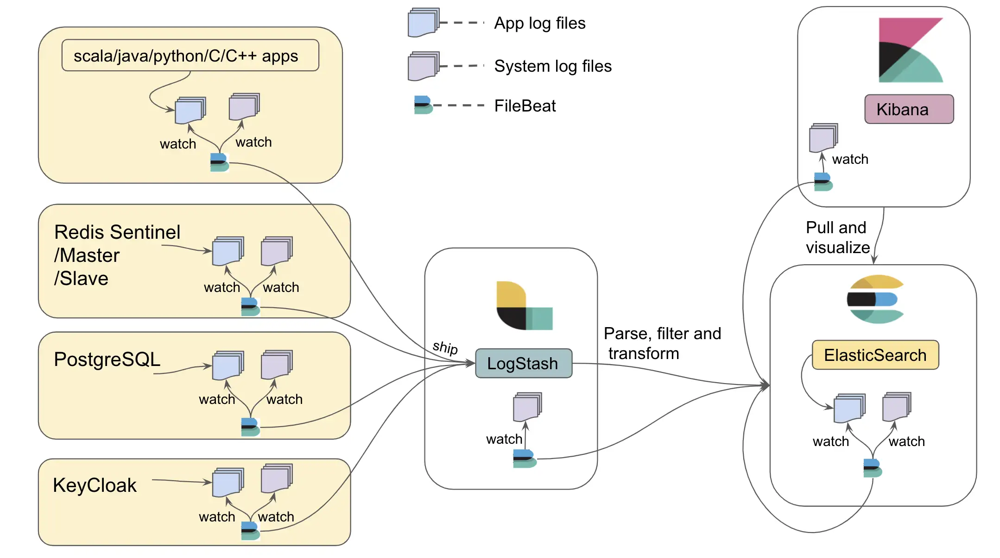
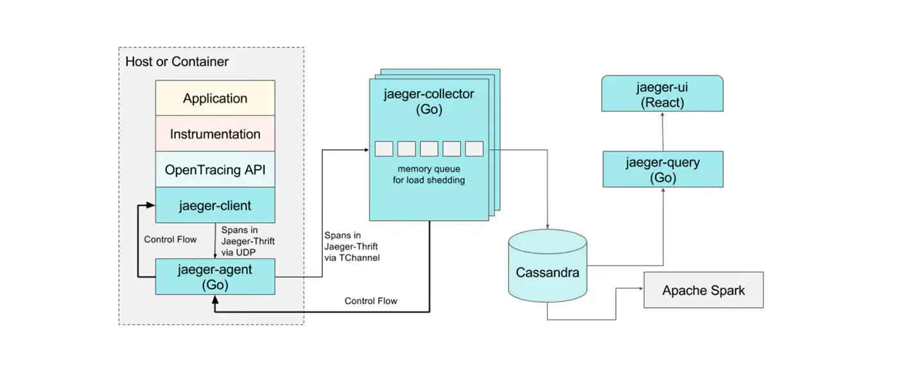
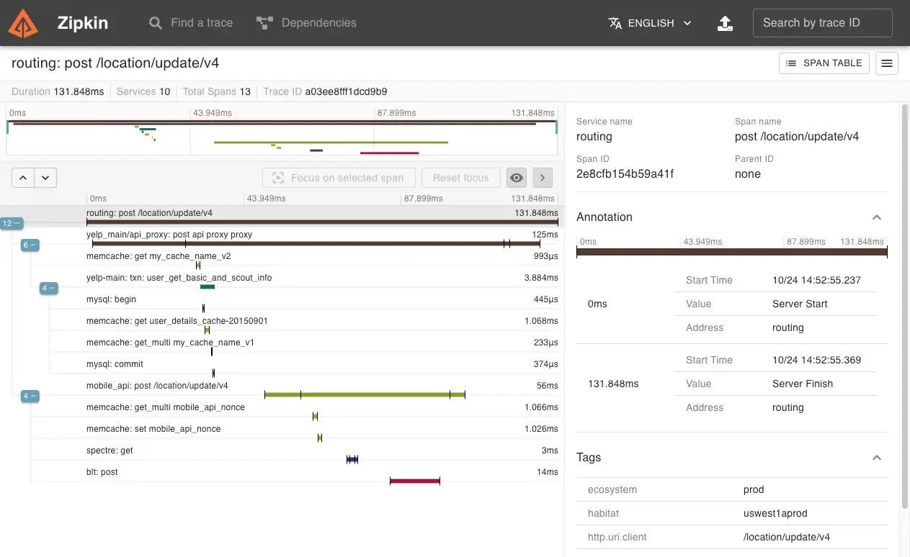
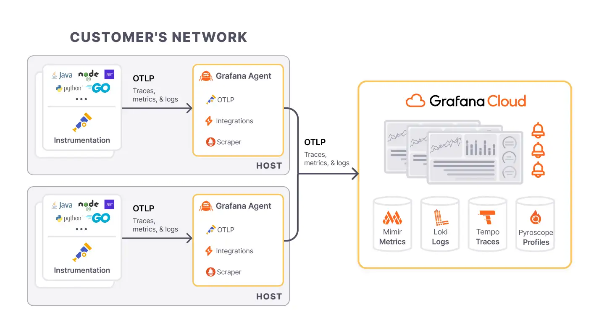

# Observability

While decoupled services are easy to scale and manage, increasing interactions between those services have created a new set of problems. It’s no surprise that debugging was listed as a major challenge in the [annual state of microservices report](https://tsh.io/blog/what-are-microservices-in-2020-key-findings-from-survey-report/).

When your systems are distributed, various things can go wrong. Even if you’ve written the perfect code, a node may fail, a connection may timeout, or participant servers may act arbitrarily. **The bottom line is that things will break**. And when they do, you want to be able to identify and fix the problem as soon as possible before it alters the entire system’s performance, or affects customers or your organization’s reputation. For this reason, we need observability to run today’s services and infrastructure.

People have varying knowledge of what observability means. For some engineers, it’s the old wine of [monitoring](https://iamondemand.com/blog/how-to-properly-monitor-your-k8s-clusters-and-pods/) in a pristine bottle. For others, it’s an umbrella concept that includes log analysis, trace analysis for distributed systems, visualization, and alerts management. Honeycomb, in its [Guide to Achieving Observability](https://www.honeycomb.io/wp-content/uploads/2018/07/Honeycomb-Guide-Achieving-Observability-v1.pdf), defines observability as the ability to ask arbitrary questions about your production environment without having to know beforehand what you wanted to ask. 

Despite the variability in these definitions, they all explain **the overarching goal of observability, which is to achieve better, unprecedented visibility into systems. Observability is a property enabling you to understand what’s happening inside your software, from the outside.** An observable system provides all the information you need in real time to address the day-to-day questions you might have about a system. It also enables you to navigate from effect to cause whenever the system develops a fault.

An effective observability solution may address questions like:

* Why is “y” broken?
* What went wrong during the release of feature “x”?
* Why has system performance degraded over the past few months?
* What did my service look like at point “y”?
* Is this system issue affecting specific users or all of them?

The inherent integrations and nature of distributed systems lead to *layers of distinct ownership* which are sometimes challenging to manage. **By implementing observability across a development environment, you might be able to understand your system’s failure modes and trace issues to their root cause.**

## Pillars of Observability

* **System**: Short for system under observation (SUO). This is the cloud-native platform (and applications running on it) you care about and are responsible for.
* **Signals**: Information observable from the outside of a system. There are different signal types (the most common are logs, metrics, and traces), and they are generated by sources. 
* **Sources**: Part of the infrastructure and application layer, such as a microservice, a device, a database, a message queue, or the operating system. They typically must be instrumented to emit signals. 
* **Agents**: Responsible for signal collection, processing, and routing. 
* **Destinations**: Where you consume signals, for different reasons and use cases. These include visualizations (e.g., dashboards), alerting, long-term storage (for regulatory purposes), and analytics (finding new usages for an app). 
* **Telemetry**: The process of collecting signals from sources, routing or preprocessing via agents, and ingestion to destinations.


## Signals
Observability is a critical concept in modern distributed systems, particularly in microservices architectures, as it enables teams to understand and troubleshoot systems effectively. The three pillars of observability—**metrics**, **logs**, and **traces**—play a vital role in providing insights into the system’s behavior and performance. 



### Metrics
Metrics are numerical values that capture key performance indicators (KPIs) about your system over time. They are typically aggregated and provide an overview of system health and performance.

**Characteristics**:
  - **Quantitative Data**: Metrics are quantitative and can be counted or measured (e.g., CPU usage, memory consumption, request latency).
  - **Low Cardinality**: Metrics tend to have low cardinality, meaning they track fewer distinct values compared to logs or traces.
  - **Time-Series Nature**: Metrics are usually collected as time-series data and plotted on dashboards to show trends over time.

**Types**:
  - **System Metrics**: CPU, memory, disk, and network usage.
  - **Application Metrics**: Request count, error rate, request latency, and throughput.

**Use Cases**:
  - **Monitoring**: Continuous monitoring of performance indicators like latency, error rates, and resource consumption.
  - **Alerting**: Alerts can be set when metrics exceed predefined thresholds (e.g., high CPU usage or request errors).
  - **Capacity Planning**: Helps in predicting future resource needs based on trends in usage patterns.


| **Metric Name**       | **Label Key** | **Label Value** | **Label Key** | **Label Value** | **Value T0 (ms)** | **Value T1 (ms)** |
|-----------------------|---------------|-----------------|---------------|-----------------|-------------------|-------------------|
| `api_request_latency`  | `status_code` | `200`           | `endpoint`    | `/users`        | 120               | 150               |
| `api_request_latency`  | `status_code` | `404`           | `endpoint`    | `/orders`       | 250               | 260               |
| `api_request_latency`  | `status_code` | `500`           | `endpoint`    | `/products`     | 350               | 400               |
| `api_request_latency`  | `status_code` | `200`           | `endpoint`    | `/users/{id}`   | 90                | 95                |
| `api_request_latency`  | `status_code` | `500`           | `endpoint`    | `/checkout`     | 500               | 510               |
| `api_request_latency`  | `status_code` | `200`           | `endpoint`    | `/login`        | 180               | 190               |
| `api_request_latency`  | `status_code` | `200`           | `endpoint`    | `/orders/{id}`  | 75                | 80                |
| `api_request_latency`  | `status_code` | `500`           | `endpoint`    | `/cart`         | 400               | 420               |
| `api_request_latency`  | `status_code` | `200`           | `endpoint`    | `/health`       | 60                | 65                |
| `api_request_latency`  | `status_code` | `404`           | `endpoint`    | `/products`     | 220               | 230               |


**Cardinality Explosion**

**Cardinality** refers to the number of unique combinations of label values (or dimensions) associated with a particular metric. Each unique combination creates a new "time series" that must be stored and tracked over time.

Consider a metric that tracks the latency of API requests. It might have the following labels (dimensions):
- `status_code`: HTTP status code of the request (e.g., 200, 404, 500).
- `endpoint`: The specific API endpoint being accessed (e.g., `/users`, `/orders`).
- `region`: The geographical location of the server (e.g., `us-east-1`, `eu-west-1`).
- `nodeid`: The id of the server (e.g., `node-567`, `node-343`).

For each unique combination of these labels, a new time series is created:
- `latency{status_code="200", endpoint="/users", region="us-east-1", "node-567"}`
- `latency{status_code="404", endpoint="/users", region="us-east-1", "node-343"}`

If each label can take on many unique values, the number of possible combinations (and hence the number of time series) increases exponentially. For example, under the assumption of observing 1000 endpoints, running on 100 nodes, and considering only 20 status codes, **we would have to store 2M values each time step**. 


### Logs
Logs are detailed, unstructured or semi-structured textual records that describe events that occurred in the system. Logs capture the full context of operations and are the most granular observability data.

**Characteristics**:
  - **Rich Detail**: Logs provide detailed information about the system’s state and operations, often including error messages, stack traces, and debug information.
  - **High Cardinality**: Logs can capture many unique details such as user IDs, IP addresses, and session IDs.
  - **Time-Stamped Events**: Each log entry is typically associated with a timestamp, allowing you to track events in chronological order.

**Types**:
  - **Application Logs**: Generated by the application itself to capture business logic events, errors, or warnings.
  - **System Logs**: Logs related to the operating system, server errors, or hardware issues.
  - **Security Logs**: Logs capturing access events, login attempts, and authorization failures.
  - **Infrastructure log**: Vital part of infrastructure management, which involves managing the physical and logical equipment that affects an organization's IT foundation.

**Use Cases**:
  - **Debugging**: Logs are essential for troubleshooting errors and understanding the state of an application at specific points in time.
  - **Auditing**: Logs can be used to track access, changes, and interactions within the system for compliance and security purposes.
  - **Incident Investigation**: In the case of system failure or unexpected behavior, logs provide the information needed to reconstruct the chain of events leading to the issue.

```
[INFO] 2024-10-19 10:15:03 - Service 'OrderService' started successfully on port 8080.
[ERROR] 2024-10-19 10:16:25 - Failed to connect to the database. Error: ConnectionTimeoutException: Database not reachable at db-host:5432.
[WARN] 2024-10-19 10:18:45 - Memory usage is above the threshold (90%). Current usage: 95%.
[DEBUG] 2024-10-19 10:19:07 - Processing request for user ID 12345. Request payload: { "orderId": "9876", "product": "Laptop", "quantity": 2 }.
[TRACE] 2024-10-19 10:19:12 - Sending HTTP request to PaymentService. Endpoint: /api/payment. CorrelationId: abcd-1234-efgh-5678.
```

### Traces
- **Definition**: Traces track the path of a request as it moves through various services in a distributed system. They help visualize and analyze how requests propagate across different components.
- **Characteristics**:
    - **Distributed Context**: Traces are particularly valuable in microservices architectures where a request can span multiple services, databases, and external APIs.
    - **Span and Trace IDs**: Traces are composed of spans, which represent a single operation within a service. Each span contains a unique ID, and all spans related to a single request share the same trace ID, allowing you to track the request end-to-end.
    - **End-to-End Latency**: Traces provide visibility into the time taken by each service involved in processing a request.
- **Types**:
    - **Root Span**: The first span in a trace, usually representing the entry point of a request into the system.
    - **Child Spans**: Represent operations in downstream services, each tracked independently but associated with the same trace ID.
- **Use Cases**:
    - **Performance Optimization**: Traces help identify bottlenecks by showing how long each service or component takes to process a request.
    - **Root Cause Analysis**: Tracing allows you to pinpoint which service or component is causing slowdowns or errors.
    - **Dependency Visualization**: Traces give a clear picture of how services interact, making it easier to understand complex dependencies in a microservice architecture.



### Combining Metrics, Logs, and Traces
Although each pillar serves a different purpose, they complement one another to provide full visibility into system health:
- **Metrics** provide the "what" (e.g., high CPU usage or slow response times).
- **Logs** offer the "why" by showing the details of events leading up to or during an issue.
- **Traces** offer the "how" by revealing the flow of requests through different parts of the system, making it possible to locate performance bottlenecks or failures in distributed environments.

By integrating these pillars using observability tools (e.g., Prometheus for metrics, ELK stack for logs, Jaeger for tracing), teams can achieve comprehensive insight into the behavior of their systems, which is essential for effective monitoring, debugging, and optimizing modern software systems.

## Instrumentation

Instrumentation in microservices refers to the process of collecting metrics, logs, and traces to monitor, diagnose, and improve performance. Instrumenting microservices involves costs in terms of resource consumption, performance overhead, and engineering effort.

### The B2I (Business Logic to Instrumentation) ratio

To calculate the B2I ratio, determine the number of lines of code (LOC) before adding an instrumentation (adding code for emitting signals for a signal type), and then determine the LOC after the instrumentation. The B2I ratio is then:

> B2I = LOC_AFTER_INSTRUMENTATION / LOC_BEFORE_INSTRUMENTATION

In an ideal world, the B2I ratio would be 1, representing zero instrumentation costs in the code. However, in reality, the more LOC you dedicate to instrumentation, the higher the B2I ratio is. For example, if your code has 3800 LOC and you added 400 LOC for instrumentation (say, to emit logs and metrics), then you’d end up with a B2I ratio of 1.105, from (3800 + 400) / 3800.

### Manual instrumentation

**Metrics**

Micrometer is a popular metrics collection library in the Spring ecosystem, often used with Prometheus or other monitoring tools. Adding metrics introduces costs in terms of resource usage and infrastructure needs.

```java
import io.micrometer.core.instrument.MeterRegistry;
import io.micrometer.core.instrument.Counter;
import org.springframework.web.bind.annotation.GetMapping;
import org.springframework.web.bind.annotation.RestController;

@RestController
public class ExampleController {

    private final Counter requestCounter;

    public ExampleController(MeterRegistry meterRegistry) {
        this.requestCounter = meterRegistry.counter("http.requests.count");
    }

    @GetMapping("/hello")
    public String hello() {
        requestCounter.increment();  // Increment the metric counter
        return "Hello, World!";
    }
}
```

- **Resource Overhead**: Each request increments a counter. In high-traffic applications, this small overhead accumulates.
- **Infrastructure Costs**: Storing and querying metrics in Prometheus or another monitoring system requires resources, including storage and compute.

**Logs**

Logging is essential for debugging and monitoring microservices, but excessive logging can consume storage, network bandwidth, and degrade performance.

```java
import org.slf4j.Logger;
import org.slf4j.LoggerFactory;
import org.springframework.web.bind.annotation.GetMapping;
import org.springframework.web.bind.annotation.RestController;

@RestController
public class LoggingController {

    private static final Logger logger = LoggerFactory.getLogger(LoggingController.class);

    @GetMapping("/data")
    public String fetchData() {
        logger.info("Fetching data...");
        // Simulate data retrieval
        return "Data retrieved!";
    }
}
```

- **Storage Costs**: Logs can grow quickly, especially in microservices architectures where each service generates logs. Storing these logs (e.g., in ELK stack) adds to infrastructure costs.
- **Performance Impact**: Writing logs to disk or sending them to a centralized logging service can introduce latency.

**Traces**
Distributed tracing helps in understanding requests flowing through various microservices. It can introduce performance overhead due to the additional tracking, logging, and transmission of trace data.

```java
import io.opentelemetry.api.trace.Span;
import io.opentelemetry.api.trace.Tracer;
import org.springframework.web.bind.annotation.GetMapping;
import org.springframework.web.bind.annotation.RestController;

@RestController
public class TracingController {

    private final Tracer tracer;

    public TracingController(Tracer tracer) {
        this.tracer = tracer;
    }

    @GetMapping("/process")
    public String processRequest() {
        Span span = tracer.spanBuilder("processRequest").startSpan();  // Start tracing span
        try {
            // Simulate some business logic
            Thread.sleep(500);
            return "Processed";
        } catch (InterruptedException e) {
            span.recordException(e);
            return "Failed";
        } finally {
            span.end();  // End the span
        }
    }
}
```

- **Performance Overhead**: Tracing adds latency to each request as spans are created, propagated, and sent to a tracing backend (e.g., Jaeger, Zipkin).
- **Operational Costs**: Setting up and maintaining tracing infrastructure requires additional resources, especially for high-volume traffic and complex distributed systems.

### Zero-code instrumentation

**Zero Code Instrumentation** refers to a technique where no code changes are required to instrument an application for monitoring, observability, or performance tracking. This is typically achieved through automatic instrumentation provided by agents (such as Java agents) or frameworks.

A **Java agent** is a special type of Java program that can modify the behavior of Java bytecode at runtime. It leverages the Java Instrumentation API, allowing developers or tools to inject custom behavior into Java classes before they are loaded into memory by the JVM.

**How It Works**
* **Bytecode Manipulation**: The Java agent can modify the bytecode of the application’s classes to introduce additional behavior, such as tracing, logging, or collecting metrics, without changing the application code itself.
* **Premain and Agentmain Methods**: Java agents have two key methods:
  - **premain()**: Invoked before the main method of the application, allowing agents to attach at startup.
  - **agentmain()**: Allows agents to attach to a running JVM (dynamic attachment).
* **JVM Argument**: To use a Java agent, it is added as a JVM argument, such as:

```bash
java -javaagent:/path/to/agent.jar -jar your-application.jar
```


## Sources
We categorize sources using a simple and widely used trichotomy: **compute**, **storage**, and **network**. By categorizing observability into compute, storage, and network, you can better understand where issues arise, how they propagate through the system, and what steps to take to maintain the health and performance of distributed microservice architectures.


### Compute
This refers to the actual runtime environments where code executes, and it covers virtual machines, containers, serverless functions, and other compute units. Observability in this area focuses on gathering data related to the performance, resource usage, and health of the compute environments.

**Key Observability Data:**
  - **CPU**: Tracking how much CPU is consumed by a microservice, container, or VM. Spikes or high sustained CPU usage can indicate inefficient code, overloaded instances, or performance bottlenecks.
  - **Memory**: Monitoring memory usage and checking for memory leaks or inefficient memory management.
  - **Disk I/O**: Observing read/write operations to detect bottlenecks in services that handle large data transfers.

**Compute-Specific Metrics:**
- **Container-level metrics**: For instance, Docker and Kubernetes expose metrics such as container CPU, memory, and disk I/O, which are crucial for performance tuning and resource scaling.
- **Function invocation times (serverless)**: For AWS Lambda or Google Cloud Functions, the focus is on execution time, cold start duration, and memory usage per function execution.

### Storage
This category includes all components responsible for persisting and managing data. Observability in storage focuses on the health, performance, and availability of databases, file systems, and object stores.

**Key Observability Data:**
- **Query Performance**: For relational databases (e.g., PostgreSQL, MySQL), tracking slow queries, lock contention, and transaction times provides insights into bottlenecks that affect application performance.
- **Latency**: For NoSQL stores like Redis and DynamoDB, latency of read and write operations is critical to maintaining the performance of high-throughput systems.
- **Capacity and Availability**: Monitoring disk space and usage trends ensures that storage does not run out of capacity unexpectedly, while availability metrics (uptime/downtime) ensure that storage systems are accessible when needed.

**Storage-Specific Metrics:**
- **DB Metrics**: Queries per second (QPS), read/write latency, connection pool size, and transaction rollback rates.
- **Object Storage Metrics**: S3 provides metrics like `GetObject` latency and `PutObject` success/failure rates.

### Network
Networking is crucial in distributed systems, as microservices rely heavily on network communication. Observability here focuses on monitoring the flow of data across different services, ensuring that connectivity, throughput, and latency are within acceptable limits.

**Key Observability Data:**
- **Throughput**: Measuring how much data is being transferred between services. Network bottlenecks can indicate issues with data flow or congestion.
- **Latency**: Tracking round-trip times between services and clients. Latency spikes often highlight performance degradation in a service-to-service interaction.
- **Error Rates**: High rates of packet loss, failed connections, or dropped messages can signal issues with the underlying network infrastructure or service health.

**Network-Specific Metrics:**
- **API Gateway Metrics**: For APIs, metrics like request/response latency, success/failure rates, and throttled requests give insights into network performance.
- **Load Balancer Metrics**: Load balancers like AWS ELB expose metrics such as `RequestCount`, `HTTPCode_ELB_5XX_Count` (errors), and `Latency`.
- **Network Traffic**: Monitoring data transfer rates, packet loss, or bandwidth usage helps in understanding network capacity and diagnosing bottlenecks.

### Extended Considerations for Observability Sources:
- **Granularity**: For each of these categories, observability can be applied at different granularities. For example, at the compute level, you can track metrics at the VM level, container level, or process level, depending on the level of detail required.

- **Correlation**: Effective observability often involves correlating data from these three sources. For instance, high latency in the network may coincide with increased CPU usage on the compute side, or a database experiencing long-running queries could cause cascading slowdowns across the network.

- **Security Implications**: Network observability also contributes to security monitoring. Tools that inspect network traffic or audit logs can detect unauthorized access, anomalies, or data exfiltration attempts.

## Metrics: Prometheus

**Prometheus** is an open-source monitoring and alerting toolkit widely used for recording real-time metrics and generating alerts. Prometheus was developed at SoundCloud in 2012 and later became a standalone project under the umbrella of the Cloud Native Computing Foundation (CNCF). It is designed for reliability and scalability in monitoring and alerting, with a strong emphasis on time-series data.


### Key Features of Prometheus

- **Multi-dimensional Data Model**: Prometheus uses a flexible data model that allows metrics to be identified by key-value pairs known as labels. This supports the creation of highly dimensional queries.
- **Powerful Query Language**: Prometheus provides a query language called **PromQL** (Prometheus Query Language) for retrieving and manipulating time-series data, making it easy to create complex queries and aggregations.
- **Pull Model**: Prometheus primarily uses a pull model for data collection, where it scrapes metrics from configured targets at specified intervals, making it suitable for dynamic environments.
- **Alerting**: Prometheus supports alerting based on specific conditions defined in alerting rules. Alerts can be sent to various notification channels, including email, Slack, and PagerDuty.
- **Integration**: It integrates well with various data sources, exporters, and monitoring tools, allowing for comprehensive monitoring across applications and infrastructure.

### Prometheus Architecture

The architecture of Prometheus consists of several key components:

1. **Prometheus Server**: The core component that collects, stores, and processes metrics data. It performs scraping, data storage, and querying.
2. **Data Storage**: Prometheus stores time-series data in its own time-series database (TSDB), optimized for fast retrieval and storage of metric data.
3. **Exporters**: Exporters are components that expose metrics in a format Prometheus can scrape. There are various exporters available, such as node_exporter for system metrics, and application-specific exporters for popular technologies like MySQL and Redis.
4. **Alertmanager**: This component handles alerts generated by the Prometheus server. It manages alert notifications, deduplicates them, and routes them to the appropriate notification channels.
5. **Client Libraries**: These libraries allow application developers to instrument their code and expose metrics directly to Prometheus. Libraries are available for various programming languages (e.g., Go, Java, Python).

### Prometheus as an Agent

When we refer to **Prometheus as an agent**, we typically focus on its role in data collection and metrics scraping.

- **Scraping Metrics**: Prometheus acts as a data collector (or agent) that scrapes metrics from various targets at configured intervals. Targets can include applications, services, or systems exposing metrics through HTTP endpoints.
- **Service Discovery**: Prometheus supports various service discovery mechanisms (e.g., Kubernetes, Consul, static configuration) to automatically identify and scrape targets. This is especially useful in dynamic environments where services may frequently change.
- **Metrics Formatting**: Targets expose metrics in a specific text-based format that Prometheus understands. The metrics can include information about CPU usage, memory consumption, request counts, error rates, and more.

### Prometheus as a Backend Service

When we refer to **Prometheus as a backend service**, we emphasize its capabilities as a metrics storage and querying system.

- **Time-Series Data Storage**: Prometheus stores scraped metrics in a time-series database optimized for quick lookups, aggregations, and high-dimensional queries.
- **PromQL Queries**: Users can use PromQL to query and analyze metrics data efficiently. This allows for complex aggregations, filtering, and transformation of metrics, enabling insightful monitoring and alerting.
- **Alerting**: The Prometheus server evaluates alerting rules based on the collected metrics, generating alerts when conditions are met. Alerts are then forwarded to Alertmanager for handling and notification.
- **Long-Term Storage**: While Prometheus is not designed for long-term storage, it can integrate with remote storage solutions (e.g., Thanos, Cortex, InfluxDB) to store metrics data for extended periods.

## Logs: ELK Stack

The **ELK stack** is a popular set of tools used for managing and analyzing large volumes of data, particularly logs and metrics. It consists of three main components: **Elasticsearch**, **Logstash**, and **Kibana**. These tools work together to provide a complete solution for data ingestion, storage, search, analysis, and visualization. Here’s a detailed look at each key component of the ELK stack.



### Elasticsearch

**Elasticsearch** is a distributed search and analytics engine built on top of Apache Lucene. It is designed for real-time data processing and is the core component of the ELK stack, responsible for storing, searching, and analyzing data.

- **Distributed Architecture**: Elasticsearch is designed to be distributed, allowing it to scale horizontally. Data can be divided into multiple shards and distributed across multiple nodes, providing high availability and fault tolerance.
- **Full-Text Search**: It provides powerful full-text search capabilities, allowing for complex queries and retrieval of relevant data quickly.
- **RESTful API**: Elasticsearch exposes a RESTful API, enabling easy integration with applications and other components of the ELK stack. This allows users to send and receive data using standard HTTP methods.
- **Data Indexing**: Data is stored in JSON format and indexed to make it searchable. Indexing allows Elasticsearch to quickly find and retrieve documents based on search queries.
- **Aggregations**: Elasticsearch supports powerful aggregation capabilities, enabling users to perform complex statistical analyses and group data based on various criteria.

### Logstash

**Logstash** is a data processing pipeline that ingests, processes, and forwards data to various outputs, primarily Elasticsearch. It serves as the intermediary between data sources and data storage.

- **Input Plugins**: Logstash supports numerous input sources through various plugins (e.g., file, syslog, Beats, Kafka). This flexibility allows it to collect data from different environments and formats.
- **Filter Plugins**: Logstash provides a rich set of filter plugins to transform and process incoming data. Filters can parse logs, rename fields, drop unnecessary data, and enrich data (e.g., adding geolocation information).
- **Output Plugins**: Processed data can be sent to various outputs, with Elasticsearch being the most common target. Logstash can also output data to other systems, such as databases, message queues, or other log storage solutions.
- **Pipeline Management**: Users can define complex data pipelines using configuration files that specify how data should be collected, processed, and forwarded.

### Kibana

**Kibana** is the visualization and exploration tool for the ELK stack. It provides a web-based interface for users to interact with data stored in Elasticsearch, allowing for data visualization, exploration, and dashboard creation.

- **Data Visualization**: Kibana offers a variety of visualization options, such as line graphs, bar charts, pie charts, and maps, to help users understand their data better.
- **Custom Dashboards**: Users can create customizable dashboards to display multiple visualizations and metrics in a single view. Dashboards can be tailored to specific use cases and shared with others.
- **Search and Filter**: Kibana allows users to perform powerful searches and apply filters to their data, making it easy to drill down into specific metrics or logs.
- **Timelion and Canvas**: Kibana includes specialized tools like Timelion for time-series visualizations and Canvas for creating visually-rich presentations and reports based on data from Elasticsearch.

### How the ELK Stack Works Together

1. **Data Ingestion**: Data is collected from various sources using Logstash, which processes and transforms the data according to specified rules.
2. **Data Storage**: The processed data is sent to Elasticsearch, where it is indexed and stored in a way that allows for fast searching and querying.
3. **Data Visualization**: Users access Kibana to visualize and explore the data stored in Elasticsearch. They can create dashboards, perform searches, and analyze metrics to gain insights.

### Benefits of the ELK Stack

- **Centralized Logging**: The ELK stack allows organizations to centralize logs from multiple sources, making it easier to manage and analyze log data.
- **Real-Time Analysis**: With near real-time data processing capabilities, users can monitor systems and applications effectively, responding quickly to issues as they arise.
- **Flexible Visualization**: Kibana’s visualization tools help users present data in various formats, enabling better decision-making based on insights derived from the data.
- **Scalability**: The distributed nature of Elasticsearch allows the ELK stack to scale with the growth of data, making it suitable for small to large enterprises.

## Traces: Jeager/Zipkin

### Jaeger



Jaeger is an open-source end-to-end distributed tracing system originally developed by Uber Technologies. It is designed for monitoring and troubleshooting the performance of microservices-based architectures.

Key Features:
- **Distributed Context Propagation**: Jaeger tracks requests as they propagate through multiple services, providing visibility into the interactions between them.
- **Latency Analysis**: Users can analyze the timing of requests, helping to identify performance bottlenecks and optimize service interactions.
- **Root Cause Analysis**: It assists in pinpointing the root causes of performance issues by visualizing the path and duration of requests across services.
- **Service Dependency Graphs**: Jaeger generates visual representations of service dependencies, helping teams understand the architecture and relationships between services.
- **Adaptive Sampling**: Supports adaptive sampling strategies to balance data granularity and the volume of traces collected, thus managing storage and processing overhead.


### Zipkin



Zipkin is another open-source distributed tracing system designed to help gather timing data needed to troubleshoot latency problems in microservices. Like Jaeger, it helps visualize the flow of requests across services.

Key Features:
- **Distributed Context Propagation**: Similar to Jaeger, Zipkin collects tracing information as requests traverse multiple services, providing a complete view of the request lifecycle.
- **Latency Analysis**: Offers detailed latency analysis by showing how long requests take at each step in the call chain.
- **Dependency Analysis**: Generates service dependency graphs, helping teams visualize the relationships between services.
- **User Interface**: Provides a simple web-based UI for visualizing traces, including features for searching and filtering by tags or service names.
- **Storage Options**: Supports various storage backends, such as MySQL, Cassandra, and Elasticsearch, allowing teams to choose their preferred data storage solution.


## OpenTelemetry Collector (Universal Telemetry Agent)


The **OpenTelemetry collector** is a versatile, open-source tool designed to collect, process, and export telemetry data, including **logs**, **metrics**, and **traces**. It is part of the OpenTelemetry project, which aims to provide a unified standard for observability across distributed systems.

#### Key Features
- **Unified Data Collection**: The collector supports receiving telemetry data from different sources (metrics, logs, traces) and exporting them to various backends, making it a single agent that replaces multiple specialized agents.
- **Extensible Pipeline**: The collector follows a pipeline architecture consisting of **receivers**, **processors**, and **exporters**:
  - **Receivers**: Ingest telemetry data from various sources (e.g., Jaeger, Prometheus, Fluentd).
  - **Processors**: Enrich, filter, batch, or transform data before exporting.
  - **Exporters**: Send the processed data to backends like Prometheus, Elasticsearch, Grafana, or third-party observability platforms (Datadog, New Relic).

- **Vendor-Neutral**: OpenTelemetry aims to standardize how telemetry is collected, providing flexibility and portability. The collector allows you to change backends (e.g., from Prometheus to AWS CloudWatch) without modifying your application code.

- **Scalability and Flexibility**: The collector can be deployed as an agent (running locally alongside applications) or as a central service that aggregates telemetry from multiple agents across the infrastructure.

#### How OpenTelemetry Collector Works
1. **Instrumentation**: Application code is instrumented to produce telemetry data (logs, metrics, traces) using OpenTelemetry SDKs. The data is sent to the OpenTelemetry collector.
2. **Data Ingestion**: The collector ingests telemetry data via receivers (e.g., metrics from Prometheus, traces from Jaeger, logs from Fluentd).
3. **Processing**: The collector processes the telemetry (e.g., filtering sensitive data, batching traces for efficient export).
4. **Data Export**: The processed telemetry is sent to different backends (e.g., Prometheus for metrics, Elasticsearch for logs, Jaeger for traces).

#### Benefits of Using OpenTelemetry Collector
- **Consolidation**: The collector replaces multiple agents (one for logs, one for metrics, and another for traces) with a single, unified telemetry agent.
- **Cross-Language Support**: OpenTelemetry works across multiple programming languages, enabling a consistent observability strategy across diverse environments.
- **Flexibility in Exporting**: You can easily switch observability backends without reconfiguring or redeploying applications.


## Grafana Ecosystem



The **Grafana ecosystem** encompasses a variety of tools that work together to provide a comprehensive monitoring, observability, and visualization solution. Key components of this ecosystem include **Grafana**, **Tempo**, **Mimir**, and **Loki**. Each of these tools serves a specific purpose, enabling users to collect, analyze, and visualize metrics, logs, and traces from their applications and infrastructure. Here’s an in-depth look at each component and how they compare within the Grafana ecosystem.

### Grafana

**Grafana** is an open-source analytics and monitoring platform designed for visualizing metrics and logs from various data sources. It provides a flexible and customizable dashboard interface that allows users to create visualizations, alerts, and reports.


- **Data Source Integration**: Grafana supports a wide range of data sources, including Prometheus, InfluxDB, Elasticsearch, and more, allowing users to pull in data from multiple systems for unified visualization.
- **Custom Dashboards**: Users can create interactive and customizable dashboards with a variety of visualization options (e.g., graphs, heatmaps, tables) to display data in meaningful ways.
- **Alerting**: Grafana provides alerting capabilities, allowing users to set thresholds and receive notifications through various channels (e.g., email, Slack) when conditions are met.
- **Plugins and Extensions**: The Grafana ecosystem includes numerous plugins and extensions that enhance functionality, enabling users to add new data sources, visualizations, and integrations.

### Tempo

**Tempo** is a distributed tracing backend designed to collect and store trace data generated by applications. It is designed to be simple, scalable, and cost-effective, making it a good choice for organizations looking to implement distributed tracing.

- **Easy Integration**: Tempo integrates seamlessly with Grafana and other components in the Grafana ecosystem, allowing users to visualize traces alongside metrics and logs.
- **Low Overhead**: Tempo is designed to be lightweight, minimizing the performance impact on applications while collecting trace data.
- **Storage**: Tempo uses object storage (e.g., S3, GCS) for storing traces, making it easy to scale horizontally and manage costs.
- **Contextual Insights**: By correlating trace data with metrics and logs in Grafana, users can gain deeper insights into application performance and troubleshoot issues effectively.


### Mimir

**Mimir** is a metrics store designed for high-performance metrics collection and retrieval. It is particularly useful for storing large volumes of time-series data and is often seen as a scalable solution for organizations with extensive observability needs.

- **Horizontal Scalability**: Mimir is built to scale horizontally, enabling organizations to handle large amounts of time-series data without sacrificing performance.
- **Multi-Tenancy**: Mimir supports multi-tenancy, allowing multiple teams or projects to share a single instance while maintaining data isolation and security.
- **PromQL Support**: Users can leverage PromQL (Prometheus Query Language) to query data stored in Mimir, making it easy for teams familiar with Prometheus to transition to Mimir.
- **Integration with Grafana**: Mimir integrates seamlessly with Grafana, allowing users to visualize metrics stored in Mimir alongside other data sources.

### Loki

**Loki** is a log aggregation system designed to collect, store, and query log data from various sources. Unlike traditional log management systems, Loki is optimized for ease of use and integrates tightly with Grafana.

- **Log Aggregation**: Loki collects logs from various applications and systems, making it easier for users to search and analyze log data in one place.
- **Label-Based Indexing**: Loki uses a unique approach to indexing logs based on labels, which reduces the need for extensive indexing and makes log storage more efficient.
- **Integration with Grafana**: Loki integrates seamlessly with Grafana, allowing users to visualize logs alongside metrics and traces. This enables a unified observability experience.
- **Cost-Effective**: Loki is designed to be lightweight and cost-effective, making it suitable for organizations looking for an efficient log management solution.

## Signoz Ecosystem
**SigNoz** is an open-source observability platform designed for monitoring, tracing, and logging in cloud-native applications. It provides a unified solution that enables developers and DevOps teams to gain insights into application performance and troubleshoot issues effectively. 


* **Unified Observability**: Combines metrics, logs, and traces in a single interface for holistic monitoring.
* **End-to-End Tracing**: Supports distributed tracing to identify performance bottlenecks and visualize service dependencies.
* **Metrics Collection**: Collects and visualizes metrics in real time, with alerting capabilities based on defined thresholds.
* **Log Management**: Ingests, searches, and analyzes logs, allowing correlation with metrics and traces for context.
* **Easy Setup**: Quick installation and configuration for various environments (Kubernetes, Docker, etc.).
* **Powerful Query Language**: Facilitates complex queries for deeper analysis of observability data.
* **Integration**: Works seamlessly with popular monitoring and logging solutions.

### Architecture

- **Frontend**: User interface for visualizing observability data.
- **Backend Services**: Handle data ingestion, processing, and storage.
- **Database**: Uses specialized databases for metrics and logs, enabling efficient storage and retrieval.
- **Data Ingestion**: Supports OpenTelemetry for compatibility with various applications.

### Use Cases

1. **Application Performance Monitoring (APM)**: Track performance and identify bottlenecks.
2. **Infrastructure Monitoring**: Monitor servers, databases, and other components.
3. **Troubleshooting**: Search logs and trace requests for rapid issue resolution.
4. **Capacity Planning**: Analyze metrics to inform resource allocation.
5. **Incident Response**: Set alerts for quick notifications of performance issues.

### Advantages

- **Open Source**: Customizable with no licensing costs.
- **Cost-Effective**: Combines multiple observability functions in one platform.
- **Community Support**: Active contributions from the open-source community.
- **User Experience**: Intuitive interface for both technical and non-technical users.

## Costs

### Infrastructure Costs
- **Data Storage**: Observability generates vast amounts of data from logs, metrics, and traces. Storing this data requires significant disk space, especially in systems with high traffic or complex architectures. This can lead to high storage costs, particularly if long retention periods are needed.
- **Compute Resources**: Observability tools often require substantial computational power for data processing, querying, and aggregation. Running these systems can increase cloud computing or server costs, as you’ll need to scale resources to handle the load.
- **Networking Costs**: In distributed systems, observability data must be collected and transmitted across services, leading to increased network bandwidth consumption, which can result in additional costs, especially in cloud environments where network usage is billable.

### Operational Costs
- **Tooling and Software Licenses**: Many observability tools come with licensing costs, either for self-hosted solutions (e.g., Prometheus, Grafana) or cloud-based SaaS solutions (e.g., Datadog, New Relic, Splunk). These costs can escalate as the system grows and more data is collected.
- **Maintenance**: The observability stack needs constant upkeep, including updates, scaling, troubleshooting, and ensuring data integrity. Teams must invest in keeping the observability pipeline healthy and responsive, which increases operational overhead.

### Development Costs
- **Implementation Complexity**: Developers need to instrument code to collect observability data. This involves adding logging, metrics, and tracing capabilities into each service, which can increase development time and complexity. Special attention is required to ensure data is both comprehensive and accurate.
- **Technical Debt**: If observability isn’t planned properly, it can result in technical debt. For example, poorly structured logs, inconsistent metric names, or incomplete tracing can lead to confusion and difficulty in diagnosing issues, requiring further refactoring or reimplementation.

### Performance Costs
- **Increased Latency**: Collecting observability data, particularly with distributed tracing, can introduce latency into the system. This is especially true if synchronous tracing is used or if large amounts of data are logged at runtime.
- **Resource Overhead**: Monitoring and collecting metrics, logs, and traces consumes CPU, memory, and I/O resources on the services being observed. If not managed properly, this can lead to degraded performance of the system or the need to provision additional resources.
- **Sampling Impact**: To minimize performance overhead, many systems implement sampling (e.g., not tracing every request). However, this can lead to incomplete data, making certain edge cases or rare issues harder to diagnose.

### Organizational Costs
- **Skill Development and Training**: Implementing and using observability tools effectively requires expertise. Teams may need training to fully leverage these systems, especially for interpreting traces, creating effective dashboards, and understanding advanced queries. This can require both time and financial investment in personnel.
- **Cross-Team Coordination**: In a microservices environment, observability spans multiple teams. It requires coordination between development, operations, and product teams to ensure observability data is correctly interpreted and actionable. The cost of facilitating this collaboration can be non-trivial, including the time needed for regular alignment, communication, and shared responsibilities.

### Data Management Costs
- **Retention Policies**: Observability data can grow exponentially in a distributed system. Deciding on the right retention policy (e.g., which data to keep, for how long) requires careful balancing between the need for historical analysis and the cost of storing vast amounts of data.
- **Data Noise and Signal Extraction**: In large systems, observability can generate a lot of noise, especially with verbose logging. Sifting through unnecessary data to extract meaningful insights can be resource-intensive and may require advanced techniques like log sampling, aggregation, and filtering.


## Resources
- Cloud Observability in Action, Hausenblas