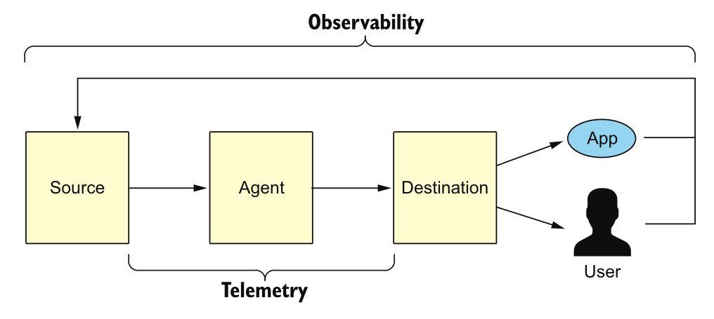
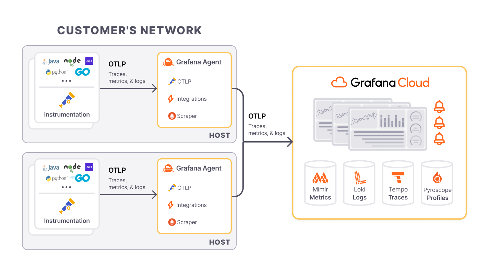
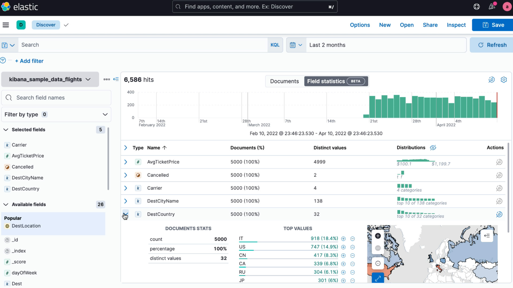

# Observability

While decoupled services are easy to scale and manage, increasing interactions between those services have created a new set of problems. It’s no surprise that debugging was listed as a major challenge in the [annual state of microservices report](https://tsh.io/blog/what-are-microservices-in-2020-key-findings-from-survey-report/).

When your systems are distributed, various things can go wrong. Even if you’ve written the perfect code, a node may fail, a connection may timeout, or participant servers may act arbitrarily. **The bottom line is that things will break**. And when they do, you want to be able to identify and fix the problem as soon as possible before it alters the entire system’s performance, or affects customers or your organization’s reputation. For this reason, we need observability to run today’s services and infrastructure.

People have varying knowledge of what observability means. For some engineers, it’s the old wine of [monitoring](https://iamondemand.com/blog/how-to-properly-monitor-your-k8s-clusters-and-pods/) in a pristine bottle. For others, it’s an umbrella concept that includes log analysis, trace analysis for distributed systems, visualization, and alerts management. Honeycomb, in its [Guide to Achieving Observability](https://www.honeycomb.io/wp-content/uploads/2018/07/Honeycomb-Guide-Achieving-Observability-v1.pdf), defines observability as the ability to ask arbitrary questions about your production environment without having to know beforehand what you wanted to ask. 

Despite the variability in these definitions, they all explain **the overarching goal of observability, which is to achieve better, unprecedented visibility into systems. Observability is a property enabling you to understand what’s happening inside your software, from the outside.** An observable system provides all the information you need in real time to address the day-to-day questions you might have about a system. It also enables you to navigate from effect to cause whenever the system develops a fault.

An effective observability solution may address questions like:

* Why is “y” broken?
* What went wrong during the release of feature “x”?
* Why has system performance degraded over the past few months?
* What did my service look like at point “y”?
* Is this system issue affecting specific users or all of them?

The inherent integrations and nature of distributed systems lead to *layers of distinct ownership* which are sometimes challenging to manage. **By implementing observability across a development environment, you might be able to understand your system’s failure modes and trace issues to their root cause.**

## Pillars of Observability

* **System**: Short for system under observation (SUO). This is the cloud-native platform (and applications running on it) you care about and are responsible for.
* **Signals**: Information observable from the outside of a system. There are different signal types (the most common are logs, metrics, and traces), and they are generated by sources. 
* **Sources**: Part of the infrastructure and application layer, such as a microservice, a device, a database, a message queue, or the operating system. They typically must be instrumented to emit signals. 
* **Agents**: Responsible for signal collection, processing, and routing. 
* **Destinations**: Where you consume signals, for different reasons and use cases. These include visualizations (e.g., dashboards), alerting, long-term storage (for regulatory purposes), and analytics (finding new usages for an app). 
* **Telemetry**: The process of collecting signals from sources, routing or preprocessing via agents, and ingestion to destinations.



## Signals
Observability is a critical concept in modern distributed systems, particularly in microservices architectures, as it enables teams to understand and troubleshoot systems effectively. The three pillars of observability—**metrics**, **logs**, and **traces**—play a vital role in providing insights into the system’s behavior and performance. 


### Metrics
- **Definition**: Metrics are numerical values that capture key performance indicators (KPIs) about your system over time. They are typically aggregated and provide an overview of system health and performance.
- **Characteristics**:
    - **Quantitative Data**: Metrics are quantitative and can be counted or measured (e.g., CPU usage, memory consumption, request latency).
    - **Low Cardinality**: Metrics tend to have low cardinality, meaning they track fewer distinct values compared to logs or traces.
    - **Time-Series Nature**: Metrics are usually collected as time-series data and plotted on dashboards to show trends over time.
- **Types**:
    - **System Metrics**: CPU, memory, disk, and network usage.
    - **Application Metrics**: Request count, error rate, request latency, and throughput.
- **Use Cases**:
    - **Monitoring**: Continuous monitoring of performance indicators like latency, error rates, and resource consumption.
    - **Alerting**: Alerts can be set when metrics exceed predefined thresholds (e.g., high CPU usage or request errors).
    - **Capacity Planning**: Helps in predicting future resource needs based on trends in usage patterns.


| Metric name       | Label key | Label value | Label key   | Label Value | Value at time t0 | .. at t1 |
|-------------------|-----------|-------------|-------------|-------------|------------------|----------|
| heap-memory-bytes | host      | host123     | data-center | c1          | 11231            | 11200    |
| heap-memory-bytes | host      | host234     | data-center | c1          | 300203           | 412103   |

> Table 1 shows two timeseries for one example metric. Their metric names, labels and values for certain timestamps are represented in a tabular view with columns.

#### Cardinality Explosion

**Cardinality** refers to the number of unique combinations of label values (or dimensions) associated with a particular metric. Each unique combination creates a new "time series" that must be stored and tracked over time.

Consider a metric that tracks the latency of API requests. It might have the following labels (dimensions):
- `status_code`: HTTP status code of the request (e.g., 200, 404, 500).
- `endpoint`: The specific API endpoint being accessed (e.g., `/users`, `/orders`).
- `region`: The geographical location of the server (e.g., `us-east-1`, `eu-west-1`).

For each unique combination of these labels, a new time series is created:
- `latency{status_code="200", endpoint="/users", region="us-east-1"}`
- `latency{status_code="404", endpoint="/users", region="us-east-1"}`

If each label can take on many unique values, the number of possible combinations (and hence the number of time series) increases exponentially.


### Logs
- **Definition**: Logs are detailed, unstructured or semi-structured textual records that describe events that occurred in the system. Logs capture the full context of operations and are the most granular observability data.
- **Characteristics**:
    - **Rich Detail**: Logs provide detailed information about the system’s state and operations, often including error messages, stack traces, and debug information.
    - **High Cardinality**: Logs can capture many unique details such as user IDs, IP addresses, and session IDs.
    - **Time-Stamped Events**: Each log entry is typically associated with a timestamp, allowing you to track events in chronological order.
- **Types**:
    - **Application Logs**: Generated by the application itself to capture business logic events, errors, or warnings.
    - **System Logs**: Logs related to the operating system, server errors, or hardware issues.
    - **Security Logs**: Logs capturing access events, login attempts, and authorization failures.
    - **Infrastructure log**: Vital part of infrastructure management, which involves managing the physical and logical equipment that affects an organization's IT foundation.
- **Use Cases**:
    - **Debugging**: Logs are essential for troubleshooting errors and understanding the state of an application at specific points in time.
    - **Auditing**: Logs can be used to track access, changes, and interactions within the system for compliance and security purposes.
    - **Incident Investigation**: In the case of system failure or unexpected behavior, logs provide the information needed to reconstruct the chain of events leading to the issue.

### Traces
- **Definition**: Traces track the path of a request as it moves through various services in a distributed system. They help visualize and analyze how requests propagate across different components.
- **Characteristics**:
    - **Distributed Context**: Traces are particularly valuable in microservices architectures where a request can span multiple services, databases, and external APIs.
    - **Span and Trace IDs**: Traces are composed of spans, which represent a single operation within a service. Each span contains a unique ID, and all spans related to a single request share the same trace ID, allowing you to track the request end-to-end.
    - **End-to-End Latency**: Traces provide visibility into the time taken by each service involved in processing a request.
- **Types**:
    - **Root Span**: The first span in a trace, usually representing the entry point of a request into the system.
    - **Child Spans**: Represent operations in downstream services, each tracked independently but associated with the same trace ID.
- **Use Cases**:
    - **Performance Optimization**: Traces help identify bottlenecks by showing how long each service or component takes to process a request.
    - **Root Cause Analysis**: Tracing allows you to pinpoint which service or component is causing slowdowns or errors.
    - **Dependency Visualization**: Traces give a clear picture of how services interact, making it easier to understand complex dependencies in a microservice architecture.


### Combining Metrics, Logs, and Traces
Although each pillar serves a different purpose, they complement one another to provide full visibility into system health:
- **Metrics** provide the "what" (e.g., high CPU usage or slow response times).
- **Logs** offer the "why" by showing the details of events leading up to or during an issue.
- **Traces** offer the "how" by revealing the flow of requests through different parts of the system, making it possible to locate performance bottlenecks or failures in distributed environments.

By integrating these pillars using observability tools (e.g., Prometheus for metrics, ELK stack for logs, Jaeger for tracing), teams can achieve comprehensive insight into the behavior of their systems, which is essential for effective monitoring, debugging, and optimizing modern software systems.

## Instrumentation cost

Instrumentation in microservices refers to the process of collecting metrics, logs, and traces to monitor, diagnose, and improve performance. Instrumenting microservices involves costs in terms of resource consumption, performance overhead, and engineering effort.

### The B2I (Business Logic to Instrumentation) ratio
To calculate the B2I ratio, determine the number of lines of code (LOC) before adding an instrumentation (adding code for emitting signals for a signal type), and then determine the LOC after the instrumentation. The B2I ratio is then:

> B2I = LOC_AFTER_INSTRUMENTATION / LOC_BEFORE_INSTRUMENTATION

In an ideal world, the B2I ratio would be 1, representing zero instrumentation costs in the code. However, in reality, the more LOC you dedicate to instrumentation, the higher the B2I ratio is. For example, if your code has 3800 LOC and you added 400 LOC for instrumentation (say, to emit logs and metrics), then you’d end up with a B2I ratio of 1.105, from (3800 + 400) / 3800.

### Metrics
Micrometer is a popular metrics collection library in the Spring ecosystem, often used with Prometheus or other monitoring tools. Adding metrics introduces costs in terms of resource usage and infrastructure needs.

```java
import io.micrometer.core.instrument.MeterRegistry;
import io.micrometer.core.instrument.Counter;
import org.springframework.web.bind.annotation.GetMapping;
import org.springframework.web.bind.annotation.RestController;

@RestController
public class ExampleController {

    private final Counter requestCounter;

    public ExampleController(MeterRegistry meterRegistry) {
        this.requestCounter = meterRegistry.counter("http.requests.count");
    }

    @GetMapping("/hello")
    public String hello() {
        requestCounter.increment();  // Increment the metric counter
        return "Hello, World!";
    }
}
```

- **Resource Overhead**: Each request increments a counter. In high-traffic applications, this small overhead accumulates.
- **Infrastructure Costs**: Storing and querying metrics in Prometheus or another monitoring system requires resources, including storage and compute.

### Logs
Logging is essential for debugging and monitoring microservices, but excessive logging can consume storage, network bandwidth, and degrade performance.

```java
import org.slf4j.Logger;
import org.slf4j.LoggerFactory;
import org.springframework.web.bind.annotation.GetMapping;
import org.springframework.web.bind.annotation.RestController;

@RestController
public class LoggingController {

    private static final Logger logger = LoggerFactory.getLogger(LoggingController.class);

    @GetMapping("/data")
    public String fetchData() {
        logger.info("Fetching data...");
        // Simulate data retrieval
        return "Data retrieved!";
    }
}
```

- **Storage Costs**: Logs can grow quickly, especially in microservices architectures where each service generates logs. Storing these logs (e.g., in ELK stack) adds to infrastructure costs.
- **Performance Impact**: Writing logs to disk or sending them to a centralized logging service can introduce latency.

### Traces
Distributed tracing helps in understanding requests flowing through various microservices. It can introduce performance overhead due to the additional tracking, logging, and transmission of trace data.

```java
import io.opentelemetry.api.trace.Span;
import io.opentelemetry.api.trace.Tracer;
import org.springframework.web.bind.annotation.GetMapping;
import org.springframework.web.bind.annotation.RestController;

@RestController
public class TracingController {

    private final Tracer tracer;

    public TracingController(Tracer tracer) {
        this.tracer = tracer;
    }

    @GetMapping("/process")
    public String processRequest() {
        Span span = tracer.spanBuilder("processRequest").startSpan();  // Start tracing span
        try {
            // Simulate some business logic
            Thread.sleep(500);
            return "Processed";
        } catch (InterruptedException e) {
            span.recordException(e);
            return "Failed";
        } finally {
            span.end();  // End the span
        }
    }
}
```

- **Performance Overhead**: Tracing adds latency to each request as spans are created, propagated, and sent to a tracing backend (e.g., Jaeger, Zipkin).
- **Operational Costs**: Setting up and maintaining tracing infrastructure requires additional resources, especially for high-volume traffic and complex distributed systems.


## Sources
We categorize sources using a simple and widely used trichotomy: **compute**, **storage**, and **network**. By categorizing observability into compute, storage, and network, you can better understand where issues arise, how they propagate through the system, and what steps to take to maintain the health and performance of distributed microservice architectures.


### Compute
This refers to the actual runtime environments where code executes, and it covers virtual machines, containers, serverless functions, and other compute units. Observability in this area focuses on gathering data related to the performance, resource usage, and health of the compute environments.

**Key Observability Data:**
  - **CPU**: Tracking how much CPU is consumed by a microservice, container, or VM. Spikes or high sustained CPU usage can indicate inefficient code, overloaded instances, or performance bottlenecks.
  - **Memory**: Monitoring memory usage and checking for memory leaks or inefficient memory management.
  - **Disk I/O**: Observing read/write operations to detect bottlenecks in services that handle large data transfers.

**Compute-Specific Metrics:**
- **Container-level metrics**: For instance, Docker and Kubernetes expose metrics such as container CPU, memory, and disk I/O, which are crucial for performance tuning and resource scaling.
- **Function invocation times (serverless)**: For AWS Lambda or Google Cloud Functions, the focus is on execution time, cold start duration, and memory usage per function execution.

### Storage
This category includes all components responsible for persisting and managing data. Observability in storage focuses on the health, performance, and availability of databases, file systems, and object stores.

**Key Observability Data:**
- **Query Performance**: For relational databases (e.g., PostgreSQL, MySQL), tracking slow queries, lock contention, and transaction times provides insights into bottlenecks that affect application performance.
- **Latency**: For NoSQL stores like Redis and DynamoDB, latency of read and write operations is critical to maintaining the performance of high-throughput systems.
- **Capacity and Availability**: Monitoring disk space and usage trends ensures that storage does not run out of capacity unexpectedly, while availability metrics (uptime/downtime) ensure that storage systems are accessible when needed.

**Storage-Specific Metrics:**
- **DB Metrics**: Queries per second (QPS), read/write latency, connection pool size, and transaction rollback rates.
- **Object Storage Metrics**: S3 provides metrics like `GetObject` latency and `PutObject` success/failure rates.

### Network
Networking is crucial in distributed systems, as microservices rely heavily on network communication. Observability here focuses on monitoring the flow of data across different services, ensuring that connectivity, throughput, and latency are within acceptable limits.

**Key Observability Data:**
- **Throughput**: Measuring how much data is being transferred between services. Network bottlenecks can indicate issues with data flow or congestion.
- **Latency**: Tracking round-trip times between services and clients. Latency spikes often highlight performance degradation in a service-to-service interaction.
- **Error Rates**: High rates of packet loss, failed connections, or dropped messages can signal issues with the underlying network infrastructure or service health.

**Network-Specific Metrics:**
- **API Gateway Metrics**: For APIs, metrics like request/response latency, success/failure rates, and throttled requests give insights into network performance.
- **Load Balancer Metrics**: Load balancers like AWS ELB expose metrics such as `RequestCount`, `HTTPCode_ELB_5XX_Count` (errors), and `Latency`.
- **Network Traffic**: Monitoring data transfer rates, packet loss, or bandwidth usage helps in understanding network capacity and diagnosing bottlenecks.

### Extended Considerations for Observability Sources:
- **Granularity**: For each of these categories, observability can be applied at different granularities. For example, at the compute level, you can track metrics at the VM level, container level, or process level, depending on the level of detail required.

- **Correlation**: Effective observability often involves correlating data from these three sources. For instance, high latency in the network may coincide with increased CPU usage on the compute side, or a database experiencing long-running queries could cause cascading slowdowns across the network.

- **Security Implications**: Network observability also contributes to security monitoring. Tools that inspect network traffic or audit logs can detect unauthorized access, anomalies, or data exfiltration attempts.


## Agents

### Log Routers


**Log routers** are a critical component in modern observability and logging infrastructures, responsible for collecting, processing, and routing log data from various sources to one or more destinations. They provide:

- **Centralized Log Management**: By aggregating logs from many sources into a single pipeline, log routers make it easier to manage and analyze logs.
- **Scalability**: Log routers can handle the high volumes of log data generated by cloud-native applications, especially in environments where services are rapidly scaled up or down.
- **Customizable Workflows**: Routing logs to different destinations based on their content (e.g., error logs to monitoring systems, audit logs to archival storage) improves the efficiency of log management and reduces noise.
- **Cost Efficiency**: Filtering out unnecessary logs, or sending logs to cheaper storage solutions (e.g., cloud storage for archival) helps reduce storage costs, especially for large systems with high log throughput.

#### Key Features
1. **Log Aggregation**: Log routers collect logs from multiple sources, such as applications, containers, virtual machines, and operating systems, consolidating them into a single stream. This eliminates the need for developers and operations teams to manually track logs from each service or server.

2. **Log Transformation**: Logs are often produced in different formats (e.g., JSON, text, syslog). A log router can transform logs into a standardized format, making it easier to analyze and process them downstream. This might include parsing fields, enriching logs with additional context, or formatting them for easier querying.

3. **Routing and Filtering**: Log routers direct logs to different destinations based on customizable rules. For example, error logs can be sent to one destination for immediate alerting, while debug logs might be routed to a different storage system for later analysis. Routers can filter out unnecessary or irrelevant logs, reducing storage costs and improving performance.

4. **Buffering and Reliability**: Log routers often implement buffering mechanisms to temporarily hold logs if the destination (such as a log storage system) becomes unavailable or experiences downtime. This ensures that logs are not lost and can be sent once the destination is back online.

5. **Destination Flexibility**: A key benefit of log routers is their ability to send logs to multiple destinations simultaneously. For example, logs can be routed to a centralized logging platform (like Elasticsearch or Splunk) for search and analysis, to cloud storage (e.g., Amazon S3) for archival, and to a monitoring system for alerting.

#### Common Destinations
- **Log Storage and Indexing**: Elasticsearch, Splunk, or Logstash for fast querying and analysis.
- **Cloud Storage**: Amazon S3, Google Cloud Storage for long-term log retention and compliance.
- **Monitoring and Alerting Systems**: Grafana, Kibana, or other observability platforms to visualize and alert based on log data.
- **Message Queues**: Kafka or RabbitMQ to store and stream logs for real-time processing pipelines.

#### Popular Log Routers
* **Fluentd**: An open-source log router that supports a wide range of input/output plugins for log collection, transformation, and routing.
* **Fluent Bit**: A lightweight version of Fluentd, optimized for environments where resources (memory, CPU) are constrained.
* **Logstash**: Part of the Elastic Stack (Elasticsearch, Logstash, Kibana), Logstash is designed to process and route logs to Elasticsearch.
* **Vector**: A newer log router that emphasizes performance and efficiency, written in Rust. Vector is designed to handle large-scale log processing with minimal resource usage.


### Metrics Routers


Prometheus is an open-source, time-series database and monitoring system widely used for collecting and querying **metrics**. It was originally developed by SoundCloud and is now part of the Cloud Native Computing Foundation (CNCF). Prometheus is particularly well-suited for microservices architectures and cloud-native environments due to its simplicity, scalability, and ability to monitor a wide range of system and application-level metrics.

#### Key Features
- **Pull-Based Model**: Prometheus uses a pull-based model to scrape metrics from various targets at predefined intervals. Each target exposes an HTTP endpoint (e.g., `/metrics`) that Prometheus queries.
- **Multi-Dimensional Data Model**: Prometheus organizes data into time-series, each identified by a unique set of key-value pairs (labels). This allows for highly flexible querying and aggregation of metrics.
- **Powerful Query Language (PromQL)**: Prometheus offers PromQL, a powerful query language for filtering, aggregating, and transforming metrics. It allows users to define complex queries for dashboards and alerts.
- **Service Discovery**: Prometheus can automatically discover and monitor new services in dynamic environments like Kubernetes using built-in service discovery mechanisms.

#### Common Metrics
- **System Metrics**: CPU usage, memory consumption, disk I/O, and network traffic from nodes, VMs, or containers.
- **Application Metrics**: Request rates (QPS), latency, error rates, and throughput from microservices.
- **Custom Business Metrics**: Metrics that represent business-related events, such as the number of orders processed or users logged in.


### OpenTelemetry Collector (Universal Telemetry Agent)


The **OpenTelemetry collector** is a versatile, open-source tool designed to collect, process, and export telemetry data, including **logs**, **metrics**, and **traces**. It is part of the OpenTelemetry project, which aims to provide a unified standard for observability across distributed systems.

#### Key Features
- **Unified Data Collection**: The collector supports receiving telemetry data from different sources (metrics, logs, traces) and exporting them to various backends, making it a single agent that replaces multiple specialized agents.
- **Extensible Pipeline**: The collector follows a pipeline architecture consisting of **receivers**, **processors**, and **exporters**:
  - **Receivers**: Ingest telemetry data from various sources (e.g., Jaeger, Prometheus, Fluentd).
  - **Processors**: Enrich, filter, batch, or transform data before exporting.
  - **Exporters**: Send the processed data to backends like Prometheus, Elasticsearch, Grafana, or third-party observability platforms (Datadog, New Relic).

- **Vendor-Neutral**: OpenTelemetry aims to standardize how telemetry is collected, providing flexibility and portability. The collector allows you to change backends (e.g., from Prometheus to AWS CloudWatch) without modifying your application code.

- **Scalability and Flexibility**: The collector can be deployed as an agent (running locally alongside applications) or as a central service that aggregates telemetry from multiple agents across the infrastructure.

#### How OpenTelemetry Collector Works
1. **Instrumentation**: Application code is instrumented to produce telemetry data (logs, metrics, traces) using OpenTelemetry SDKs. The data is sent to the OpenTelemetry collector.
2. **Data Ingestion**: The collector ingests telemetry data via receivers (e.g., metrics from Prometheus, traces from Jaeger, logs from Fluentd).
3. **Processing**: The collector processes the telemetry (e.g., filtering sensitive data, batching traces for efficient export).
4. **Data Export**: The processed telemetry is sent to different backends (e.g., Prometheus for metrics, Elasticsearch for logs, Jaeger for traces).

#### Benefits of Using OpenTelemetry Collector
- **Consolidation**: The collector replaces multiple agents (one for logs, one for metrics, and another for traces) with a single, unified telemetry agent.
- **Cross-Language Support**: OpenTelemetry works across multiple programming languages, enabling a consistent observability strategy across diverse environments.
- **Flexibility in Exporting**: You can easily switch observability backends without reconfiguring or redeploying applications.


## Destinations (backend)

Observability backends play a critical role in monitoring and analyzing the performance of modern applications and infrastructure. Tools like **Grafana Loki**, **Elasticsearch**, and **OpenSearch** provide various functionalities for managing logs, metrics, and other telemetry data. Below is an elaboration on each of these observability backends:

### Grafana Backend Ecosystem



The **Grafana Ecosystem** is a comprehensive, open-source observability stack developed by Grafana Labs, consisting of powerful tools designed to work together for monitoring and troubleshooting modern distributed systems. At the core is **Grafana**, a versatile visualization and dashboarding platform that integrates seamlessly with other observability tools like **Loki**, **Tempo**, and **Mimir**.
* **Grafana Loki** is a log aggregation system that efficiently indexes and stores logs using a label-based system, making it easy to correlate logs with metrics and traces.
* **Grafana Tempo** provides distributed tracing capabilities, enabling users to track and visualize how requests flow through complex microservices architectures without requiring expensive trace indexing. 
* **Grafana Mimir** is a highly scalable time-series database, optimized for storing and querying massive volumes of metrics, fully compatible with Prometheus. Together, these tools offer a unified observability solution, allowing users to analyze metrics, logs, and traces in one place, simplifying root cause analysis, and improving overall system visibility and performance.

### Elasticsearch/OpenSearch

Elasticsearch is a distributed search and analytics engine that is a core component of the Elastic Stack (ELK Stack: Elasticsearch, Logstash, Kibana). It is widely used for log analysis, full-text search, and real-time data analytics.

Key Features:
- **Full-Text Search**: Elasticsearch provides advanced search capabilities, including support for complex queries, relevance scoring, and full-text search.
- **Distributed Architecture**: It is designed to scale horizontally, allowing users to handle large volumes of data across multiple nodes.
- **RESTful API**: Elasticsearch can be accessed through a RESTful API, making it easy to integrate with other applications and services.
- **Powerful Aggregations**: Users can perform complex aggregations to analyze and summarize their data, enabling insights into log patterns and trends.
- **Rich Ecosystem**: Integrates well with other components of the Elastic Stack (Logstash for data ingestion, Kibana for visualization) for comprehensive observability.

## Destinations (frontend)
Observability frontends are essential tools for visualizing and interacting with telemetry data, enabling teams to monitor system performance, analyze metrics, and troubleshoot issues effectively. **Grafana** and **Kibana** are two of the most widely used observability frontends, each offering distinct features tailored to different use cases. Below is a detailed exploration of both platforms:

### Grafana


Grafana is an open-source analytics and monitoring platform designed for visualizing time-series data from various sources. It is known for its powerful dashboarding capabilities and flexibility in integrating with numerous data sources.

Key Features:
1. **Dashboarding**:
  - Users can create highly customizable dashboards to visualize metrics, logs, and events.
  - Supports a wide range of visualization types, including graphs, tables, heatmaps, and geomaps.

2. **Data Source Integration**:
  - Grafana can connect to multiple data sources, such as Prometheus, InfluxDB, Graphite, Elasticsearch, and many others.
  - Each data source can be queried and visualized using Grafana's query editor.

3. **Alerting**:
  - Built-in alerting functionality allows users to set thresholds for metrics and receive notifications via email, Slack, PagerDuty, etc.
  - Alerts can be based on the state of data points, ensuring proactive monitoring.

4. **Annotations**:
  - Users can add context to their graphs with annotations to mark significant events, deployments, or incidents.
  - This feature helps correlate metrics with events, making it easier to identify causes of anomalies.

5. **Plugin Ecosystem**:
  - Grafana has a rich ecosystem of plugins that extend its capabilities, including additional visualizations, data sources, and applications.
  - Community and official plugins allow for greater flexibility and customization.

6. **Templating**:
  - Templating allows users to create dynamic dashboards that can change based on selected parameters, such as hostnames or regions.
  - This feature enhances the interactivity and reusability of dashboards.

7. **User Management**:
  - Grafana provides role-based access control (RBAC) to manage user permissions and access to dashboards.
  - This feature ensures secure collaboration among team members.


### Kibana




Kibana is an open-source analytics and visualization platform specifically designed for use with Elasticsearch. It is a key component of the Elastic Stack (often referred to as ELK Stack: Elasticsearch, Logstash, Kibana), focusing on log data and search analytics.

Key Features:
1. **Real-time Search and Analysis**:
  - Kibana allows users to search and analyze log data stored in Elasticsearch in real-time.
  - Provides a powerful query language for complex searches and filtering.

2. **Data Visualizations**:
  - Users can create various visualizations (e.g., bar charts, line graphs, pie charts) based on their log data and metrics.
  - Supports aggregations and statistical analysis to derive insights from the data.

3. **Dashboard Creation**:
  - Users can build dashboards that combine multiple visualizations, allowing for comprehensive monitoring of data.
  - Dashboards can be customized with various layout options and styles.

4. **Discover Feature**:
  - The Discover interface allows users to explore and query their data interactively, making it easy to identify patterns or anomalies.
  - Users can view raw log entries alongside visualizations for in-depth analysis.

5. **Timelion**:
  - A powerful feature within Kibana for time-series data analysis that allows users to create visualizations using a simple expression language.
  - Timelion is beneficial for tracking changes in metrics over time.

6. **Machine Learning**:
  - Kibana provides machine learning capabilities for anomaly detection and forecasting, helping users identify unusual patterns in their data.
  - Users can set up jobs to automatically analyze data and trigger alerts based on findings.

7. **Security Features**:
  - Kibana integrates with the Elastic Stack's security features, allowing for role-based access control and user authentication.
  - Provides features for monitoring and auditing user activities within the application.


## Destinations (all-in-one)
All-in-one observability backends combine various aspects of observability, such as metrics, logs, and traces, into a single platform, simplifying monitoring and analysis for modern applications. Tools like **Jaeger**, **Zipkin**, and **Signoz** offer integrated solutions that facilitate observability across microservices architectures and help teams diagnose issues effectively.

### Jaeger


Jaeger is an open-source end-to-end distributed tracing system originally developed by Uber Technologies. It is designed for monitoring and troubleshooting the performance of microservices-based architectures.

Key Features:
- **Distributed Context Propagation**: Jaeger tracks requests as they propagate through multiple services, providing visibility into the interactions between them.
- **Latency Analysis**: Users can analyze the timing of requests, helping to identify performance bottlenecks and optimize service interactions.
- **Root Cause Analysis**: It assists in pinpointing the root causes of performance issues by visualizing the path and duration of requests across services.
- **Service Dependency Graphs**: Jaeger generates visual representations of service dependencies, helping teams understand the architecture and relationships between services.
- **Adaptive Sampling**: Supports adaptive sampling strategies to balance data granularity and the volume of traces collected, thus managing storage and processing overhead.


### Zipkin


Zipkin is another open-source distributed tracing system designed to help gather timing data needed to troubleshoot latency problems in microservices. Like Jaeger, it helps visualize the flow of requests across services.

Key Features:
- **Distributed Context Propagation**: Similar to Jaeger, Zipkin collects tracing information as requests traverse multiple services, providing a complete view of the request lifecycle.
- **Latency Analysis**: Offers detailed latency analysis by showing how long requests take at each step in the call chain.
- **Dependency Analysis**: Generates service dependency graphs, helping teams visualize the relationships between services.
- **User Interface**: Provides a simple web-based UI for visualizing traces, including features for searching and filtering by tags or service names.
- **Storage Options**: Supports various storage backends, such as MySQL, Cassandra, and Elasticsearch, allowing teams to choose their preferred data storage solution.


### Signoz


Signoz is an open-source observability platform that provides an all-in-one solution for monitoring applications, focusing on collecting, storing, and visualizing logs, metrics, and traces in a unified interface.

Key Features:
- **Unified Observability**: Signoz integrates logs, metrics, and traces into a single platform (OpenTelemetry), enabling users to correlate data across different observability signals.
- **Rich User Interface**: Provides a user-friendly interface for building dashboards, querying data, and visualizing metrics and traces.
- **Performance Monitoring**: Monitors application performance and provides insights into latency, error rates, and other critical metrics.
- **Alerting**: Supports alerting based on specific conditions, allowing teams to proactively address issues before they impact users.

## Resources
- Cloud Observability in Action, Hausenblas