# Observability

When systems are distributed, **failures are inevitable**. The key is being able to detect and resolve issues **quickly**, before they impact overall performance or damage your organization’s reputation.

Observability is interpreted differently across the industry:

* Some engineers see it as simply [monitoring](https://iamondemand.com/blog/how-to-properly-monitor-your-k8s-clusters-and-pods/) in a fancier package.
* Honeycomb, in its [Guide to Achieving Observability](https://www.honeycomb.io/wp-content/uploads/2018/07/Honeycomb-Guide-Achieving-Observability-v1.pdf), defines it as the ability to **ask arbitrary questions about your production environment**.

Regardless of the definition, **observability’s ultimate goal is visibility into your system**:

* It allows you to understand what’s happening **inside your software from the outside**.
* It equips you with the data needed to answer everyday operational questions and to **trace failures to their root causes**.

An effective observability strategy answers questions like:

* Why is service “y” failing?
* What went wrong during the deployment of feature “x”?
* Why has system performance degraded recently?
* What was the state of my service at time “y”?
* Is the issue affecting all users or only a subset?

## SLI-SLO & Observability

Observability is not just about **what happens**, but also about **how well the system meets expectations**.

* **SLI (Service-Level Indicator)** – A quantitative measure of system health.
  * Percentage of HTTP requests with latency < 500ms.
  * Error rate for payment transactions.

* **SLO (Service-Level Objective)** – The target goal for an SLI.
  * 99.9% of requests must meet the latency target.
  * Payment transaction success rate must remain above 99.5%.


## Security & Observability

Observability can enhance **security monitoring** in distributed systems.

* **Anomaly Detection** - Detect suspicious access patterns or unexpected spikes in traffic.
* **Audit Trails** - Track access, changes, and critical operations in centralized logs.
* **Security Alerts** - Trigger immediate notifications for unusual behaviors, such as repeated failed logins or privilege escalations.


## Pillars of Observability

* **Sources**: Part of the infrastructure and application layer, such as a microservice, a device, a database, a message queue, or the operating system. They typically must be instrumented to emit signals.
* **Signals**: Information emitted by sources. There are different signal types, the most common are:
  * logs
  * metrics
  * traces
* **Agents**: Responsible for signal collection, processing, and routing. 
* **Destinations**: Where you consume signals, for different reasons and use cases. These include:
  * visualizations (e.g., dashboards)
  * alerting
  * long-term storage (for regulatory purposes)
  * analytics (finding new usages for an app)
* **Telemetry**: The process of collecting signals from sources, routing or preprocessing via agents, and ingestion to destinations.

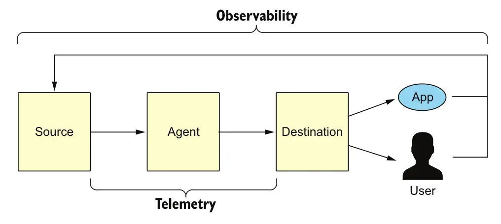

## Sources
We categorize sources using a simple and widely used trichotomy: **compute**, **storage**, and **network**. This broad categorization helps understand where issues arise, how they propagate through the system, and what steps to take to maintain health of distributed architectures.

| **Category** | **Description**                                                                                          | **Specific Metrics**                                                                                                                                                                                                                                                                     |
| ------------ | -------------------------------------------------------------------------------------------------------- | ---------------------------------------------------------------------------------------------------------------------------------------------------------------------------------------------------------------------------------------------------------------------------------------- |
| **Compute**  | The environments where code runs, including virtual machines, containers, and serverless functions.      | - **Container-level metrics**: CPU usage, memory utilization, and resource limits from Docker/Kubernetes.<br>- **Function metrics**: Execution time, cold start duration, and memory consumption for serverless functions (e.g., AWS Lambda, Google Cloud Functions).                    |
| **Storage**  | Systems that persist and manage data, such as databases, file systems, and object storage.               | - **Database metrics**: Queries per second (QPS), read/write latency, connection pool utilization, rollback/error rates.<br>- **Object storage metrics**: S3 `GetObject` and `PutObject` latency, success/failure rates, storage throughput.                                             |
| **Network**  | Components that enable communication between services, monitoring connectivity, latency, and throughput. | - **API Gateway metrics**: Request/response latency, success/failure rates, throttled requests.<br>- **Load Balancer metrics**: Request count, 5xx error rates (`HTTPCode_ELB_5XX_Count`), latency.<br>- **Network traffic metrics**: Bandwidth usage, packet loss, data transfer rates. |


## Signals
The three pillars of observability—**metrics**, **logs**, and **traces**—play a vital role in providing insights into the system’s behavior and performance. 


## Metrics

Metrics are numerical values that capture key performance indicators (KPIs) about your system over time. They are typically aggregated and provide an overview of system health and performance.

* **Quantitative Data**: Metrics are quantitative and can be counted or measured (e.g., CPU, memory, disk, threads, latency, etc.).
* **Time-Series Nature**: Metrics are usually collected as time-series data and plotted on dashboards to show trends over time.

**Types**:

* **Counter** – A monotonically increasing value that resets only on restart. It is used for counting occurrences, such as the number of HTTP requests or errors.
* **Gauge** – A value that can increase or decrease, used for measuring things like memory usage or temperature.
* **Histogram** – A metric that samples observations and counts them in configurable buckets, used for tracking request durations or response sizes. It also provides a total count and sum of values.

**Labels**:
Metrics often include **labels** (also called tags or dimensions) to add additional context. Labels are key-value pairs that allow you to break down metrics by categories such as service, endpoint, status code, region, or instance. For example:

```
http_requests_total{method="GET", endpoint="/api/users", status="200", region="eu-west-1"}
```

Here, `http_requests_total` is the metric name, and the labels provide context about the request method, endpoint, HTTP status, and geographic region. Labels make it easier to filter, aggregate, and slice metrics in dashboards and alerts.

```text
http://localhost:8080/actuator/prometheus

# HELP http_server_requests_seconds  
# TYPE http_server_requests_seconds summary
http_server_requests_seconds_count{error="none",exception="none",method="GET",outcome="SUCCESS",status="200",uri="/actuator"} 1
http_server_requests_seconds_sum{error="none",exception="none",method="GET",outcome="SUCCESS",status="200",uri="/actuator"} 0.01236351
http_server_requests_seconds_count{error="none",exception="none",method="GET",outcome="SUCCESS",status="200",uri="/actuator/health"} 4
http_server_requests_seconds_sum{error="none",exception="none",method="GET",outcome="SUCCESS",status="200",uri="/actuator/health"} 0.016967813
http_server_requests_seconds_count{error="none",exception="none",method="GET",outcome="SUCCESS",status="200",uri="/actuator/prometheus"} 10
http_server_requests_seconds_sum{error="none",exception="none",method="GET",outcome="SUCCESS",status="200",uri="/actuator/prometheus"} 0.14632263
```

> ### `http_server_requests_seconds_count`
>
> * **Counts** the number of HTTP requests served with these characteristics (GET, endpoint `/actuator`, status 200, no error).
> * **Value**: `1` → 1 request served.
>
> ### `http_server_requests_seconds_sum`
>
> * **Total time** spent serving the same requests, in seconds.
> * **Value**: `0.01236351` → ~12 ms total.
>
> **Average time per request** ≈ `_sum / _count` = 0.01236 s (~12 ms).


**Cardinality Explosion**:

**Cardinality** refers to the number of unique combinations of label values (or dimensions) associated with a particular metric. Each unique combination creates a time series that must be stored and tracked over time.

Consider a metric that tracks the latency of API requests. It might have the following labels (dimensions):
- `endpoint`: The specific API endpoint being accessed (e.g., `/users`, `/orders`).
- `nodeid`: The id of the server (e.g., `node-567`, `node-343`).
- `region`: The geographical location of the server (e.g., `us-east-1`, `eu-west-1`).

For each unique combination of these labels, a new time series is created:

| **endpoint**  | **nodeid**   | **region**     | **Latency (ms) - T1** | **Latency (ms) - T2** |  
|--------------|-------------|---------------|----------------|----------------|  
| `/users`     | `node-567`  | `us-east-1`   | 120            | 130            |  
| `/users`     | `node-343`  | `us-east-1`   | 135            | 140            |  
| `/orders`    | `node-567`  | `us-east-1`   | 200            | 210            |  
| `/orders`    | `node-343`  | `us-east-1`   | 220            | 225            |  
| `/users`     | `node-567`  | `eu-west-1`   | 180            | 185            |  
| `/orders`    | `node-567`  | `eu-west-1`   | 190            | 195            |  

If we have **1,000 endpoints** running on **100 nodes** distributed across **3 regions**, we could end up collecting **300,000 time series** at each time step.

If we were to replace `nodeid` with `user_id`, the number of unique label combinations would **skyrocket**, potentially overwhelming the monitoring system.

### Prometheus

[Prometheus](https://prometheus.io/) is an open-source monitoring and alerting toolkit widely used for recording real-time metrics and generating alerts. Prometheus was developed at [SoundCloud](https://soundcloud.com/) in 2012 and later became a standalone project under the umbrella of the [Cloud Native Computing Foundation](https://www.cncf.io/).

- **Service Discovery**: Automatically detects and scrapes targets using mechanisms like Kubernetes, Eureka, etc.
- **Scraping Metrics**: Collects data from targets (applications, services, systems) via HTTP at set intervals.
- **Query Language**: Provides **PromQL** for querying and analyzing time-series data.

```
# the total cumulative time spent handling HTTP server requests, measured in seconds.
http_server_request_duration_seconds_sum
rate(http_server_request_duration_seconds_sum[1m])
``` 
       
- **Alerting**: Supports rule-based alerts, sending notifications.

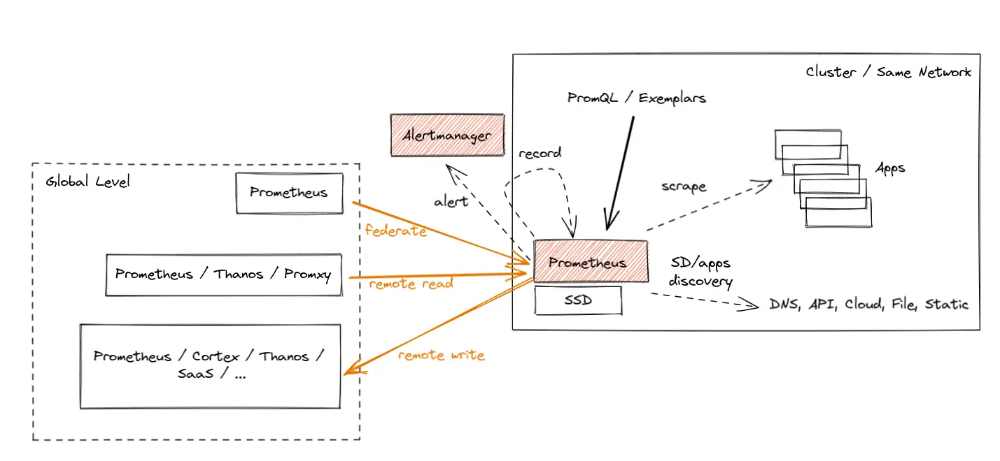

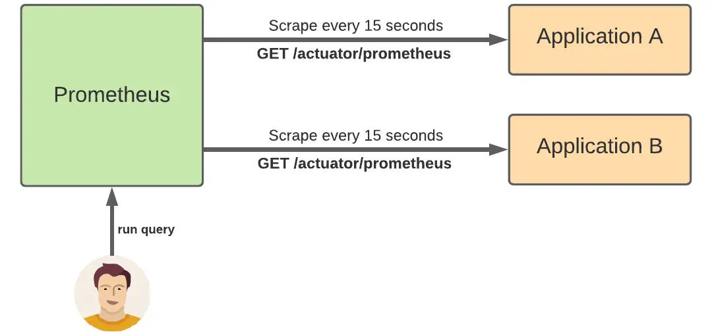

- **Client Libraries**: Enable applications to expose custom metrics using libraries for Go, Java, Python, and more.
- **Prometheus Server**: Core component that collects, stores, and queries metrics.
- **Data Storage**: Uses a built-in time-series database (TSDB) for efficient metric storage and retrieval.
- **Alertmanager**: Manages, deduplicates, and routes alerts to notification channels.


### Prometheus Problem

Prometheus alone is excellent for local monitoring and collecting metrics from single applications or clusters, but it has some limitations:

* **Limited vertical scalability**

  * A single Prometheus instance has limits on how much data it can write and read simultaneously.
* **Limited data retention**

  * Prometheus stores data locally in its TSDB, usually keeping metrics for only a few weeks.
* **Multi-cluster or multi-data center monitoring**

  * Prometheus is “single-node” per cluster; if you want to aggregate metrics from multiple clusters or regions, you need to run separate queries.

Thus, several projects have emerged to extend Prometheus capabilities:

* **Global View**: Aggregate metrics from multiple Prometheus instances, providing a unified and centralized query interface.
* **Long-Term Storage**: Offload Prometheus TSDB data to object storage systems (e.g., S3, GCS, Azure Blob), enabling virtually unlimited data retention.
* **High Availability**: Support replicated Prometheus instances with built-in deduplication mechanisms to prevent double-counting of metrics.


### Thanos

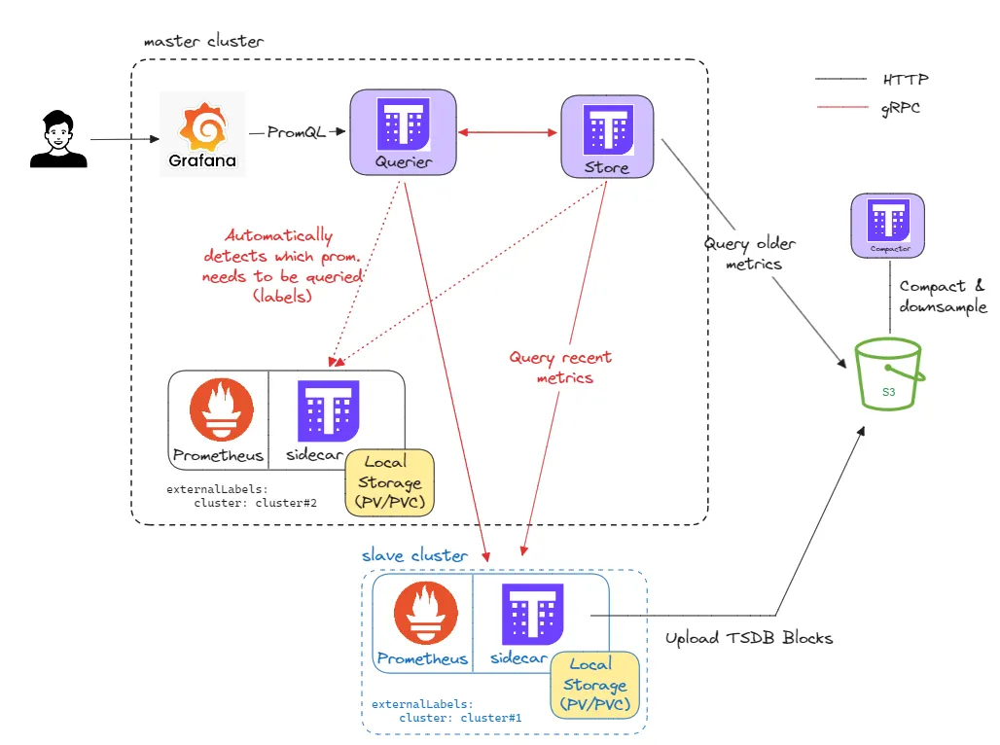

* **Prometheus** feeds real-time metrics into the **Thanos Sidecar**. It also persists the data in Persistent Volume for a minimum of 6 hours.
* The **Thanos Sidecar** uploads metrics to Object Storage every 2 hours (default) and allows Thanos Query to access real-time data.
* **Thanos Store** fetches historical data from Object Storage for querying.
* **Thanos Query** aggregates data from Thanos Sidecar, Thanos Store, and potentially other query nodes to provide a unified querying interface.
* **Thanos Compactor** optimizes data in Object Storage to improve query performance.

**Architecture Highlights**: Uses **consistent hashing** to distribute data across store gateways and a **replication factor** to maintain multiple copies of each block. Queries are routed intelligently to only the nodes storing relevant blocks.


---

### Cortex

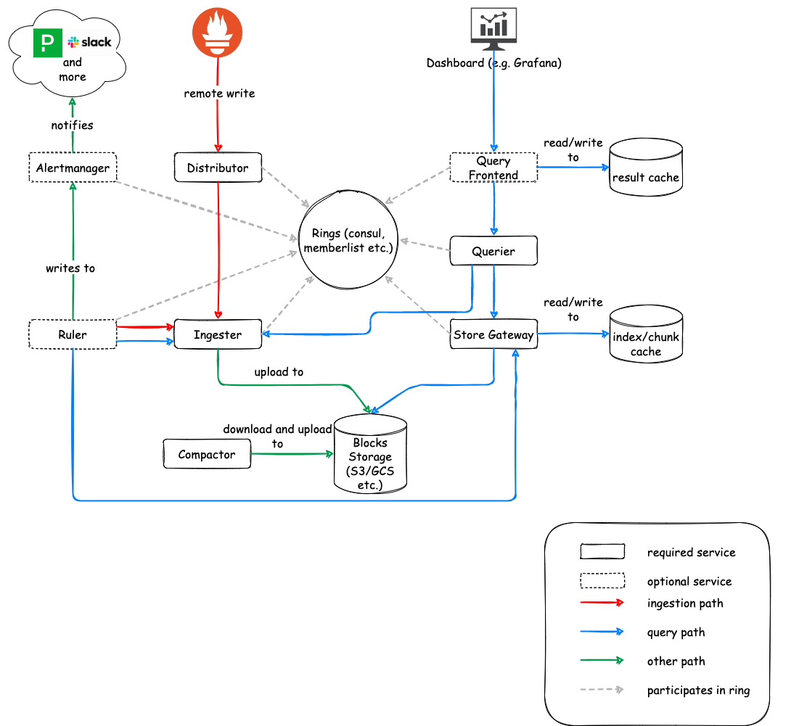

* **Distributor**: Receives incoming metrics, replicates them, and writes them to the correct ingesters.
* **Ingester**: Stores incoming metrics temporarily in-memory and flushes them to long-term storage.
* **Querier**: Handles read requests, fetching from ingesters and object storage.
* **Table Manager**: Manages long-term storage schemas (for DynamoDB/Cassandra).
* **Alertmanager**: Integrated or separate for alert handling.

**Architecture Highlights**: Uses **horizontal scaling** and **sharding via consistent hashing** to ensure load balancing. Queries intelligently target only the nodes containing the relevant time-series data.


## Logs
Logs are detailed, unstructured or semi-structured textual records that describe events that occurred in the system. Logs capture the full context of operations and are the most granular observability data.

- **Rich Detail**: Logs provide detailed information about the system’s state and operations, often including error messages, stack traces, and debug information.
- **Time-Stamped Events**: Each log entry is typically associated with a timestamp, allowing you to track events in chronological order.

**Use Cases**:
  - **Debugging**: Logs are essential for troubleshooting errors and understanding the state of an application at specific points in time.
  - **Auditing**: Logs can be used to track access, changes, and interactions within the system for compliance and security purposes.
  - **Incident Investigation**: In the case of system failure or unexpected behavior, logs provide the information needed to reconstruct the chain of events leading to the issue.

```
[INFO] 2024-10-19 10:15:03 - Service 'OrderService' started successfully on port 8080.
[ERROR] 2024-10-19 10:16:25 - Failed to connect to the database. Error: ConnectionTimeoutException: Database not reachable at db-host:5432.
[WARN] 2024-10-19 10:18:45 - Memory usage is above the threshold (90%). Current usage: 95%.
[DEBUG] 2024-10-19 10:19:07 - Processing request for user ID 12345. Request payload: { "orderId": "9876", "product": "Laptop", "quantity": 2 }.
[TRACE] 2024-10-19 10:19:12 - Sending HTTP request to PaymentService. Endpoint: /api/payment. CorrelationId: abcd-1234-efgh-5678.
```

### ELK Stack

The [ELK stack](www.elastic.co/elastic-stack) is a popular set of tools used for managing and analyzing large volumes of data, particularly logs.

- **Centralized Logging**: The ELK stack allows organizations to centralize logs from multiple sources, making it easier to manage and analyze log data.
- **Flexible Visualization**: Kibana’s visualization tools help users present data in various formats, enabling better decision-making based on insights derived from the data.
- **Scalability**: The distributed nature of Elasticsearch allows the ELK stack to scale with the growth of data, making it suitable for small to large enterprises.

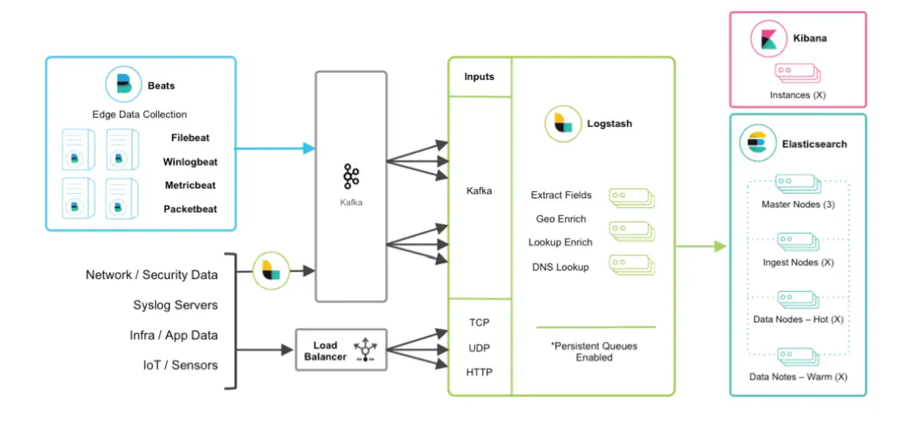

[Logstash](https://www.elastic.co/logstash) is a data pipeline that collects, transforms, and routes logs and events to destinations like Elasticsearch. It supports **multiple input sources** (e.g., files, Kafka), **filter plugins** for data processing (e.g., parsing, enrichment), and **output plugins** to forward processed data. 

[Elasticsearch](https://www.elastic.co/elasticsearch) is a distributed search and analytics engine built on Apache Lucene, enabling real-time data indexing, searching, and analysis. As the core of the ELK stack, it scales horizontally using **sharded architecture**, ensuring fault tolerance and high availability. It provides a **RESTful API** for easy integration and supports **JSON-based indexing**, allowing fast full-text searches and aggregations.

[Kibana](https://www.elastic.co/kibana) is a **visualization and analytics tool** for exploring Elasticsearch data. It allows users to create **interactive dashboards** with charts and graphs, apply **search and filtering**, and monitor logs, metrics, and traces. 

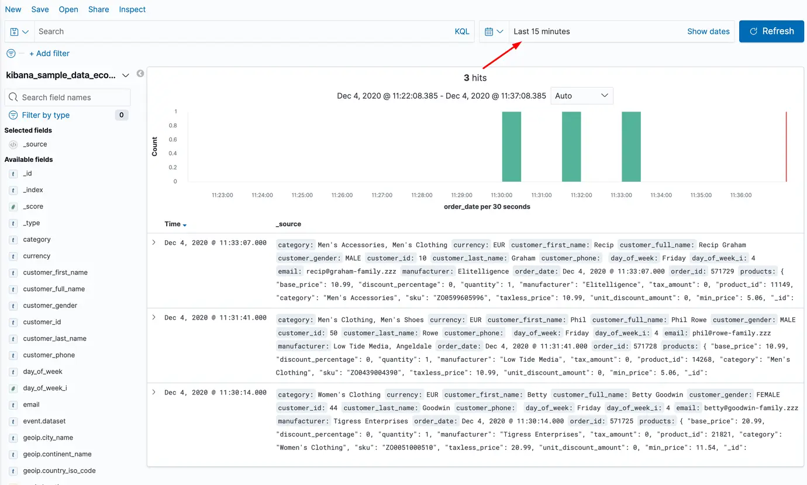


## Traces
Traces track the path of a request as it moves through various services in a distributed system. They help visualize how requests propagate across different components (a sort of distributed [stack trace](https://en.wikipedia.org/wiki/Stack_trace)).

- **Span and Trace IDs**: Traces are composed of spans, which represent a single operation within a service. Each span contains a unique ID, and all spans related to a single request share the same trace ID.
- **End-to-End Latency**: Traces provide visibility into the time taken by each service involved in processing a request.

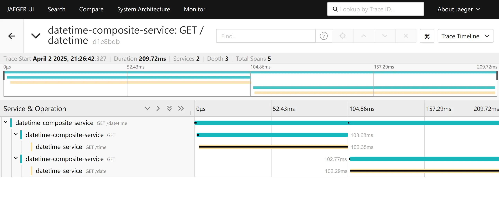

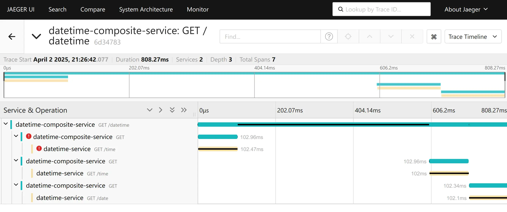

**Use Cases**:
* **Distributed Context Propagation**: Tracks requests as they propagate across multiple services, providing visibility into their interactions.
* **Latency Analysis**: Enables analysis of request timing to identify performance bottlenecks and optimize service interactions.
* **Performance Optimization**: Helps detect bottlenecks by showing how long each service takes to process a request.
* **Root Cause Analysis**: Makes it possible to pinpoint which service is responsible for slowdowns or errors.
* **Dependency Visualization**: Provides a clear view of how services interact, making complex dependencies easier to understand in a microservice architecture.


### Traces: Jeager/Zipkin

[Jaeger](https://www.jaegertracing.io/) and [Zipkin](https://zipkin.io/) are an open-source end-to-end distributed tracing system designed for monitoring and troubleshooting the performance of microservices-based architectures.

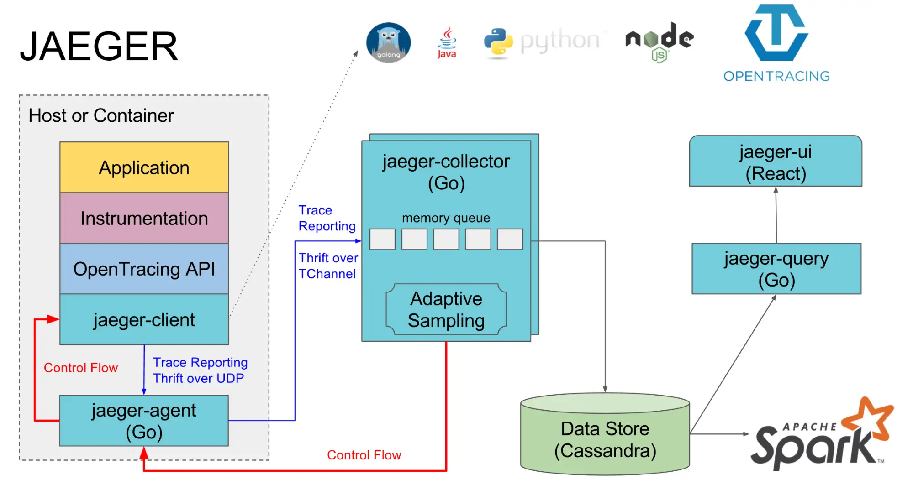


## Combining Metrics, Logs, and Traces
Although each pillar serves a different purpose, they complement one another to provide full visibility into system health:
- **Metrics** indicate **what** is happening, such as high CPU usage or slow response times.
- **Logs** provide the **why** by capturing detailed event data preceding or occurring during an issue.
- **Traces** illustrate the **how** by mapping request flows across system components, enabling the identification of performance bottlenecks or failures.

By integrating these observability pillars with specialized tools—such as Prometheus for metrics, the ELK stack for logs, and Jaeger for tracing—teams can gain comprehensive visibility into system behavior. This integration is crucial for effective monitoring, debugging, and optimization of modern software systems.

## Event-Based Observability

In addition to metrics, logs, and traces, modern observability leverages **real-time event streams** to gain immediate insights.

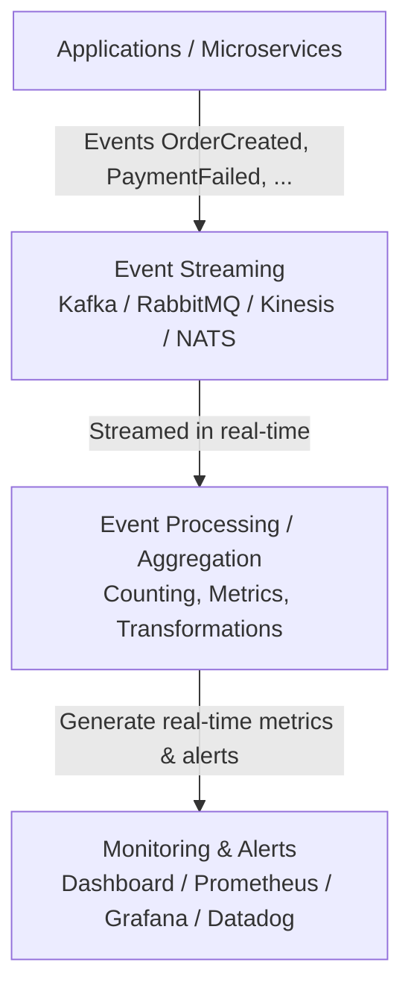
```mermaid
flowchart TD
    A[Applications / Microservices] -->|Events OrderCreated, PaymentFailed, ...| B[Event Streaming<br>Kafka / RabbitMQ / Kinesis / NATS]
    B -->|Streamed in real-time| C[Event Processing / Aggregation<br>Counting, Metrics, Transformations]
    C -->|Generate real-time metrics & alerts| D[Monitoring & Alerts<br>Dashboard / Prometheus / Grafana / Datadog]
```
* **Event Stream Sources**

  * Messaging systems such as **Apache Kafka**, **RabbitMQ**, **AWS Kinesis**, or **NATS** capture events from applications or microservices.
  * Events may represent completed operations, errors, state changes, or user interactions.

* **Real-Time Metrics and Alerts**

  * Events can be aggregated into metrics or triggers in near real-time without waiting for polling intervals.
  * Example: Counting `OrderCreated` events in Kafka to monitor throughput and detect sudden drops or spikes.


## Instrumentation

Instrumentation in microservices refers to the process of collecting metrics, logs, and traces to monitor, diagnose, and improve performance. Instrumenting microservices involves costs in terms of resource consumption, performance overhead, and engineering effort.

### The B2I (Business Logic to Instrumentation) ratio

To calculate the B2I ratio, determine the number of lines of code (LOC) before adding an instrumentation (adding code for emitting signals for a signal type), and then determine the LOC after the instrumentation. The B2I ratio is then:

**B2I = LOC_AFTER_INSTR / LOC_BEFORE_INSTR**

In an ideal world, the B2I ratio would be 1, representing zero instrumentation costs in the code. However, in reality, the more LOC you dedicate to instrumentation, the higher the B2I ratio is. For example, if your code has 3800 LOC and you added 400 LOC for instrumentation (say, to emit logs and metrics), then you’d end up with a B2I ratio of 1.105, from (3800 + 400) / 3800.

### Manual instrumentation

**Metrics**

[Micrometer](https://micrometer.io/) is a popular metrics collection library in the Spring ecosystem, often used with Prometheus or other monitoring tools. 

```java
import io.micrometer.core.instrument.MeterRegistry;
import io.micrometer.core.instrument.Counter;
import org.springframework.web.bind.annotation.GetMapping;
import org.springframework.web.bind.annotation.RestController;

@RestController
public class ExampleController {

    private final Counter requestCounter;

    public ExampleController(MeterRegistry meterRegistry) {
        this.requestCounter = meterRegistry.counter("http.requests.count");
    }

    @GetMapping("/hello")
    public String hello() {
        requestCounter.increment();  // Increment the metric counter
        return "Hello, World!";
    }
}
```

```python
from prometheus_client import Counter, start_http_server
from flask import Flask

# Create a Counter metric
REQUEST_COUNTER = Counter('http_requests_total', 'Total HTTP requests')

app = Flask(__name__)

@app.route("/hello")
def hello():
    REQUEST_COUNTER.inc()  # Increment the metric counter
    return "Hello, World!"

if __name__ == "__main__":
    # Start Prometheus metrics server on port 8000
    start_http_server(8000)
    app.run(port=5000)
```

**Logs**

[SLF4J (Simple Logging Facade for Java)](https://www.slf4j.org/) is a popular logging abstraction in the Java ecosystem, commonly used with logging frameworks like **Logback** or **Log4j** to provide a flexible and consistent logging API.

```java
import org.slf4j.Logger;
import org.slf4j.LoggerFactory;
import org.springframework.web.bind.annotation.GetMapping;
import org.springframework.web.bind.annotation.RestController;

@RestController
public class LoggingController {

    private static final Logger logger = LoggerFactory.getLogger(LoggingController.class);

    @GetMapping("/data")
    public String fetchData() {
        logger.info("Fetching data...");
        // Simulate data retrieval
        return "Data retrieved!";
    }
}
```

```python
import logging
from flask import Flask

# Configure logging
logging.basicConfig(
    level=logging.INFO,
    format='%(asctime)s [%(levelname)s] %(name)s - %(message)s'
)
logger = logging.getLogger("LoggingController")

app = Flask(__name__)

@app.route("/data")
def fetch_data():
    logger.info("Fetching data...")
    # Simulate data retrieval
    return "Data retrieved!"

if __name__ == "__main__":
    app.run(port=5000)
```

The logging system has to be configured to send logs remotely.

```xml
<?xml version="1.0" encoding="UTF-8"?>
<configuration>

    <appender name="STDOUT" class="ch.qos.logback.core.ConsoleAppender">
        <encoder>
            <pattern>%d{dd-MM-yyyy HH:mm:ss.SSS} [%thread] %-5level %logger{36}.%M - %msg%n</pattern>
        </encoder>
    </appender>

    <appender name="FILE" class="ch.qos.logback.core.FileAppender">
        <file>logs/application.log</file>
        <encoder>
            <Pattern>%d{dd-MM-yyyy HH:mm:ss.SSS} [%thread] %-5level %logger{36}.%M - %msg%n</Pattern>
        </encoder>
    </appender>

    <appender name="LOKI" class="com.github.loki4j.logback.Loki4jAppender">
        <http>
            <url>${LOKI_ENDPOINT}</url>
        </http>
        <format>
            <label>
                <pattern>app=datetime-service,host=${HOSTNAME}</pattern>
            </label>
            <message>
                <pattern>%-5level [%.5(${HOSTNAME})] %.10thread %logger{20} | %msg %ex</pattern>
            </message>
        </format>
    </appender>

    <root level="INFO">
        <appender-ref ref="STDOUT"/>
        <appender-ref ref="FILE"/>
        <appender-ref ref="LOKI"/>
    </root>
</configuration>
```

**Traces**

[OpenTelemetry](https://www.slf4j.org/) is a widely adopted observability framework that provides **tracing, metrics, and logging** capabilities.

```java
import io.opentelemetry.api.trace.Span;
import io.opentelemetry.api.trace.Tracer;
import org.springframework.web.bind.annotation.GetMapping;
import org.springframework.web.bind.annotation.RestController;

@RestController
public class TracingController {

    private final Tracer tracer;

    public TracingController(Tracer tracer) {
        this.tracer = tracer;
    }

    @GetMapping("/process")
    public String processRequest() {
        Span span = tracer.spanBuilder("processRequest").startSpan();  // Start tracing span
        try {
            // Simulate some business logic
            Thread.sleep(500);
            return "Processed";
        } catch (InterruptedException e) {
            span.recordException(e);
            return "Failed";
        } finally {
            span.end();  // End the span
        }
    }
}
```

```python
# Configure OpenTelemetry tracer
resource = Resource(attributes={"service.name": "tracing-service"})
trace.set_tracer_provider(TracerProvider(resource=resource))
tracer = trace.get_tracer(__name__)

# Export spans to console (for demo purposes)
span_processor = BatchSpanProcessor(ConsoleSpanExporter())
trace.get_tracer_provider().add_span_processor(span_processor)

app = Flask(__name__)

@app.route("/process")
def process_request():
    with tracer.start_as_current_span("processRequest") as span:
        try:
            # Simulate some business logic
            time.sleep(0.5)
            return "Processed"
        except Exception as e:
            span.record_exception(e)
            return "Failed"

if __name__ == "__main__":
    app.run(port=5000)
```

### Zero Code Instrumentation

**Definition:**

* Technique where **no changes to application code** are needed to enable monitoring, observability, or performance tracking.
* Achieved using **automatic instrumentation** via agents or frameworks.

* **Supported Frameworks**

  * Java: Spring Boot, gRPC, JDBC, HTTP clients
  * Python: Flask, Django, requests, SQLAlchemy, Celery
  * Node.js: Express, HTTP, MySQL/Postgres, Redis

#### What is a Java Agent?

* Special Java program that can **intercept and modify bytecode at runtime**
* Uses the **Java Instrumentation API**
* Injects **custom behavior** into classes **before or during loading** by the JVM

**Command to attach an agent:**

```bash
java -javaagent:/path/to/agent.jar -jar your-application.jar
```

---

#### How It Works

1. **Agent Startup**

  * JVM loads the agent before the main application
  * `premain()` method is invoked

2. **Class Transformation**

  * JVM provides the **bytecode** of each class as it is loaded
  * Agent can **modify the bytecode** (inject logging, metrics, tracing)

---

#### Intercepting Methods with Byte Buddy

**Original Method**

```java
public void doWork() {
    businessLogic();
}
```

**Instrumented Method via Agent**

```java
public void doWork() {
    long start = System.currentTimeMillis();
    try {
        businessLogic();
    } finally {
        long end = System.currentTimeMillis();
        log(end - start);
    }
}
```

```java
public class LoggerInterceptor {
    @RuntimeType
    public static Object intercept(@SuperCall Callable<?> zuper) throws Exception {
        long start = System.currentTimeMillis();
        try {
            return zuper.call(); // original method executes
        } finally {
            long end = System.currentTimeMillis();
            System.out.println("Execution time: " + (end - start) + "ms");
        }
    }
}
```

## OpenTelemetry Collector (Universal Telemetry Agent)

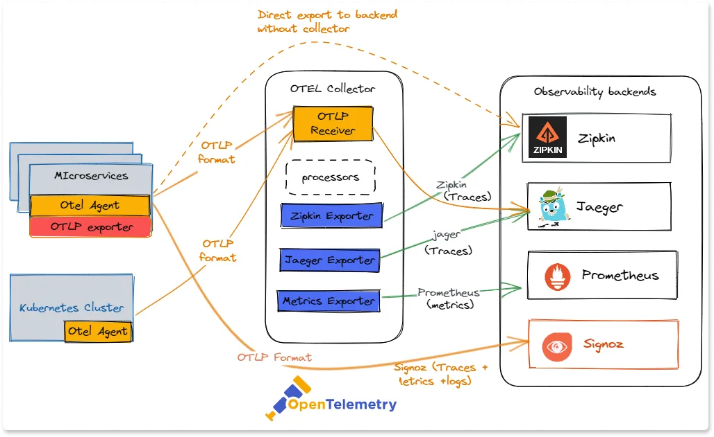

The **OpenTelemetry Collector** is an open-source, vendor-neutral tool for collecting, processing, and exporting **logs, metrics, and traces**. It provides a **unified data collection** solution, replacing multiple specialized agents, and can be deployed either as a local agent or a central service. Its **extensible pipeline** includes:

* **Receivers**: ingest data from various sources.
* **Processors**: enrich, filter, or transform data.
* **Exporters**: send data to backends like Prometheus, Elasticsearch, Grafana, or third-party platforms.

It offers **scalability, flexibility, and portability** across different infrastructures.

## Observability as a Platform

Modern observability favors **unified platforms** over isolated tools.

* **Grafana Cloud** – Integrates metrics, logs, and tracing with Tempo, Loki, Mimir.

* **SigNoz** – Single datastore (ClickHouse) for metrics, logs, traces; simpler to operate than separate stacks.

* **OpenObserve** – Lightweight Rust-based architecture, optimized for cost, performance, and cloud-native environments.

* **Benefits**

  * Simplifies operational complexity.
  * Centralizes data collection.
  * Reduces inconsistency across multiple tools.

### Observability Costs

* **Storage**: High-volume or high-cardinality data is costly; retention policies and compression help manage expenses.
* **Compute**: Processing tasks like queries, aggregations, and anomaly detection increase compute costs at scale.
* **Networking**: Cross-region transfers, streaming analytics, and API calls can add significant network costs.
* **Licensing & Tooling**: Proprietary tools incur license fees; open-source tools require infrastructure and maintenance resources.

## Best Practices 

* **Control Cardinality** - Avoid highly granular labels (e.g., `user_id`) in metrics to prevent time series explosion.
* **Data Privacy** - Never log sensitive data (passwords, PII).
* **Scraping Frequency and Overhead** - Balance frequency of metric collection and log verbosity with system resource consumption.
* **Retention Policies** - Define retention and compression policies to control storage costs while retaining useful data for analysis.


## Resources
- Cloud Observability in Action, Hausenblas