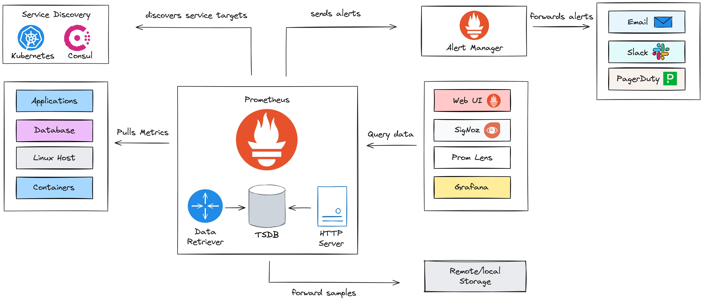

# Observability

When your systems are distributed, various things can go wrong. Even if you’ve written the perfect code, a node may fail, a connection may timeout, or participant servers may act arbitrarily. **The bottom line is that things will break**. And when they do, you want to be able to identify and fix the problem as soon as possible before it alters the entire system’s performance, or affects customers or your organization’s reputation. For this reason, we need observability to run today’s services and infrastructure.

People have varying knowledge of what observability means: 
* For some engineers, it’s the old wine of [monitoring](https://iamondemand.com/blog/how-to-properly-monitor-your-k8s-clusters-and-pods/) in a pristine bottle.
* For others, it’s an umbrella concept including analysis for distributed systems, visualization, and alerts management.
* Honeycomb, in its [Guide to Achieving Observability](https://www.honeycomb.io/wp-content/uploads/2018/07/Honeycomb-Guide-Achieving-Observability-v1.pdf), defines observability as the ability to ask arbitrary questions about your production environment.

Despite the variability in these definitions, **the overarching goal of observability is to achieve better visibility into systems:** 
* Observability is a property enabling you to understand what’s happening inside your software, from the outside.
* An observable system provides all the information you need to address day-to-day questions about a system. It also enables you to navigate into the system’s failure modes and **trace issues to their root cause**.

An effective observability solution may address questions like:

* Why is “y” broken?
* What went wrong during the release of feature “x”?
* Why has system performance degraded over the past few days?
* What did my service look like at point “y”?
* Is this system issue affecting specific users or all of them?

## Pillars of Observability

* **System**: Short for system under observation (SUO). This is the cloud-native platform (and applications running on it) you care about and are responsible for.
* **Signals**: Information observable from the outside of a system. There are different signal types (the most common are logs, metrics, and traces), and they are generated by sources. 
* **Sources**: Part of the infrastructure and application layer, such as a microservice, a device, a database, a message queue, or the operating system. They typically must be instrumented to emit signals. 
* **Agents**: Responsible for signal collection, processing, and routing. 
* **Destinations**: Where you consume signals, for different reasons and use cases. These include visualizations (e.g., dashboards), alerting, long-term storage (for regulatory purposes), and analytics (finding new usages for an app). 
* **Telemetry**: The process of collecting signals from sources, routing or preprocessing via agents, and ingestion to destinations.


## Signals
The three pillars of observability—**metrics**, **logs**, and **traces**—play a vital role in providing insights into the system’s behavior and performance. 


### Metrics
Metrics are numerical values that capture key performance indicators (KPIs) about your system over time. They are typically aggregated and provide an overview of system health and performance.

**Characteristics**:
  - **Quantitative Data**: Metrics are quantitative and can be counted or measured (e.g., CPU, memory, disk, threads, latency, etc.).
  - **Low Cardinality**: Metrics tend to have low cardinality (limited number of possible values), when compared to logs or traces.
  - **Time-Series Nature**: Metrics are usually collected as time-series data and plotted on dashboards to show trends over time.

**Use Cases**:
  - **Monitoring**: Continuous monitoring of performance indicators like latency, error rates, and resource consumption.
  - **Alerting**: Alerts can be set when metrics exceed predefined thresholds (e.g., high CPU usage or request errors).
  - **Capacity Planning**: Helps in predicting future resource needs based on trends in usage patterns.

**Cardinality Explosion**:

**Cardinality** refers to the number of unique combinations of label values (or dimensions) associated with a particular metric. Each unique combination creates a time series that must be stored and tracked over time.

Consider a metric that tracks the latency of API requests. It might have the following labels (dimensions):
- `endpoint`: The specific API endpoint being accessed (e.g., `/users`, `/orders`).
- `nodeid`: The id of the server (e.g., `node-567`, `node-343`).
- `region`: The geographical location of the server (e.g., `us-east-1`, `eu-west-1`).

For each unique combination of these labels, a new time series is created:

| **endpoint**  | **nodeid**   | **region**     | **Latency (ms) - T1** | **Latency (ms) - T2** |  
|--------------|-------------|---------------|----------------|----------------|  
| `/users`     | `node-567`  | `us-east-1`   | 120            | 130            |  
| `/users`     | `node-343`  | `us-east-1`   | 135            | 140            |  
| `/orders`    | `node-567`  | `us-east-1`   | 200            | 210            |  
| `/orders`    | `node-343`  | `us-east-1`   | 220            | 225            |  
| `/users`     | `node-567`  | `eu-west-1`   | 180            | 185            |  
| `/orders`    | `node-567`  | `eu-west-1`   | 190            | 195            |  

If we have **1,000 endpoints** running on **100 nodes** distributed across **3 regions**, we could end up collecting **300,000 time series** at each time step.

If we were to replace `nodeid` with `user_id`, the number of unique label combinations would **skyrocket**, potentially overwhelming the monitoring system.


### Logs
Logs are detailed, unstructured or semi-structured textual records that describe events that occurred in the system. Logs capture the full context of operations and are the most granular observability data.

**Characteristics**:
  - **Rich Detail**: Logs provide detailed information about the system’s state and operations, often including error messages, stack traces, and debug information.
  - **High Cardinality**: Logs can capture many unique details such as user IDs, IP addresses, and session IDs.
  - **Time-Stamped Events**: Each log entry is typically associated with a timestamp, allowing you to track events in chronological order.

**Types**:
  - **Application Logs**: Generated by the application itself to capture business logic events, errors, or warnings.
  - **System Logs**: Logs related to the operating system, server errors, or hardware issues.
  - **Security Logs**: Logs capturing access events, login attempts, and authorization failures.
  - **Infrastructure log**: Vital part of infrastructure management, which involves managing the physical and logical equipment that affects an organization's IT foundation.

**Use Cases**:
  - **Debugging**: Logs are essential for troubleshooting errors and understanding the state of an application at specific points in time.
  - **Auditing**: Logs can be used to track access, changes, and interactions within the system for compliance and security purposes.
  - **Incident Investigation**: In the case of system failure or unexpected behavior, logs provide the information needed to reconstruct the chain of events leading to the issue.

```
[INFO] 2024-10-19 10:15:03 - Service 'OrderService' started successfully on port 8080.
[ERROR] 2024-10-19 10:16:25 - Failed to connect to the database. Error: ConnectionTimeoutException: Database not reachable at db-host:5432.
[WARN] 2024-10-19 10:18:45 - Memory usage is above the threshold (90%). Current usage: 95%.
[DEBUG] 2024-10-19 10:19:07 - Processing request for user ID 12345. Request payload: { "orderId": "9876", "product": "Laptop", "quantity": 2 }.
[TRACE] 2024-10-19 10:19:12 - Sending HTTP request to PaymentService. Endpoint: /api/payment. CorrelationId: abcd-1234-efgh-5678.
```

### Traces
Traces track the path of a request as it moves through various services in a distributed system. They help visualize how requests propagate across different components.

- **Characteristics**:
    - **Distributed Context**: Traces are particularly valuable in distributed architectures where a request can span multiple services, databases, and external APIs.
    - **Span and Trace IDs**: Traces are composed of spans, which represent a single operation within a service. Each span contains a unique ID, and all spans related to a single request share the same trace ID.
    - **End-to-End Latency**: Traces provide visibility into the time taken by each service involved in processing a request.
- **Use Cases**:
    - **Performance Optimization**: Traces help identify bottlenecks by showing how long each service takes to process a request.
    - **Root Cause Analysis**: Tracing allows you to pinpoint which service is causing slowdowns or errors.
    - **Dependency Visualization**: Traces give a clear picture of how services interact, making it easier to understand complex dependencies in a microservice architecture.


### Combining Metrics, Logs, and Traces
Although each pillar serves a different purpose, they complement one another to provide full visibility into system health:
- **Metrics** indicate **what** is happening, such as high CPU usage or slow response times.
- **Logs** provide the **why** by capturing detailed event data preceding or occurring during an issue.
- **Traces** illustrate the **how** by mapping request flows across system components, enabling the identification of performance bottlenecks or failures.

By integrating these observability pillars with specialized tools—such as Prometheus for metrics, the ELK stack for logs, and Jaeger for tracing—teams can gain comprehensive visibility into system behavior. This integration is crucial for effective monitoring, debugging, and optimization of modern software systems.

## Instrumentation

Instrumentation in microservices refers to the process of collecting metrics, logs, and traces to monitor, diagnose, and improve performance. Instrumenting microservices involves costs in terms of resource consumption, performance overhead, and engineering effort.

### The B2I (Business Logic to Instrumentation) ratio

To calculate the B2I ratio, determine the number of lines of code (LOC) before adding an instrumentation (adding code for emitting signals for a signal type), and then determine the LOC after the instrumentation. The B2I ratio is then:

> B2I = LOC_AFTER_INSTRUMENTATION / LOC_BEFORE_INSTRUMENTATION

In an ideal world, the B2I ratio would be 1, representing zero instrumentation costs in the code. However, in reality, the more LOC you dedicate to instrumentation, the higher the B2I ratio is. For example, if your code has 3800 LOC and you added 400 LOC for instrumentation (say, to emit logs and metrics), then you’d end up with a B2I ratio of 1.105, from (3800 + 400) / 3800.

### Manual instrumentation

**Metrics**

Micrometer is a popular metrics collection library in the Spring ecosystem, often used with Prometheus or other monitoring tools. 

```java
import io.micrometer.core.instrument.MeterRegistry;
import io.micrometer.core.instrument.Counter;
import org.springframework.web.bind.annotation.GetMapping;
import org.springframework.web.bind.annotation.RestController;

@RestController
public class ExampleController {

    private final Counter requestCounter;

    public ExampleController(MeterRegistry meterRegistry) {
        this.requestCounter = meterRegistry.counter("http.requests.count");
    }

    @GetMapping("/hello")
    public String hello() {
        requestCounter.increment();  // Increment the metric counter
        return "Hello, World!";
    }
}
```

**Logs**

SLF4J (Simple Logging Facade for Java) is a popular logging abstraction in the Java ecosystem, commonly used with logging frameworks like **Logback** or **Log4j** to provide a flexible and consistent logging API.

```java
import org.slf4j.Logger;
import org.slf4j.LoggerFactory;
import org.springframework.web.bind.annotation.GetMapping;
import org.springframework.web.bind.annotation.RestController;

@RestController
public class LoggingController {

    private static final Logger logger = LoggerFactory.getLogger(LoggingController.class);

    @GetMapping("/data")
    public String fetchData() {
        logger.info("Fetching data...");
        // Simulate data retrieval
        return "Data retrieved!";
    }
}
```

**Traces**

OpenTelemetry is a widely adopted observability framework that provides **tracing, metrics, and logging** capabilities, often used with backend systems like **Prometheus, Jaeger, and Grafana** for monitoring and analysis.

```java
import io.opentelemetry.api.trace.Span;
import io.opentelemetry.api.trace.Tracer;
import org.springframework.web.bind.annotation.GetMapping;
import org.springframework.web.bind.annotation.RestController;

@RestController
public class TracingController {

    private final Tracer tracer;

    public TracingController(Tracer tracer) {
        this.tracer = tracer;
    }

    @GetMapping("/process")
    public String processRequest() {
        Span span = tracer.spanBuilder("processRequest").startSpan();  // Start tracing span
        try {
            // Simulate some business logic
            Thread.sleep(500);
            return "Processed";
        } catch (InterruptedException e) {
            span.recordException(e);
            return "Failed";
        } finally {
            span.end();  // End the span
        }
    }
}
```

### Zero-code instrumentation

**Zero Code Instrumentation** refers to a technique where no code changes are required to instrument an application for monitoring, observability, or performance tracking. This is typically achieved through automatic instrumentation provided by agents (such as [OpenTelemetry Java agent](https://opentelemetry.io/docs/zero-code/java/agent/)) or frameworks.

A **Java agent** is a special type of Java program that can modify the behavior of Java bytecode at runtime. It leverages the Java Instrumentation API, allowing developers or tools to inject custom behavior into Java classes before they are loaded into memory by the JVM.

```bash
java -javaagent:/path/to/agent.jar -jar your-application.jar
```


## Sources
We categorize sources using a simple and widely used trichotomy: **compute**, **storage**, and **network**. This broad categorization helps understand where issues arise, how they propagate through the system, and what steps to take to maintain the health and performance of distributed architectures.

| **Category**  | **Description** | **Key Observability Data** | **Specific Metrics** |  
|--------------|---------------|---------------------------|----------------------|  
| **Compute**  | The runtime environments where code executes, including VMs, containers, and serverless functions. Observability focuses on performance, resource usage, and health. | - **CPU**: Tracks CPU usage per microservice, container, or VM, detecting inefficiencies or bottlenecks.  <br> - **Memory**: Monitors usage, memory leaks, and inefficiencies.  <br> - **Disk I/O**: Observes read/write operations to detect bottlenecks in data-heavy services. | - **Container-level metrics**: CPU, memory, and disk I/O from Docker/Kubernetes.  <br> - **Function invocation times**: Execution time, cold start duration, and memory usage for AWS Lambda/Google Cloud Functions. |  
| **Storage**  | Components responsible for persisting and managing data, such as databases, file systems, and object stores. Observability focuses on performance, health, and availability. | - **Query Performance**: Monitors slow queries, lock contention, and transaction times (PostgreSQL, MySQL).  <br> - **Latency**: Tracks read/write latency for NoSQL stores (Redis, DynamoDB).  <br> - **Capacity & Availability**: Ensures storage doesn’t run out and remains accessible. | - **DB Metrics**: Queries per second (QPS), read/write latency, connection pool size, rollback rates.  <br> - **Object Storage Metrics**: S3 `GetObject` latency, `PutObject` success/failure rates. |  
| **Network**  | Ensures smooth communication between microservices by monitoring connectivity, throughput, and latency. | - **Throughput**: Measures data transfer between services to detect bottlenecks.  <br> - **Latency**: Tracks round-trip times between services and clients.  <br> - **Error Rates**: Detects packet loss, failed connections, and dropped messages. | - **API Gateway Metrics**: Request/response latency, success/failure rates, throttled requests.  <br> - **Load Balancer Metrics**: AWS ELB `RequestCount`, `HTTPCode_ELB_5XX_Count` (errors), `Latency`.  <br> - **Network Traffic**: Data transfer rates, packet loss, bandwidth usage. |  

**Extended Considerations for Observability Sources:**

- **Granularity**: For each of these categories, observability can be applied at different granularities. For example, at the compute level, you can track metrics at the VM level, container level, or process level, depending on the level of detail required.

- **Correlation**: Effective observability often involves correlating data from these three sources. For instance, high latency in the network may coincide with increased CPU usage on the compute side, or a database experiencing long-running queries could cause cascading slowdowns across the network.

- **Security Implications**: Network observability also contributes to security monitoring. Tools that inspect network traffic or audit logs can detect unauthorized access, anomalies, or data exfiltration attempts.

## Metrics: Prometheus

[Prometheus](https://prometheus.io/) is an open-source monitoring and alerting toolkit widely used for recording real-time metrics and generating alerts. Prometheus was developed at [SoundCloud](https://soundcloud.com/) in 2012 and later became a standalone project under the umbrella of the [Cloud Native Computing Foundation](https://www.cncf.io/). It is designed for reliability and scalability in monitoring and alerting, with a strong emphasis on time-series data.



- **Prometheus Server**: Core component that collects, stores, and queries metrics.
- **Data Storage**: Uses a built-in time-series database (TSDB) for efficient metric storage and retrieval.
- **Alertmanager**: Manages, deduplicates, and routes alerts to notification channels.
- **Client Libraries**: Enable applications to expose custom metrics using libraries for Go, Java, Python, and more.

**Key Features:**

- **Service Discovery**: Automatically detects and scrapes targets using mechanisms like Kubernetes, Eureka, static configs (easy replica management).
- **Scraping Metrics**: Collects data from targets (applications, services, systems) via HTTP at set intervals.
- **Metrics Formatting**: Uses a structured, text-based format to expose metrics (CPU, memory, requests, errors, etc.).
- **Powerful Query Language**: Provides **PromQL** for querying and analyzing time-series data.
- **Alerting**: Supports rule-based alerts, sending notifications.

## Logs: ELK Stack

The **ELK stack** is a popular set of tools used for managing and analyzing large volumes of data, particularly logs. 


 [Logstash](https://www.elastic.co/logstash) is a data pipeline that collects, transforms, and routes logs and events to destinations like Elasticsearch. It supports **multiple input sources** (e.g., files, Kafka), **filter plugins** for data processing (e.g., parsing, enrichment), and **output plugins** to forward processed data. It is widely used for **centralized log management** and preprocessing before storage.

[Elasticsearch](https://www.elastic.co/elasticsearch) is a distributed search and analytics engine built on Apache Lucene, enabling real-time data indexing, searching, and analysis. As the core of the ELK stack, it scales horizontally using **sharded architecture**, ensuring fault tolerance and high availability. It provides a **RESTful API** for easy integration and supports **JSON-based indexing**, allowing fast full-text searches and aggregations.

[Kibana](https://www.elastic.co/kibana) is a **visualization and analytics tool** for exploring Elasticsearch data. It allows users to create **interactive dashboards** with charts and graphs, apply **search and filtering**, and monitor logs, metrics, and traces. With features like **alerting and security monitoring**, Kibana is essential for troubleshooting and observability.

**Key Features:**

- **Centralized Logging**: The ELK stack allows organizations to centralize logs from multiple sources, making it easier to manage and analyze log data.
- **Flexible Visualization**: Kibana’s visualization tools help users present data in various formats, enabling better decision-making based on insights derived from the data.
- **Scalability**: The distributed nature of Elasticsearch allows the ELK stack to scale with the growth of data, making it suitable for small to large enterprises.


## Traces: Jeager/Zipkin

[Jaeger](https://www.jaegertracing.io/) and [Zipkin](https://zipkin.io/) are an open-source end-to-end distributed tracing system designed for monitoring and troubleshooting the performance of microservices-based architectures.


**Key Features:**

- **Distributed Context Propagation**: Jaeger tracks requests as they propagate through multiple services, providing visibility into the interactions between them.
- **Latency Analysis**: Users can analyze the timing of requests, helping to identify performance bottlenecks and optimize service interactions.
- **Root Cause Analysis**: It assists in pinpointing the root causes of performance issues by visualizing the path and duration of requests across services.
- **Service Dependency Graphs**: Jaeger generates visual representations of service dependencies, helping teams understand the architecture and relationships between services.
- **Storage Options**: Supports various storage backends, such as MySQL, Cassandra, and Elasticsearch, allowing teams to choose their preferred data storage solution.

## OpenTelemetry Collector (Universal Telemetry Agent)


The **OpenTelemetry collector** is a versatile, open-source tool designed to collect, process, and export telemetry data, including **logs**, **metrics**, and **traces**. It is part of the [OpenTelemetry project](https://opentelemetry.io/), which aims to provide a unified standard for observability across distributed systems.

#### Key Features
- **Unified Data Collection**: The collector supports receiving telemetry data from different sources (metrics, logs, traces) and exporting them to various backends, making it a single agent that replaces multiple specialized agents.
- **Extensible Pipeline**: The collector follows a pipeline architecture consisting of **receivers**, **processors**, and **exporters**:
  - **Receivers**: Ingest telemetry data from various sources (e.g., Jaeger, Prometheus, Fluentd).
  - **Processors**: Enrich, filter, batch, or transform data before exporting.
  - **Exporters**: Send the processed data to backends like Prometheus, Elasticsearch, Grafana, or third-party observability platforms (Datadog, New Relic).

- **Vendor-Neutral**: OpenTelemetry aims to standardize how telemetry is collected, providing flexibility and portability. The collector allows you to change backends (e.g., from Prometheus to AWS CloudWatch) without modifying your application code.

- **Scalability and Flexibility**: The collector can be deployed as an agent (running locally alongside applications) or as a central service that aggregates telemetry from multiple agents across the infrastructure.

#### Benefits of Using OpenTelemetry Collector
- **Consolidation**: The collector replaces multiple agents (one for logs, one for metrics, and another for traces) with a single, unified telemetry agent.
- **Cross-Language Support**: OpenTelemetry works across multiple programming languages, enabling a consistent observability strategy across diverse environments.
- **Flexibility in Exporting**: You can easily switch observability backends without reconfiguring or redeploying applications.


## OpenTelemetry Ecosystems

### Grafana Ecosystem


The [Grafana ecosystem](https://grafana.com/) encompasses a variety of tools that work together to provide a comprehensive monitoring, observability, and visualization solution. Key components of this ecosystem include **Grafana**, **Tempo**, **Mimir**, and **Loki**. 


**Grafana** is an open-source analytics and monitoring platform designed for visualizing metrics and logs from various data sources. It provides a flexible and customizable dashboard interface that allows users to create visualizations, alerts, and reports.

**Tempo** is a distributed tracing backend designed to collect and store trace data generated by applications. It is designed to be simple, scalable, and cost-effective, making it a good choice for organizations looking to implement distributed tracing.

**Mimir** is a metrics store designed for high-performance metrics collection and retrieval. It is particularly useful for storing large volumes of time-series data and is often seen as a scalable solution for organizations with extensive observability needs.

**Loki** is a log aggregation system designed to collect, store, and query log data from various sources. Unlike traditional log management systems, Loki is optimized for ease of use and integrates tightly with Grafana.

### Signoz Ecosystem
[SigNoz](https://signoz.io/) is an open-source observability platform designed for monitoring, tracing, and logging in cloud-native applications. 


* **Unified Observability**: Combines metrics, logs, and traces in a single interface for holistic monitoring.
* **End-to-End Tracing**: Supports distributed tracing to identify performance bottlenecks and visualize service dependencies.
* **Metrics Collection**: Collects and visualizes metrics in real time, with alerting capabilities based on defined thresholds.
* **Log Management**: Ingests, searches, and analyzes logs, allowing correlation with metrics and traces for context.

## Costs

### Infrastructure Costs
- **Data Storage**: Observability generates vast amounts of data from logs, metrics, and traces. Storing this data requires significant disk space, especially in systems with high traffic or complex architectures. This can lead to high storage costs, particularly if long retention periods are needed.
- **Compute Resources**: Observability tools often require substantial computational power for data processing, querying, and aggregation. Running these systems can increase cloud computing or server costs, as you’ll need to scale resources to handle the load.
- **Networking Costs**: In distributed systems, observability data must be collected and transmitted across services, leading to increased network bandwidth consumption, which can result in additional costs, especially in cloud environments where network usage is billable.

### Operational Costs
- **Tooling and Software Licenses**: Many observability tools come with licensing costs, either for self-hosted solutions (e.g., Prometheus, Grafana) or cloud-based SaaS solutions (e.g., Datadog, New Relic, Splunk). These costs can escalate as the system grows and more data is collected.
- **Maintenance**: The observability stack needs constant upkeep, including updates, scaling, troubleshooting, and ensuring data integrity. Teams must invest in keeping the observability pipeline healthy and responsive, which increases operational overhead.

### Development Costs
- **Implementation Complexity**: Developers need to instrument code to collect observability data. This involves adding logging, metrics, and tracing capabilities into each service, which can increase development time and complexity. Special attention is required to ensure data is both comprehensive and accurate.
- **Technical Debt**: If observability isn’t planned properly, it can result in technical debt. For example, poorly structured logs, inconsistent metric names, or incomplete tracing can lead to confusion and difficulty in diagnosing issues, requiring further refactoring or reimplementation.

### Performance Costs
- **Increased Latency**: Collecting observability data, particularly with distributed tracing, can introduce latency into the system. This is especially true if synchronous tracing is used or if large amounts of data are logged at runtime.
- **Resource Overhead**: Monitoring and collecting metrics, logs, and traces consumes CPU, memory, and I/O resources on the services being observed. If not managed properly, this can lead to degraded performance of the system or the need to provision additional resources.
- **Sampling Impact**: To minimize performance overhead, many systems implement sampling (e.g., not tracing every request). However, this can lead to incomplete data, making certain edge cases or rare issues harder to diagnose.

### Data Management Costs
- **Retention Policies**: Observability data can grow exponentially in a distributed system. Deciding on the right retention policy (e.g., which data to keep, for how long) requires careful balancing between the need for historical analysis and the cost of storing vast amounts of data.
- **Data Noise and Signal Extraction**: In large systems, observability can generate a lot of noise, especially with verbose logging. Sifting through unnecessary data to extract meaningful insights can be resource-intensive and may require advanced techniques like log sampling, aggregation, and filtering.


## Resources
- Cloud Observability in Action, Hausenblas