# Observability (Scenarios)

##  Metrics description

1. _**jvm\_cpu\_recent\_utilization\_ratio**_

   Indicates the JVM’s recent CPU usage.
    * Low values: JVM uses little CPU.
    * High values: JVM is under load.
    * Typical range: 0.0 (0%) to 1.0 (100% of one core). Values > 1.0 mean multiple cores are used.


2. _**jvm\_thread\_count**_

   The total number of active threads in the JVM.

    * Low: few threads in use (may be okay or indicate blocking).
    * High: high load or thread management issues (e.g., leaks).


3. _**http\_client\_request\_duration\_seconds\_bucket**_

   Histogram that tracks the duration of HTTP requests from the client side.


4. _**http\_server\_request\_duration\_seconds\_bucket**_

   Histogram of request durations from the server side (service receiving the request), in our case _gateway service_.

## 🟢 Low Load

We simulate low load on a system with **no resilience mechanisms** using Vegeta (a load testing tool).
The low load is set with the "times" parameter in this HTTP call:

```bash
echo 'GET http://127.0.0.1:8080/mcd?a=18&b=12&times=100&faults=0' | vegeta attack -duration=300s --rate=5 | vegeta report
```

Sample output:

```
Requests      [total, rate, throughput]  1500, 5.00, 5.00  
Duration      [total, attack, wait]      4m59.80s  
Latencies     [mean, 50, 95, 99, max]    13.5ms, 9.7ms, 30ms, 39ms, 312ms  
Bytes In      [total, mean]              112500, 75.00  
Success       [ratio]                    100.00%  
Status Codes  [code:count]               200:1500  
```

As expected, with low load and latency, everything works fine. Let's verify this with Grafana.


### Metrics Analysis via Grafana

#### JVM\_THREAD\_COUNT

This metric, measured in changes per second (c/s), shows how many threads were added recently per service.

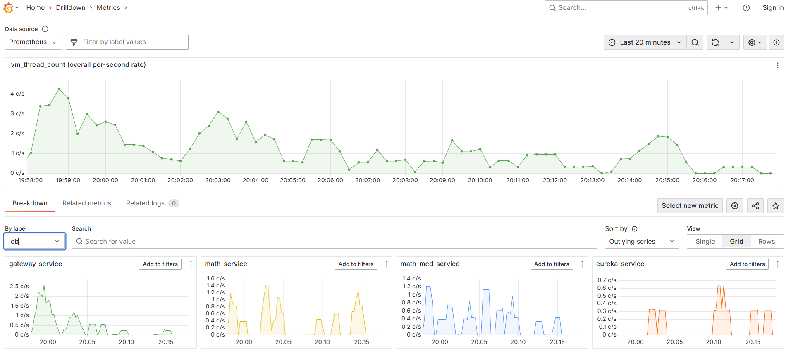
→ The thread pool remains low under low load.


#### JVM\_CPU\_UTILIZATION\_RATIO

Shows average CPU usage per process.

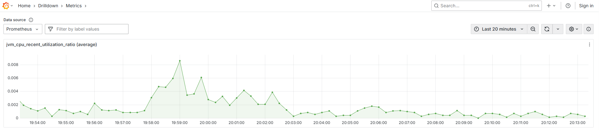

In general, it remains low.  We can take a look also to the "CPU utilization" caused by each service and state that also in this case it is low (max. 0.0175 of gateway service).

---

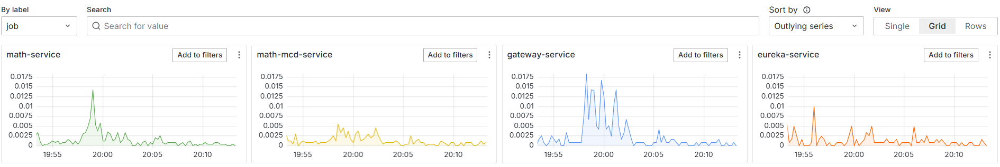

&rarr; CPU usage is low and doesn’t overload the system.


#### http\_server\_request\_duration\_seconds\_bucket

Shows how long each request takes, grouped into histogram buckets.
Eureka (used for routing) is the main reference here.

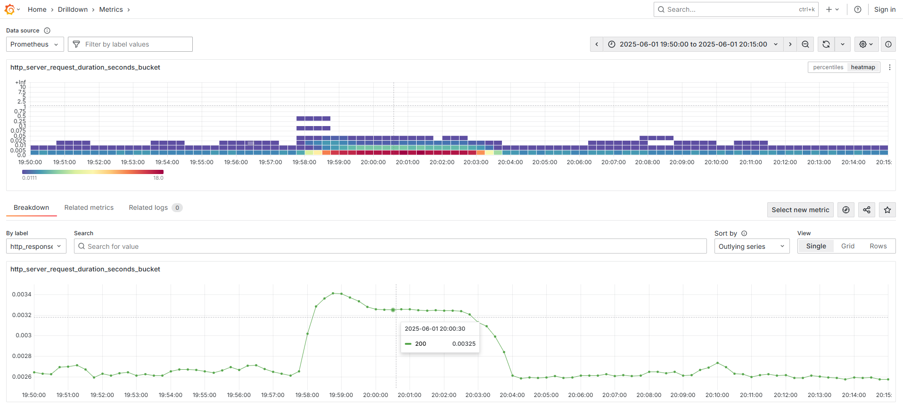

The `http_server_request_duration_seconds_bucket` metric measures the cumulative number of HTTP requests completed within specific time intervals (buckets). Each bucket represents a maximum response time, which is useful for calculating distributions and percentiles.

The graph shows a peak in latency between 19:58 and 20:03, with a maximum of around 3.25 ms for HTTP 200 responses. After 20:03, latencies return to normal. The heatmap highlights the request density for each duration interval. No errors were detected.

It's possible to see latency for each "service" that in grafana is called _job_.

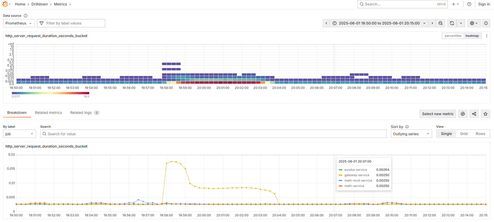

The graph shows a peak between 19:58 and 20:03, with a maximum latency of ~0.018s on the `gateway-service`, while the other services remain stable.

#### http\_client\_request\_duration\_seconds\_bucket

The `http_client_request_duration_seconds_bucket` metric measures the duration of client-side HTTP requests, broken down into cumulative buckets. Each dot represents how many requests were completed within a certain maximum time.

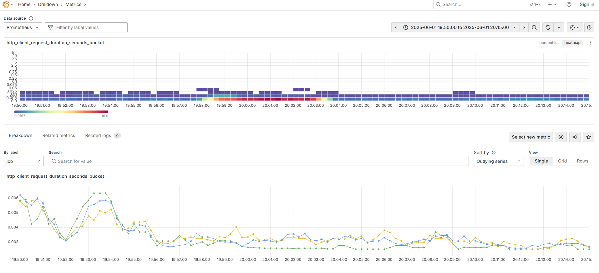

The graph shows a stable average client latency between 2 ms and 6 ms, peaking around 19:54 and fluctuating up to 20:10. The heatmap at the top highlights the temporal distribution of latencies: warmer colors indicate more requests in that bucket. Differences between services (jobs) are visible in the graph at the bottom. No serious degradation is evident.

### **Trace Analysis (Tempo)**

Traces starting from 19:58 show all service interactions were successful:

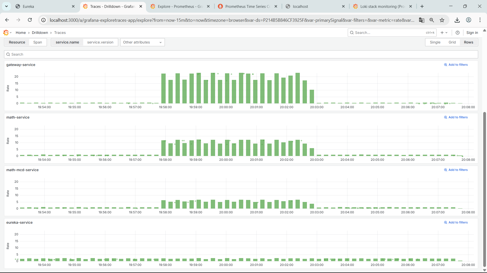

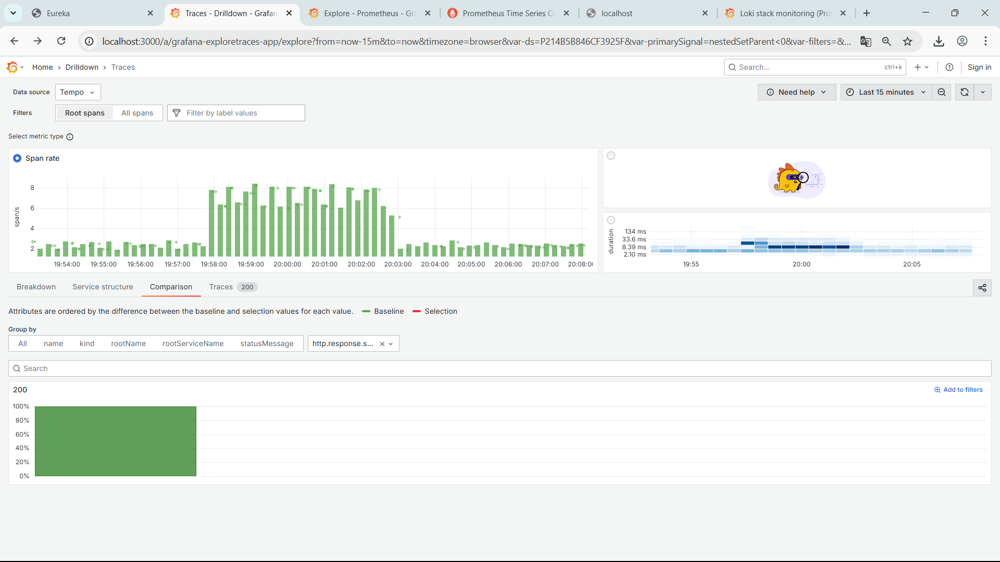


## 🟡 Mid Load

> *Note*: Vegeta returns a **Client.TimeoutConnection expired** error when the endpoint takes too long to respond. A 120s timeout was set for the gateway, and total requests reduced for practicality.

```bash
echo 'GET http://127.0.0.1:8080/mcd?a=18&b=12&times=1000000&faults=0' | vegeta attack -duration=180s --rate=3 -timeout=120s | vegeta report
```

```
Requests      [total, rate, throughput]  540, 3.01, 0.17  
Success       [ratio]                    9.44%  
Status Codes  [code:count]               200:51  503:41  0:448  
Error: 503 - context deadline exceeded
```
As expected, since we don't have resiliency, when we have an higher load there is no way to avoid failures.
The replicas (2 for math and mcd-services) were insufficient to process all requests. Let’s look at Grafana metrics.


### Metric Analysis (Mid Load)

#### JVM\_THREAD\_COUNT

Increase expected under load:

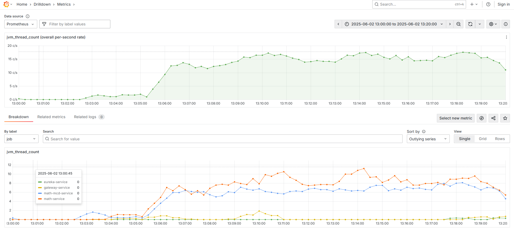

The top graph shows the number of active JVM threads per second over time, with a clear increase starting at 1:06 PM to a peak near 1:10 PM, followed by a relatively stable phase and a slight decrease around 1:20 PM. This indicates an increase in the activity of the monitored JVM applications.

In the bottom graph, the same metric is broken down by service, making it clear that the largest contribution to the increase in threads comes from the "math-service" service (orange line) and partly from the "math-mcd-service" (blue line), while "eureka-service" and "gateway-service" remain stable near zero. This detail allows you to easily identify which components are increasing the load on the JVM system.


Taking a look on states of threads:


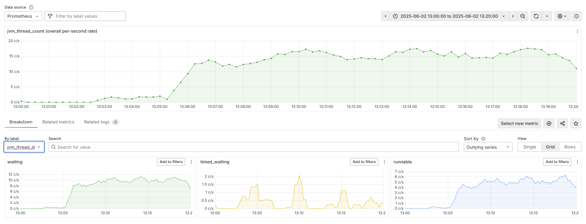

The graph shows that the increase in jvm_thread_count is mainly due to the increase in waiting and runnable threads.
- Waiting threads are the most numerous, indicating many threads waiting passively.
- Runnable threads also increase, indicating increased CPU activity. Timed_waiting threads remain marginal, with isolated spikes.

Overall, active and waiting threads explain the observed growth in the total count.


#### CPU Utilization

Increased CPU use compared to low load; peak at 0.118.

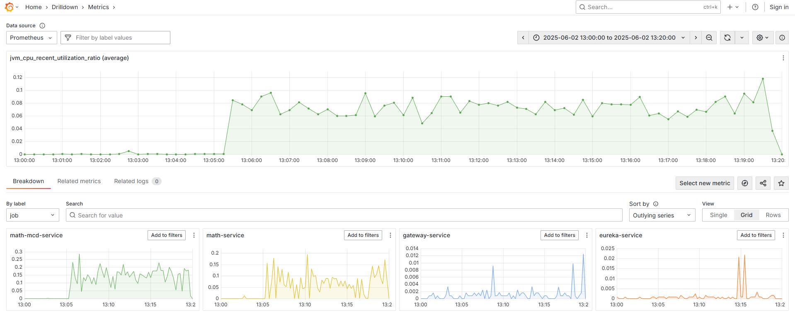


#### http\_server\_request\_duration\_seconds\_bucket


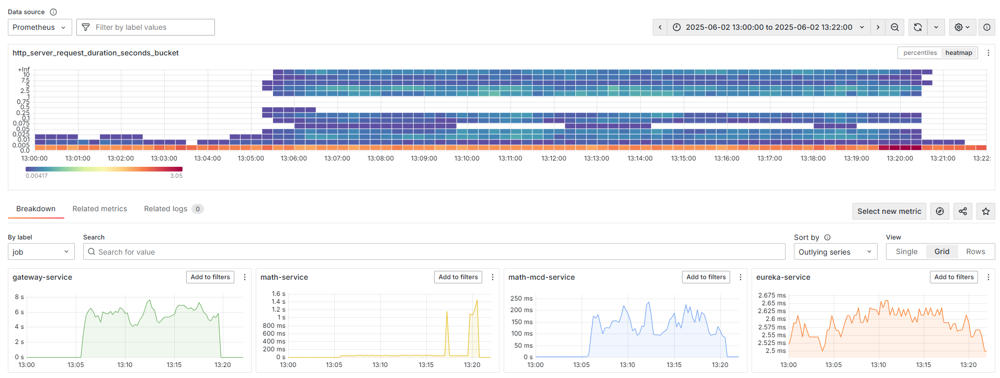
The heatmap above shows the distribution of durations: the more the color is towards red, the slower the requests are. In the graphs below, we can see that gateway-service has high and constant response times, while math-service shows sudden spikes, a sign of possible slowdowns. math-mcd-service has intermediate performance, while eureka-service is always very fast. In general, the graph helps to understand where and when the services are responding slower.


Filtering by HTTP status 503:

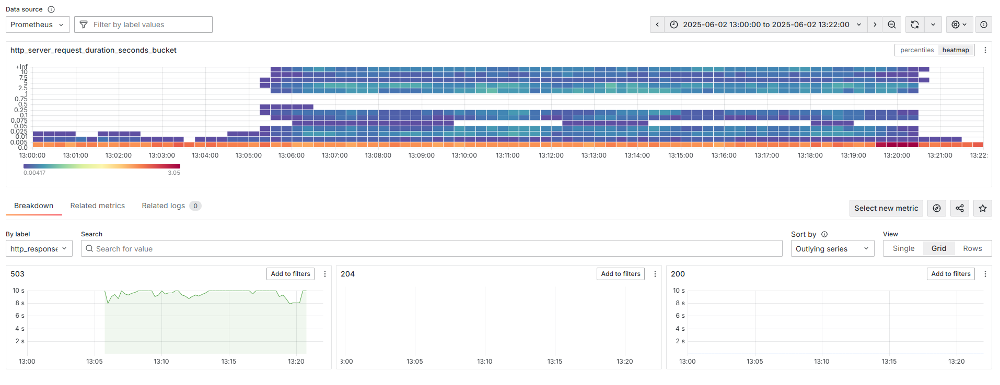


#### http\_client\_request\_duration\_seconds\_bucket

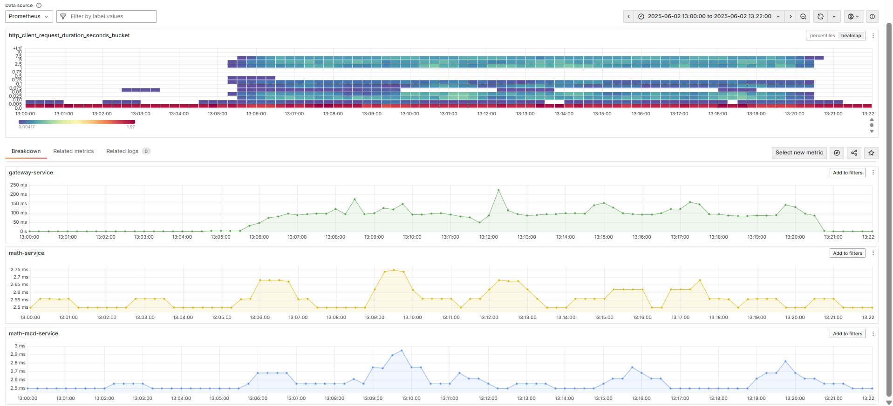

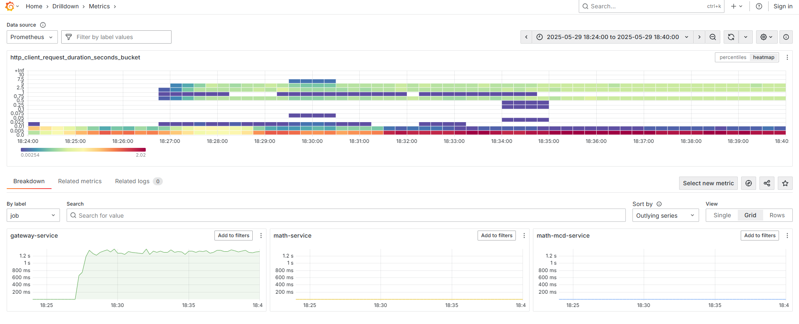

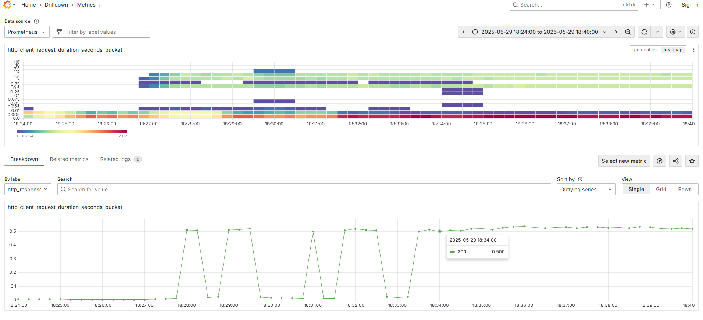


### **Trace Analysis (Tempo)**

Traces for this scenario: we have 200 errors traces that are requests failed.

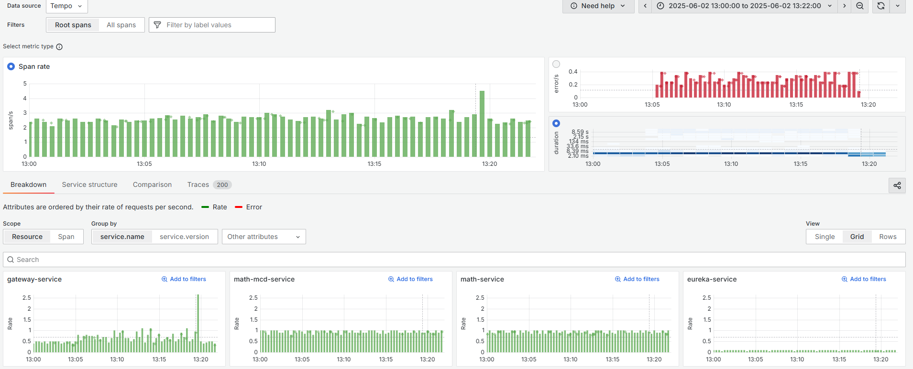

The faulty endpoint is obviously `/mcd` endpoint to get the GCD.
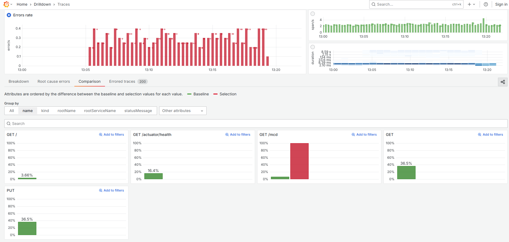


### **Log Analysis (Loki)**

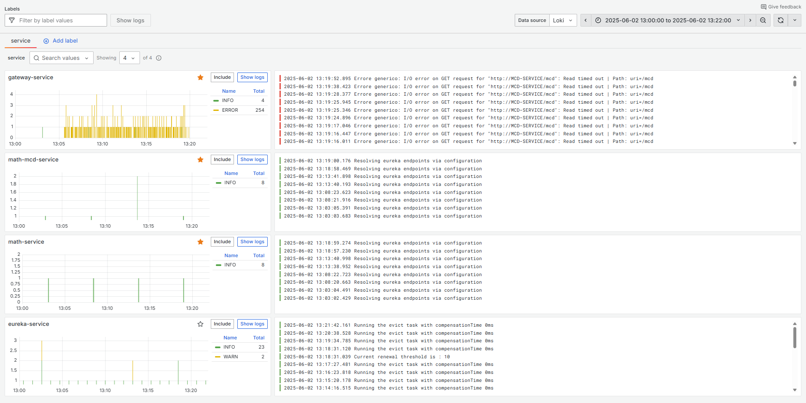

→ The system already struggles under mid load without resilience patterns. Nonetheless, let’s examine high load behavior in a very synthetic way.


## 🔴 High Load

```bash
echo 'GET http://127.0.0.1:8080/mcd?a=18&b=12&times=100000000&faults=0' | vegeta attack -duration=180s --rate=3 -timeout=120s | vegeta report
```
**OUTPUT**
```
Requests      [total, rate, throughput]  540, 3.01, 0.00
Duration      [total, attack, wait]      4m59.6674639s, 2m59.6670586s, 2m0.0004053s
Latencies     [mean, 50, 95, 99, max]    1m51.451312637s, 2m0.000407425s, 2m0.000944394s, 2m0.00274867s, 2m0.0045551s
Bytes In      [total, mean]              0, 0.00
Bytes Out     [total, mean]              0, 0.00
Success       [ratio]                    0.00%
Status Codes  [code:count]               0:459  503:81
Error Set:
503
Get "http://127.0.0.1:8080/mcd?a=18&b=12&times=100000000&faults=0": context deadline exceeded (Client.Timeout exceeded while awaiting headers)
```

As expected no request has been satisfied, all with errors or timed-out.

We can see logs and utilization of resources.

#### CPU Utilization

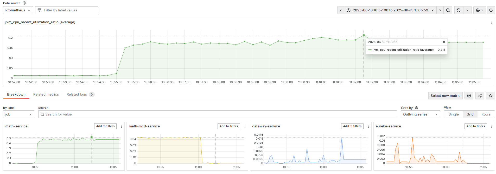

#### http\_server\_request\_duration\_seconds\_bucket

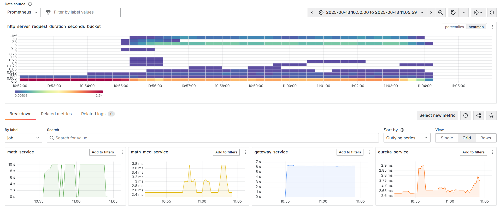

#### http\_client\_request\_duration\_seconds\_bucket

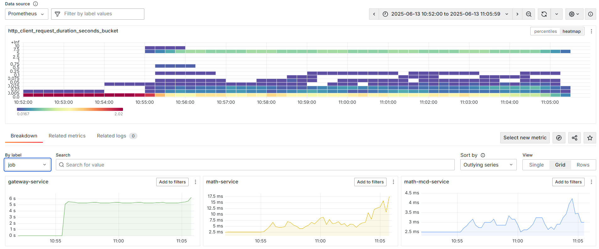

#### JVM\_THREAD\_COUNT
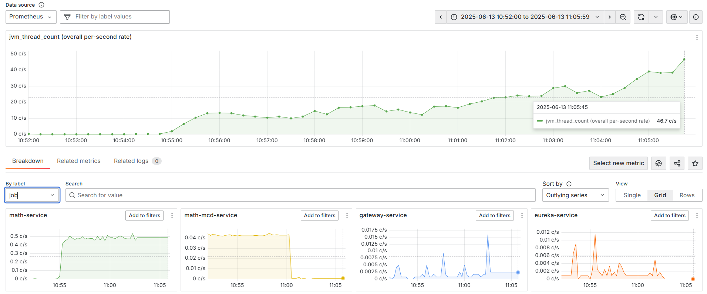


## Adding faults

_What if we add some faults?_
We can consider the mid-load scenario to do the simulations...

Only to have an overview we can consider a 40% of faults.

```bash
echo 'GET http://127.0.0.1:8080/mcd?a=18&b=12&times=1000000&faults=40' | vegeta attack -duration=180s --rate=3 -timeout=120s | vegeta report
```
**OUTPUT**
```
Requests      [total, rate, throughput]  540, 3.01, 0.05
Duration      [total, attack, wait]      4m45.9751028s, 2m59.6662637s, 1m46.3088391s
Latencies     [mean, 50, 95, 99, max]    1m3.242639883s, 1m4.299247118s, 1m59.730385527s, 2m0.00077797s, 2m0.0072698s
Bytes In      [total, mean]              1079, 2.00
Bytes Out     [total, mean]              0, 0.00
Success       [ratio]                    2.59%
Status Codes  [code:count]               0:26  200:14  500:19  503:481
Error Set:
503
500
Get "http://127.0.0.1:8080/mcd?a=18&b=12&times=1000000&faults=40": context deadline exceeded (Client.Timeout exceeded while awaiting headers)
```

As expected with no resiliency patterns most of the requests has failed with errors or timed out. Taking a look in Loki logs we can see:

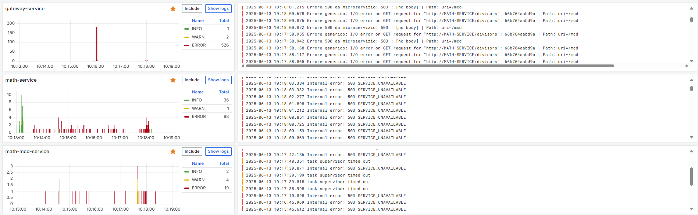

If we see the metrics of errors for both microservices that we've defined for examine this scenario:

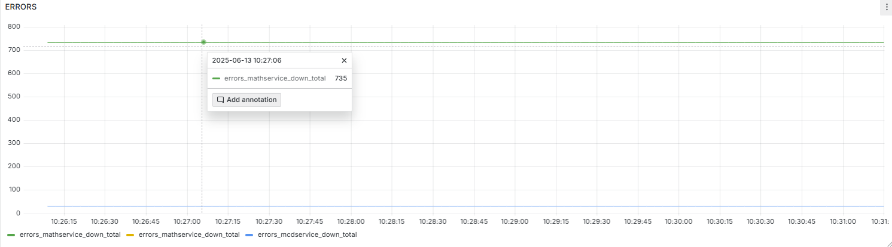

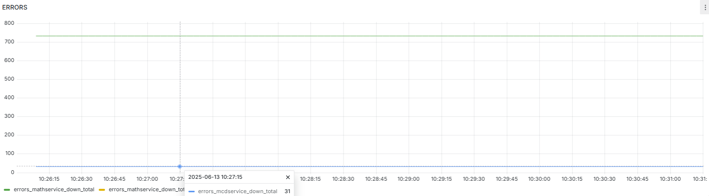
