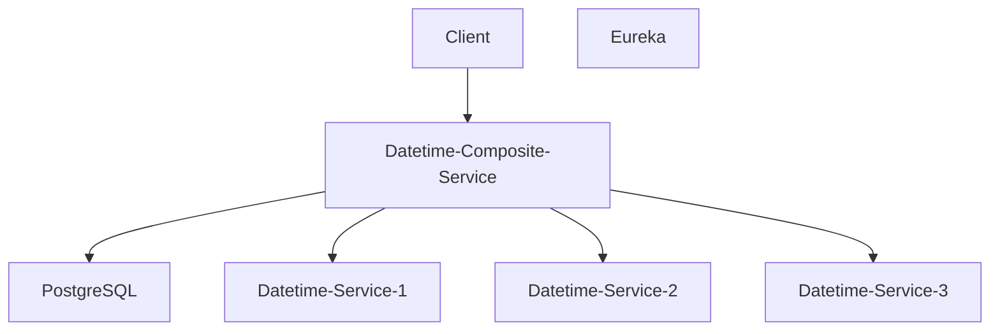

# Labs

## Lab 1: Implementing Resiliency Patterns

1. Develop a **datetime-service** that provides the current date and time based on the system clock.
   - `GET /date` → Returns the current date.
   - `GET /time` → Returns the current time.

2. Develop a **datetime-composite-service** that aggregates the current date and time by querying multiple instances of **datetime-service**.
   - `GET /datetime` → Returns the current date and time.

3. Integrate **datetime-composite-service** with PostgreSQL for fetching additional data associated with each date. PostgreSQL has to be "protected" with a Redis cache. 
- `GET /datetimeWithInfo` → Returns the current date, time, and additional infos (related to the date) queried from a PostgreSQL database.

4. Implement resilience mechanisms to enhance system reliability:
   - Utilize Eureka service discovery and client-side load balancing to identify and route requests to healthy instances of **datetime-service**.
   - Retry synchronous requests to **datetime-service** up to three times before marking them as failed.
   - Integrate a circuit breaker within **datetime-composite-service** to trigger a fail-fast fallback mechanism when 50% of requests fail.
   - Enforce a rate limit of 100 synchronous requests per minute to **datetime-service**.
   - Configure **datetime-service** with two distinct thread pools, one for each endpoint.

5. Validate the effectiveness of the implemented resilience strategies using HTTP testing tools such as `curl` or `vegeta`.

# Questions
1. What is resiliency, and why is it essential in distributed systems?
2. Describe the *one thread per request* pattern and its key issues (i.e., thread pool/memory saturation).
3. Which are the most used alternatives to the *one thread per request* pattern? Highlight their key features and mutual differences.
4. Describe the difference between client-side and server-side resiliency patterns.
5. Describe the most used client-side resiliency patterns. 
6. Describe the most used server-side resiliency patterns.
7. Describe pros and cons of *fixed-window*, *sliding-window*, *leaky bucket* policies for circuit breaker implementations.
8. What is a fallback mechanism and how does it relate with the circuit breaker pattern?
9. What is Redis persistence, and how does it ensure data durability? Describe the differences between RDB, AOF, and hybrid persistence.
10. Explain how Redis multi-node deployments work. What are the benefits and limitations of using replicas in a Redis setup?
11. Discuss the key caching patterns, and the role of Redis as a caching solution. 
