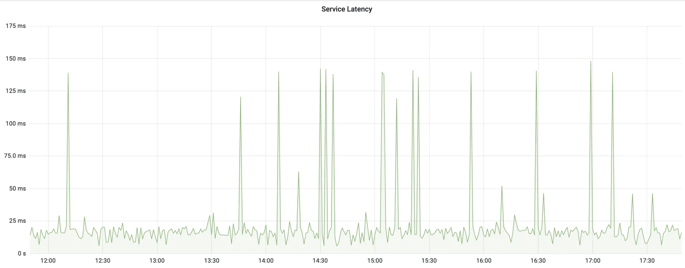

# Microservices resiliency

## What is Resilience?
**Microservices are distributed in nature**. When you work with distributed systems, always remember this number one rule **anything could happen**. We might be dealing with network issues, service unavailability, application slowness etc. **An issue with one system might affect another system behavior/performance**. The capacity of a system to recover from such failures, remain functional, and avoid cascading failures to downstream services makes it **resilient**.

### Understanding the Importance of Resiliency
When it comes to building resilient systems, most software engineers only take into account the complete failure of a piece of infrastructure or critical service. **They focus on building redundancy into each layer of their application** using techniques such as:
* clustering key servers
* load balancing between services
* segregating infrastructure into multiple locations

However, when a service is running slow, detecting that poor performance and routing around it is often difficult:
* Service degradation can start out as intermittent and then build momentum. Service degradation might also occur only in small bursts. **The first signs of failure might be a small group of users complaining about a problem until, suddenly, the application container exhausts its thread pool and collapses completely.**
* Calls to remote services are usually synchronous and imply a wait for the service to return. **The caller has no concept of a timeout to keep the service call from hanging.**
* **Applications are often designed to deal with complete failures of remote resources, not partial degradations**. Often, as long as the service has not entirely failed, an application will continue to call a poorly behaving service and won’t fail fast. In this case, the calling service is at risk of crashing because of resource exhaustion. 

What’s insidious about problems caused by **poorly performing remote services is that they are not only difficult to detect but can trigger a cascading effect that can ripple throughout an entire application ecosystem**. Without safeguards in place, a single, poorly performing service can quickly take down entire applications. 

Resiliecy key features:
* **Enhanced User Experience**: Resilient applications continue functioning and serving users even when failures occur, ensuring a seamless user experience.
* **Business Continuity**: By handling failures gracefully, resilient applications ensure business continuity and minimize the impact of disruptions on critical operations.
* **Scalability and Performance**: Resilient applications are designed to scale and handle varying loads, enabling them to meet user demands efficiently.
* **System Stability**: Resilient systems are better equipped to recover from failures, reducing downtime and enhancing overall system stability.

## Client-side resiliency patterns
**Client-side resiliency software patterns focus on protecting a client of a remote resource (another microservice call or database lookup) from crashing when the remote resource fails because of errors or poor performance**. These patterns allow the client to fail fast and not consume valuable resources, such as database connections and thread pools. 

### Client-side load balancing

Client-side load balancing involves having the client look up all of a service’s individual instances from a service discovery agent (like Netflix Eureka) and then caching the physical location of said service instances.

When a service consumer needs to call a service instance, the client-side load balancer returns a location from the pool of service locations it maintains. Because the client-side load balancer sits between the service client and the service consumer, the load balancer can detect if a service instance is throwing errors or behaving poorly. **If the client-side load balancer detects a problem, it can remove that service instance from the pool of available service locations and prevent any future calls from hitting that service instance.**

### Circuit breaker

**The Circuit Breaker pattern is a crucial pattern in making synchronous communication in microservices more resilient. It acts as a safety mechanism that monitors the availability and responsiveness of dependent services.** The Circuit Breaker maintains a state based on the success or failure of previous requests. If the response indicates a failure, such as a timeout or an error, the Circuit Breaker opens the circuit, preventing further requests from being sent to the failing service. **This avoids overwhelming the failing service and reduces the risk of cascading failures throughout the system.**

The key features of a circuit breaker are as follows:

* If a circuit breaker detects too many faults, it will open its circuit not allowing new calls.
* When the circuit is open, a circuit breaker will perform **fail-fast logic**. This means that it does not wait for a new fault to happen but, instead, it redirects the calls to a **fallback method**.
* After a while, the circuit breaker will be half-open, allowing new calls to see whether the issue that caused the previous failures is still there. If new failures are detected by the circuit breaker, it will open the circuit again and go back to the fail-fast logic. Otherwise, it will close the circuit and go back to normal operation.

There are several rate limiting strategies:

* **Fixed Window**: In this strategy, a fixed number of requests are allowed within a specific time window. Once the limit is reached, requests are rejected until the next time window. However, this approach can block requests unfairly during high traffic periods.
* **Sliding Window**: The sliding window approach, also known as the token bucket algorithm, works by continuously refilling a bucket of tokens that represent the allowed number of requests during a time period. When a request arrives, a token is consumed. If the bucket is empty, the request is rejected. This method allows for more flexible handling of varying traffic conditions.
* **Leaky Bucket**: Similar to the token bucket, the leaky bucket algorithm imposes rate limits by emptying the bucket at a fixed rate. Incoming requests are added to the bucket, and if the bucket overflows, requests are rejected. This strategy enforces a consistent processing pace at the service.

### Fallback processing
**With the fallback pattern, when a remote service call fails, rather than generating an exception, the service consumer executes an alternative code path and tries to carry out the action through another means.**

For instance, let’s suppose you have an e-commerce site that monitors your user’s behavior and gives them recommendations for other items they might want to buy. If the preference service fails, your fallback might be to retrieve a more general list of preferences that are based on all user purchases from a different service and data source.

### Retry
When a request fails, the Retry pattern initiates a retry mechanism, which can be configured with a certain number of retries and backoff strategies. The following circumstances have to be understood before applying this pattern:

* **Non-idempotent operations** can cause unintended side effects if retried multiple times. Examples include operations that modify data, perform financial transactions, or have irreversible consequences. Retrying such operations can lead to data inconsistency or duplicate actions.
* **Circuit breaker**: always consider implementing circuit breakers when enabling retry. When failures are rare, that's not a problem. Retries that increase load can make matters significantly worse.
* **Exponential backoff/jitter**: Implementing exponential backoff can be an effective retry strategy. It involves increasing the delay between each retry attempt exponentially, reducing the load on the failing service and preventing overwhelming it with repeated requests. Here is a good article on how [AWS SDKs support exponential backoff and jitter](https://aws.amazon.com/blogs/architecture/exponential-backoff-and-jitter/) as a part of their retry behaviour.

| Exponential backoff                             | Exponential backoff + jitter                      |
|-----------------------------------|---------------------------------------------------|
|  |  |

* **Time-sensitive operations**: Retries may not be appropriate for time-critical operations. Retries might not work well where latency's 99th percentile is close to 50th percentile. Look at the graphs below. On the first one, timeouts occasionally happens, a good case for enabling retries. On the second graph, timeouts happen periodically, do not enable retries.

| Retry suitable                    | Retry not suitable                    |
|-----------------------------------|---------------------------------------|
|  |  |

### Timeout

It introduces a time limit for synchronous operations, ensuring that requests do not wait indefinitely for a response. When a service makes a request to a dependent service, a timeout value is set. **If a response is not received within the specified time, the operation is considered failed, and appropriate actions can be taken. By setting appropriate timeouts, services can avoid getting stuck in unresponsive states and prevent bottlenecks in the system.**

Typically, the most difficult problem is choosing a timeout value to set:
* **Setting a timeout which is too high** reduces its usefulness, because resources are still consumed while the client waits for the timeout
* **Setting a timeout which is too low** might increase traffic on the backend and latency because too many requests are retried. It might also lead to a complete outage, because all requests start being retried.

**A good practice for choosing a timeout is to start with the latency metrics of the downstream service**. When we make one service call another service, we choose an acceptable rate of false timeouts (such as 0.1%). Then, we set the timeout at the corresponding latency percentile (99.9th percentile in this example).

TODO: Show how to measure service latency with jperf

### Bulkhead

A ship is split into small multiple compartments using Bulkheads. Bulkheads are used to seal parts of the ship to prevent entire ship from sinking in case of flood. Similarly, failures should be expected when we design software. The application should be split into multiple components and resources should be isolated in such a way that failure of one component is not affecting the other.

**The thread pools act as the bulkheads for your service**. Each remote resource is segregated and assigned to a thread pool. If one service is responding slowly, the thread pool for that type of service call can become saturated and stop processing requests. **Assigning downstream services to different thread pools helps in confining resource exhaustion to specific thread pools instead of the whole service**.

For example: Lets assume that there are 2 services A and B. Service A has very limited resources (say 5 threads). It can process only 5 concurrent requests with its available threads. Service A has 2 sets of APIs as shown below.

* /a/b – depends on Service B (which is slow sometimes)
* /a – depends on Service A
  
When there are multiple concurrent requests to Service A, say 10, 5 of them are for endpoint /a/b and 5 of them are for endpoint /a, there is a chance that Service A might use all its threads to work on the requests for /a/b and block all the 5 threads.

Even though the remaining requests are for /a which does not have any other service dependency, Service A does not have free threads to work on the requests (resource exhaustion)! Service B slowness indirectly affects Service A performance as well.

**Bulkhead Pattern helps us to allocate limit the resources which can be used for specific services so that resource exhaustion can be reduced.**

### Caching

The Caching pattern is a valuable technique for improving the performance and scalability of microservices in synchronous communication. **It involves storing frequently accessed data or computation results in a cache, which is a high-speed storage system, to serve subsequent requests more quickly.**

**By caching data, microservices can reduce the need for repeated, expensive operations, such as retrieving data from a database or performing complex computations**. Instead, the cached results can be directly served, significantly improving response times and overall system performance.

**Caching improves scalability by offloading the workload from backend systems.** By serving cached data, microservices can handle more requests without overloading the underlying resources, ensuring that the system remains responsive even under high traffic conditions.

**Caching also improves resiliency because services can continue to serve requests even if their backend systems are temporarily unavailable**. This improves fault tolerance and ensures that the system can gracefully handle disruptions.

TODO: code example is missing (https://github.com/fpivetti/Spring-Data-Redis-Cache)

## Server-side resiliency patterns

### Rate Limiter

**The Rate Limiting pattern is a powerful technique for making synchronous communication in microservices more resilient by controlling the rate at which requests are made to a service**. It sets limits on the number of requests that can be processed within a specific time period, ensuring that a service is not overwhelmed by excessive traffic.

By implementing rate limiting, microservices can protect themselves from being overloaded, prevent resource exhaustion, and maintain optimal performance. It allows services to handle requests within their capacity and ensures fair distribution of resources among clients.

When implementing the Rate Limiting pattern, **it is crucial to consider factors such as the maximum allowed requests per unit of time and different rate-limiting strategies, such as fixed windows or sliding windows (see circuit breaker strategies)**. The careful configuration ensures that the rate limits are appropriate for the service's capabilities and the expected load.

Three types of attacks that can be prevented by rate limiting are:
* **DDoS attacks** - Distributed Denial of Service (DDoS) attacks involve sending a massive number of requests to a system or service to overwhelm it, causing it to become unresponsive or unavailable. 
* **Brute force attacks** - Brute force attacks involve repeatedly attempting to guess login credentials or other sensitive information by using automated tools to send a large number of requests. 
* **API abuse** - API abuse involves sending a large number of requests to an API with the intention of extracting large amounts of data or causing resource exhaustion.

## Resources
- https://www.baeldung.com/resilience4j
- https://www.baeldung.com/spring-boot-resilience4j
