# Microservices Resiliency

## What is Resilience?

In distributed systems, **anything can happen**: network failures, service crashes, slow responses, or unexpected load spikes.
(*Remember the [Fallacies of Distributed Systems](../../communication-sync/slides/0%20-%20Fallacies%20of%20distributed%20computing.md)!*)

> An issue in one system can propagate and **affect the behavior and performance of others**.

**Resilience** is the system’s ability to:

* **Recover from failures**
* **Continue operating** despite partial failures
* **Prevent cascading failures** across services

> Think of resilience as a combination of **fault-tolerance**, **graceful degradation**, and **self-healing**.

---

## Thread-Related Risks

### One Thread Per Request

**Traditional synchronous model**:

* Service A assigns a **dedicated thread** to handle each request to Service B.
* The thread is **blocked while waiting**, consuming memory and some CPU.
  ([Spring Boot Starter Web](https://mvnrepository.com/artifact/org.springframework.boot/spring-boot-starter-web)) enables this model.

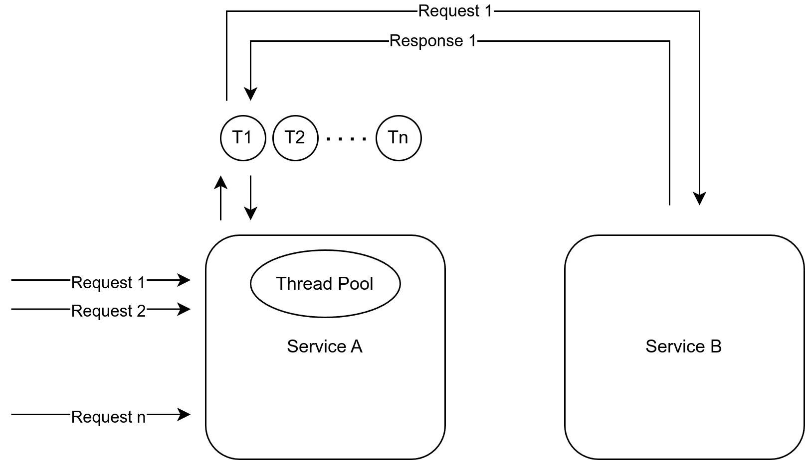

**Problems at scale:**

1. **Memory consumption:** Each thread uses ~2MB; thousands of concurrent requests quickly consume gigabytes.
2. **Thread pool saturation:** Once the pool (`server.tomcat.threads.max`) is full, new requests queue → increased latency → potential rejection (DoS).
3. **Resource inefficiency:** Idle threads still consume CPU to manage scheduling, leaving less CPU for actual work.

> This model works for low-to-medium traffic but can **collapse under high load or slow downstream services**.

---

### Reactive Programming

**Idea:** Handle requests asynchronously with **non-blocking I/O**.

* Operations like DB queries or HTTP calls **don’t block threads**.
* Instead, a **callback** resumes the operation once data is ready.
  ([Spring Boot WebFlux](https://mvnrepository.com/artifact/org.springframework.boot/spring-boot-starter-webflux), [Quarkus](https://quarkus.io/), [FastAPI](https://fastapi.tiangolo.com/))

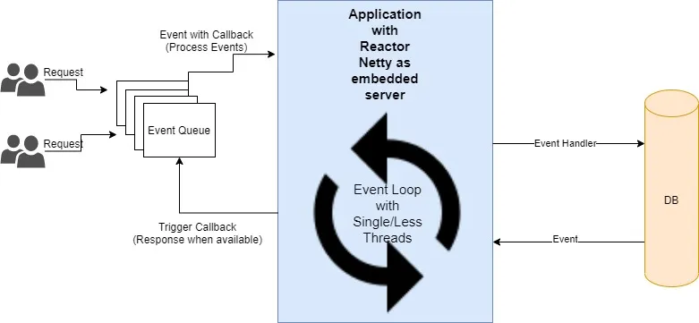

**Key benefits:**

* **High concurrency with fewer threads** → can handle thousands of requests on limited hardware
* **Better CPU utilization** → threads do actual computation instead of waiting
* **Scalability** → reactive streams can **propagate backpressure**, preventing downstream overload

**Example:** Instead of waiting for a DB response, the system subscribes to a **Publisher** and resumes only when data arrives.

---

### Java Virtual Threads

**A modern alternative to both thread-per-request and reactive models.**

* Lightweight threads managed by the **JVM**, not the OS.
* Traditional **blocking code can be used**, but at massive scale.

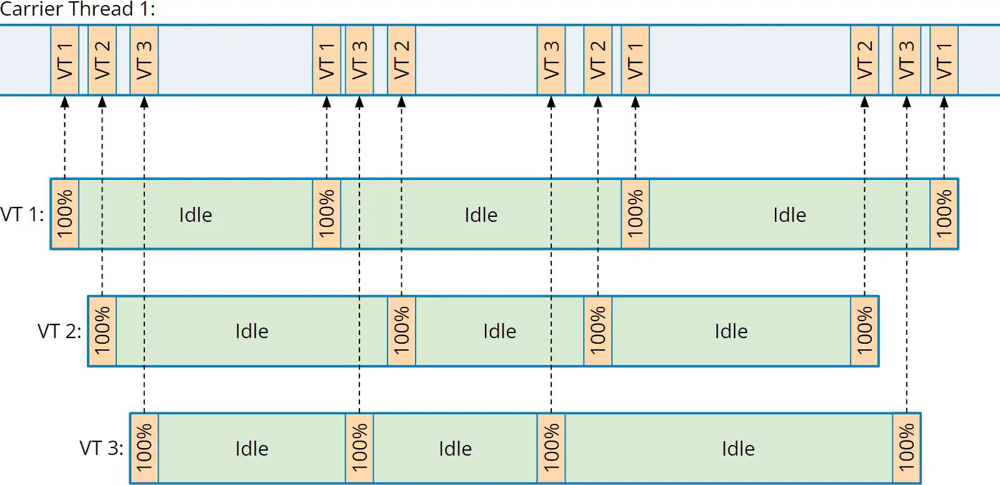

**Key features:**

* **Cheap to create and manage:** thousands of virtual threads possible with minimal overhead.
* **Simplifies code:** no callback chains or reactive frameworks needed.
* **Compatible with existing libraries:** works with blocking I/O libraries without rewriting code.

> Best for teams who want **simplicity + high concurrency**, without learning reactive paradigms.

---

### Concurrency → Resilience

Concurrency models improve **resource efficiency**, but they **don’t automatically prevent cascading failures**.

* Slow/failing downstream services can **still consume resources**.
* Requests can **pile up**, increasing latency and memory usage.
* Failures can **propagate**, bringing multiple services down.

**Resiliency patterns** are required to **detect, contain, and recover from failures**.

---

## Why Resiliency Matters

Building resilient systems is **not just about threads or efficiency**, it’s about maintaining service despite **partial failures**.

**Key considerations:**

* **Infrastructure failures** – servers, databases, networks, or entire services can fail unexpectedly.
* **Redundancy across layers** – replicate services, distribute data, and deploy across multiple locations.

**Techniques:**

* **Clustering & load balancing** between services
* **Infrastructure segregation** across regions or availability zones
* **Monitoring and alerting** to detect anomalies early

**Subtle risks:**

* Intermittent slowness can **snowball into outages**.
* Clients without **timeouts or circuit breakers** may keep waiting → threads and connections get exhausted.

> Efficient concurrency alone **does not make a system resilient**.

---

### Real-World Example

A minor NAS configuration change caused:

1. Inventory service reads slowed dramatically
2. Organization service threads and DB connections were **exhausted**
3. Licensing service calls queued → **cascading failure across three services**

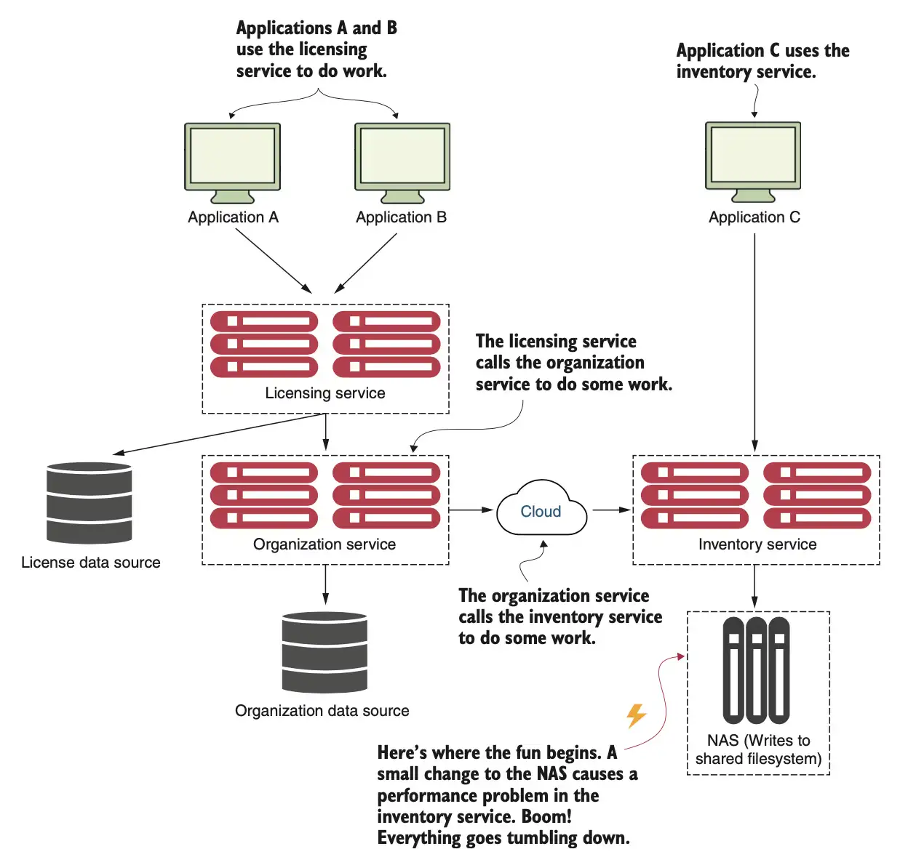

> Single slow service → ripple effect → entire application ecosystem impacted.

---

### State of Resilience 2025 Survey

* **95%** aware of operational weaknesses
* **84%** lost ≥$10,000 due to outages
* **55%** experienced weekly disruptions
* **39%** reported employee burnout from outages

> Outages are frequent, costly, and damaging to both business and staff morale.

---

## Client-Side Resiliency Patterns

Protect **clients** from remote service failures and reduce **resource waste**.

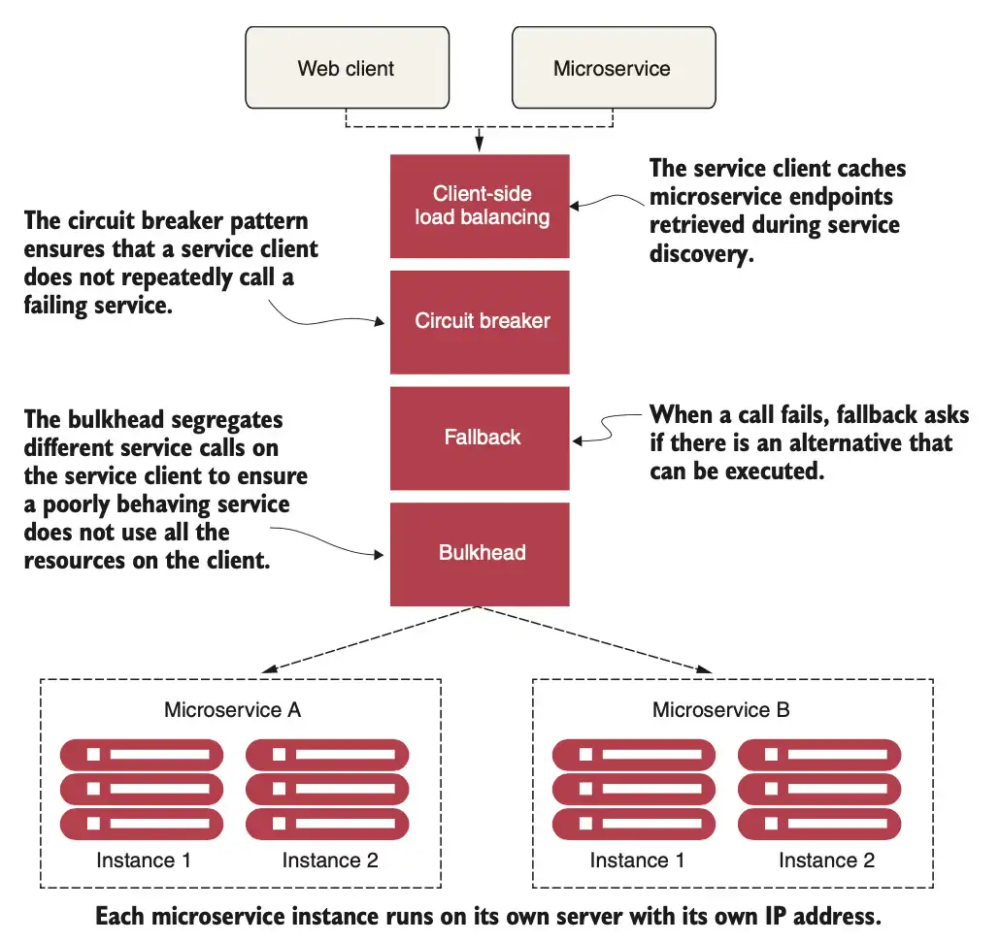

---

### Load Balancing

* Client maintains **cache of service instances** (via Eureka or similar).
* Removes failing instances dynamically.

**Benefit:** Prevents requests from hitting unhealthy services, reducing cascading failures.

---

### Circuit Breaker

Monitors dependent services and **fails fast** if unhealthy.

* **Open:** block calls, use fallback
* **Half-open:** test if service recovered
* **Closed:** normal operations

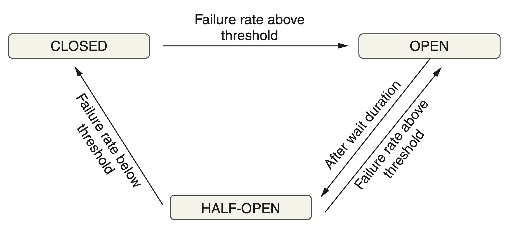

**Fixed Window**

* Count failures in fixed intervals (e.g., 10s).
* Open circuit if threshold exceeded.
* **Pros:** Simple. **Cons:** Slow to detect bursts at window edges.

**Sliding Window**

* Continuously track failures over a rolling period.
* Open circuit if failure ratio exceeds threshold.
* **Pros:** Fast detection. **Cons:** Sensitive to short bursts.

**Leaky Bucket**

* Failures accumulate in a “bucket” that leaks over time.
* Open circuit if bucket fills up.
* **Pros:** Smooths bursts. **Cons:** Needs tuning (bucket size/leak rate).

---

### Fallback

* Execute alternative logic when remote calls fail
* Prevents **exceptions from crashing clients**

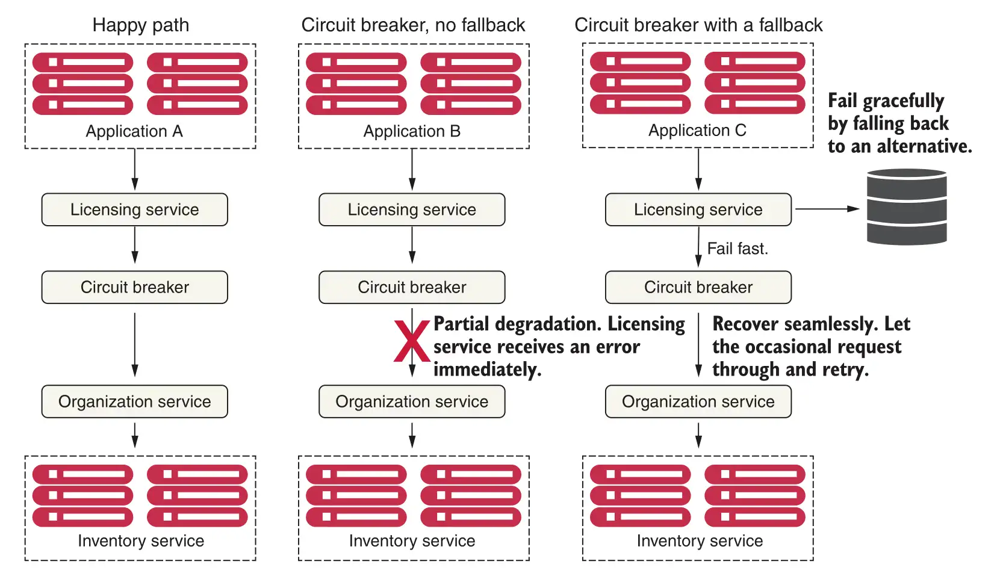

**Example:** Return cached data or default values if a service is down.

---

### Retry

* Retry failed requests **with backoff**
* Important: **only for idempotent operations**
* Use **circuit breakers** to avoid retry storms
* **Exponential backoff + jitter** smooths traffic spikes

| Retry suitable                    | Retry not suitable                    |
| --------------------------------- | ------------------------------------- |
| 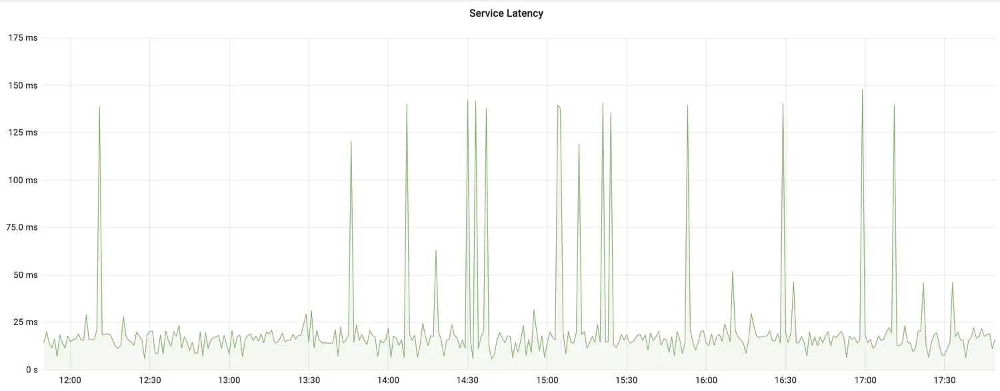 | 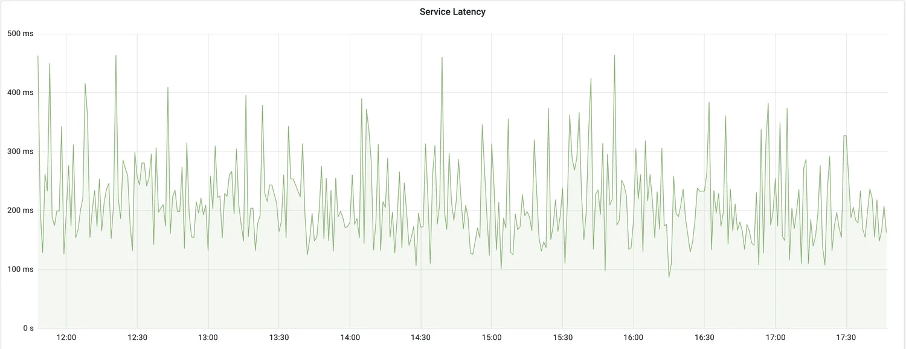 |

**Tip:** Avoid retries for **time-critical operations**; failing fast is often better.

---

### Timeout

* Set maximum wait for synchronous calls
* **Too high:** wastes resources
* **Too low:** triggers unnecessary retries → latency spikes

**Best practice:** use **high-percentile latency metrics** (e.g., 99.9th percentile) to choose timeouts.

---

### Bulkhead

**Isolate resources per dependency** to prevent one slow service from consuming all resources.

* Different thread pools or connection pools per downstream service
* Failures confined → other parts remain operational

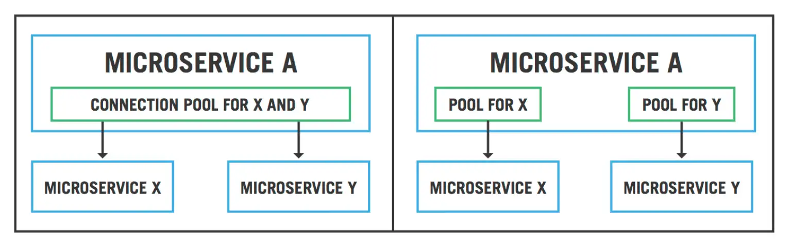

**Example:** Service A with `/a/x` (slow) and `/a/y` (fast).

Without bulkheads → `/a/x` consumes all threads → `/a/y` blocked.

With bulkheads → `/a/x` threads isolated → `/a/y` continues.

---

## Server-Side Resiliency Patterns

### Rate Limiter

Controls the **rate of incoming requests**.

* Prevents overload, DoS attacks, and unfair resource usage
* Strategies: fixed window, sliding window

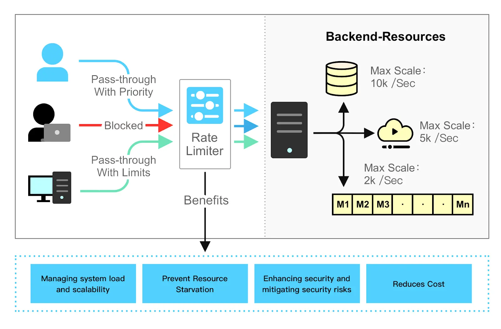

**Load Shedding vs Rate Limiting:**

* **Rate Limiting:** throttle **before processing**
* **Load Shedding:** drop requests **when overloaded**

---

## Resources

* *Microservices with Spring Boot 3 and Spring Cloud* – Chapter 13
* [YouTube Video on Microservices Resiliency](https://www.youtube.com/watch?v=sNzxX45zhJY)
* AWS Article: [Exponential Backoff and Jitter](https://aws.amazon.com/blogs/architecture/exponential-backoff-and-jitter/)

