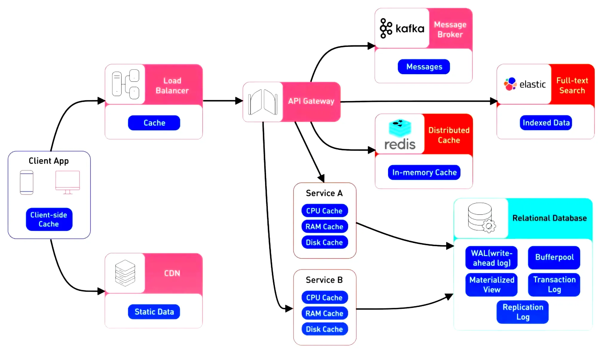

# Microservices resiliency

## What is Resilience?
**Microservices are distributed in nature**. When you work with distributed systems, always remember this number one rule **anything could happen**. We might be dealing with network issues, service unavailability, application slowness etc. (remember [Fallacies of Distributed Systems](../../communication/slides/0%20-%20Fallacies%20of%20distributed%20computing.md)!) **An issue with one system might affect another system behavior/performance**. The capacity of a system to recover from such failures, remain functional, and avoid cascading failures makes it **resilient**.

## Thread-related risks

### One Thread Per Request Design Pattern

In this model, when a client sends a request to a server (e.g., via HTTP), the server creates or assigns a dedicated thread to handle that request. The thread is responsible for executing the necessary operations (e.g., database queries, computations) and preparing the response to send back to the client. These are often **I/O-bound operations** that can take some time to complete.

During these I/O operations, the thread is **blocked**, meaning it cannot proceed with the next steps until the operation is finished. While blocked, the thread remains in a **waiting state**, simply consuming system resources without doing any actual work. [Spring Boot Starter Web](https://mvnrepository.com/artifact/org.springframework.boot/spring-boot-starter-web) is the key starter dependency to enable this traditional paradigm.

This is problematic for the following reasons:

1. **Memory Consumption**: Even though the thread is waiting and not using CPU resources, it still occupies memory (1MB each approximately), which increases with the number of concurrent requests.

2. **Thread Pool Saturation**: If many threads are simultaneously waiting for I/O to complete, the thread pool can become exhausted or saturated (see `server.tomcat.threads.max` property). When no free threads are available, the system may queue incoming requests, leading to increased response times, or even reject new requests altogether (**DoS**).

3. **Resource Inefficiency**: Having a large number of threads that are mostly idle (waiting for I/O) leads to inefficient use of system resources. The system could be using the available CPU and memory more effectively to handle more requests or perform useful work, but instead, these resources are tied up by threads in a waiting state.

### Reactive Programming as a Solution

Instead of dedicating one thread per request, reactive applications handle requests via event-driven models. Operations that would typically block a thread (such as waiting for I/O) are handled asynchronously. When a response is ready (e.g., when data from a database becomes available), a callback mechanism resumes the computation. [Spring Boot Starter WebFlux](https://mvnrepository.com/artifact/org.springframework.boot/spring-boot-starter-webflux) is the key starter dependency to enable the reactive paradigm. Take a look at [Quarkus](https://quarkus.io/) as an example of a fully-reactive microservices framework.

**Key Features**:
- **Non-blocking I/O**: Instead of a thread waiting for I/O operations (e.g., database or network calls), the system registers a callback to handle the operation once it's done, freeing up the thread for other work.
- **Efficient Resource Usage**: By leveraging non-blocking I/O, a reactive system can handle many more concurrent requests with fewer threads.
- **Scalability**: Reactive systems scale better because they can handle higher loads without a significant increase in resource consumption.

### Java Virtual Threads as a Solution

Java Virtual Threads, offer an alternative solution. Unlike platform (OS) threads, which are heavy-weight and tied to the underlying operating system, virtual threads are light-weight and managed by the JVM itself. Virtual threads allow Java applications to create a large number of concurrent threads without the usual overhead associated with traditional threads.

**Key Features**:
- **Lightweight**: Virtual threads are much cheaper to create and manage than platform threads, allowing thousands or even millions of threads to be created without significant resource strain.
- **No Need for Callbacks**: Unlike reactive programming, where callbacks are often used, virtual threads allow traditional, synchronous-looking code to be written, avoiding the complexity and cognitive overhead of managing asynchronous callbacks.

## Understanding the Importance of Resiliency
When it comes to building resilient systems, focus usually on:
* **Complete failure of a piece of infrastructure.** 
* **Building redundancy into each layer of their application**.

Techniques:
* clustering/load balancing between services
* segregating infrastructure into multiple locations

However, detecting and avoiding service degradation is often difficult:
* **Service degradation can start out as intermittent and then quickly build momentum**.
* The caller has **no concept of a timeout** to keep the service call from hanging.
* **Applications are often designed to deal with complete failures of remote resources**, not partial degradations. Often, as long as the service has not entirely failed, an application will continue to call a poorly behaving service and won’t fail fast. In this case, the calling service is at risk of crashing because of resource exhaustion.

**Poorly performing remote services are not only difficult to detect but can trigger a cascading effect (callers might exhaust their thread pools!) that can ripple throughout an entire application ecosystem**. Without safeguards in place, a single, poorly performing service can quickly take down entire applications.

### A real-world story

In the scenario above, three applications are communicating in one form or another with three different services. Applications A and B communicate directly with the licensing service. The licensing service retrieves data from a database and calls the organization service to do some work for it.

The organization service retrieves data from a completely different database platform and calls out to another service, the inventory service, from a third-party cloud provider, whose service relies heavily on an internal Network Attached Storage (NAS) device to write data to a shared filesystem. Application C directly calls the inventory service.

Over the weekend, a network administrator made what they thought was a small tweak to the configuration on the NAS. This change appeared to work fine, but on Monday morning, reads to a particular disk subsystem began performing exceptionally slow.

The developers who wrote the organization service never anticipated slowdowns occurring with calls to the inventory service. They wrote their code so that the writes to their database and the reads from the service occur within the same transaction. When the inventory service starts running slowly, not only does the thread pool for requests to the inventory service start backing up, the number of database connections in the service container’s connection pools becomes exhausted. These connections were held open because the calls to the inventory service never completed.

Now the licensing service starts running out of resources because it’s calling the organization service, which is running slow because of the inventory service. Eventually, all three services stop responding because they run out of resources while waiting for the requests to complete.

### State of Resilience 2025 Survey
The [State of Resilience 2025 Survey](../../../books/the-state-of-resilience-2025.pdf) conducted among 1,000 senior cloud architects, engineers, and technology executives across North America, EMEA, and APAC showed:

* **Widespread Operational Weaknesses**: 95% of executives are aware of existing operational weaknesses that leave their organizations vulnerable to financial and operational damage from unplanned outages. Nearly half (48%), however, admit their companies’ efforts are insufficient to address these issues.

* **High Cost of Service Disruption**: All surveyed organizations reported suffering outage-related revenue loss over the last twelve months, with 84% losing at least \$10,000. One-third indicated that their per-outage revenue loss ranged from \$100,000 to \$1,000,000 or more, highlighting the severe economic consequences when resilience measures fall short.

* **Frequent Outages are the New Normal**: Organizations reported experiencing 86 outages annually on average, with 55% experiencing disruptions at least once a week. Notably, 70% of large enterprises said their outages typically take 60 minutes or more to resolve – and almost half experienced downtime for two hours or more.

* **Internal and External Consequences**: The impact of unplanned outages goes far beyond financial losses; they also erode the confidence of consumers and business partners, and damage internal trust in IT teams. Even worse, frequent outages accelerate employee burnout, as 39% of respondents reported increased workloads from missed deadlines and accumulated requests.

* **Spotty Preparation**: Just one in three executives claimed their organizations have an organized approach to responding to downtime, and fewer than one-third conduct any failover testing. This lack of preparation exposes organizations to further risks while reinforcing the need for enhanced resilience strategies.

* **Overdue Investments in Resilience**: Overwhelmingly, participants stated a need for investment in operational resilience, especially in automation and AI-driven solutions (49%) and cloud infrastructure services (49%). These investments reflect a forward-looking mindset as organizations recognize the growing importance of AI in disaster prevention and outage recovery capabilities.

## Client-side resiliency patterns
**Client-side resiliency patterns focus on protecting a client of a remote resource (usually another microservice or a database) from crashing when the remote resource fails partially or completely**. These patterns allow the client to fail fast and not consume valuable resources (i.e., database connections, thread pools, memory). 

### Client-side load balancing

Client-side load balancing involves having the client look up all of a service’s instances from a service discovery agent (like Netflix Eureka) and then caching the physical location of said service instances.

When a service consumer needs to call a service instance, the client-side load balancer returns a location from the pool of service locations it maintains. **If the client-side load balancer detects a problem, it can remove that service instance from the pool of available service locations and prevent future calls from hitting that service instance.**

### Circuit breaker

**The Circuit Breaker pattern acts as a safety mechanism that monitors the availability and responsiveness of dependent services.** The Circuit Breaker maintains a state based on the success or failure of previous requests. If the response indicates a failure, such as a timeout or an error, the Circuit Breaker opens the circuit, preventing further requests from being sent to the failing service. **This avoids overwhelming the failing service and reduces the risk of cascading failures throughout the system.**

The key features of a circuit breaker are as follows:

* If a circuit breaker detects too many faults, it will open its circuit not allowing new calls.
* When the circuit is open, a circuit breaker will perform **fail-fast logic**. This means that it does not wait for a new fault to happen but, instead, it redirects the calls to a **fallback method**.
* After a while, the circuit breaker will be half-open, allowing new calls to see whether the issue that caused the previous failures is still there. If new failures are detected by the circuit breaker, it will open the circuit again and go back to the fail-fast logic. Otherwise, it will close the circuit and go back to normal operation.

To monitor the rate of failures and determine when to open or close, circuit breakers use time-based windowing mechanisms to track error counts. Three common methods are: **Fixed Window**, **Sliding Window**, and **Leaky Bucket**.

**Fixed Window**

The **fixed window** method divides time into regular, non-overlapping intervals (windows) of fixed duration (e.g., every 30 seconds or 1 minute). It tracks the number of successful and failed requests within each interval separately (**slow detection, can miss errors at window boundaries**).

Example:
- Window size: 1 minute.
- Failure threshold: 50%.
- If 100 requests occur in a 1-minute window, and more than 50 requests fail, the circuit breaker opens. Once the 1-minute window ends, the counts reset.

**Sliding Window**

A **sliding window** is similar to a fixed window, but instead of using discrete, non-overlapping windows, the sliding window continuously updates over time, giving more real-time failure tracking. The window "slides" as new requests come in, maintaining a record of failures and successes over a defined duration (**fast detection, might produce false positives in systems prone to bursts**).

Example:
- Window size: 1 minute.
- Failure threshold: 50%.
- The system tracks the last 1 minute of requests, recalculating the failure rate every second. If more than 50% of requests fail within any 1-minute period, the circuit breaker opens.

**Leaky Bucket**

The **leaky bucket** mechanism is inspired by a physical bucket with a hole at the bottom, where water (representing requests) leaks out at a constant rate. The bucket represents the capacity of the system to handle failures, and water drips in as requests fail. If the bucket fills up (reaches its limit), the circuit breaker opens.

The leaky bucket algorithm smooths out sudden bursts of errors, only triggering when failures consistently occur over time. It helps prevent spikes in traffic from overwhelming the system by gradually letting failures "leak" out (**designed to smooth out failures over time, good for systems prone to bursts of traffic/failures**).

Example:
- Bucket size: 100 failures.
- Leak rate: 1 failure every second.
- If failures occur faster than the leak rate (e.g., more than 1 failure per second), the bucket fills up. If it fills completely (100 failures), the circuit breaker opens.

### Fallback processing
**With the fallback pattern, when a remote service call fails, rather than generating an exception, the service consumer executes an alternative code path and tries to carry out the action through another means.**

For instance, let’s suppose you have an e-commerce site that monitors your user’s behavior and gives them recommendations for other items they might want to buy. If the preference service fails, a fallback mechanism could retrieve a more general list of preferences that are based on all user purchases from a different service.

### Retry
When a request fails, the Retry pattern initiates a retry mechanism, which can be configured with a certain number of retries and backoff strategies. The following circumstances have to be understood **before** applying this pattern:

* **Non-idempotent operations** can cause unintended side effects if retried multiple times. Retrying such operations can lead to data inconsistency or duplicate actions.
* **Circuit breaker**: always consider implementing circuit breakers when enabling retry. When failures are rare, that's not a problem. Instead, **retries that increase load can make matters significantly worse** (e.g., latency is high because bandwidth is saturated).
* **Exponential backoff/jitter**: It involves increasing the delay between each retry attempt exponentially, reducing the load on the failing service and preventing overwhelming it with repeated requests. Here is a [well written article](https://aws.amazon.com/blogs/architecture/exponential-backoff-and-jitter/) on how AWS SDKs support exponential backoff and jitter as a part of their retry behaviour.

| Exponential backoff                               | Exponential backoff + jitter                      |
|---------------------------------------------------|---------------------------------------------------|
|  |  |

* **Time-sensitive operations**: Retries may not be appropriate for time-critical operations. Retries might not work well where latency's 99th percentile is close to 50th percentile. Look at the graphs below. On the first one, timeouts occasionally happens, a good case for enabling retries. On the second graph, timeouts happen periodically, do not enable retries.

| Retry suitable                    | Retry not suitable                    |
|-----------------------------------|---------------------------------------|
|  |  |

Temporal heatmaps are often used to represent latency distribution over time.

### Timeout

It introduces a time limit for synchronous operations, ensuring that requests do not wait indefinitely for a response. When a service makes a request to a dependent service, a timeout value is set. **If a response is not received within the specified time, the operation is considered failed, and appropriate actions can be taken**. By setting appropriate timeouts, services can avoid getting stuck in unresponsive states and prevent bottlenecks in the system.

Typically, the most difficult problem is choosing a timeout value to set:
* **Setting a timeout which is too high** reduces its usefulness, because resources are still consumed while the client waits for the timeout
* **Setting a timeout which is too low** might increase traffic on the backend and latency because too many requests are retried. It might also lead to a complete outage, because all requests start being retried.

**A good practice for choosing a timeout is to start with the latency metrics of the downstream service**. When we make one service call another service, we choose an acceptable rate of false timeouts (such as 0.1%). Then, we set the timeout at the corresponding latency percentile (99.9th percentile in this example).

### Bulkhead

A ship is split into small multiple compartments using Bulkheads. Bulkheads are used to seal parts of the ship to prevent entire ship from sinking in case of flood. Similarly, failures should be expected when we design software. 

The application should be split into multiple components and resources should be isolated in such a way that failure of one component is not affecting the other.

**Having different thread pools act as the bulkheads for your service**. Each remote resource is segregated and assigned to a thread pool. If one service is responding slowly, the thread pool for that type of service call can become saturated, but resource exhaustion is confined instead of affecting the whole service.

For example: Lets assume that service A has very limited resources (5 threads, it can process only 5 concurrent requests). Service A has 2 sets of APIs as shown below.

* /a/x – depends on Service X (which is slow sometimes)
* /a/y – depends on Service Y
  
When there are multiple concurrent requests to Service A, say 10, 5 of them are for endpoint /a/x and 5 of them are for endpoint /a/y, there is a chance that Service A might use all its threads to work on the requests for /a/x and consume all the 5 threads.

Even though the remaining requests are for /a/y which is fast and available, Service A does not have free threads to work on the requests (resource exhaustion)! Service X slowness indirectly affects the whole Service A performance.

**Bulkhead Pattern helps us to allocate limit the resources which can be used for specific services so that resource exhaustion can be reduced.**

### Caching

The Caching pattern is a valuable technique for improving the performance and scalability of microservices in synchronous communication. **It involves storing frequently accessed data or computation results in a cache, which is a high-speed storage system, to serve subsequent requests more quickly.**

**By caching data, microservices can reduce the need for repeated, expensive operations, such as retrieving data from a database or performing complex computations**. Instead, the cached results can be directly served, significantly improving response times and overall system performance.

**Caching improves scalability by offloading the workload from backend systems.** By serving cached data, microservices can handle more requests without overloading the underlying resources, ensuring that the system remains responsive even under high traffic conditions.

**Caching also improves resiliency because services can continue to serve requests even if their backend systems are temporarily unavailable**. This improves fault tolerance and ensures that the system can gracefully handle disruptions.

## Server-side resiliency patterns

### Rate Limiter

**The Rate Limiting pattern controls the rate at which requests are made to a service**. It sets limits on the number of requests that can be processed within a specific time period, ensuring that a service is not overwhelmed by excessive traffic (DoS attacks). It allows services to handle requests within their capacity and ensures fair distribution of resources among clients.

When implementing the Rate Limiting pattern, **it is crucial to consider factors such as the maximum allowed requests per unit of time and different rate-limiting strategies, such as fixed windows or sliding windows (see circuit breaker strategies)**. The careful configuration ensures that the rate limits are appropriate for the service's capabilities and the expected load.

## Resources
- Microservices with Spring Boot 3 and Spring Cloud (Chapter 13)

