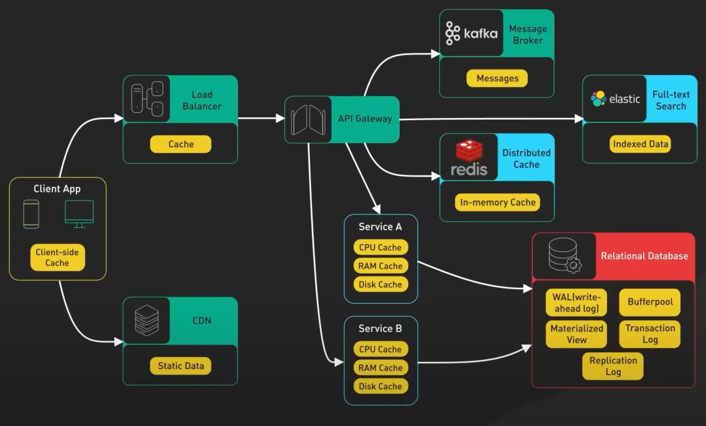
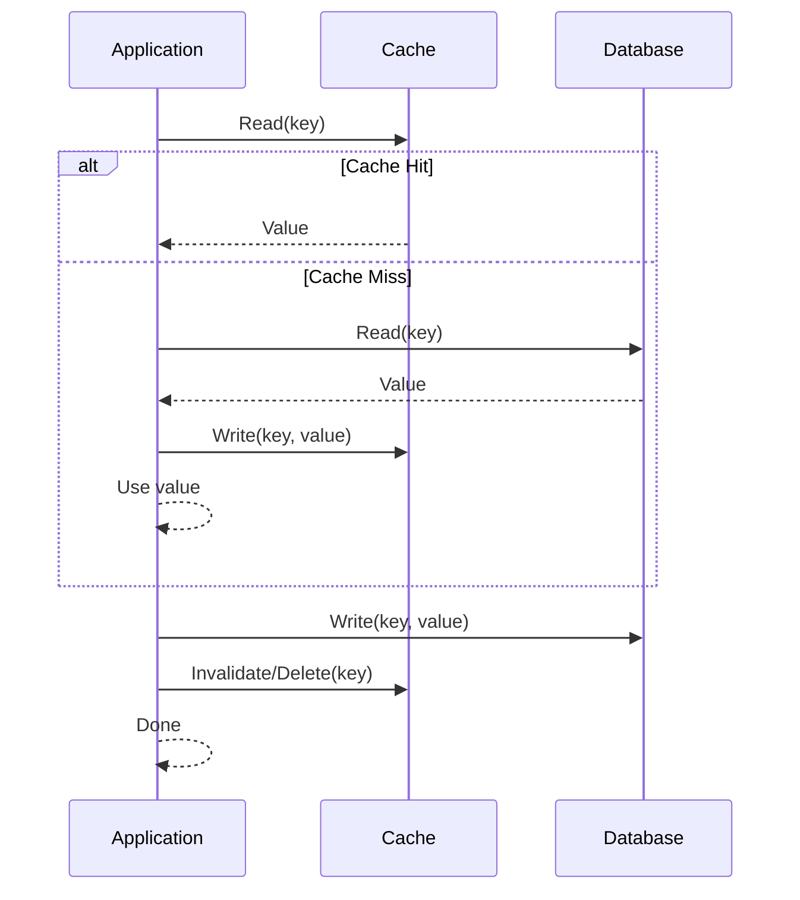
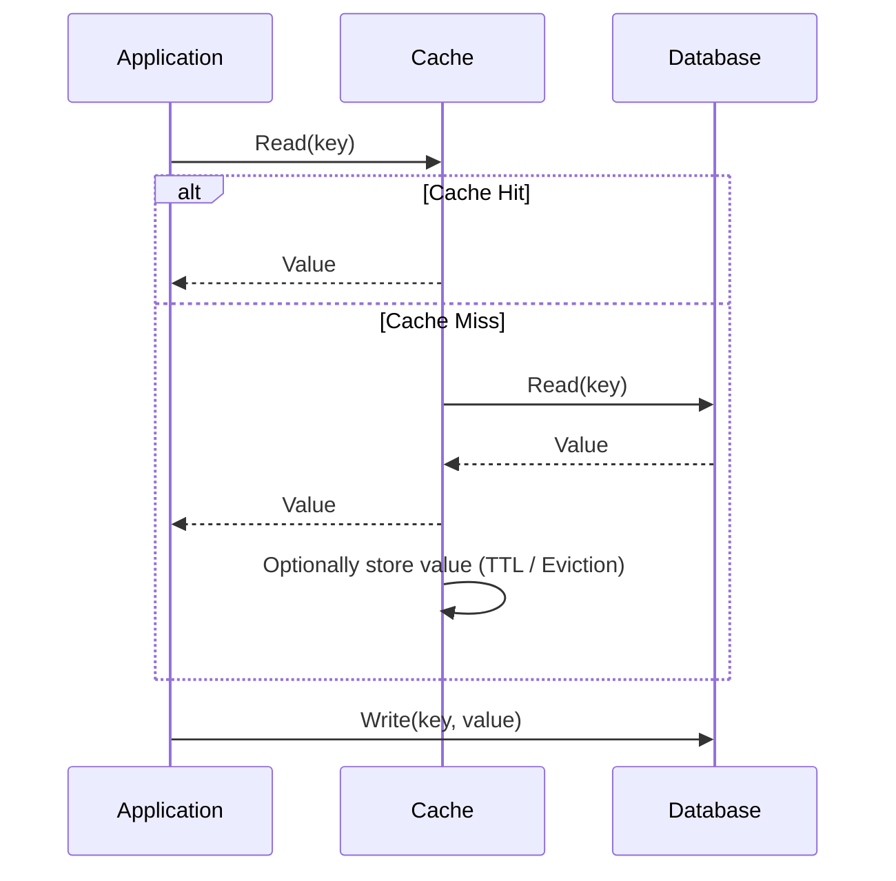
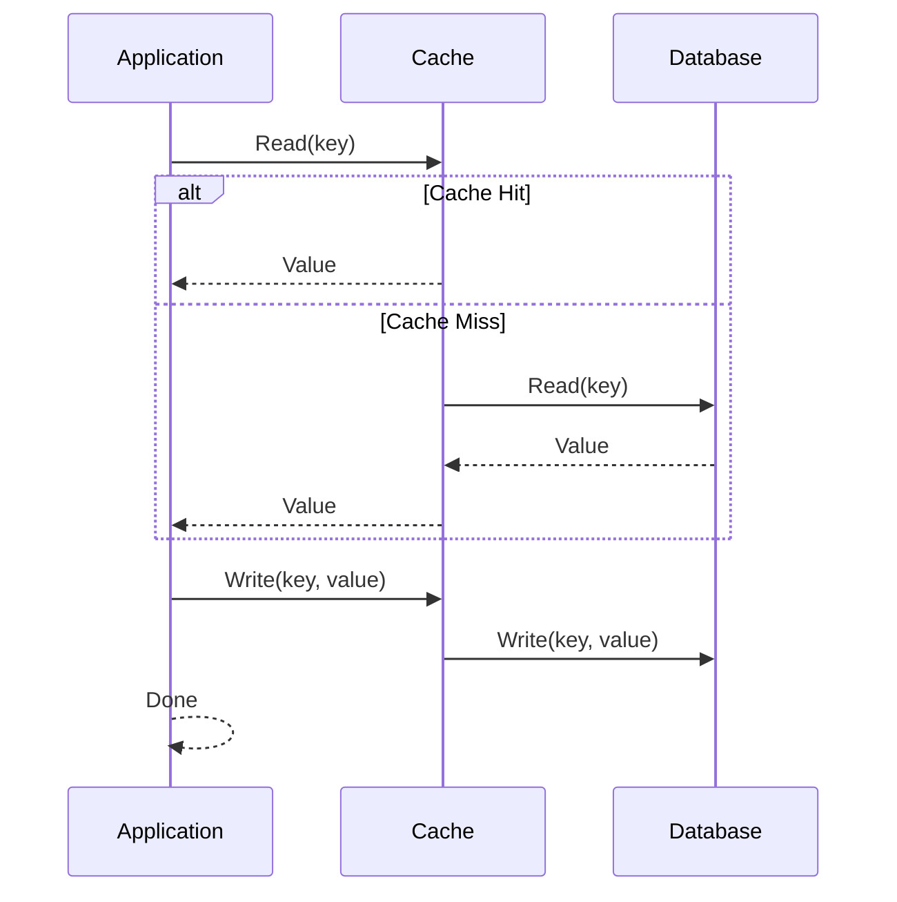
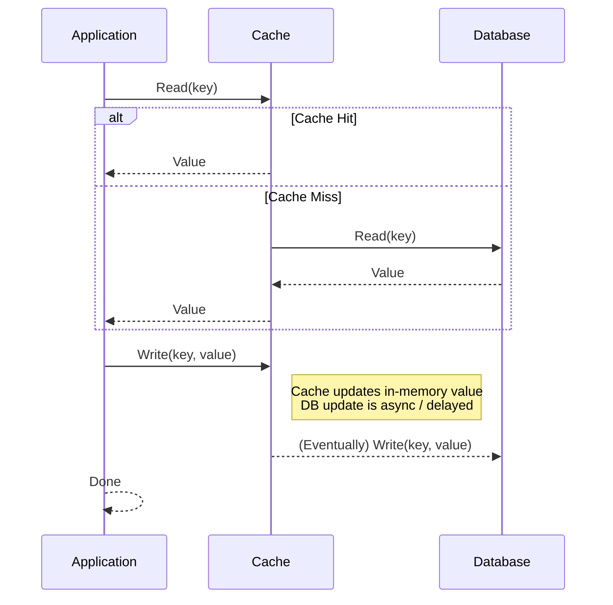

# Distributed Caching in Microservices

Caching stores frequently accessed data so microservices can serve it without repeating expensive operations. Benefits:

* **Boosts performance** – faster responses by avoiding repeated DB queries or heavy computations.
* **Enhances resiliency** – services can respond even if backend systems are temporarily unavailable.
* **Improves scalability** – reduces load on backend systems by offloading repeated requests.

---

##  **Cache Patterns**

---

## **1. Cache-Aside Pattern (Application-Controlled)**

> Very flexible and widely used. Suitable for read-heavy workloads. Application manages cache population.

**Read Flow:**

* Application checks the cache.
* On miss: reads from DB → stores value in cache → returns value.

**Write Flow:**

* Application writes to DB.
* Optionally invalidates/updates cache (TTL-based).

**Pros:** Full control, flexible, good for read-heavy workloads.

**Cons:** More complex, risk of stale cache, extra round-trips on miss.

---

## **2. Read-Through Pattern**

> Cache handles loading logic. Simplifies read operations, but cache may become stale if not invalidated.

**Read Flow:**

* Application queries cache.
* Cache fetches from DB on miss → stores → returns value.

**Write Flow:**

* Application writes to DB. Cache is not updated automatically.

**Pros:** Simplifies client code.

**Cons:** Cache may serve stale data, requires cache logic to fetch from DB.

---

## **3. Write-Through Pattern**

> Cache and DB always consistent. Writes are slower due to double-write.

**Read Flow:**

* Cache serves data if present.
* On miss: fetch from DB → store → return.

**Write Flow:**

* Application writes to cache → cache synchronously writes to DB

**Pros:** Strong consistency.

**Cons:** Slower writes.

---

## **4. Write-Behind / Write-Back Pattern**

> Writes are fast for the application. DB update is async → risk of data loss if cache fails.

**Read Flow:**

* Like read-through.

**Write Flow:**

* Application writes to cache → cache asynchronously updates DB.

**Pros:** Very fast writes, good for high-throughput systems.

**Cons:** Potential data loss, complex async handling.

---

## **Cache Invalidation**

> Cache invalidation is a “hard problem” due to the tradeoff between performance (large, long-lived cache) and consistency (fresh data).

Ensuring cached data remains accurate is challenging in distributed systems.
Strategies:

* **Time-based**: Expire entries after a set period. Simple but may serve stale data.
* **Event-based**: Invalidate on data changes. Consistent but complex to implement.
* **Size-based**: Evict entries when cache exceeds memory limit. Memory-efficient, may remove relevant data.

## Resources

