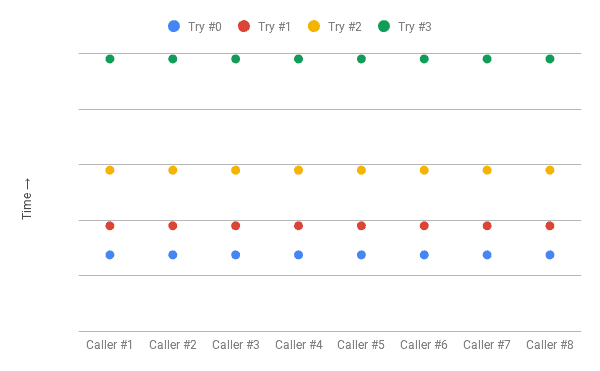
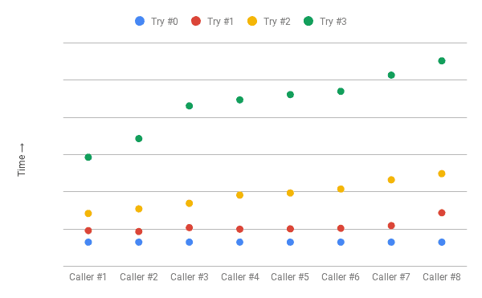

# Microservices resiliency

## Resilience4j
**Resilience4j is a lightweight fault tolerance library designed for functional programming. It provides higher-order functions (decorators) to enhance any functional interface, lambda expression or method reference with a Circuit Breaker, Rate Limiter, Retry or Bulkhead.**

You can stack more than one decorator on any functional interface, lambda expression or method reference. The advantage is that you have the choice to select the decorators you need and nothing else.

```java
Supplier<String> supplier = () -> service.sayHelloWorld(param1);

String result = Decorators.ofSupplier(supplier)
  .withBulkhead(Bulkhead.ofDefaults("name"))
  .withCircuitBreaker(CircuitBreaker.ofDefaults("name"))
  .withRetry(Retry.ofDefaults("name"))
  .withFallback(asList(CallNotPermittedException.class, BulkheadFullException.class),  
      throwable -> "Hello from fallback")
  .get();
```

To use the library as an integration in Spring Boot add the following Maven dependencies:

```xml
<dependencies>
    <dependency>
        <groupId>org.springframework.boot</groupId>
        <artifactId>spring-boot-starter-aop</artifactId>
    </dependency>
    <dependency>
        <groupId>org.springframework.boot</groupId>
        <artifactId>spring-boot-starter-actuator</artifactId>
    </dependency>
    <dependency>
      <groupId>io.github.resilience4j</groupId>
      <artifactId>resilience4j-spring-boot3</artifactId>
    </dependency>
</dependencies>
```

### Circuit Breaker

Resilience4j exposes information about circuit breakers at runtime in a number of ways:
* The current state of a circuit breaker can be monitored using the microservice’s actuator endpoint, **/actuator/metrics**.
* The circuit breaker also publishes events on an actuator endpoint, for example, state transitions and **/actuator/circuitbreakevents**.

To control the logic in a circuit breaker, Resilience4j can be configured using standard Spring Boot configuration files. We will use the following configuration parameters:

```yaml
resilience4j.circuitbreaker:
  configs:
    default:
      allowHealthIndicatorToFail: false
      slidingWindowType: COUNT_BASED
      slidingWindowSize: 5
      failureRateThreshold: 50
      waitDurationInOpenState: 10000
      permittedNumberOfCallsInHalfOpenState: 3
      automaticTransitionFromOpenToHalfOpenEnabled: true
      record-exceptions:
        - org.springframework.web.client.HttpServerErrorException
  instances:
    time:
      base-config: default
```

* **allowHealthIndicatorToFail**: tells Resilience4j not to affect the status of the health endpoint. This means that the health endpoint will still report "UP" even if one of the component’s circuit breakers is in an open or half-open state. It is very important that the health state of the component is not reported as "DOWN" just because one of its circuit breakers is not in a closed state.
* **slidingWindowType**: To determine if a circuit breaker needs to be opened, Resilience4j uses a sliding window, counting the most recent events to make the decision. The sliding windows can either be based on a fixed number of calls or a fixed elapsed time.
* **slidingWindowSize**: The number of calls in a closed state, which are used to determine whether the circuit should be opened. We will set this parameter to 5.
* **failureRateThreshold**: The threshold, in percent, for failed calls that will cause the circuit to be opened. We will set this parameter to 50%. This setting, together with slidingWindowSize set to 5, means that if three or more of the last five calls are faults, then the circuit will open.
* **waitDurationInOpenState**: Specifies how long the circuit stays in an open state, that is, before it transitions to the half-open state. We will set this parameter to 10000 ms.
* **permittedNumberOfCallsInHalfOpenState**: The number of calls in the half-open state, which are used to determine whether the circuit will be opened again or go back to the normal, closed state. We will set this parameter to 3, meaning that the circuit breaker will decide whether the circuit will be opened or closed based on the first three calls after the circuit has transitioned to the half-open state. Since the failureRateThreshold parameters are set to 50%, the circuit will be open again if two or three calls fail. Otherwise, the circuit will be closed.
* **automaticTransitionFromOpenToHalfOpenEnabled**: Determines whether the circuit breaker will automatically transition to the half-open state once the waiting period is over. Otherwise, it will wait for the first call after the waiting period is over until it transitions to the half-open state.
* **record-exceptions**: A list of exceptions representing a fault that will trigger the circuit breaker.

Now, it is enough to annotate methods using external resources (e.g., other services, databases, etc.) with the corresponding annotation.

```java
@CircuitBreaker(name = "time", fallbackMethod = "getTimeFallbackValue")
public LocalTime getTime(int delay, int faultPercent) {
    URI url = UriComponentsBuilder.fromUriString(TIME_SERVICE_URL + "?delay={delay}&faultPercent={faultPercent}").build(delay, faultPercent);

    LOG.info("Calling time API on URL: {}", url);
    return restClient.get()
            .uri(url)
            .retrieve()
            .body(LocalTime.class);
}

public LocalTime getTimeFallbackValue(int delay, int faultPercent, CallNotPermittedException e) {
    return LocalTime.of(11, 11, 11);
}
```

#### Testing

Let's build and run the microservice ecosystem:

```bash
$ mvn clean package
$ docker compose build
$ docker compose up --detach
```

Inside the /testing directory you can find two files that can be used with curl.

**urls-circuit-breaker-open.txt**

```yaml
url = "http://127.0.0.1:8080/time?delay=1000&faultPercent=100"
url = "http://127.0.0.1:8080/time?delay=1000&faultPercent=100"
url = "http://127.0.0.1:8080/time?delay=1000&faultPercent=100"
url = "http://127.0.0.1:8080/time?delay=1000&faultPercent=100"
url = "http://127.0.0.1:8080/time?delay=1000&faultPercent=100"
```

**urls-circuit-breaker-close.txt**

```yaml
url = "http://127.0.0.1:8080/time?delay=1000&faultPercent=0"
url = "http://127.0.0.1:8080/time?delay=1000&faultPercent=0"
url = "http://127.0.0.1:8080/time?delay=1000&faultPercent=0"
url = "http://127.0.0.1:8080/time?delay=1000&faultPercent=0"
```

The following command opens the circuit breaker with 5 failed requests.

```
$ curl --parallel --parallel-immediate --config urls-circuit-breaker-open.txt
...

$ curl -sS 'http://127.0.0.1:8080/actuator/circuitbreakers' | jq   
{
  "circuitBreakers": {
    "time": {
      "failureRate": "100.0%",
      "slowCallRate": "0.0%",
      "failureRateThreshold": "50.0%",
      "slowCallRateThreshold": "100.0%",
      "bufferedCalls": 5,
      "failedCalls": 5,
      "slowCalls": 0,
      "slowFailedCalls": 0,
      "notPermittedCalls": 0,
      "state": "OPEN"
    }
  }
}
```

After 10 seconds (see configuration), the circuit breaker automatically transition to the HALF_OPEN state.

```
{
  "circuitBreakers": {
    "time": {
      "failureRate": "-1.0%",
      "slowCallRate": "-1.0%",
      "failureRateThreshold": "50.0%",
      "slowCallRateThreshold": "100.0%",
      "bufferedCalls": 0,
      "failedCalls": 0,
      "slowCalls": 0,
      "slowFailedCalls": 0,
      "notPermittedCalls": 0,
      "state": "HALF_OPEN"
    }
  }
}
```

Instead, the following command closes the circuit breaker with 5 succeeded requests. Note well: the "11:11:11" is the fallback value returned when the circuit breaker is open.

```
$ curl --parallel --parallel-immediate --config urls-circuit-breaker-close.txt
"11:11:11""15:14:54.76469185""15:14:54.764691868""15:14:54.764691817"%   

$ curl -sS 'http://127.0.0.1:8080/actuator/circuitbreakers' | jq  
{
  "circuitBreakers": {
    "time": {
      "failureRate": "-1.0%",
      "slowCallRate": "-1.0%",
      "failureRateThreshold": "50.0%",
      "slowCallRateThreshold": "100.0%",
      "bufferedCalls": 0,
      "failedCalls": 0,
      "slowCalls": 0,
      "slowFailedCalls": 0,
      "notPermittedCalls": 0,
      "state": "CLOSED"
    }
  }
}
```


### Time Limiter
To help a circuit breaker handle slow or unresponsive services, a timeout mechanism can be helpful. Resilience4j’s timeout mechanism, called a TimeLimiter, can be configured using standard Spring Boot configuration files. We will use the following configuration parameter:

```yaml
resilience4j.timelimiter:
  configs:
    default:
      timeoutDuration: 3s
  instances:
    time:
      base-config: default
```

* **timeoutDuration**: Specifies how long a TimeLimiter instance waits for a call to complete before it throws a timeout exception. We will set it to 3 seconds.

```java
@TimeLimiter(name = "time")
public LocalTime getTime(int delay, int faultPercent) {
    URI url = UriComponentsBuilder.fromUriString(TIME_SERVICE_URL + "?delay={delay}&faultPercent={faultPercent}").build(delay, faultPercent);

    LOG.info("Calling time API on URL: {}", url);
    return restClient.get()
            .uri(url)
            .retrieve()
            .body(LocalTime.class);
}
```

#### Testing

n/a

### Retry

Resilience4j exposes retry information in the same way as it does for circuit breakers when it comes to events and metrics.

Retry events are accessible on the actuator endpoint: **/actuator/retryevents**. To control the retry logic, Resilience4j can be configured using standard Spring Boot configuration files. We will use the following configuration parameters:

```yaml
resilience4j.retry:
  configs:
    default:
      maxAttempts: 3
      waitDuration: 500
      enableExponentialBackoff: true
      exponentialBackoffMultiplier: 2
      enableRandomizedWait: true
      randomizedWaitFactor: 0.5
      retryExceptions:
        - org.springframework.web.client.HttpServerErrorException
  instances:
    time:
      base-config: default
```

* **maxAttempts**: The number of attempts before giving up, including the first call. We will set this parameter to 3, allowing a maximum of two retry attempts after an initial failed call.
* **waitDuration**: The wait time before the next retry attempt. We will set this value to 500 ms, meaning that we will wait 1 second between retries.
* **enableExponentialBackoff**: Exponential backoff is a common strategy for handling retries of failed network calls. In simple terms, the clients wait progressively longer intervals between consecutive retries:

```
wait_interval = base * exponentialBackoffMultiplier ^ n
```



* **enableRandomizedWait**:  Adding jitter provides a way to break the synchronization across the clients thereby avoiding collisions. In this approach, we add randomness to the wait intervals.

```
wait_interval = (base * exponentialBackoffMultiplier ^ n) +/- (random_interval)
```

* **randomizedWaitFactor**: Determines the range over which the random value will be spread with regard to the specified waitDuration. So for the value of 0.5 above, the wait times generated will be between 250ms (500 - 500 * 0.5) and 750ms (500 + 500 * 0.5).



* **retryExceptions**: A list of exceptions that will trigger a retry. We will only trigger retries on InternalServerError exceptions, that is, when HTTP requests respond with a 500 status code.

```java
@Retry(name = "time")
public LocalTime getTime(int delay, int faultPercent) {
    URI url = UriComponentsBuilder.fromUriString(TIME_SERVICE_URL + "?delay={delay}&faultPercent={faultPercent}").build(delay, faultPercent);

    LOG.info("Calling time API on URL: {}", url);
    return restClient.get()
            .uri(url)
            .retrieve()
            .body(LocalTime.class);
}
```

#### Testing

```bash
$ curl -i 'http://127.0.0.1:8080/time?faultPercent=100' 
$ curl -sS 'http://127.0.0.1:8080/actuator/retryevents' | jq

    {
      "retryName": "time",
      "type": "RETRY",
      "creationTime": "2024-10-15T13:22:48.477677565Z[Etc/UTC]",
      "errorMessage": "org.springframework.web.client.HttpServerErrorException$InternalServerError: 500 : \"{\"timestamp\":\"2024-10-15T13:22:48.475+00:00\",\"status\":500,\"error\":\"Internal Server Error\",\"path\":\"/time\"}\"",
      "numberOfAttempts": 1
    },
    {
      "retryName": "time",
      "type": "RETRY",
      "creationTime": "2024-10-15T13:22:48.960023632Z[Etc/UTC]",
      "errorMessage": "org.springframework.web.client.HttpServerErrorException$InternalServerError: 500 : \"{\"timestamp\":\"2024-10-15T13:22:48.956+00:00\",\"status\":500,\"error\":\"Internal Server Error\",\"path\":\"/time\"}\"",
      "numberOfAttempts": 2
    },
    {
      "retryName": "time",
      "type": "ERROR",
      "creationTime": "2024-10-15T13:22:49.747997054Z[Etc/UTC]",
      "errorMessage": "org.springframework.web.client.HttpServerErrorException$InternalServerError: 500 : \"{\"timestamp\":\"2024-10-15T13:22:49.746+00:00\",\"status\":500,\"error\":\"Internal Server Error\",\"path\":\"/time\"}\"",
      "numberOfAttempts": 3
    }
  ]
}
```

Looking carefully at the timestamps you can see both exponential backoff and randomness in action.


### Bulkhead

The Bulkhead pattern isolates remote resources of an application into pools so that if one fails,
the others can continue to function.
Resilience4j’s Bulkhead can be configured using standard Spring Boot configuration files,
and is implemented by limiting the number of concurrent calls to a single remote service.
In other words, the thread pool of the application is statically partitioned into different pools,
one for each remote service.
We will use the following configuration parameters:

```yml
resilience4j.bulkhead:
  configs:
    default:
      maxConcurrentCalls: 2
  instances:
    time:
      base-config: default
    date:
      base-config: default
```

- The max threads for the web server (tomcat) is 4. (This is just to simulate resource exhaustion).
> As always, the configuration is local for a single instance, so we are able to configure different BulkHeads for different services.
> In this case, we have two services, "time" and "date", and we have configured a bulkhead for each of them, with these parameters:


* **maxConcurrentCalls**: max number of concurrent calls allowed downstream.
* **maxWaitDuration**: any additional requests will wait for the given duration. Otherwise, it will go with default/fallback method and/or generate a `BulkheadFullException`.

> Keep in mind that we cannot use Project Reactor or any other asynchronous model as the point here is to demonstrate thread exhaustion issues.

With the configuration in place, now, first of all, we need to handle the `BulkheadFullException`,
by creating a dedicated class:

```java
@RestControllerAdvice
public class ErrorHandler {

    @ExceptionHandler(BulkheadFullException.class)
    @ResponseStatus(HttpStatus.TOO_MANY_REQUESTS)
    public void bulkheadException() {}

}
```

After that, we just need to annotate the method that we want to protect with the `@Bulkhead` annotation:

```java
@Bulkhead(name = "time")
public LocalTime getTimeWithBulkhead(int delay, int faultPercent) {
    return getTime(delay, faultPercent);
}

@Bulkhead(name = "date")
public LocalDate getDateWithBulkhead(int delay, int faultPercent) {
    return getDate(delay, faultPercent);
}
```

That's it! Your endpoints are now protected with a Bulkhead pattern.

#### Testing

The datetime-composite-service exposes, among others, the following endpoints:

* /datetime/time -> Calls the datetime service and returns time
* /datetime/date -> Calls the datetime service and returns date
* /datetime/timeBulkhead -> Like /time, but with Bulkhead|
* /datetime/dateBulkhead -> Like /date, but with Bulkhead|

All endpoints accept two parameters: `delay` and `faultPercent`.
The `delay` parameter is used to simulate a slow response from the service.

Inside the /testing directory you can find two files that can be used with curl.

**urls-shared-pool.txt**

```yaml
url = "http://127.0.0.1:8080/time?delay=3000"
url = "http://127.0.0.1:8080/time?delay=3000"
url = "http://127.0.0.1:8080/time?delay=3000"
url = "http://127.0.0.1:8080/time?delay=3000"
url = "http://127.0.0.1:8080/date"
```

**urls-bulkhead-pool.txt**

```yaml
url = "http://127.0.0.1:8080/timeBulkhead?delay=3000"
url = "http://127.0.0.1:8080/timeBulkhead?delay=3000"
url = "http://127.0.0.1:8080/timeBulkhead?delay=3000"
url = "http://127.0.0.1:8080/timeBulkhead?delay=3000"
url = "http://127.0.0.1:8080/date"
```

The following command send all the requests in parallel so that the thread pool of the service (size=4) gets saturated and the endpoint /date becomes unavailable despite being unused.

```
$ curl --parallel --parallel-immediate --config urls-shared-pool.txt
```

Instead, the following command calls the bulkhead-protected endpoint preventing the saturation of the thread pool. The endpoint /date immediately responds.

```
$ curl --parallel --parallel-immediate --config urls-shared-pool.txt
```

### Rate Limiter
Datetime-service is a simple service that returns the current time and date. In resilienc4j, the simple fixed window algorithm is implemented, so we will only have a few configuration options:

```yaml
resilience4j.ratelimiter:
  configs:
    default:
      limit-for-period: 20
      limit-refresh-period: 60s
      timeout-duration: 0s
  instances:
    time:
      base-config: default
    date:
      base-config: default
```

* **limit-for-period**: Specifies the maximum number of requests allowed within a specific time period.
* **limit-refresh-period**: Defines the time after which the limit will be reset.
* **timeout-duration**: Determines how long a request can wait for the rate limiter to allow it to proceed. As an example, if we set timeout-duration to 10 seconds and the rate limit is exceeded,
all further requests will wait for 10 seconds before they are stopped, but if during this time the rate limit resets, the requests will unlock and be served. This parameter can be used to implement a queue-like mechanism.

As always, we need to handle the generated exceptions by creating a dedicated class:

```java
@ControllerAdvice
public class ExceptionHandler {

    @org.springframework.web.bind.annotation.ExceptionHandler(RequestNotPermitted.class)
    @ResponseStatus(HttpStatus.TOO_MANY_REQUESTS)
    public void handleRequestNotPermitted() {}
}
```

And annotate the methods we want to protect with the `@RateLimiter` annotation:
```java
@GetMapping(value = "/date")
@RateLimiter(name = "date")
public LocalDate date(
        @RequestParam(value = "delay", required = false, defaultValue = "0") int delay,
        @RequestParam(value = "faultPercent", required = false, defaultValue = "0") int faultPercent) throws InterruptedException {
    Thread.sleep(delay);
    throwErrorIfBadLuck(faultPercent);
    return LocalDate.now(ZoneId.of(zoneId));
}

@GetMapping(value = "/time")
@RateLimiter(name = "time")
public LocalTime time(
        @RequestParam(value = "delay", required = false, defaultValue = "0") int delay,
        @RequestParam(value = "faultPercent", required = false, defaultValue = "0") int faultPercent) throws InterruptedException {
    Thread.sleep(delay);
    throwErrorIfBadLuck(faultPercent);
    return LocalTime.now(ZoneId.of(zoneId));
}
```

#### Testing
To test the limiter, fire up many requests and see what happens. A convenient bash oneliner would be:
```bash
for i in {1..25}; do curl -i http://127.0.0.1:9001/date ; done
HTTP/1.1 200 
Content-Type: application/json
Transfer-Encoding: chunked
Date: Tue, 15 Oct 2024 11:01:41 GMT

"2024-10-15"HTTP/1.1 200 
Content-Type: application/json
Transfer-Encoding: chunked
Date: Tue, 15 Oct 2024 11:01:41 GMT

...

Content-Type: application/json
Transfer-Encoding: chunked
Date: Tue, 15 Oct 2024 11:01:44 GMT
Connection: close

{"timestamp":"2024-10-15T11:01:44.994+00:00","status":500,"error":"Internal Server Error","path":"/date"}HTTP/1.1 500 
Content-Type: application/json
Transfer-Encoding: chunked
Date: Tue, 15 Oct 2024 11:01:44 GMT
Connection: close

{"timestamp":"2024-10-15T11:01:45.002+00:00","status":500,"error":"Internal Server Error","path":"/date"}%   


```

As we can see, the first 20 requests are served, and the next 5 are rejected with a 429 status code.

## Resources
* https://www.baeldung.com/resilience4j
* https://www.baeldung.com/spring-boot-resilience4j
* https://www.baeldung.com/resilience4j-backoff-jitter
* https://blog.acolyer.org/2015/01/15/the-tail-at-scale/
* https://jmeter.apache.org/

