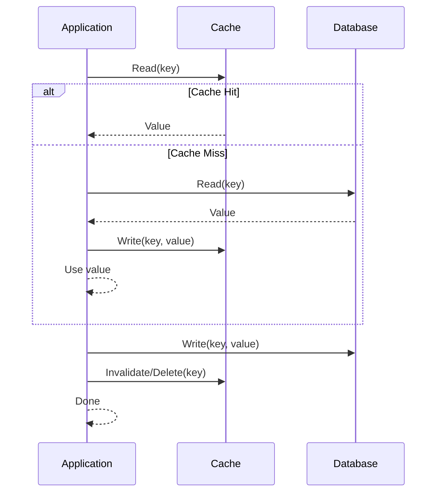
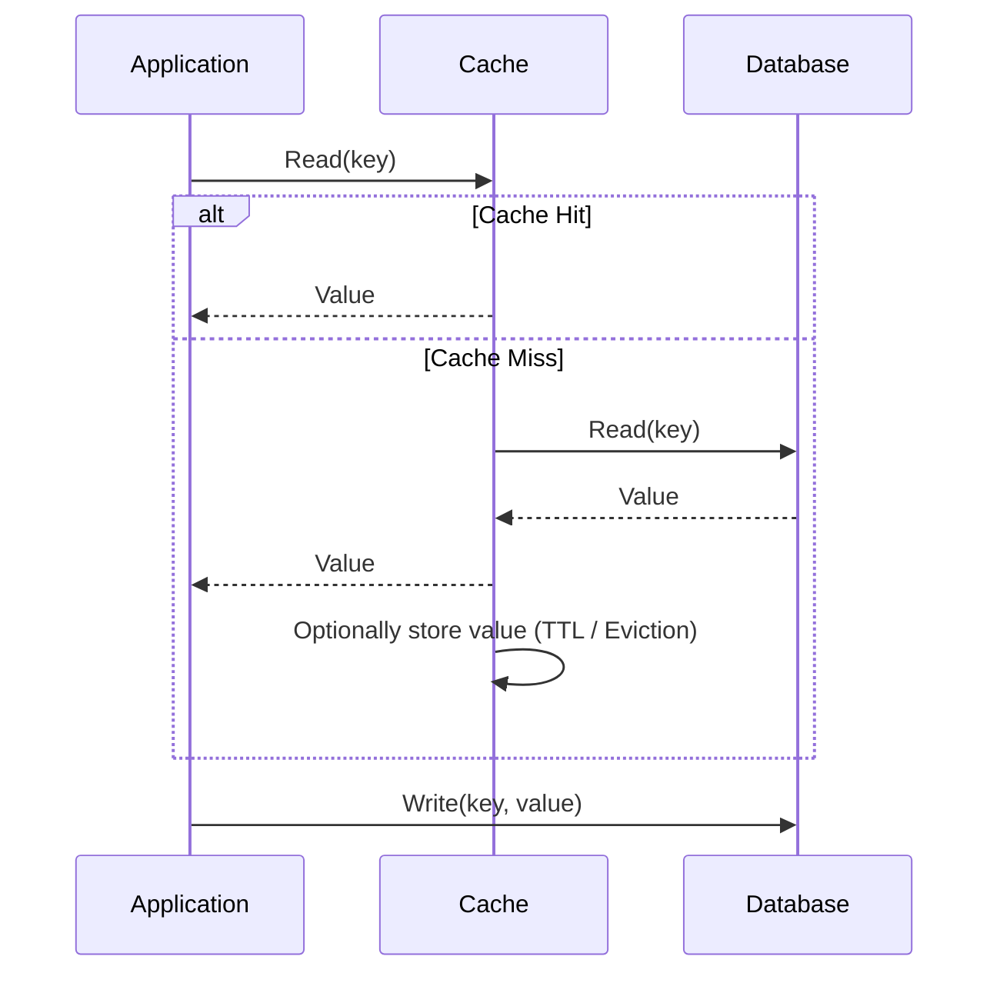
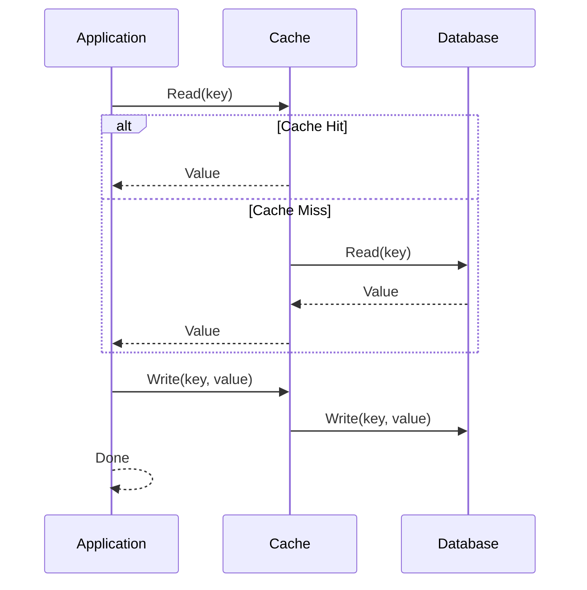
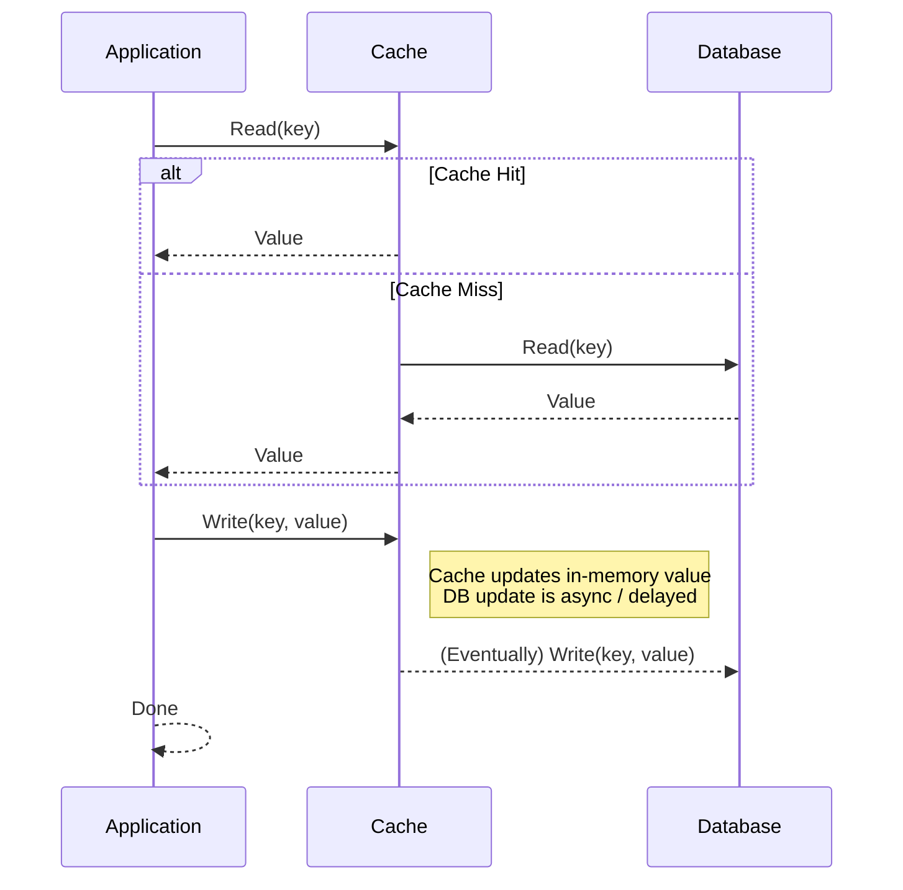
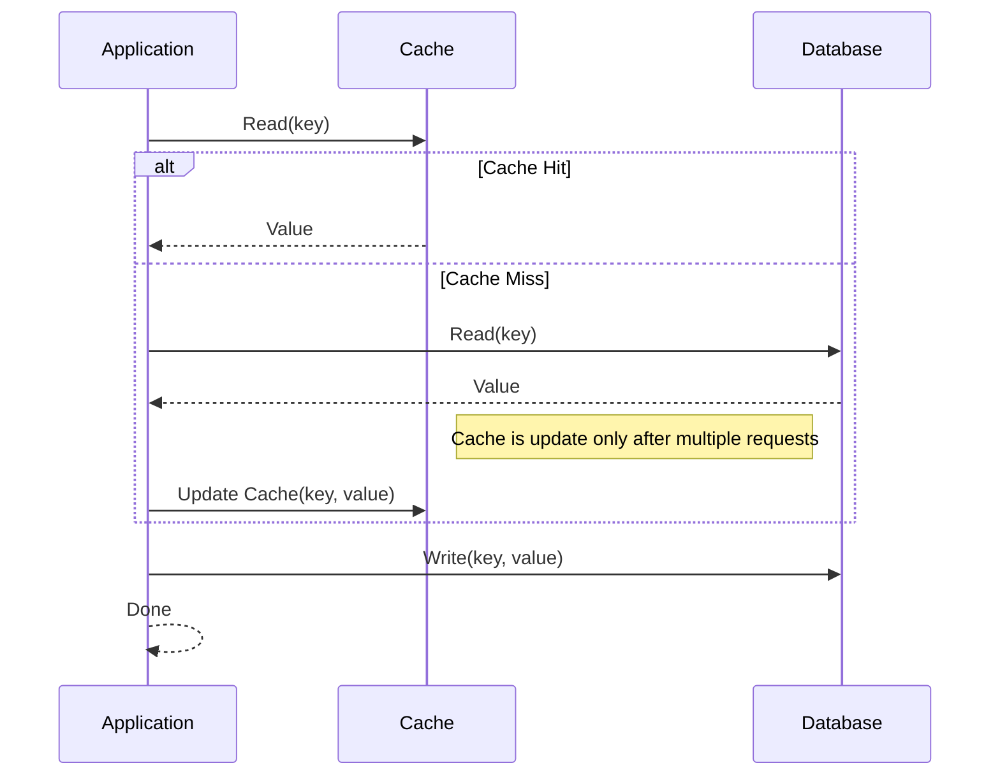

# Distributed caching

By caching data, microservices can reduce the need for repeated, expensive operations, such as retrieving data from a database or performing complex computations. Instead, the cached results can be directly served, significantly improving response times and overall system performance.
* **Caching improves resiliency because services can continue to serve requests even if their backend systems are temporarily unavailable**.
* **Caching improves scalability by offloading the workload from backend systems.**

## Cache-Aside (Lazy Loading)

- Read Flow:  
  → Application checks the cache.  
  → On cache miss: application reads from the database, stores the result in cache, and returns it.
- Write Flow:  
  → Application writes directly to the database.  
  → Optionally, it also updates or invalidates the cache (TTL).

> Very flexible and widely used. Suitable when reads are much more frequent than writes.

> When the application wants full control over cache population. Good for read-heavy workloads with occasional writes.

## Read-Through Cache

- Read Flow:  
  → Application queries the cache.  
  → On cache miss: the cache itself fetches the data from the database, stores it, and returns it.
- Write Flow:  
  → Application writes directly to the database. Cache is not updated automatically.

> Easier for developers because the cache handles loading logic. Requires the cache system to know how to fetch from DB. Cache, if not invalidated, becomes a "shadow database" that might never update.

> When you want to simplify read logic and avoid code duplication for cache handling.

## Write-Through Cache

- Read Flow:  
  → Application queries the cache.  
  → On cache miss: the cache itself fetches the data from the database, stores it, and returns it.
- Write Flow:  
  → Application writes data to the cache.  
  → The cache synchronously writes it to the database.

> Ensures cache and database are always consistent. But writes can be slower due to double-write.

> When reads and writes happen together often, and consistency is critical.

## Write-Back (Write-Behind) Cache

- Read Flow:  
  → Usually like read-through.
- Write Flow:  
  → Application writes data to the cache.  
  → Cache writes asynchronously to the database (with a delay or batching).

> Very fast writes from the application's perspective, but introduces risk of data loss if cache fails before writing to DB.

> When write performance is more important than immediate consistency (high-throughput systems). Risk of data loss if cache fails before persisting.

## Write-Around Cache

- Read Flow:  
  → Application checks the cache.  
  → On miss: reads directly from DB, but does *not* store result in cache. Only subsequent read requests for the same data trigger caching.
- Write Flow:  
  → Application writes only to the database.

> Avoids polluting the cache with rarely-read data. But frequently-read data may cause repeated cache misses.

> When data is rarely read after being written or for write-heavy workloads where caching writes is not worth it.

## Cache invalidation

Cache invalidation is the process of ensuring that cached data remains accurate by removing outdated or stale information. It is challenging due to the tension between **performance** and **consistency**: maintaining fast data retrieval (a.k.a. large cache, few invalidations) while ensuring the data is up-to-date (a.k.a. smaller cache, frequent invalidations).

In distributed systems, the difficulty grows due to their **complexity**—multiple nodes, varying data states, and potential network failures make coordinating cache invalidation difficult. Ensuring data consistency across all nodes while optimizing for performance is a fine balance.

Key strategies:

* **Time-based**: Cache entries expire after a set period. This is the simplest method, but it may lead to serving stale data if expiration times aren’t properly tuned.

* **Event-based**: Cache entries are invalidated when a specific event or change happens in the data source, ensuring consistency. However, it's more complex to implement and manage events.

* **Size-based**: When the cache exceeds its memory limit, entries are evicted. While useful for memory efficiency, this method may remove data that is still relevant.

* **Version-based**: Data is tagged with versions or timestamps, and the cache is invalidated when a new version is available. It balances freshness and performance, but can become complicated with frequent data updates.

## Resources
