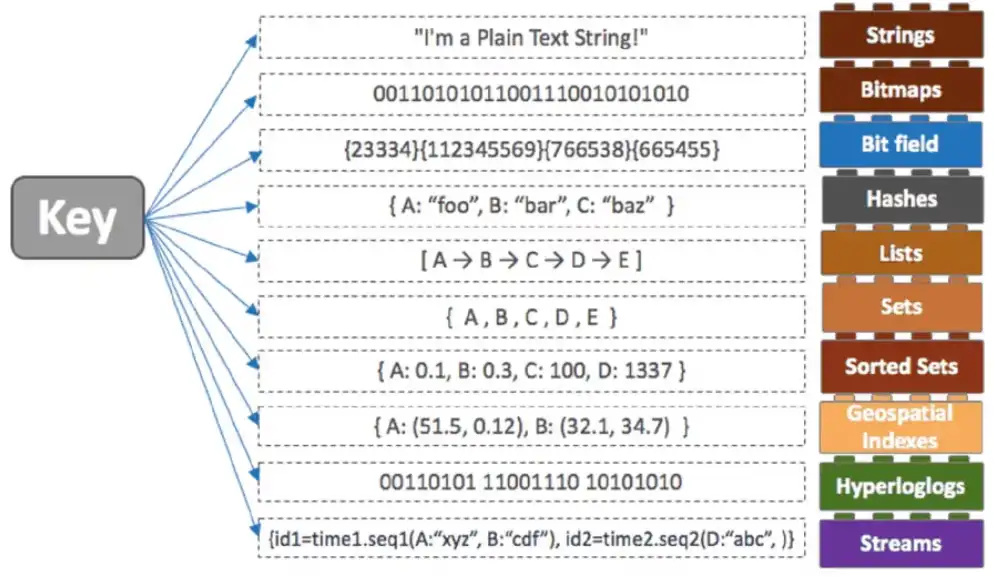

# Redis

**Redis Overview**

* **Full name:** Remote Dictionary Server
* **Type:** Open-source, in-memory, distributed Key-Value store
* **Performance:** Operates directly in RAM rather than on SSD/HDD → extremely low latency

**Architecture Highlights**

* **Single-threaded, event-driven** → uses *select()/poll()* to handle multiple connections without blocking
* **Atomic operations** → each command is executed fully without interruption, simplifying consistency

| Process                             | Duration  | Normalized |
|-------------------------------------|-----------|------------|
| 1 CPU cycle                         | 0.3ns     | 1s         |
| L1 cache access                     | 1ns       | 3s         |
| L2 cache access                     | 3ns       | 9s         |
| L3 cache access                     | 13ns      | 43s        |
| **DRAM access (from CPU)**          | **120ns** | **6min**   |
| SSD I/O                             | 0.1ms     | 4days      |
| HDD I/O                             | 1-10ms    | 1-12months |
| Internet: San Francisco to New York | 40ms      | 4years     |
| Internet: San Francisco to London   | 80ms      | 8years     |
| Internet: San Francisco to Sydney   | 130ms     | 13years    |
| TCP retransmit                      | 1s        | 100years   |
| Container reboot                    | 4s        | 400years   |


## Redis Persistence Modes

1. **No Persistence**

  * **Description:** Memory only; data lost on restart.
  * **Use case:** Temporary caching, speed-critical tasks.
  * **Pros:** Fastest.
  * **Cons:** Data lost on restart.

2. **RDB (Snapshots)**

  * **Description:** Saves periodic snapshots of data.
  * **Use case:** Occasional persistence, analytics.
  * **Pros:** Fast restart, low overhead.
  * **Cons:** Can lose data between snapshots.

3. **AOF (Append-Only File)**

  * **Description:** Logs every write operation.
  * **Use case:** High durability needed, e.g., e-commerce.
  * **Pros:** Safe, configurable.
  * **Cons:** Slower, uses more disk.

4. **Hybrid (RDB + AOF)**

  * **Description:** Combines snapshots + logs.
  * **Use case:** Large apps needing fast recovery + durability.
  * **Pros:** Fast + safe.
  * **Cons:** Higher disk use, slight performance hit.

## Data Structures in Redis
The data is organized using **key-value pairs**, where keys are unique identifiers, and values can be of different types as we will see later. Data in Redis is accessed by keys, making it a highly efficient and simple data store.



## Single-node Deployment

To interact directly with the Redis server, we can use Docker:

```bash
docker run --detach --name redis -p 6379:6379 redis:latest
```

```yaml
services:
  redis:
    image: redis:latest
    ports:
      - "6379:6379"
    healthcheck:
      test: [ "CMD", "redis-cli", "ping" ]
      interval: 5s
      timeout: 2s
      retries: 60
```

We can then install a Redis client, connect:

```bash
redis-cli -h redis -p 6379
```

and interact:

```bash
redis:6379> ping
PONG
```


### KEY-VALUE operations

* ***SET***: Sets the value of the specified key.

    ```
    SET <key> <value>

    Example:
    SET name "pippo"
    ```

* ***GET***: Retrieves the value associated with the specified key.

    ```
    GET <key>

    Example:
    GET name
    > "pippo"
    ```

* ***EXIST***: Checks if the specified key exists in the database.

    ```
    EXIST <key>

    Example:
    EXIST name
    ```

* ***DEL***: Deletes one or more keys and their associated values.

    ```
    DEL <key> [<key> …]

    Example:
    DEL name
    ```

### LISTS operations

* ***LPUSH***: Adds a new element to the head of a list.

    ```
    LPUSH <key> <element> [<element> ...]

    Example:
    LPUSH bikes:repairs bike:1
    ```

* ***RPUSH***: Adds a new element to the tail of a list.

    ```
    RPUSH <key> <element> [<element> ...]

    Example:
    RPUSH bikes:repairs bike:1
    ```

* ***LPOP***: Removes and returns an element from the head of a list.

    ```
    LPOP <key>

    Example:
    LPUSH bikes:repairs bike:1 bike:2
    LPOP bikes:repairs
    > "bike:2"
    ```

* ***RPOP***: Removes and returns an element from the tail of a list.

    ```
    RPOP <key>

    Example:
    LPUSH bikes:repairs bike:1 bike:2
    RPOP bikes:repairs
    > "bike:1"
    ```
  
* ***LRANGE***: Gets elements from a list.

    ```
    LRANGE <key> <start> <stop>

    Example:
    LRANGE bikes:repairs 0 -1
    ```


### SETS operations

* ***SADD***: Creates a set, and adds element to it.

    ```
    SADD <set_name> <element> [<element> ...]

    Example:
    SADD SocialMedia Facebook Twitter WhatsApp
    ```

* ***SMEMBERS***: Shows all the elements, present in that set.

    ```
    SMEMBERS <set_name>

    Example:
    SMEMBERS SocialMedia
    > 1) "Facebook" 
    > 2) "Twitter"
    > 3) "WhatsApp"
    ```

* ***SCARD***: Shows number of elements present in that set.

    ```
    SCARD <set_name>

    Example:
    SCARD SocialMedia
    > 3
    ```

### HASHES operations

* ***HSET***: Sets the value of a field in a Hash.

    ```
    HSET <key> <field> <value>

    Example:
    HSET user:123 name "Charlie"
    HSET user:123 country "USA"
    ```

* ***HGETALL***: Retrieves all fields and values of a Hash.
    
    ```
    HGETALL <key>
    
    Example:
    HGETALL user:123
    > 1) "name"
    > 2) "Charlie"
    > 3) "country"
    > 4) "USA"
    ```

* ***HDEL***: Deletes one or more fields from a Hash.

    ```
    HDEL <key> <field1> [<field2> … <fieldN>]

    Example:
    HDEL user:123 country
    HGETALL user:123
    > 1) "name"
    > 2) "Charlie"
    ```

### Transactions

A very interesting feature of Redis is the ability to be able to combine multiple operations and execute them all together as if they were a single atomic operation that will succeed only if they all succeed (**transaction**):

```
MULTI
<Redis commands>
EXEC

Example:
MULTI
SET name "Alice"
HSET user:123 username "Alice"
EXEC
```

## Multi-node deployments

In addition to being used on a single machine, Redis is also well-suited for **distributed environments**. 

* **Scalability (Data size)**: One machine has limited resource in terms of memory, thus all data should fit in that single machine.
* **Scalability (TPS)**: One machine has limited resource in terms of CPU, so it can support a limited number of “transaction per seconds” (TPS). If your reads/writes go beyond that limit, your machine/pipeline can fail.
* **Availability**: When you are running everything on single machine, if that machine crashes, you will loose your Redis database.

### Redis Replication

> Ideal for scenarios where you need to scale read operations. The master handles writes, and replicas handle reads. It's useful when data consistency isn't a concern, and failover is not automated.


- **Write Performance**: All write operations are still handled by the single master node, so there is no increase in the write throughput (writes per second).
- **Data Distribution**: The data is not split across multiple nodes. Instead, the replica nodes maintain identical copies of the data from the master node. This means there is no increase in the total storage capacity.
- **Failure Handling**: If the master node fails, all write operations will fail, and only read requests can be served by the replica nodes. However, these replica nodes will serve outdated data, as the latest writes will not be replicated during the failure. Therefore, the system's availability does not improve in case of a master node failure.
- **Read Performance**: What improves with replication is the read capacity of the database. For example, if a single machine could handle 1,000 reads per second, with 4 nodes (1 master and 3 replicas), the system can now handle approximately 4,000 reads per second.

### Redis Sentinel

> Best for high availability in a Redis deployment. It automatically handles failover, monitoring, and notification. Use when you need automatic recovery in case of node failures.


**Monitoring**: Redis Sentinel continuously monitors the health of Redis instances (masters and replicas) to ensure they are operating correctly.  
**Failover**: In case of a master failure, Redis Sentinel automatically promotes a replica to master, minimizing downtime.  
**High Availability**: It ensures Redis is highly available by providing automatic failover and notification of failures, maintaining consistent data access even when nodes go down.

### Redis Cluster

> Suitable for horizontal scaling with sharding (consistent hashing). It distributes data across multiple nodes, making it ideal for large datasets that exceed the memory capacity of a single instance while ensuring high availability and partition tolerance.


- **Data Distribution**: In a Redis Cluster, data is split across multiple master nodes. For example, if the total data size is 100GB, it could be distributed as 30GB in Master1, 40GB in Master2, and 30GB in Master3. This enables horizontal scalability for data storage.
- **Write Scalability**: Since each master node is responsible for handling write requests, having multiple master nodes allows for scalability in terms of write throughput (writes per second). This helps distribute the write load across several nodes.
- **High Availability**: If a master node fails, one of its replica nodes is automatically promoted to master. This ensures continued operation and improves the availability of the database, even in the event of node failures.


## Resources
* [Redis explained](https://architecturenotes.co/p/redis)
