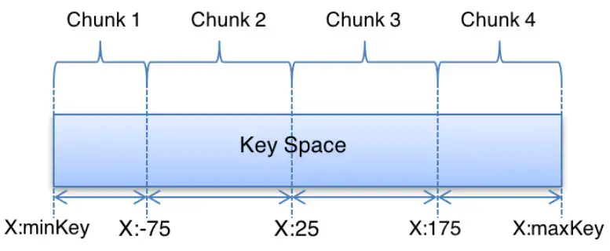
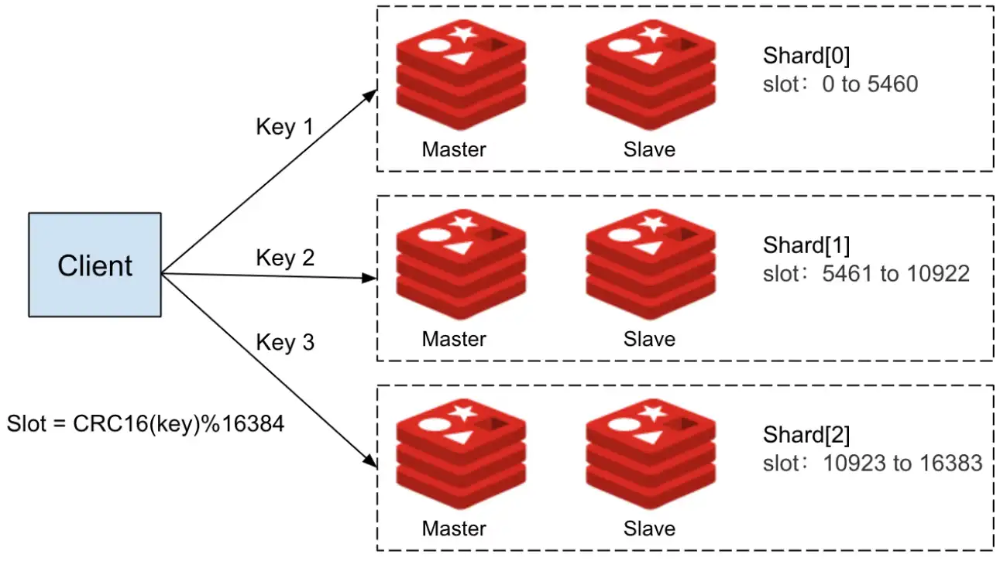
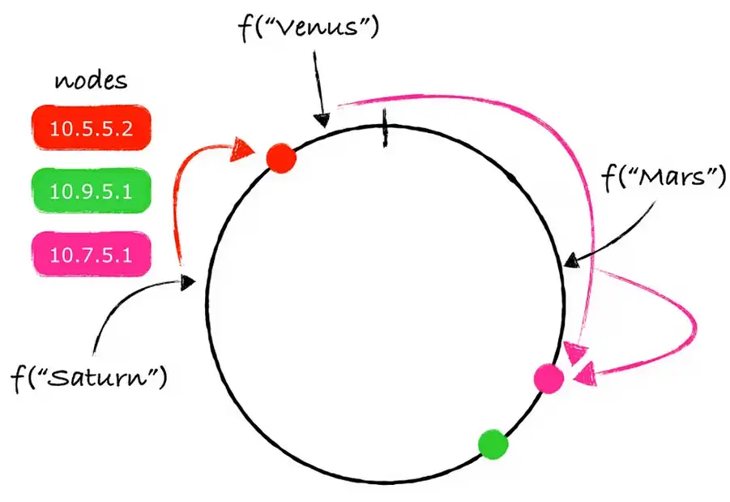

# Distributed Caching (Redis)

Redis is an acronym for "Remote Dictionary Server": it is an **open source in-memory distributed Key-Value** store and so works directly in-memory (RAM) rather than like traditional databases that operate on secondary storage such as SSDs or Hard Disks (**low latency**).

| Process                             | Duration  | Normalized |
|-------------------------------------|-----------|------------|
| 1 CPU cycle                         | 0.3ns     | 1s         |
| L1 cache access                     | 1ns       | 3s         |
| L2 cache access                     | 3ns       | 9s         |
| L3 cache access                     | 13ns      | 43s        |
| **DRAM access (from CPU)**          | **120ns** | **6min**   |
| SSD I/O                             | 0.1ms     | 4days      |
| HDD I/O                             | 1-10ms    | 1-12months |
| Internet: San Francisco to New York | 40ms      | 4years     |
| Internet: San Francisco to London   | 80ms      | 8years     |
| Internet: San Francisco to Sydney   | 130ms     | 13years    |
| TCP retransmit                      | 1s        | 100years   |
| Container reboot                    | 4s        | 400years   |

Furthermore, Redis uses a **single-thread**, **event-driven** approach. Specifically, this mechanism allows Redis not to block on a specific connection while waiting for a future request. Instead, through the use of system calls like *select()* and *poll()*, it waits for an event to occur on any of its connections, thus not blocking on any particular one. 

Since Redis is single-thread, **each individual operation is atomic** and therefore cannot be interrupted by any other, thus going to simplify operation.


## Redis as primary Database or Cache 

**No Persistence**

Redis operates purely in-memory with no persistence mechanism. This means all data is lost when Redis is restarted, and no disk I/O is involved. It’s ideal for use cases like caching, where the data is temporary and can be regenerated if needed. This setup is suitable for scenarios where high performance is essential and data loss is tolerable.
- **Pros**: Fastest performance, minimal memory overhead.
- **Cons**: Data is lost upon restart, no durability.

**RDB (Redis Database)**

Redis saves snapshots of the dataset at configured intervals (e.g., every 5 minutes or after a certain number of writes). This method is appropriate for applications where occasional persistence is required, and some data loss between snapshots is acceptable. It works well for use cases where long-term persistence is needed, but high durability isn’t critical, such as analytics and reporting systems.
- **Pros**: Fast restart times, lower memory and disk overhead.
- **Cons**: Data loss between snapshots, no continuous updates.

**AOF (Append-Only File)**

Redis logs every write operation in an append-only file (`appendonly.aof`). This mechanism ensures that all write operations are logged and can be replayed on restart, providing higher durability. AOF is suitable for applications that require a higher level of data consistency, such as e-commerce or financial systems, where each operation needs to be preserved.
- **Pros**: Provides durability with the logging of every write operation, configurable write policies.
- **Cons**: Larger disk space usage, slower performance due to continuous disk writes.

**Hybrid (RDB + AOF)**

This method combines RDB snapshots and AOF logging to provide a balance of performance and durability. Redis will use RDB snapshots for fast recovery and AOF logs for high durability, applying both on restart. This setup is ideal for applications that need both fast recovery and high data durability, such as large-scale web applications or systems that require both performance and reliability.
- **Pros**: Combines the advantages of RDB and AOF (fast recovery and high durability).
- **Cons**: Increased disk space usage, potentially slower performance due to dual persistence operations.

Each persistence method has its advantages depending on whether the priority is performance, durability, or fast recovery. The best choice will depend on your application's needs.

## Data Structures in Redis
The data is organized using **key-value pairs**, where keys are unique identifiers, and values can be of different types as we will see later. Data in Redis is accessed by keys, making it a highly efficient and simple data store.


## Redis single-node deployments

To interact directly with the Redis server, we can use Docker compose:

```yaml
services:
  redis:
    image: redis:latest
    ports:
      - "6379:6379"
    healthcheck:
      test: [ "CMD", "redis-cli", "ping" ]
      interval: 5s
      timeout: 2s
      retries: 60
```

Afterward, we can install a Redis client, connect like this:

```bash
redis-cli -h redis -p 6379
```

and interact:

```bash
redis:6379> ping
PONG
```


### KEY-VALUE operations

* ***SET***: Sets the value of the specified key.

    ```
    SET <key> <value>

    Example:
    SET name "pippo"
    ```

* ***GET***: Retrieves the value associated with the specified key.

    ```
    GET <key>

    Example:
    GET name
    > "pippo"
    ```

* ***EXIST***: Checks if the specified key exists in the database.

    ```
    EXIST <key>

    Example:
    EXIST name
    ```

* ***DEL***: Deletes one or more keys and their associated values.

    ```
    DEL <key> [<key> …]

    Example:
    DEL name
    ```

### LISTS operations

* ***LPUSH***: Adds a new element to the head of a list.

    ```
    LPUSH <key> <element> [<element> ...]

    Example:
    LPUSH bikes:repairs bike:1
    ```

* ***RPUSH***: Adds a new element to the tail of a list.

    ```
    RPUSH <key> <element> [<element> ...]

    Example:
    RPUSH bikes:repairs bike:1
    ```

* ***LPOP***: Removes and returns an element from the head of a list.

    ```
    LPOP <key>

    Example:
    LPUSH bikes:repairs bike:1 bike:2
    LPOP bikes:repairs
    > "bike:2"
    ```

* ***RPOP***: Removes and returns an element from the tail of a list.

    ```
    RPOP <key>

    Example:
    LPUSH bikes:repairs bike:1 bike:2
    RPOP bikes:repairs
    > "bike:1"
    ```

### SETS operations

* ***SADD***: Creates a set, and adds element to it.

    ```
    SADD <set_name> <element> [<element> ...]

    Example:
    sadd SocialMedia Facebook Twitter WhatsApp
    ```

* ***SMEMBERS***: Shows all the elements, present in that set.

    ```
    SMEMBERS <set_name>

    Example:
    SMEMBERS SocialMedia
    > 1) "Facebook" 
    > 2) "Twitter"
    > 3) "WhatsApp"
    ```

* ***SCARD***: Shows number of elements present in that set.

    ```
    SCARD <set_name>

    Example:
    SCARD SocialMedia
    > 3
    ```

### HASHES operations

* ***HSET***: Sets the value of a field in a Hash.

    ```
    HSET <key> <field> <value>

    Example:
    HSET user:123 name "Charlie"
    HSET user:123 country "USA"
    ```

* ***HGETALL***: Retrieves all fields and values of a Hash.
    
    ```
    HGETALL <key>
    
    Example:
    HGETALL user:123
    > 1) "name"
    > 2) "Charlie"
    > 3) "country"
    > 4) "USA"
    ```

* ***HDEL***: Deletes one or more fields from a Hash.

    ```
    HDEL <key> <field1> [<field2> … <fieldN>]

    Example:
    HDEL user:123 country
    HGETALL user:123
    > 1) "name"
    > 2) "Charlie"
    ```

### Transactions

A very interesting feature of Redis is the ability to be able to combine multiple operations and execute them all together as if they were a single atomic operation that will succeed only if they all succeed (**transaction**):

```
MULTI
<Redis commands>
EXEC

Example:
MULTI
SET name "Alice"
HSET user:123 username "Alice"
EXEC
```

## Redis multi-node deployments

In addition to being used on a single machine, Redis is also well-suited for **distributed environments**. 

* **Scalability (Data size)**: When you have only one machine, it means your data should fit in that single machine.
* **Scalability (TPS)**: One machine has limited resource in terms of CPU, so it can support a limited number of “transaction per seconds” (TPS). If your reads/writes go beyond that limit, your machine/pipeline can fail.
* **Availability**: When you are running everything on single machine, if that machine crashes, you will loose your Redis database.

### Replication


- **Write Performance**: All write operations are still handled by the single master node, so there is no increase in the write throughput (writes per second).
- **Data Distribution**: The data is not split across multiple nodes. Instead, the replica nodes maintain identical copies of the data from the master node. This means there is no increase in the total storage capacity.
- **Failure Handling**: If the master node fails, all write operations will fail, and only read requests can be served by the replica nodes. However, these replica nodes will serve outdated data, as the latest writes will not be replicated during the failure. Therefore, the system's availability does not improve in case of a master node failure.
- **Read Performance**: What improves with replication is the read capacity of the database. For example, if a single machine could handle 1,000 reads per second, with 4 nodes (1 master and 3 replicas), the system can now handle approximately 4,000 reads per second.

### Cluster


- **Data Distribution**: In a Redis Cluster, data is split across multiple master nodes. For example, if the total data size is 100GB, it could be distributed as 30GB in Master1, 40GB in Master2, and 30GB in Master3. This enables horizontal scalability for data storage.
- **Write Scalability**: Since each master node is responsible for handling write requests, having multiple master nodes allows for scalability in terms of write throughput (writes per second). This helps distribute the write load across several nodes.
- **High Availability**: If a master node fails, one of its replica nodes is automatically promoted to master. This ensures continued operation and improves the availability of the database, even in the event of node failures.


### Sentinels

We saw in the cluster mode, that high availability is achieved when during master node failures, one of the replica node is promoted as master. But this high-availability is achieved because we have multiple masters which are configured to talk among themselves.

However, maintaining multiple masters has its challenges too. Although going in details about them is out of scope for this discussion, but one challenge is — multi-key operation. Say, you perform a multi-key operation (like fetch two keys, update 2 keys, etc in single command), both keys should be in the same master; if not, the command will fail.

In cases where you don’t really need multiple masters (because your dataset is not large enough that it has to be distributed among multiple machines, or your write requests are small enough to be handled by one machine) but you do need a highly-available system ?


In a typical Redis Sentinel deployment, you have a regular Redis setup with one master and multiple replicas. Alongside this, the Sentinel service runs on separate machines, continuously monitoring the master node and communicating with each other.

If a Sentinel node detects that the master node is unreachable, it initiates the failover process by consulting with other Sentinel nodes to confirm the issue. This typically requires a majority vote to confirm that the master node is indeed down.

Once the majority agrees, one of the Sentinel nodes is designated as the leader and proceeds with the failover process. During this process, the leader Sentinel promotes one of the replica nodes to become the new master and instructs the remaining replicas to begin syncing with the new master.

## Partitioning
Partitioning involves dividing your dataset into smaller subsets, known as **shards**, and distributing these shards across multiple Redis nodes. Each shard contains a portion of the keys and data. The partitioning strategy often depends on the use case and the key distribution of your data. Some **common partitioning strategies** include:

**Range-Based Partitioning**

In range-based partitioning, you define ranges of keys based on some criteria (e.g., key prefixes or key values), and each range is assigned to a specific Redis node. This approach is useful when you can predict the distribution of keys across your dataset.



**Hash-Based Partitioning**

Hash-based partitioning involves applying a hash function to each key to determine which Redis node will store it. This method provides an even distribution of keys across nodes but may require redistributing data when nodes are added or removed.



**Consistent Hashing**

Consistent hashing is a popular partitioning method in distributed systems. It minimizes data movement when adding or removing nodes, making it more efficient for **dynamic clusters**.

In practice, consistent hashing often uses **virtual nodes** (also called replicas). Each physical node in the cluster is represented by multiple points on the hash ring. This improves load distribution, reduces the chances of hotspot formation, and provides better fault tolerance.




## Resources
* [What is Redis and how does it work internally](https://medium.com/@ayushsaxena823/what-is-redis-and-how-does-it-work-cfe2853eb9a9)
* [Everything You Need to Know About Redis](https://medium.com/codex/7-redis-features-you-might-not-know-bab8c9beb2c)
* [Redis as a database](https://medium.com/wix-engineering/redis-as-a-database-f9df579b09c0)
* [Introduction to Redis](https://www.geeksforgeeks.org/introduction-to-redis-server/)
* [Redis explained](https://architecturenotes.co/p/redis)
* [Redis operations](https://www.tutorialspoint.com/redis/redis_quick_guide.htm)
* [Problem of Hash-based partitioning](http://www.mikeperham.com/2009/01/14/consistent-hashing-in-memcache-client/)
