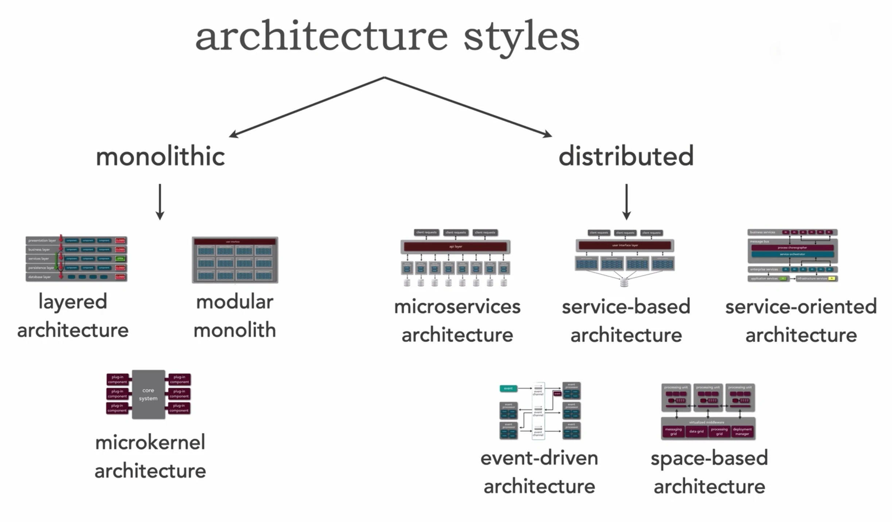
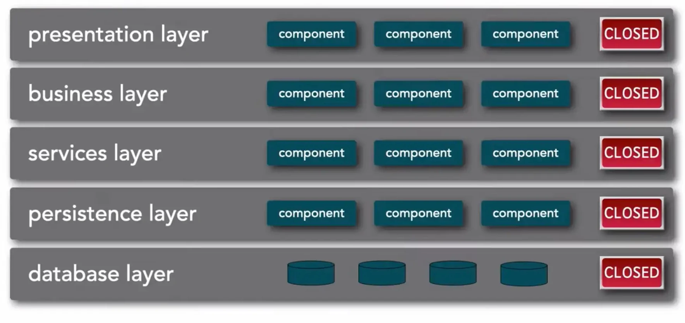
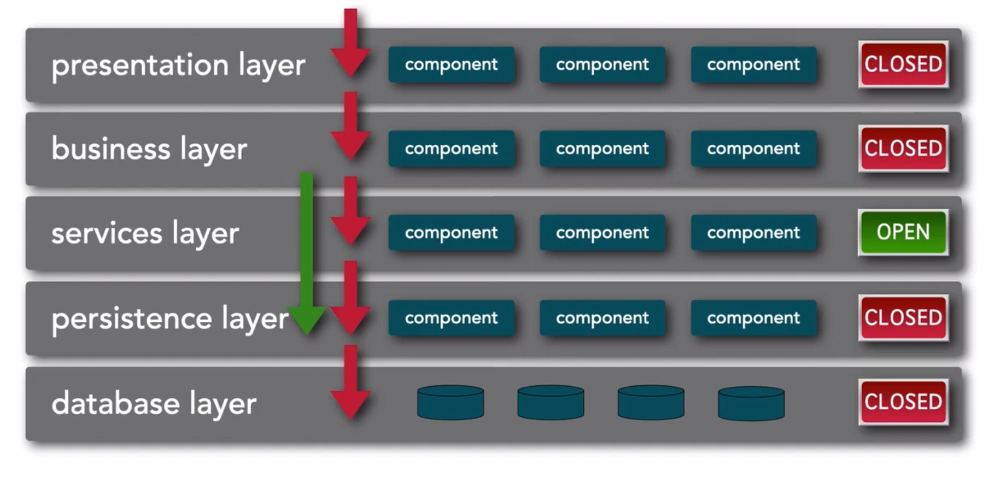
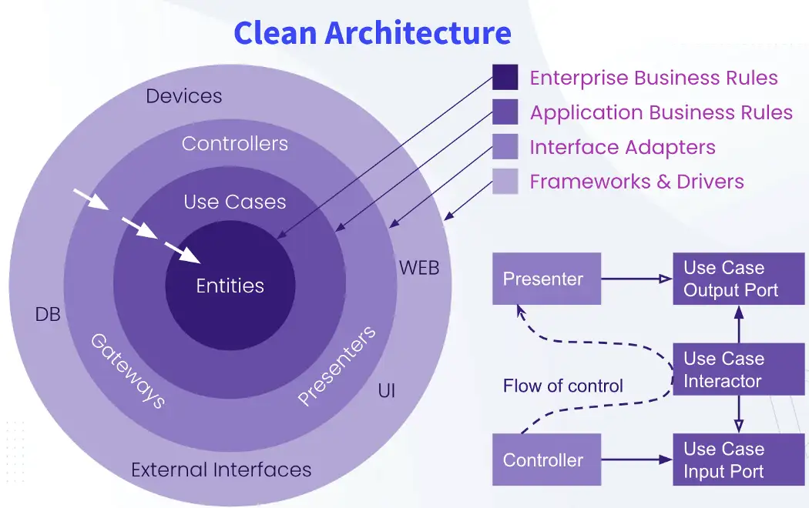
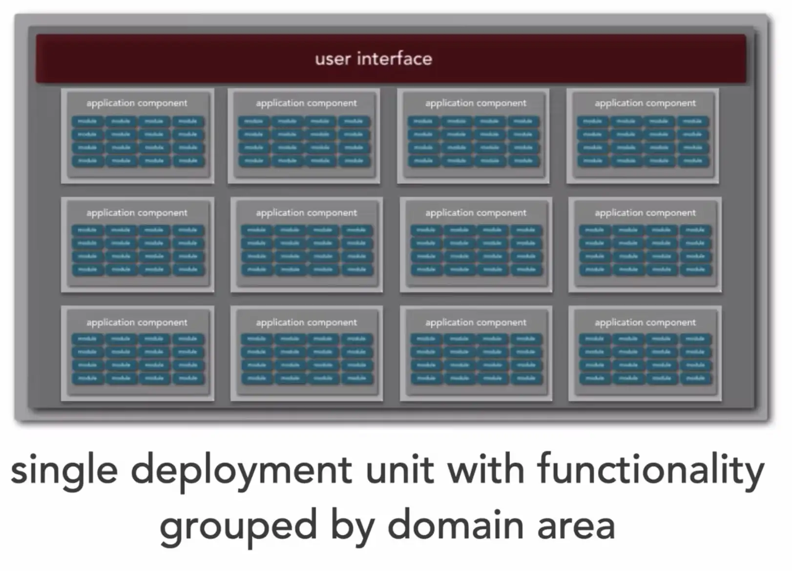
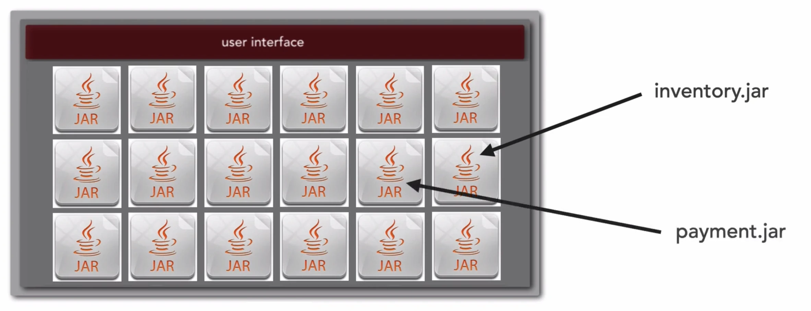
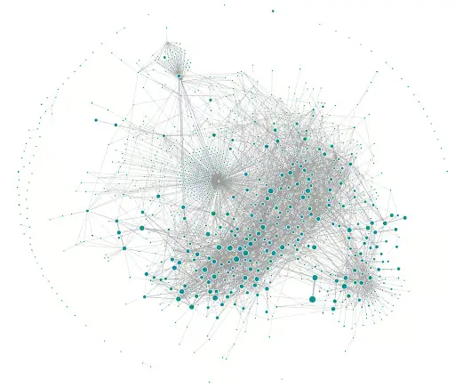
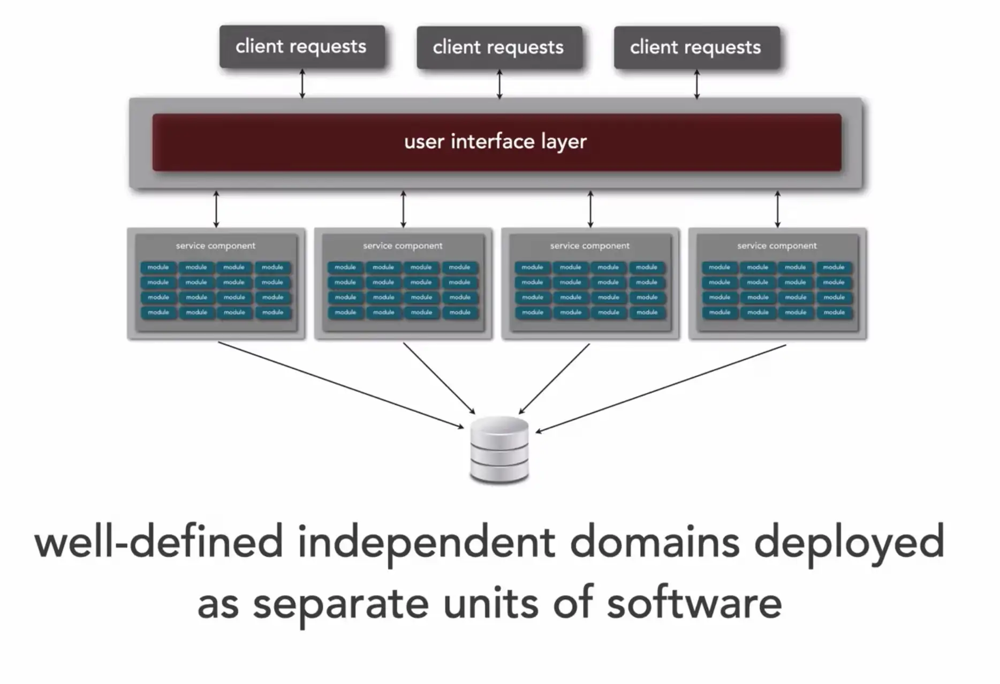
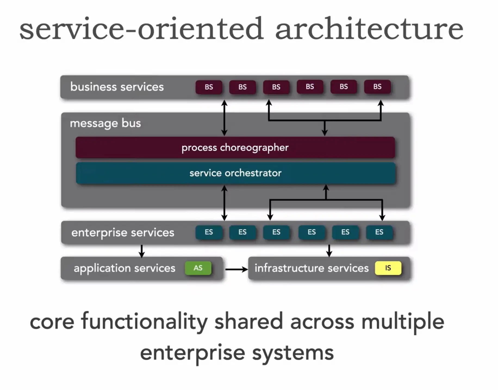
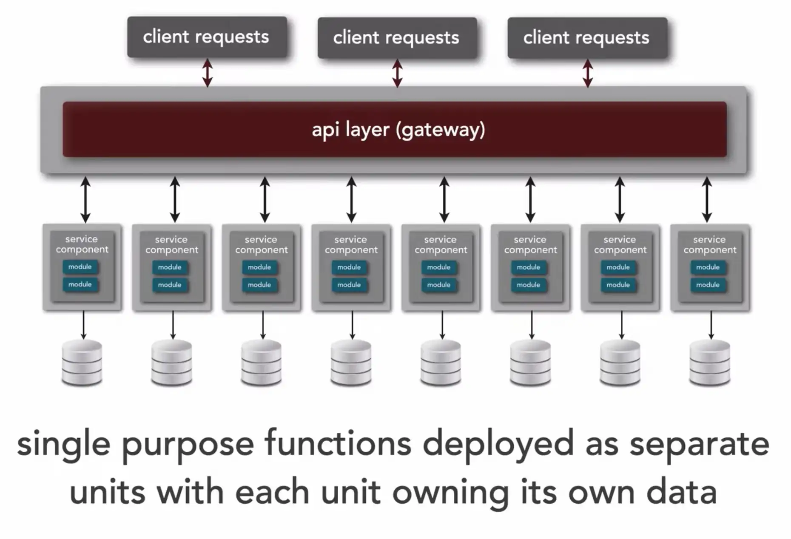

# Software architectures

## What is software architecture?

[Len Bass and colleagues](https://books.google.it/books?id=-II73rBDXCYC&printsec=frontcover&redir_esc=y#v=onepage&q&f=false) defined it as: *The software architecture of a computing system is the set of structures needed to reason about the system, which comprise software elements, relations among them, and properties of both.*

[David Garlan and colleagues](https://books.google.it/books/about/Software_Architecture.html?id=fh_kjgEACAAJ&redir_esc=y) defined it as: *something that defines a family of such systems in terms of a pattern of structural organization. More specifically, an architectural style determines the vocabulary of components and connectors that can be used in instances of that style, together with a set of constraints on how they can be combined.*

## Local and Global Complexity

- **Local Complexity**: The difficulty of understanding and modifying a single component or module.
- **Global Complexity**: The difficulty of understanding and managing interactions across the entire system.

Different architectural styles affect local and global complexity differently.

## Monolithic Architectures

A **monolithic architecture** is a software development approach where an application is built as a **single and unified unit**. In this architecture, all components (such as the user interface, business logic, and database operations) are tightly integrated into one codebase and typically run as a single process.

### Benefits of Monolithic Architecture

When applications are relatively small, a monolithic architecture offers numerous advantages such as:

- **Wide collection of tools**: Integrated Development Environments (IDEs) and developer tools (e.g. *debugger*) are optimized for building a single application, simplifying development.
- **Straightforward Testing**: End-to-end tests can be written to launch the application, invoke the REST API, and test the UI with tools like Selenium.
- **Simple Deployment**: Developers can simply copy the WAR file to a server with Tomcat installed for deployment, moreover they can change the code and database schema, then build and deploy the application seamlessly.
- **Performance**: Faster communication between components since everything is in one process.

### Challenges of Monolithic Architecture

#### Development issues

When monolithic architectures grow, the inexorable degradation of their structure leads to a high degree of coupling of internal components. They evolve towards a [big ball of mud](http://www.laputan.org/mud/mud.html#BigBallOfMud) (**local complexity apex**) where, **due to tight coupling, changes in one part can impact the whole system**.

This process leads to:
- **Slow Development**: The lengthy build process and slow startup times hinder productivity, making the edit-build-run-test cycle inefficient.
- **Testing Challenges**: The large size of the application makes thorough testing difficult, allowing bugs to slip into production.
- **Long Deployment Path**: Updating production becomes cumbersome, often limiting updates to once a month and making continuous deployment nearly impossible.
- **Obsolete Technology Stack**: The monolithic structure hampers the adoption of new frameworks and languages, as rewriting the entire application is costly and risky.

> *A big ball of mud is haphazardly structured, sprawling, sloppy, duct-tape and bailing wire, spaghetti code jungle. We’ve all seen them. These systems show unmistakable signs of unregulated growth, and repeated, expedient repair. Information is shared promiscuously among distant elements of the system, often to the point where nearly all the important information becomes global or duplicated. The overall structure of the system may never have been well-defined. If it was, it may have eroded beyond recognition. Programmers with a shred of architectural sensibility shun these quagmires. Only those who are unconcerned about architecture, and, perhaps, are comfortable with the inertia of the day-to-day chore of patching the holes in these failing dikes, are content to work on such systems.* - Brian Foote, Joseph Yoder (1999)

*Dots on the perimeter represent classes, edges represent dependencies.*

#### Scaling issues

Different kind of scaling options are describable thanks to **The Scale Cube**:

**X-axis Scaling**: Involves running multiple instances of the monolithic application behind a load balancer to handle increased load. 

In most cases, **just a few parts of the application are the choke points that require scaling**, while other components are used less.

**If you scale the monolithic design, all the code for these different tasks is deployed multiple times and scaled at the same grade.** 
* Costly (in terms of hardware): all nodes have must address peak performance of the heaviest components.
* Slow: duplicating a large artifact, starting it, updating DNS requires **many seconds, possibly minutes**!

---

**Z-axis Scaling**: Each instance is responsible for only a subset of the data, allowing for more efficient resource usage (e.g., routing requests by userId).

Scaling a monolithic application by **data sharding** can help manage large datasets, but it has several downsides:

**Complex Data Management**: Sharding requires routing queries to the correct shard, complicates joins across shards, and makes consistency harder to enforce, particularly for transactions and foreign key relationships.

**Limited Scalability**: Sharding only scales the database layer, leaving other layers (like business logic) unoptimized. This can lead to bottlenecks in the application, and inter-shard queries may add latency.

**Operational Overhead**: Sharded databases require extra maintenance, like rebalancing or splitting shards over time. This is complex in a monolithic app where schema changes affect many areas simultaneously.

---

**Y-axis Scaling**: Introduces functional decomposition, where each service is a mini-application implementing focused functionality.

### Multi-Layered architecture

One common architecture is the [multi-layered or n-tier architecture](https://www.youtube.com/watch?v=Y9bKZCYxFuI). With this design:
* an applications is divided into multiple layers (technical partitioning);
* each layer has its own responsibilities (e.g., UI, business logic, data).

Benefits:
* N-tier applications offer good **separation of concerns**, making it possible to consider areas like UI (user interface), data, and business logic separately.
* It’s **easy for teams to work independently on different components** of n-tier applications.
* Because this is a well-understood enterprise architecture, **it’s relatively easy to find skilled developers** for n-tier projects.

Drawbacks:
* Messages tend to pass up and down through the layers, which can be inefficient.
* **Refactoring might be difficult** (domain-based features require changes to all layers).

When to use:
* When developing simple applications, it is advisable to implement a layered architecture because it’s the simplest framework. 
* Pre-existing, technically-oriented teams.

| **Feature**      | **Score** |
|------------------|-----------|
| cost             | * * * * * |
| simplicity       | * * * * * |
| maintainability  | *         |
| evolvability     | *         |
| scalability      | *         |

### Clean Architecture

The [Clean Architecture](https://www.amazon.com/Clean-Architecture-Craftsmans-Software-Structure/dp/0134494164) is an approach designed to make systems more maintainable, flexible, and testable: 
* **It emphasizes a separation of concerns by organizing the software into distinct layers, where the inner layers are not dependent on the outer ones**.
* It focuses on creating independent and reusable components, with clear rules for how different parts of the application should interact.

Benefits:
* Clean Architecture promotes high decoupling between components, ensuring that **changes in outer layers do not affect others**.
* It enhances the testability of the system, allowing developers to test business logic without UI or databases.
* **Due to its modular nature, it's easier to replace or upgrade parts of the system (e.g., databases, UI frameworks) without impacting core business logic.**

Drawbacks:
* It requires a **steeper learning curve** and a deeper understanding of architecture principles.
* **Overhead from creating multiple abstraction layers** can slow down the initial development process.

When to use:
* **Recommended when working on systems that need to evolve over time**, or where different teams may be responsible for different components.
* It’s particularly useful when there is a **high level of business logic that needs to remain isolated** from external dependencies like UI or databases.

| **Feature**      | **Score** |
|------------------|-----------|
| cost             | * * * * * |
| simplicity       | * * *     |
| maintainability  | * *       |
| evolvability     | * *       |
| scalability      | *         |

### Modular Monolithic Architecture

Instead of using layered architecture with horizontal logical layers: 
* **We can organize our code across vertical slices of business functionality** (determined on business demands, rather than technical constraints).

* [Modular monolithic architecture](https://www.youtube.com/watch?v=ikuu3QIuJuc) **divides application logic into independent and isolated modules with business logic, database schema**. 

* Modules can be a potential microservices when need to independently deployed and scale in future refactorings (read more about [Strangler Pattern](https://microservices.io/patterns/refactoring/strangler-application.html)).

Benefits:
* **Encapsulate Business Logic** in modules, and enables high reusability, while data remains consistent and communication patterns simple.
* **Modular components can be reused**: that can help teams establish a single source of truth.

Drawbacks:
* **Can't diversifying technology**: modular monoliths don't provide all benefits of microservices. If you need to diversify technology and language choices, you just can't. 
* **Can't scale and deploy independently**: since the application is a single unit, it can't deploy and scale separated parts like with microservices.

When to use:
* **Domain-based changes and teams**: modular monoliths enable independent development by aligning teams with business domains, ensuring localized changes within well-defined modules to enhance maintainability and scalability. However, this architecture is unfit scenarios where technical-based changes are frequent (e.g., changes to the UI or DB).
* **Modernization**: if you already have a big complex monolithic application running, the modular monolith is the perfect architecture to help you refactor your code to get ready for a potential microservice architecture. Instead of jumping into microservices, you can move modular monolithic without effecting your business and get benefits like speed up with a well-factored modular monolith.
* **Strong consistency**: for many companies unable to make the move to microservices, due to their data not fit for distributed architecture. For example if your application store high important data like debit on bank account, then you need strong consistency that means your data should be correct for every time, if you got any exception you have to rollback immediately.

| **Feature**      | **Score** |
|------------------|-----------|
| cost             | * * * * * |
| simplicity       | * * * * * |
| maintainability  | * *       |
| evolvability     | * *       |
| scalability      | *         |

## Distributed Architectures

A **distributed architecture** is an application built as a collection of interconnected components running on multiple systems (servers, nodes, or machines). These components communicate over a network, working together to provide functionality while distributing the workload.

* Each service is relatively small and focused on a single responsibility.  
* Easier to understand and modify an isolated microservice.  
* Allows independent scaling and deployment of services.  
* Reduces the risk of a single point of failure affecting the whole system.

Independent component uses **Remote Procedure Calls (RPC) for communication**.

Given that distributed architectures are composed of multiple *small* independent services, they decrease local complexity respect to [monolithic architectures](#monolithic-architectures). However, they **increase global complexity**:

- **Increased complexity** in handling service boundaries, API design, and data consistency.  
- **Increased operational overhead** (service discovery, monitoring, logging, tracing).  
- Network communication adds **latency, failure points**.

Distributed architectures naturally evolve towards a [big ball of distributed mud]() (**global complexity apex**).

Big Ball of Distributed Mud is an expression used to describe a chaotic and poorly designed distributed architecture. It occurs when:
- Distributed components are poorly defined and overly dependent on each other.
- There are no clear boundaries between services, leading to a "distributed monolith."
- Communication between services is inefficient, with excessive calls, high latencies, and consistency issues.

*Uber’s microservice architecture circa mid-2018 from Jaeger. Nodes represent services, edges represent dependencies (remote procedure calls).*

### Service-based architecture

[Service-Based Architecture](https://www.youtube.com/watch?v=LK0tC1-mlFA) is a software design approach where:
* an application is **divided into coarse independent services (2-12)** that perform specific functions;
* **each service runs in its own process and communicates with other services through well-defined APIs**, often using protocols like HTTP or messaging queues
* this architecture focuses on separating services by business capability, providing flexibility and scalability.

Benefits:
* **Service-Based Architecture allows independent development, deployment, scaling of services**
* **Low cost, no need for operational automation** (DevOps, Kubernetes)
* **Single database brings simplicity, strong consistency**
* **Modernization**

Drawbacks:
* **Communication between services can introduce latency and complexity**, particularly when dealing with distributed systems.
* **Debugging and monitoring** can be challenging due to the distributed nature of services.
* **Big Ball of Distributed Mud** in case of highly coupled services (chattiness).
* **Low elasticity** Mean Time To Start (MTTS) for coarse grained services is too slow (seconds).

When to use:
* Best suited for **medium to large-scale applications where different teams are responsible for different business functions**.
* Ideal when the **application needs to scale parts of the system independently** based on user demand or performance requirements.

| **Feature**      | **Score** |
|------------------|-----------|
| cost             | * * * *   |
| simplicity       | * * *     |
| maintainability  | * * * *   |
| evolvability     | * * *     |
| scalability      | * * *     |

### Service-oriented architecture

*Dumb services, Smart pipes*

[Service-Oriented Architecture (SOA)](https://www.youtube.com/watch?v=9fn4vGEKFs8&t=522s) is a design paradigm where software components (services) provide functionality through standardized interfaces and protocols. **In SOA, services are reusable, self-contained units that can be discovered and invoked over a network, often using protocols like SOAP or REST**. These services interact with each other to form complete business processes, promoting loose coupling and modularity.

Benefits:
* **Interoperability and integration between heterogeneous services.**
* It enhances flexibility, as **services can be composed** to form business processes without the need to redesign the entire system.
* By decoupling services from each other, **it supports integration across heterogeneous platforms and technologies**, making it ideal for enterprises with diverse systems.

Drawbacks:
* **Limited ability to respond quickly to change.**
* **Performance overhead due to protocol agnostic behaviour**..
* **Shared functionalities become single point of failure/friction to change**.

When to use:
* **Large enterprise systems that need to integrate heterogeneous applications** and platforms.
* **Business processes to span across different systems** or when functionality needs to be exposed to external partners.

| **Feature**          | **Score** |
|----------------------|-----------|
| cost                 | *         |
| simplicity           | *         |
| maintainability      | *         |
| evolvability         | *         |
| scalability          | * * *     |
| **abstraction**      | * * * * * |
| **interoperability** | * * * * * |

### Microservices Architecture

*Smart services, Dumb pipes*

[Microservices architecture](https://www.youtube.com/watch?v=UZQMUiVqpFs) is a modern approach where:
* **Services (single purpose functions) are deployed as separate units each owning their own data (bonded context)**.
* **Services communicate with each other using lightweight protocols, often over HTTP or messaging queues**.

Benefits:
* **Separation of concerns**, each service handle a specific part of the business logic (**and its data!**) independently. 
* **Quick response to changes**, each service is independent and owns its data.
* **Common chassis** for simplified development (read more on [Chassis Pattern](https://microservices.io/patterns/microservice-chassis.html)).
* **Avoids technology lock-in**, each service can be developed with a different tech stack.
* **Division of labour**, teams can work on different services in parallel.
* **Scalability**, as individual services can be scaled independently based on demand.

Drawbacks:
* **Managing communication between services can become complex**, especially as the number of microservices grows.
* **Debugging and monitoring** across distributed services require specialized tools and techniques.
* It can lead to **operational overhead** since each service may have its own database, technology stack, or deployment requirements.

When to use:
* Microservice architecture is ideal for **complex, applications where independent scalability and flexibility are key requirements**.
* Recommended for teams with advanced knowledge of distributed systems and the ability to manage the complexities of service communication and monitoring.

| **Feature**     | **Score** |
|-----------------|-----------|
| cost            | *         |
| simplicity      | *         |
| maintainability | * * * * * |
| evolvability    | * * * * * |
| scalability     | * * * * * |

## Choosing the Right Architecture

- Monolithic systems have lower global complexity but can suffer from high local complexity as they grow.
- Distributed systems reduce local complexity but introduce higher global complexity due to inter-service communication.
- The best choice depends on factors like team expertise, scalability needs, and operational constraints.

## Resources
- [Richards, Ford - Fundamentals of Software Architectures](https://www.oreilly.com/library/view/fundamentals-of-software/9781492043447/)
* [Mark Richards' YouTube Channel](https://www.youtube.com/@markrichards5014/videos)

