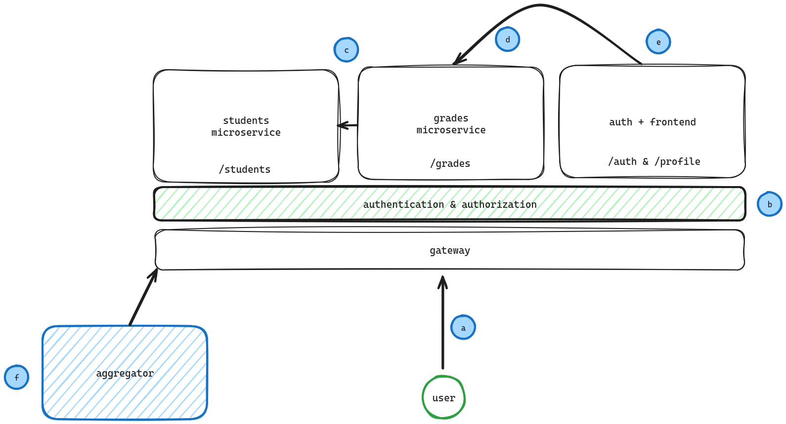

<!-- TOC start (generated with https://github.com/derlin/bitdowntoc) -->
# Table of contents
- [Chapter II: the system and its components — how everything connects](#chapter-ii-the-system-and-its-components-how-everything-connects)

<!-- TOC end -->

<!-- TOC -->
# Chapter II: the system and its components — how everything connects

Now that we dealt with the "theory", let's get right into practice. In this short chapter we are going to talk about which components our system is made of and how they interact. Keep in mind that this is a toy example and not a real world production-ready system, of course, not everything is optimized and carefully thought of since we are going to focus on the authentication/authorization part.
 
Let's take a glance at what we are going to build:

Our goal, by the end of this guide, is to be able to implement these functionalities:

<ol style="list-style: lower-alpha;">
    <li>
        The user can request access to resources through a gateway, a sort of router that knows how to forward requests to the correct microservice;
    </li>
    <li>
    The authentication and authorization layer is hybrid throughout the system, meaning that it will be implemented both on the gateway and the microservices. In particular, microservices will <b>authenticate</b> requests, whereas the gateway will <b>authorize</b> them. This is merely an implementation choice and it is by no means a standard practice: remember that this scenario is particularly didactic and, again, not all choices are made with performance in mind. Things are implemented this way because of simplicity: we will see how intricate gateway authorization can get and adding authentication on top of that is simply to much to bear for the aim of this project;
    </li>
    <li>
        Our first toy microservice is the <i>students microservice</i>, which essentialy abstracts a database of students;
    </li>
    <li>
        Our second microservice is the <i>grades microservice</i>, put in front of, you guessed it, a database of grades. This module will talk with the students microservice for verification purposes we will see in a bit;
    </li>
    <li>
        This module is composed of two submodules: auth and frontend. The first is be our authentication middleware that talks with Keycloak for authenticating users, the second will display a simple HTML page that fetches information from the other microservices; 
    </li>
    <li>
        The last piece of software is the <i>aggregator</i>: it's an automated application that fetches and aggregates information from microservices.
    </li>
</ol>

Now that we have introduced every component, let's see _how_ they are made!

Next chapter: [Chapter III: base project](Chapter%20III.md) 
Previous chapter: [Chapter I: introduction to OAuth2 with Keycloak](Chapter%20I.md)