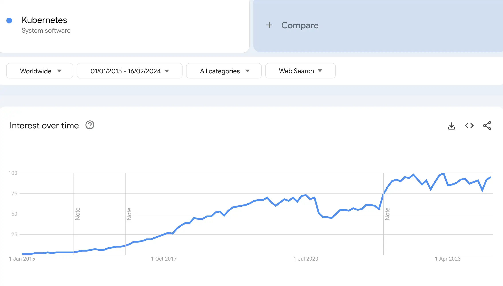

# Understanding the Spring Ecosystem

In this lesson, we'll go through the main modules that Spring offers and understand how they relate to each other to form the Spring ecosystem.

## The Popularity of Spring
Spring is a [back-end](https://en.wikipedia.org/wiki/Front_and_back_ends) technology with a broad range of uses, the most common being the development of web applications. Spring is also a very general term which can refer to the core of the framework, but most often, it refers to the whole family of Spring-related projects.

Spring was originally built in response to the complexity of developing with [J2EE](https://www.oracle.com/technetwork/java/javaee/appmodel-135059.html) / Java EE, let's compare it with that: [Spring Framework - Java EE Google Search Trend Comparison](https://trends.google.com/trends/explore?date=all&q=%2Fm%2F0dhx5b,Java%20EE)

Backend technologies (such as the Spring Framework) are also propelled by the massive increase in popularity of edge-cloud technologies and microservice architecture. 

[OReilly's Technology Trends for 2024](https://www.oreilly.com/radar/technology-trends-for-2024/) also shows how Java Technologies related to cloud software engineering and microservices architectures are extremely relevant.

## Why Use Spring?
The early goal of Spring, and still a core guideline of the framework, is removing complexity, clutter and boilerplate code. Basically, **Spring aims to make building a system easier for developers**. 

Spring is also not an all or nothing choice. **You can actually pick and choose the parts of Spring that make sense for your system**.

An interesting aspect of Spring is how much of a long-term investment learning Spring actually is, as its evolution is quite unique. On the one hand, it's **actively developed and always improving** at the edges. But, at the core, it's **highly stable**. 

[This article](https://medium.com/javarevisited/10-reasons-why-it-is-worth-learning-spring-boot-in-2023-fd06bf833de8) underlines the key factors behind Spring relevance:
* Spring Remains Viable, And Its Track Record Of Staying Current And Relevant Is Impressive
* The Ecosystem Integrates With Existing Popular Libraries
* Testability
* Monitoring
* Observability
* Rapid Development
* Embedded Servers
* Open source

## The Spring Ecosystem
Due to the success of the framework, the Spring ecosystem is now quite vast, as you can see on the [official site](https://spring.io/projects/spring-framework).

### Spring Core
* Core technologies: dependency injection, events, resources, i18n, validation, data binding, type conversion, SpEL, AOP.
* Testing: mock objects, TestContext framework, Spring MVC Test, WebTestClient.
* Data Access: transactions, DAO support, JDBC, ORM, Marshalling XML.
* Spring MVC and Spring WebFlux web frameworks.
* Integration: remoting, JMS, JCA, JMX, email, tasks, scheduling, cache and observability.

### Spring Data
Spring Data’s mission is to provide a familiar and consistent, Spring-based programming model for data access while still retaining the special traits of the underlying data store.

* Powerful repository and custom object-mapping abstractions
* Dynamic query derivation from repository method names
* Implementation domain base classes providing basic properties
* Support for transparent auditing (created, last changed)

### Spring Cloud
Spring Cloud focuses on providing good out of box experience for typical use cases and extensibility mechanism to cover others.

* Distributed/versioned configuration
* Service registration and discovery
* Routing
* Service-to-service calls
* Load balancing
* Circuit Breakers
* Distributed messaging
* Short-lived microservices (tasks)
* Consumer-driven and producer-driven contract testing

### Spring Security
Spring Security is a powerful and highly customizable authentication and access-control framework. It is the de-facto standard for securing Spring-based applications.

* Comprehensive and extensible support for both Authentication and Authorization
* Protection against attacks like session fixation, clickjacking, cross site request forgery, etc
* Servlet API integration
* Optional integration with Spring Web MVC

## Spring Boot

**Spring Boot represents a layer of abstraction on top of the Spring framework**. **The goal is simplifying the development of a Spring application.** 

**Boot is an extension of the Spring framework that comes with default configuration with an opinionated take on building web application with Spring**. Before Boot, a Spring application needed a lot of configuration just to get started. 

**Boot lives on top of the Spring framework.** So it’s not a question of using one or the other. Boot is, without a question, useful, and it does make things simple. But, in doing so, **it hides a lot of the internals of Spring**.

Spring Boot key features:

* Create stand-alone Spring applications
* Embed Tomcat, Jetty or Undertow directly (no need to deploy WAR files)
* Provide opinionated **starter** dependencies to simplify your build configuration
* Automatically configure Spring and 3rd party libraries whenever possible
* Provide production-ready features such as metrics, health checks, and externalized configuration
* Avoids code generation and XML configuration

## Resources
- https://spring.io/projects/spring-framework
