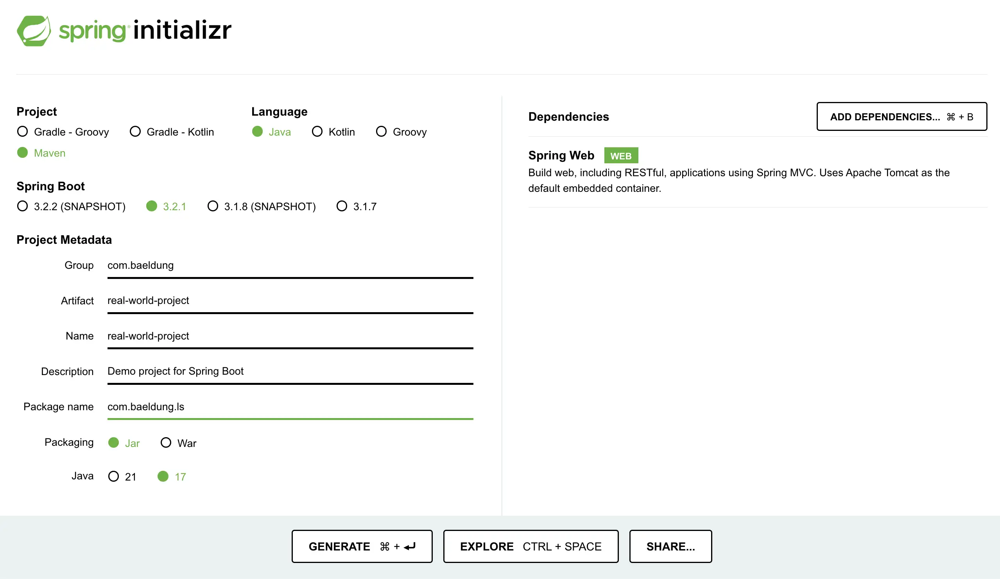

# The Real-World Project We’re Building

## Creating the Project

The example application we've chosen to serve as the code base for the course is a task management application. [**Spring Initializr**](https://start.spring.io/) is useful a quickstart generator for Spring projects.

We'll choose a Maven project using Java, and we need to fill in the project details:

-   Group: com.nbicocchi
-   Artifact: product-service-no-db

For the dependencies section, we'll choose the *Spring Web* dependency. Even though we won't be focusing on web aspects in this module, we include it since it allows us to start the application and keep it running.



Now we can click the "Generate" button to download the project, unzip it and import it into an IDE.

If you are using IntelliJ, you can import the project by navigating to the main menu, select File > Open, and then navigating to the path where our project is present to add it as a Project.

## Adding the Persistence Layer
We'll create a simple [persistence layer](https://en.wikipedia.org/wiki/Persistence_(computer_science)#Persistence_layers) under the package _com.nbicocchi.product.persistence.model_, by adding a _Product_ class.

```
package com.nbicocchi.product.persistence.model;

import lombok.*;

@AllArgsConstructor
@NoArgsConstructor
@Data
public class Product {
    private Long id;
    private String name;
    private Double weight;

    public Product(String name, Double weight) {
        this(null, name, weight);
    }

    public Product(Product product) {
        this(product.getId(), product.getName(), product.getWeight());
    }
}
```

This class will have 3 basic attributes: the _id_, _name_ and _weight_.

Next, we'll add the [repository](https://martinfowler.com/eaaCatalog/repository.html) under the package _com.nbicocchi.product.persistence.repository_:

```
package com.nbicocchi.product.persistence.repository;

import com.nbicocchi.product.persistence.model.Product;
import org.springframework.stereotype.Repository;

import java.util.*;

@Repository
public class ProductRepository {
    private final List<Product> products = new ArrayList<>();

    public Optional<Product> findById(Long id) {
        return products.stream().filter(p -> p.getId().equals(id)).findFirst();
    }

    public Iterable<Product> findAll() {
        return products;
    }

    public Product save(Product product) {
        Product toSave = new Product(product);
        if (Objects.isNull(toSave.getId())) {
            toSave.setId(new Random().nextLong(1_000_000L));
        }
        Optional<Product> existingProject = findById(product.getId());
        existingProject.ifPresent(products::remove);

        products.add(toSave);
        return toSave;
    }

    public void delete(Product product) {
        products.remove(product);
    }
}

```

## Adding the Service Layer
Moving on to the [service layer](https://en.wikipedia.org/wiki/Multitier_architecture#Common_layers), we'll add a similar service interface under the package _com.nbicocchi.product.service_ and class name as _ProductService_:

```
package com.nbicocchi.product.service;

import java.util.Optional;

import com.nbicocchi.product.persistence.model.Product;
import com.nbicocchi.product.persistence.repository.ProductRepository;
import org.springframework.stereotype.Service;

@Service
public class ProductService {
    private final ProductRepository productRepository;

    public ProductService(ProductRepository productRepository) {
        this.productRepository = productRepository;
    }

    public Optional<Product> findById(Long id) {
        return productRepository.findById(id);
    }

    public Iterable<Product> findAll() {
        return productRepository.findAll();
    }

    public Product save(Product product) {
        return productRepository.save(product);
    }

    public void delete(Product product) {
        productRepository.delete(product);
    }
}
```

The _@Repository, @Service_ and _@Autowired_ annotations we've used are Spring annotations that define and connect the 2 classes. 

## Adding the Presentation Layer
Moving on to the [presentation layer](), we'll add a similar service interface under the package _com.nbicocchi.controller_ and class name as _IProjectController_ with an implementation under the package _com.controller.service.impl_:

```
@RequestMapping(value = "/projects")
public interface IProjectController {
    @GetMapping(value = "/{id}")
    Project findOne(@PathVariable Long id);

    @GetMapping
    Collection<Project> findAll();

    @PostMapping
    @ResponseStatus(HttpStatus.CREATED)
    Project create(@RequestBody Project project);
}
```

```
@RestController
public class ProjectController implements IProjectController {
    IProjectService projectService;

    public ProjectController(IProjectService projectService) {
        this.projectService = projectService;
    }

    @Override
    public Project findOne(Long id) {
        return projectService.findById(id).orElseThrow(
                () -> new ResponseStatusException(HttpStatus.BAD_REQUEST));
    }

    @Override
    public Collection<Project> findAll() {
        return projectService.findAll();
    }

    @Override
    public Project create(Project project) {
        return projectService.save(project);
    }
}
```

## _ApplicationRunner_ and _CommandLineRunner_ Interfaces

In Spring Boot, _CommandLineRunner_ and _ApplicationRunner_ are two interfaces that allow you to execute code when a Spring Boot application starts. They are typically used to perform some initialization or setup tasks before the application starts processing requests. Both interfaces have a single run method that you need to implement.

```
@SpringBootApplication
public class App implements ApplicationRunner {
    ProductRepository productRepository;

    public App(ProductRepository productRepository) {
        this.productRepository = productRepository;
    }

    public static void main(final String... args) {
        SpringApplication.run(App.class, args);
    }

    @Override
    public void run(ApplicationArguments args) {
        productRepository.save(new Product("Laptop", 2.2));
        productRepository.save(new Product("Bike", 5.5));
        productRepository.save(new Product("Shirt", 0.2));
    }
}
```

## Resources

