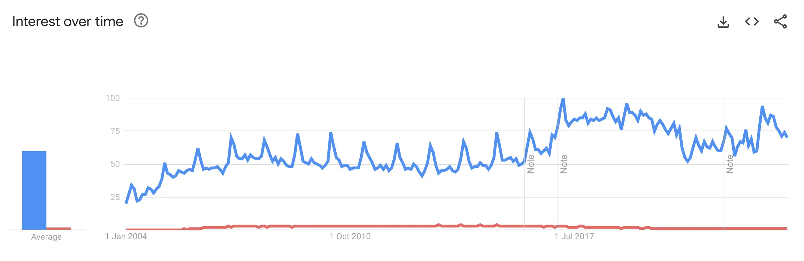
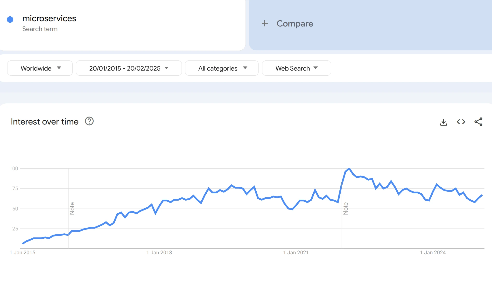
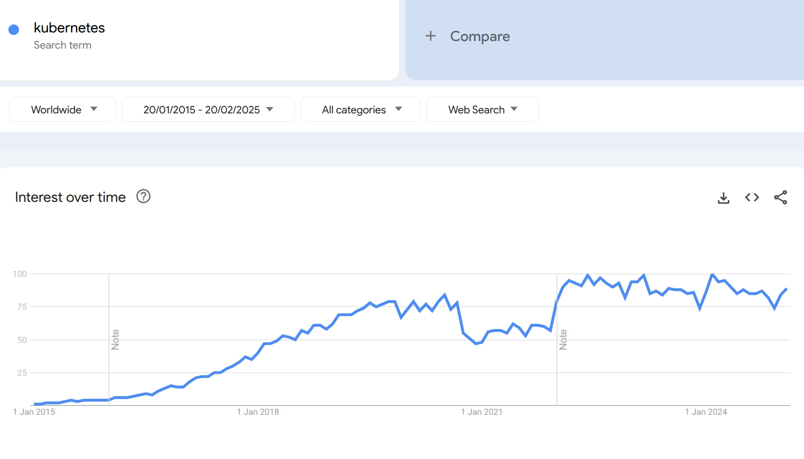

# Understanding the Spring Ecosystem

## The Popularity of Spring
Spring is a [back-end](https://en.wikipedia.org/wiki/Front_and_back_ends) technology with a broad range of uses, the most common being the development of web applications. Spring is also a very general term which can refer to the core of the framework, but most often, it refers to the whole family of Spring-related projects.

Spring was originally built in response to the complexity of developing with [J2EE](https://www.oracle.com/technetwork/java/javaee/appmodel-135059.html) / Java EE, let's compare it with that: [Spring Framework - Java EE Google Search Trend Comparison](https://trends.google.com/trends/explore?date=all&q=%2Fm%2F0dhx5b,Java%20EE)

Backend technologies (such as the Spring Framework) are also propelled by the **massive increase in popularity of edge-cloud technologies and microservice architecture**. [OReilly's Technology Trends for 2024](https://www.oreilly.com/radar/technology-trends-for-2024/) also shows how Java Technologies related to cloud software engineering and microservices architectures are currently relevant.

## Why Use Spring?
The early goal of Spring, and still a core guideline of the framework, is removing complexity, clutter and boilerplate code. Basically, **Spring aims to make building a system easier for developers**. 

Spring is also not an all or nothing choice. **You can actually pick and choose the parts of Spring that make sense for your system**.

An interesting aspect of Spring is how much of a long-term investment learning Spring actually is, as its evolution is quite unique. On the one hand, it's **actively developed and always improving** at the edges. But, at the core, it's **highly stable**. 

[This article](https://medium.com/javarevisited/10-reasons-why-it-is-worth-learning-spring-boot-in-2023-fd06bf833de8) underlines the key factors behind Spring relevance:
* Massive ecosystem
* Testability
* Monitoring
* Observability
* Rapid development
* Embedded servers
* Open source

## The Spring Ecosystem
Due to the success of the framework, the Spring ecosystem is now quite vast, as you can see on the [official site](https://spring.io/projects/spring-framework).

### Spring Core
* Core technologies: dependency injection, events, resources, i18n, validation, data binding, type conversion, SpEL, AOP.
* Testing: mock objects, TestContext framework, Spring MVC Test, WebTestClient.
* Data Access: transactions, DAO support, JDBC, ORM, Marshalling XML.
* Integration: remoting, JMS, JCA, JMX, email, tasks, scheduling, cache and observability.

### Spring Boot
**Spring Boot simplifies the development of a Spring application.**

**Spring Boot is an extension of the Spring framework that comes with default configuration with an opinionated take on building web application with Spring**. Before Boot, a Spring application needed a lot of configuration just to get started.

Spring Boot key features:

* **Embedded web servers** (no need to deploy WAR files)
* Provide **starter** dependencies to simplify your build configuration
* **Automatically configure** libraries whenever possible
* Provide **production-ready features** such as metrics, health checks, and externalized configuration
* Avoids XML configuration

### Spring Data
Spring Data provides a familiar and consistent programming model for data access while still retaining the special traits of the underlying data store.

* Powerful repository and custom object-mapping abstractions
* Dynamic query derivation from repository method names
* Implementation domain base classes providing basic properties
* Support for transparent auditing (created, last changed)

### Spring Cloud
Spring Cloud provides out of box experience for typical use cases and extensibility mechanism to cover others.

* Distributed configuration
* Service registration and discovery
* Routing
* Service-to-service calls
* Load balancing
* Circuit Breakers
* Distributed messaging

## Resources
- https://spring.io/projects/spring-framework
