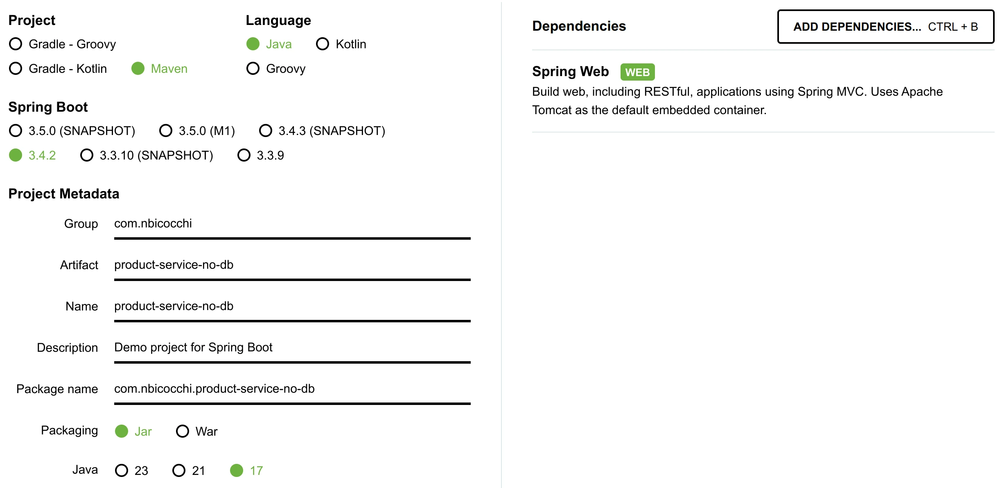

# Real-World Project

## Creating the Project

In this lesson, we'll build a simple layered microservice for handling a catalog of products. [**Spring Initializr**](https://start.spring.io/) is useful quickstart generator for Spring projects.

We'll choose a Maven project using Java, and we need to fill in the project details:

-   Group: com.nbicocchi
-   Artifact: product-service-no-db

For the dependencies section, choose the *Spring Web* dependency. Even though we won't be focusing on web aspects in this module, we include it since it allows us to keep the application running after startup.



Now we can click the "Generate" button to download the project, unzip it and import it into an IDE.

If you are using IntelliJ, you can import the project by navigating to the main menu, select File > Open, and then navigating to the path where our project is present to add it as a Project.

## Adding the Persistence Layer
We'll create a simple [persistence layer](https://en.wikipedia.org/wiki/Persistence_(computer_science)#Persistence_layers) under the package _com.nbicocchi.product.persistence.model_, by adding a _Product_ class.

```
@AllArgsConstructor
@NoArgsConstructor
@Data
public class Product {
    private Long id;
    @EqualsAndHashCode.Include
    private String uuid;
    private String name;
    private Double weight;

    public Product(String uuid, String name, Double weight) {
        this.uuid = uuid;
        this.name = name;
        this.weight = weight;
    }
}
```

This class has 3 key attributes: _uuid_, _name_ and _weight_.

Next, we'll add the [repository](https://martinfowler.com/eaaCatalog/repository.html) under the package _com.nbicocchi.product.persistence.repository_:

```
@Repository
public class ProductRepository {
    private final List<Product> products = new ArrayList<>();

    public Optional<Product> findById(Long id) {
        return products.stream().filter(p -> p.getId().equals(id)).findFirst();
    }

    public Optional<Product> findByUuid(String uuid) {
        return products.stream().filter(p -> p.getUuid().equals(uuid)).findFirst();
    }

    public Iterable<Product> findAll() {
        return products;
    }

    public Product save(Product product) {
        Product toSave = new Product(
                product.getId(),
                product.getUuid(),
                product.getName(),
                product.getWeight()
        );
        if (Objects.isNull(toSave.getId())) {
            toSave.setId(new Random().nextLong(1_000_000L));
        }
        Optional<Product> existingProject = findById(product.getId());
        existingProject.ifPresent(products::remove);
        products.add(toSave);
        return toSave;
    }

    public void delete(Product product) {
        products.remove(product);
    }
}
```

## Adding the Service Layer
Moving on to the [service layer](https://en.wikipedia.org/wiki/Multitier_architecture#Common_layers), we'll add a similar service under the package _com.nbicocchi.product.service_:

```
@Service
public class ProductService {
    private final ProductRepository productRepository;

    public ProductService(ProductRepository productRepository) {
        this.productRepository = productRepository;
    }

    public Optional<Product> findByUuid(String uuid) {
        return productRepository.findByUuid(uuid);
    }

    public Iterable<Product> findAll() {
        return productRepository.findAll();
    }

    public Product save(Product product) {
        return productRepository.save(product);
    }

    public void delete(Product product) {
        productRepository.delete(product);
    }
}
```

## Adding the Presentation Layer
Moving on to the [presentation layer](), we'll add a similar service interface under the package _com.nbicocchi.controller_:

```
@RestController
@RequestMapping("/products")
public class ProductController {
    ProductService productService;

    public ProductController(ProductService productService) {
        this.productService = productService;
    }

    @GetMapping("/{uuid}")
    public Product findByUuid(@PathVariable String uuid) {
        return productService.findByUuid(uuid).orElseThrow(() -> new ResponseStatusException(HttpStatus.NOT_FOUND));
    }

    @GetMapping
    public Iterable<Product> findAll() {
        return productService.findAll();
    }

    @PostMapping
    public Product create(@RequestBody Product product) {
        return productService.save(product);
    }

    @PutMapping("/{uuid}")
    public Product update(@PathVariable String uuid, @RequestBody Product product) {
        Optional<Product> optionalProject = productService.findByUuid(uuid);
        optionalProject.orElseThrow(() -> new ResponseStatusException(HttpStatus.NOT_FOUND));
        product.setId(optionalProject.get().getId());
        return productService.save(product);
    }

    @DeleteMapping("/{uuid}")
    public void delete(@PathVariable String uuid) {
        Optional<Product> optionalProject = productService.findByUuid(uuid);
        optionalProject.orElseThrow(() -> new ResponseStatusException(HttpStatus.NOT_FOUND));
        productService.delete(optionalProject.get());
    }
}
```

## _ApplicationRunner_ and _CommandLineRunner_ Interfaces

In Spring Boot, _CommandLineRunner_ and _ApplicationRunner_ are two interfaces that allow you to execute code when a Spring Boot application starts. They are typically used to perform some initialization or setup tasks before the application starts processing requests. Both interfaces have a single run method that you need to implement.

```
@Log
@SpringBootApplication
public class App implements ApplicationRunner {
    ProductRepository productRepository;

    public App(ProductRepository productRepository) {
        this.productRepository = productRepository;
    }

    public static void main(final String... args) {
        SpringApplication.run(App.class, args);
    }

    @Override
    public void run(ApplicationArguments args) {
        productRepository.save(new Product("171f5df0-b213-4a40-8ae6-fe82239ab660", "Laptop", 2.2));
        productRepository.save(new Product("f89b6577-3705-414f-8b01-41c091abb5e0", "Bike", 5.5));
        productRepository.save(new Product("b1f4748a-f3cd-4fc3-be58-38316afe1574", "Shirt", 0.2));

        Iterable<Product> products = productRepository.findAll();
        for (Product product : products) {
            log.info(product.toString());
        }
    }
}
```

## Testing the Product microservice

See one product

```bash
╰> curl -X GET http://localhost:7001/products/171f5df0-b213-4a40-8ae6-fe82239ab660 | jq
{
  "id": 833124,
  "uuid": "171f5df0-b213-4a40-8ae6-fe82239ab660",
  "name": "Laptop",
  "weight": 2.2
}
```

See all products

```bash
╰> curl -X GET http://localhost:7001/products | jq                                     
[
  {
    "id": 163814,
    "uuid": "171f5df0-b213-4a40-8ae6-fe82239ab660",
    "name": "Laptop",
    "weight": 2.2
  },
  {
    "id": 269752,
    "uuid": "f89b6577-3705-414f-8b01-41c091abb5e0",
    "name": "Bike",
    "weight": 5.5
  },
  {
    "id": 328487,
    "uuid": "b1f4748a-f3cd-4fc3-be58-38316afe1574",
    "name": "Shirt",
    "weight": 0.2
  }
]
```

Add a product

```bash
╰> curl -X POST http://localhost:7001/products -H "Content-Type: application/json" -d '{                                                
    "uuid": "b1f4748a-0000-4fc3-be58-38316afe1574",
    "name": "Puppet",
    "weight": 0.2
  }'
{"id":777523,"uuid":"b1f4748a-0000-4fc3-be58-38316afe1574","name":"Puppet","weight":0.2}%   
```

Update a product

```bash
╰> curl -X PUT http://localhost:7001/products/b1f4748a-0000-4fc3-be58-38316afe1574 -H "Content-Type: application/json" -d '{
    "uuid": "b1f4748a-0000-4fc3-be58-38316afe1574",
    "name": "Puppet, but nicer",
    "weight": 0.3
  }'
{"id":777523,"uuid":"b1f4748a-0000-4fc3-be58-38316afe1574","name":"Puppet, but nicer","weight":0.3}%   
```

Delete a product

```bash
curl -X DELETE http://localhost:7001/products/b1f4748a-f3cd-4fc3-be58-38316afe1574 | jq
```


## Resources

