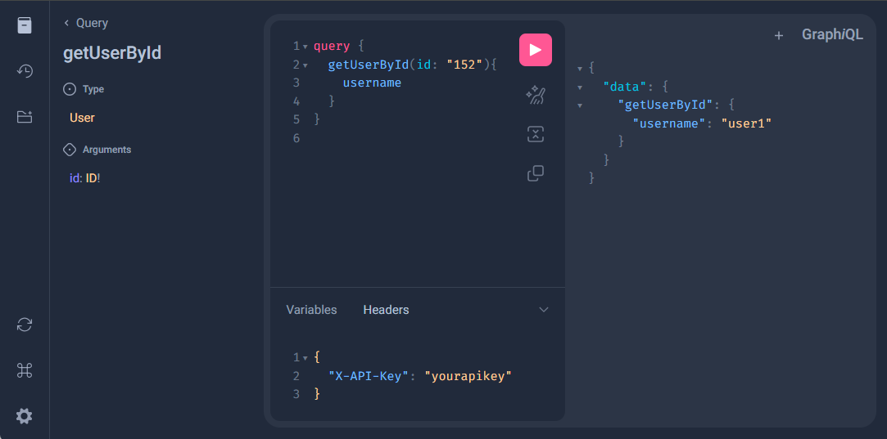
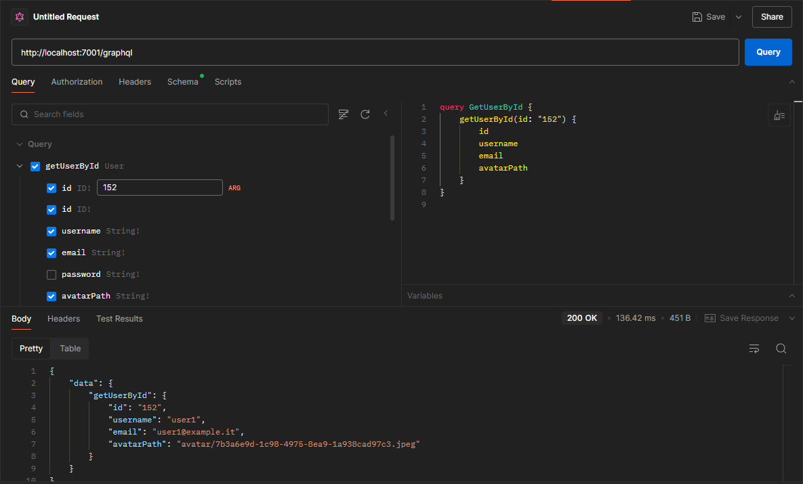
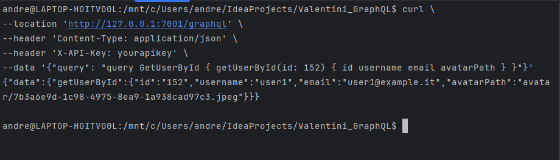
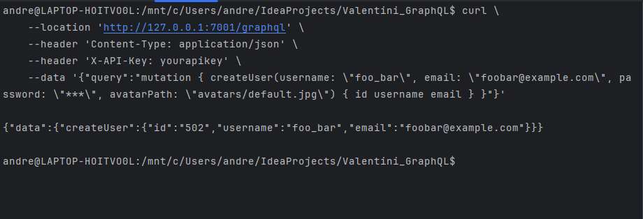

# GraphQL

## Theory introduction

GraphQL is a query language for APIs (Application Programming Interfaces), developed by Facebook in 2012 and made open-source in 2015.

Unlike traditional REST APIs, where the client has to make multiple requests to obtain all the information it needs, GraphQL allows the client to specify exactly what data it wants to obtain and from where, in a single request.

With GraphQL, the client sends a query describing the structure of the data it wishes to receive, and the server responds with a JSON containing only the requested data, in the format requested by the client. This approach allows greater flexibility and efficiency, as it reduces network overhead and allows the client to obtain only the data it needs, without unnecessary information.

In addition, GraphQL provides a strong typing system, which allows developers to clearly define the data structure and validate queries at compile time. This leads to better automatic API documentation and greater robustness in client and server code.

Another advantage to using GraphQL is the lack of the need to provide for api versioning to allow, for example, legacy applications to run. This is because this query language only returns the data that’s explicitly requested, so new capabilities can be added via new types and new fields on those types without creating a breaking change.

For example, if you want to obtain information about an individual post, you can send the query:
```
query {
  getPostById(id: "123") {
    id
    description
    user {
      id
      username
    }
    comments {
      id
      content
    }
    likesCount
    imagePath
  }
}
```

In this query:

- **`query`** is the keyword indicating that a query is being performed.
- **`getPostById`** is the name of the query endpoint, which may correspond to a function or a field defined in the GraphQL server.
- **`(id: "123")`** specifies the query arguments. In this case, we are querying the information of a post with a specific ID (in our example, "123").
- **`id`** and **`description`** are the required post fields.
- **`user`** is a field that can contain additional fields, such as **`id`** and **`username`**, representing the post's author.
- **`comments`** is a field that can be a list of objects, which may contain additional fields such as **`id`** and **`content`**, representing the post's comments.

When this query is executed on the GraphQL server, a JSON object will be returned containing the required information about the post, or possibly an error if the post is not found or another problem occurs during the execution of the query. For example:

```json
{
  "data": {
    "post": {
      "id": "123",
      "description": "This is the post description.",
      "user": {
        "id": "456",
        "username": "john_doe"
      },
      "comments": [
        {
        "id": "789",
        "content": "This is the first comment."
        },
        {
        "id": "1011",
        "content": "This is the second comment."
        }
      ],
      "likesCount": "10",
      "imagePath": "posts/default.jpg"
    }
  }
}
```

In this response:

- We have a JSON object with a key **`data`**, which contains the data required by the query.
- 
- Within the object **`data`**, we have an object **`post`**, which contains information about the requested user.
- The object **`post`** contains the properties **`id`**, **`description`**, **`likesCount`**, and **`imagePath`**, representing the post's ID, description, number of likes, and image path, respectively.
- The property **`user`** contains an object with the properties **`id`** and **`username`**, representing the post's author.
- The property **`comments`** contains an array of objects, each representing a comment on the post. Each comment object contains the properties **`id`** and **`content`**, representing the comment's ID and content.

In the above example, the values of all parameters were requested; in case it wants only some of them (e.g., just the name), the answer will be:
```json
{
  "data": {
    "post": {
      "description": "This is the post description."
    }
  }
}
```
making the query:
```
query {
  getPostById(id: "123") {
    description
  }
}
```
For the moment, we will focus on the basic concepts of GraphQL also by using examples with queries, and then we will move on to the technical aspects of its implementation.

### Basic concepts

#### Queries & Mutations
In GraphQL, queries are used to retrieve data from the server, while mutations are used to modify or create data on the server. Both queries and mutations are defined in the GraphQL schema and can be executed by clients to interact with the server.
The main difference between queries and mutations is that queries are read-only operations that do not modify the server's state, while mutations are write operations that can modify the server's state. 
The syntax for queries and mutations is similar, but they are distinguished by the operation keyword at the beginning of the request:
- **Query**: Used to retrieve data from the server; we have talked about it in the previous section.
- **Mutation**: Used to modify or create data on the server. An example can be:
    ```
    mutation {
        createPost(description: "This is a description", userId: "200", imagePath: "posts/default.jpg") {
            id
            description
            likescount
        }
    }
    ```
    Note the *Data mutations and after fetch* principle: after a mutation, the server returns the data that was modified or created. This allows the client to update its local cache or UI based on the server's response.
    If we don't want to return anything, we can use the keyword *void*:
    ```
    mutation {
        deletePost(id: "123") {
            void
        }
    }
    ```
    In this case, the server will delete the post with the specified ID and return nothing.

#### Aliases
In GraphQL, aliases are used to request the same field or fields multiple times within a single query, but with different names for each occurrence. 
This is particularly useful when you want to retrieve similar data from a GraphQL server but need to differentiate between them in the response.
Anyway,  if any part of a query fails to execute successfully, the entire query will result in an error. 
This is known as "all or nothing" behavior. So, when using aliases, it's important to ensure that each aliased field is valid and can be resolved successfully. Otherwise, the entire query will fail.
Just for example, if you want to retrieve information about two posts with different IDs, you can use aliases to differentiate between them in the response:
```
query GetProduct {
    alias0: getPostById(productId: 111) {
       id
       description
}

    alias1: getPostById(productId: 112) {
       id
       description
    }
}
```
Here is the response:
```json
{
  "data": {
    "alias0": {
      "id": 111,
      "description": "post 111"
    },
    "alias1": {
      "id": 112,
      "description": "post 112"
    }
  }
}
```

#### Fragments
Fragments in GraphQL are like reusable units of fields. They allow you to define a set of fields that you can include in multiple queries, mutations, or other fragments.
Here's a breakdown of how fragments work in GraphQL:
```
fragment PostFields on Post {
    id
    description
}
```
In this example, the fragment **`PostFields`** defines a set of fields that can be included in queries or mutations that require information about a post. The **`on Post`** part specifies that the fragment applies to objects of type **`Post`**.
To use the fragment in a query, you can include it like this:
```
query GetPost {
    getPostById(productId: 111) {
        ...PostFields
    }
  
}
```

#### Operations
The operationName in GraphQL is an optional piece of metadata that you can include in your GraphQL requests. It's used to specify the name of the operation being performed within a multi-operation request.

In GraphQL, you can send multiple operations (queries, mutations, or subscriptions) in a single request separated by curly braces {}. This is particularly useful when you want to fetch or mutate multiple sets of data in a single round trip to the server.
Here's an example of a GraphQL request with multiple operations:
```
query PleaseGetPost {
  getPostById(id: 111) {
    id
    description
  }
  getPostByUserId(userId: 200) {
    id
    likesCount
  }
}
```
Will be possible to see *operationName* in some places, like in the GraphQL debug interface:
```
--- logs here ---
    getPostById(id: 111) {
        id
        description
    }
    getPostByUserId(userId: 200) {
        id
        likesCount
    },
    operationName='PleaseGetProduct'
--- others logs here ---
```

#### Variables
Variables in GraphQL allow you to parameterize your queries, mutations, or subscriptions, making them dynamic and reusable. Instead of hardcoding values directly into your GraphQL operations, you can use variables to pass values from the client to the server at runtime.

Here's how you can define and use variables in GraphQL:
1. Define the variable in the query or mutation operation.
    ```
        query GetPost($postId: ID!) {
            getPostById(id: $postId) {
                description
                likesCount
            }
        }
    ```
    You can define the default variable value by adding a colon and the default value after the type declaration:
        ```
            query GetPost($postId: ID = "123") {
              getPostById(id: $postId) {
                description
                likesCount
              }
            }
        ```

2. Pass the variable values when executing the operation.
  ```
    {
        "postId": "123"
    }
  ```
Using variables in GraphQL provides several benefits:
- **Dynamic Queries**: Variables allow you to construct dynamic queries based on user input or other runtime conditions. 
- **Security**: Using variables helps protect against injection attacks, as values are passed separately from the query string. 
- **Query Reusability**: By parameterizing your queries, mutations, or subscriptions, you can reuse them with different input values, improving code maintainability and reducing duplication.

#### Directives
Directives in GraphQL are used to conditionally include or exclude fields or fragments in a query based on certain conditions. They provide a way to control the execution of a query and customize the response based on the client's requirements.
Here is an example of how you can use directives in a GraphQL query:
```
query GetPost($includeImage: Boolean!) {
  getPostById(id: "123") {
    description
    imagePath @include(if: $includeImage)
  }
}
```
In this query, the **`@include`** directive is used to conditionally include the **`imagePath`** field based on the value of the **`$includeImage`** variable. If the variable is **`true`**, the **`imagePath`** field will be included in the response; otherwise, it will be excluded.
```
{
    "$includeImage": true
}
```

#### Introspection query
The introspection query is a special query in GraphQL that allows you to query the schema of a GraphQL server to retrieve information about the types, fields, and directives defined in the schema. This can be useful for exploring the capabilities of a GraphQL API, generating documentation, or building tools that work with GraphQL schemas.
Some application like Postman uses this query in advance to retrieve the schema of the API and to allow the user to compose queries and mutations in an intuitive way.

It is possible to do this query, by cURL for example, by sending the attached JSON body file *introspection_query.json* (omitted in this text for readability reasons because is very long) to the desired endpoint (e.g., *http://localhost:7001/graphql*) by the command:
```bash
curl --location --request POST 'http://localhost:7001/graphql' \
--header 'Content-Type: application/json' \
-d @introspection_query.json
```
The response is also omitted for brevity because can be really verbose.

Obviously, using this kind of method is a little bit cumbersome, so it is advisable to not use it.
This query will return a JSON object containing information about the schema of the GraphQL server, including the query type, mutation type, subscription type, types, and directives defined in the schema.

## Technical explanation

### Schema

The GraphQL schema defines the structure of the data available through a GraphQL API. This schema provides a clear map of the available data types and the relationships between them, enabling developers to understand how to interact with the API and what data can be requested and sent. In fact, it is possible to make a request in advance in order to know what objects and queries are available.

In the GraphQL schema, several data types are defined, including:

1. **Object Types**: They represent objects within the system. For example, an object type could represent a user, a post or any other entity in the system.
2. **Fields**: These are the properties of an object type. Each field has a name and a type. Fields can be scalar (strings, numbers, booleans, etc.) or they can be other object types.
3. **Arguments**: These are the parameters passed to fields to customise the result. For example, a query to obtain information about a user might require an argument such as the user's ID.
4. **Scalar types**: These are the primitive data types, such as strings, numbers, Booleans, etc.
5. **List of types**: Indicates an array of a specific type of data. For example, a list of posts.

Here is a simplified example of what a GraphQL schema might look like:

```graphql
type User {
    id: ID!
    username: String!
    email: String!
    password: String!
    avatarPath: String!
}

input UserInput {
    username: String!
    email: String!
    password: String!
}

type Query {
    getUserById(id: ID!): User
    getUserByUsername(username: String!): User
    getUserByEmail(email: String!): User
    getUsers: [User]!
}

type Mutation {
    createUser(username: String!, email: String!, password: String!, avatarPath:String!): User!
    deleteUser(id: ID!): Boolean
    updateUser(id: ID!, username: String, email: String, password: String, avatarPath: String): User
}
```

In this example:

- An object type was defined: User, which represents users in the system.
- Each object type has fields representing the properties of that object; with their respective types (integer, string, etc.). The "!" symbol in a GraphQL schema indicates that a field is mandatory, i.e. it must always have a value when returned by the GraphQL server. If a field has the "!" symbol, it means that it cannot be null and must be included in the query result. The usage of the square brackets around type show that the object returned is a List.
- The **`Input`** is a data type used to define the structure of input parameters for mutations. Mutations are operations that modify or update data in the GraphQL server, such as creating a new user or editing a post.
- The type **`Query`** defines the available read operations (queries), such as getUserById, which returns the details of the user having that specific *id*. It is similar to the GET method in REST.
- The **`Mutation`** in GraphQL are operations that allow data to be modified on the server. Whereas queries are used to read data, mutations allow data to be created, modified or deleted in the system; they take as input the parameters defined within the round brackets and return the values of the type defined after the symbol ":"; again the presence of the symbol "!" symbol means that after the operation is executed, it must return something other than *null*. Mutations are defined within the GraphQL schema just like queries, but are annotated with the type **`Mutation`** instead of **`Query`**.
It works like the POST, PUT, PATCH and DELETE methods in REST.

### Responses

A special feature of GraphQL, unlike REST, is that the status code of the HTTP response is always 200, regardless of whether the request was successful or not. This is because GraphQL handles errors differently from traditional REST APIs.

Instead of using the HTTP status code to report errors, GraphQL returns a JSON object with an 'errors' key in the response body if errors occur during query processing. This object contains a list of errors giving details of the type of error and where it occurred.

For example, if a GraphQL query contains a syntax error, the server will respond with a status 200 and include an 'errors' object in the response to indicate the specific error:

- **Wrong query**:

    ```bash
    query GetUser {
        getUserById(id: 123 { # it lacks the ")" symbol after 123
            username
            email
        }
    }
    ```

- **Response**:

    ```bash
    {
        "errors": [
          {
            "message": "Invalid Syntax : offending token '{' at line 2 column 31"
          }
        ]
     }
    ```


On the other hand, if the query is processed correctly and there are no errors, the response will still be status 200 and will include the requested data in the JSON response.

Therefore, when working with GraphQL, it is important to examine the content of the JSON response to determine whether the request was successful or not, rather than relying solely on the HTTP status code.

**Exceptions handling**

It is possible to enhance the response of wrong query in order to make it more verbose (e.g. *notfoundexception* in the case of an object not found instead of a generic one). It can be done by adding a custom exception resolver class (extending *DataFetcherExceptionResolverAdapter*) like this:

```java
@Component
public class GraphQlCustomExceptionResolver extends DataFetcherExceptionResolverAdapter {

    @Override
    protected GraphQLError resolveToSingleError(Throwable ex, DataFetchingEnvironment env) {
        if (ex instanceof NotFoundException) {
            return GraphqlErrorBuilder.newError()
                    .errorType(ErrorType.NOT_FOUND)
                    .message(ex.getMessage())
                    .path(env.getExecutionStepInfo().getPath())
                    .location(env.getField().getSourceLocation())
                    .build();
        } else if (ex instanceof InvalidInputException) {
            return GraphqlErrorBuilder.newError()
                    .errorType(ErrorType.BAD_REQUEST)
                    .message(ex.getMessage())
                    .path(env.getExecutionStepInfo().getPath())
                    .location(env.getField().getSourceLocation())
                    .build();
        } else if (ex instanceof BadRequestException) {
            return GraphqlErrorBuilder.newError()
                    .errorType(ErrorType.BAD_REQUEST)
                    .message(ex.getMessage())
                    .path(env.getExecutionStepInfo().getPath())
                    .location(env.getField().getSourceLocation())
                    .build();
        }
        else {
            return null;
        }
    }
}
```
where every exception returns a more verbose error. Obviously each exception will have to be declared separately (see attached code in the repository).

### GraphQL vs REST
Here is a quick overview of the differences between GraphQL and REST API:

#### REST API
1. **Architecture**:
   - Based on resources identified by URLs. 
   - Uses standard HTTP methods like GET, POST, PUT, DELETE.

2. **Requests**:
   - Each endpoint is tied to a specific resource.
   - Responses are often fixed and can include unnecessary data.

3. **Scalability**:
   - Simpler to implement for straightforward APIs.
   - Can become complex with the increase in resources and relationships between them.

4. **Versioning**:
   - Often requires versioning of the API to manage changes (e.g., /v1/users, /v2/users).

5. **Caching**:
   - Excellent cache management due to standard HTTP methods.

#### GraphQL
1. **Architecture**:
    - Based on a single endpoint for all requests.
    - Allows defining exactly what data is required in the query.

2. **Requests**:
    - Clients can specify exactly what data they want, reducing unnecessary data.
    - More flexible, as a single query can request data from multiple resources with one call.

3. **Scalability**:
    - Can handle complex relationships between data without needing specific endpoints.
    - Requires more initial planning to define the data schema.

4. **Versioning**:
    - Does not require API versioning, as changes can be managed through the schema without breaking existing queries.
   
5. **Caching**:
    - Cache management is more complex, requiring specific techniques and tools (e.g., client-side persistence).

#### Key Differences
- **Flexibility**: GraphQL offers greater flexibility in data requests compared to REST, which has more rigid responses. 
- **Request Efficiency**: GraphQL can reduce the number of requests needed to obtain all the required data, while REST may require multiple API calls. 
- **Response Structure**: With GraphQL, responses are exactly what was requested, while REST often includes unnecessary fields. 
- **Implementation Complexity**: REST can be simpler to implement for basic APIs, while GraphQL may require more initial planning but offers advantages for more complex APIs.

In summary, GraphQL is often preferred for modern and complex applications that require flexible and efficient data interaction, while REST remains a solid choice for simpler APIs with a less dynamic data model.
Also, GraphQL is not a replacement for REST, but rather a complementary technology that can be used alongside REST APIs to provide more flexibility and efficiency in data retrieval.
So, the choice between GraphQL and REST depends on the specific requirements of the application and the complexity of the data model.

#### A simple comparison between GraphQL requests and REST requests
##### GET Request example
Here is a comparison between a GraphQL request and a REST request to obtain the same information:
- **GraphQL request**:
    ```graphql
    query GetUser {
        getUserById(id: 123) {
            id
            username
            email
        }
    }
    ```
  The response will be:
    ```json
    {
        "data": {
            "getUserById": {
                "id": 123,
                "username": "john_doe",
                "email": "johndoe@example.com"
            }
        }
    }
    ```
  
Additionally, GraphQL can help to avoid chattiness by allowing the client to request multiple resources in a single query. For example, the client could request information about multiple users in a single query, reducing the number of requests needed to obtain all the required data (we've talked about this in the first part of this markdown: *Aliases* and *Fragments*).

- **REST request**:
    ```bash
    GET /user/123
    ```
    The response will be:

    ```json
        {
            "id": 123,
            "username": "Product Name",
            "email": 100
        }
    ```

In the REST request, the client sends a GET request to the `/products/123` endpoint to retrieve information about the product with ID 123. The server responds with a JSON object containing all the product details.
Differently from the REST request, the GraphQL request allows the client to specify exactly what information it wants to retrieve about the product, including only the fields it needs, such as the product ID, username and email.
For example, we could be request just a single field:

```graphql
    query GetUser {
        getUserById(id: 123) {
            username
        }
    }
```
  The response will be:

```json
    {
        "data": {
            "getUserById": {
                "username": "john_doe"
            }
        }
    }
```

To be noted that in the REST request we have to personalize the url in order to obtain the desired information, while in the GraphQL request we can obtain the same information just by changing the query.

##### POST Request example
Here is a comparison between a GraphQL request and a REST request to create a new user:
- **GraphQL request**:
    ```graphql
    mutation CreateUser {
        createUser(username: "foo_bar", email: "foobar@example.com", password: "***", avatarPath: "avatars/default.jpg") {
            id
            username
            email
        }
    }
    ```
  The response will be:
    ```json
    {
        "data": {
            "createUser": {
                "id": 123,
                "username": "foo_bar",
                "email": "foobar@example.com"
            }
        }
    }
    ```
- **REST request**:
    ```bash
    POST /user
    {
        "id": 123,
        "username": "foo_bar",
        "password": "***",
        "email": "foobar@example.com"
    }
    ```
    The response will be:

    ```json
    {
        "id": 123,
        "username": "foo_bar",
        "password": "***",
        "email": "foobar@example.com"
    }
    ```
In the REST request, the client sends a POST request to the `/user` endpoint with the user details in the request body to create a new product. The server responds with a JSON object containing the details of the newly created product.
In the GraphQL request, the client sends a mutation operation to create a new product with the specified details. The server responds with a JSON object containing the details of the newly created product (all of them or just a few).

##### DELETE Request example
Here is a comparison between a GraphQL request and a REST request to delete a product:
- **GraphQL request**:
    ```graphql
    mutation DeleteUser {
        deleteUser(id: 123)
    }
    ```
  The response will be:
    ```json
    {
        "data": {
            "deleteUser": true
        }
    }
    ```
- **REST request**:
    ```bash
    DELETE /user/123
    ```
    The response will be:

    ```json
    {
        "success": true
    }
    ```
In the REST request, the client sends a DELETE request to the `/user/123` endpoint to delete the user with ID 123. The server responds with a JSON object indicating the success of the deletion operation.
In the GraphQL request, the client sends a mutation operation to delete the user with the specified ID. The server responds with a JSON object indicating the success of the deletion operation.

Note that with graphql we always use the same endpoint using the same HTTP method (POST), unlike the REST API where a different method is used for each type of request: GET for query, POST for inserting, and DELETE to deleting.

##### "Chattiness reduction" 
In the case of a REST API, using our example, if we want to obtain information about a Post and its Comments, we would have to make more than one request to the server: one to obtain the post information, one to obtain the comments and another one to obtain the user. 
This can lead to chattiness, where multiple requests are needed to obtain all the required data.
Indeed, to get all the information about a product, you might have to make several calls:
- One call to get the post details. 
- Another call to get the user. 
- Another call to get the comments. 

This involves multiple round-trips between the client and the server.
With GraphQL, you can make a single request to get all this information at once. Here's an example of a GraphQL query that requests all the fields defined in the ProductAggregate type:

```graphql
{
    getPostById(id: 1) {
        id
        description
        user {
            id
            username
        }
        comments {
            id
            content
            user {
                id
                username
            }
        }
    }
}
```
This query will return a JSON object containing all the requested fields for the post, user and comments in a single response. This reduces the number of round-trips between the client and the server, improving performance and reducing chattiness.
Also, *comments* and *user* are two different objects, so the query will return a JSON object with an array and an object. We can also notice this in the appropriate schema.graphqls:
```graphql
type Post {
    id: ID!
    description: String!
    user: User!
    comments: [Comment]!
    likesCount: Int!
    imagePath: String!
}

```


## Code section: Spring boot with GraphQL

### Implementation

Spring Boot and GraphQL can be combined to create web services that use GraphQL as a query layer to access data. Spring Boot offers a number of libraries and tools that simplify the integration of GraphQL in Java applications.

In order to implement correctly, there are a few steps to follow:

1. Inclusion of the correct dependencies in Maven or Gradle.
2. The definition of the schema with the various types of objects, inputs, queries and mutations.
3. Enabling the graphql endpoint in the file *application.properties*.
4. The creation of the resolver classes that will implement the queries and mutations defined in the schema.

#### 1. Inclusion of addictions

**Maven**

Using Apache Maven, the file *pom.xml* must contain:
```xml
<dependencies>
    <!-- Other dependencies -->

    <dependency>
        <groupId>org.springframework.boot</groupId>
        <artifactId>spring-boot-starter-graphql</artifactId>
    </dependency>
</dependencies>

```

#### 2. Schema definition.graphqls

In order to define the objects, we must create the file, with the extension `*.graphqls`, which must be placed in the path `src/main/java/resources/graphql`.

There shall be a single schema file within the folder; it is possible to split them in the case of defining different schemas for different applications that draw from the same *resources* folder by creating subfolders and defining this in the respective *application.properties (see later).*

#### 3. Enabling graphQL endpoints

It is then necessary to enable the endpoint by entering the correct entries in the file *application.properties*:

```properties
spring.graphql.schemaLocation= classpath*:graphql/**/
```

If desired, it is possible to declare a different classpath in order to place *.graphls files in different subdirectories for reasons of convenience. In that case:

```properties
spring.graphql.schemaLocation= classpath*:graphql/sub-folder/**/
```

In this case, the application will search for the schema file within the subfolder *sub-folder.*

By default, the endpoint will be reachable at the url `$ADDRESS:$PORT/graphql`. You can change this by adding in *application.properties*:

```properties
spring.graphql.path=/graphql
```

#### 4. Resolver definition

- **Resolver Class**:

```java
@Controller
public class UserResolver {
    private final UserRepository userRepository;

    public UserResolver(UserRepository userRepository) {
        this.userRepository = userRepository;
    }

    @QueryMapping
    public User getUserById(@Argument Long id) {
        return userRepository.findById(id).orElse(null);
    }

    @QueryMapping
    public Optional<User> getUserByUsername(@Argument String username) {
        return userRepository.findByUsername(username);
    }

    @QueryMapping
    public User getUserByEmail(@Argument String email) {
        return userRepository.findByEmail(email);
    }

    @QueryMapping
    public Iterable<User> getUsers() {
        return userRepository.findAll();
    }

    @MutationMapping
    public User createUser(@Argument String username, @Argument String email, @Argument String password, @Argument String avatarPath) {
        User user = new User();
        user.setUsername(username);
        user.setEmail(email);
        user.setPassword(password);
        user.setAvatarPath(avatarPath);
        try {
            return userRepository.save(user);
        } catch (DataIntegrityViolationException e) {
            // Throw a custom exception
            throw new UsernameAlreadyExistsException("Username is already taken");
        }

    }

    @MutationMapping
    public boolean deleteUser(@Argument Long id) {
        userRepository.deleteById(id);
        return true;
    }

    @MutationMapping
    public User updateUser(@Argument Long id, @Argument String username, @Argument String email, @Argument String password, @Argument String avatarPath) {
        User user = userRepository.findById(id).orElse(null);
        if (user != null) {
            user.setUsername(username);
            user.setEmail(email);
            user.setPassword(password);
            user.setAvatarPath(avatarPath);

            try {
                return userRepository.save(user);
            } catch (DataIntegrityViolationException e) {
                // Throw a custom exception
                throw new UsernameAlreadyExistsException("Username is already taken");
            }
        }
        return null;
    }
}
```

Worthy of note are the annotations *@QueryMapping*, which indicates that the query of the same name defined in the schema will refer to this method, *@MutationMapping* with regard to modification queries and finally *@Argument* which refers to the attributes passed by the query or mutation queries.

### Requests
#### GraphiQL (for testing purpose)

Spring boot's GraphQL library provides a browser-accessible default endpoint for composing and testing queries and mutations. It can be enabled via *application.properties* file by adding this:
```properties
spring.graphql.graphiql.enabled=true
```
It can be changed via *path:* field.

Here is an example:


It is advisable to use this mode only during development, as enabling this endpoint could potentially create security issues.

#### Postman

With Postman, this is very simple, as it is already set up for GraphQL queries. By putting in the correct url, it will automatically retrieve the schema of objects, queries and mutations and allow the various queries to be composed intuitively.



#### cURL

With it, the composition of requests is more laborious as one has to compose requests by hand, and it is required to know the schema in advance (if not we have to use an introspection query before). Here are some examples of requests:

- **Query**:

    ```bash
        curl \
        --location 'http://127.0.0.1:7001/graphql' \
        --header 'Content-Type: application/json' \
        --header 'X-API-Key: yourapikey' \
        --data '{"query": "query GetUserById { getUserById(id: 152) { id username email avatarPath } }"}'
    ```

    and the response will be:
    


- **Mutation (*Input query*)**:

    ```bash
    curl \
    --location 'http://127.0.0.1:7001/graphql' \
    --header 'Content-Type: application/json' \
    --header 'X-API-Key: yourapikey' \
    --data '{"query":"mutation { createUser(username: \"foo_bar\", email: \"foobar@example.com\", password: \"***\", avatarPath: \"avatars/default.jpg\") { id username email } }"}'
    ```
    and the response will be:
    


The request itself is nothing more than a JSON object with the query or mutation to be executed; the keyword *query* at the beginning of the object is mandatory, regardless of the type of request.

#### By code

Since the response of a GraphQL query is nothing more than a json-formatted body, you can parse it as you have always done in the case of REST.
Here is an example of Java code to do query and json response parsing:
```java
 private User retrieveLoggedUser() {
    RestTemplate restTemplate = new RestTemplate();
    HttpHeaders headers = new HttpHeaders();
    headers.add("X-API-Key", api_key);

    // Get the currently authenticated user
    Authentication authentication = SecurityContextHolder.getContext().getAuthentication();
    UserDetails loggedUser = (UserDetails) authentication.getPrincipal();
    log.info("credentials" , authentication.getCredentials());
    // Build the GraphQL query
    String query = "{ getUserByUsername(username: \"" + loggedUser.getUsername() + "\") { id username email password avatarPath} }";

    Map<String, Object> requestBody = new HashMap<>();
    requestBody.put("query", query);

    HttpEntity<Map<String, Object>> request = new HttpEntity<>(requestBody, headers);

    ResponseEntity<Map> response = restTemplate.postForEntity("http://user:7001/graphql", request, Map.class);

    if (response.getStatusCode() == HttpStatus.OK && response.getBody() != null) {
        Map<String, Object> responseBody = response.getBody();

        // Check for errors in the response
        if (responseBody.containsKey("errors")) {
            throw new RuntimeException("Error retrieving data");
        }

        Map<String, Object> data = (Map<String, Object>) responseBody.get("data");
        if (data == null) {
            throw new RuntimeException("Error retrieving data");
        }
        Map<String, Object> userMap = (Map<String, Object>) data.get("getUserByUsername");
        User user = new User();
        user.setId(Long.valueOf(userMap.get("id").toString()));
        user.setUsername((String) userMap.get("username"));
        user.setEmail((String) userMap.get("email"));
        user.setPassword((String) userMap.get("password"));
        user.setAvatarPath((String) userMap.get("avatarPath"));

        return user;
    } else if (response.getStatusCode() == HttpStatus.UNAUTHORIZED) {
        throw new BadCredentialsException("Invalid API Key");
    } else {
        throw new RuntimeException("Error retrieving data");
    }
}
```

## Resources and further details
- [GraphQL](https://graphql.org/)
- [Spring for GraphQL](https://spring.io/projects/spring-graphql)
- [Building a GraphQL service](https://spring.io/guides/gs/graphql-server)
- [Getting Started with GraphQL and Spring Boot](https://www.baeldung.com/spring-graphql)
- [GraphQL vs REST](https://aws.amazon.com/it/compare/the-difference-between-graphql-and-rest/)
