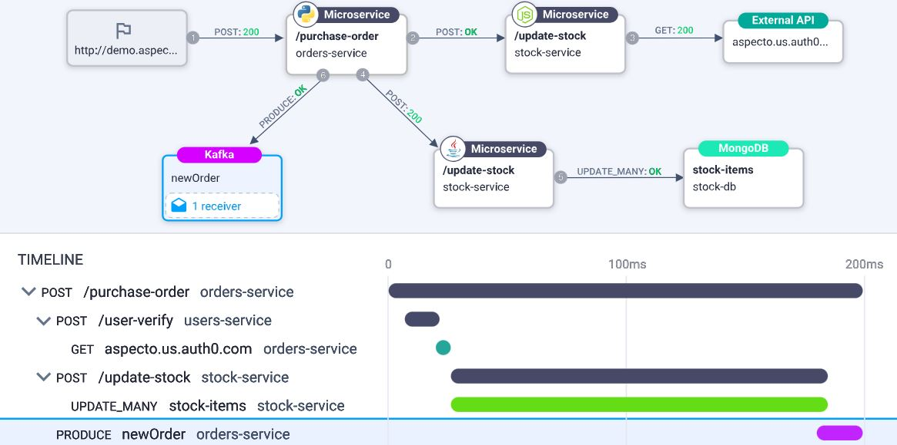
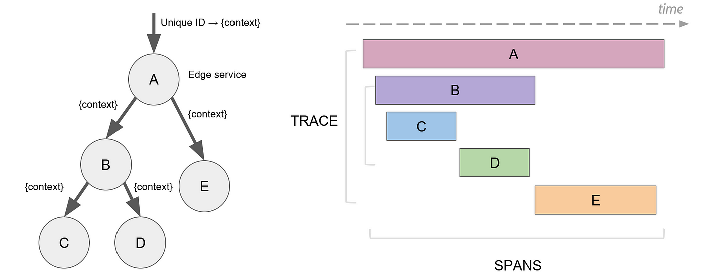
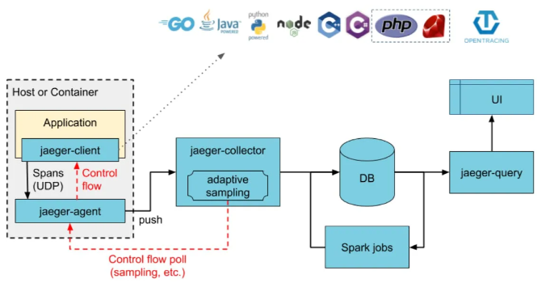
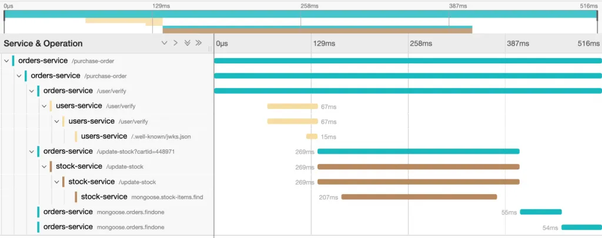

# Jaeger Tracing 

___
## Distributed tracing
___

In the past, applications were structured as monolithic blocks, making maintenance 
and updates difficult since any change could impact the entire system. 
The shift to a microservices architecture, with applications divided into independent 
components, has improved scalability and maintainability but introduced new challenges 
in coordinating and monitoring interactions between services. 


For example, when a user makes a request, it can pass through many independent services, complicating the 
identification of performance issues. **Distributed tracing** addresses this by centralizing information from 
various services,allowing each action within the microservices to be tracked. This makes it 
possible to trace a single request throughout its entire journey, from origin to destination, 
facilitating the identification and management of system issues.




## Jaeger introduction
___

[Jaeger](https://www.jaegertracing.io) is an open-source distributed tracing system created by Uber back in 2015.
It's used to monitor and troubleshoot microservices-based architectures. Its main purpose is 
to trace the path of user requests across different microservices, providing developers with a clear 
view of data flows and interactions within the system. This helps identify bottlenecks, optimize performance, 
and better understand dependencies between components. To sum up Jaeger:
- tracks how data moves within the system.
- helps identify which microservices are slowing down the system to optimize latency.
- shows relationships between microservices to analyze how changes in one component might affect others, 
aiding in root cause analysis.

  


The **Jaeger data model** is compatible with **OpenTracing** – which is a specification that defines how the collected 
tracing data would look, as well as libraries of implementations in different languages. 

As in most distributed tracing systems, Jaeger works with "_span_" and "_traces_", as defined in the OpenTracing specification.
- **Span**: A logical unit of work in a distributed tracing system. When a request flows through the system, 
each activity associated with it is recorded as a span and includes details like the operation name, start time and
duration. 
Once an operation is completed, the _parent span_ references the next _child span_. Together, these spans form a trace.

- **Trace**: A collection/list of spans connected in a child/parent relationship (and can also be thought of as a directed 
acyclic graph of spans). Traces specify how requests are propagated through our services and other components.
All spans in a trace share the same ID.




## Jaeger Architecture
___
Let's now look at the main components of Jaeger, so we can understand how it works.


- **Strumentation**: process of adding code to the application, in order to generate and collect *telemetry data*, 
such as logs, metrics, and traces.
In Jaeger this is possible thanks to the use of official libraries (aka <u>client-libraries</u>), written in various programming languages.
Note: they are being deprecated in favor of OpenTelemetry.


- **Data pipeline**: this component manages the flow of trace data from the application to the storage backend. 
The main modules are:
  - <u>Jaeger Agent</u>: a background daemon that acts as an intermediary between the client and the collection system. 
  It receives spans generated by the application via UDP and pushes them to the collectors.
  - <u>Jaeger Collector</u>: This module is responsible for receiving traces from the Jaeger agent and performs validations 
  and transformations. After that, it saves them to the selected storage backends.


- **Backend storage**: component that handles the storage of data collected by Jaeger. Trace data is stored in either 
SQL or NoSQL databases, depending on the needs. Notable NoSQL options include *Cassandra* and *ElasticSearch*. 
Cassandra is highly scalable and handles large amounts of data across multiple servers without a single point of failure. 
ElasticSearch is used for real-time search and analysis, storing data in JSON format and supporting efficient full-text searches 
and complex queries.


- **Visualization**: Jaeger provides a web UI that lets developers search for specific traces using <u>Queries</u> 
(based on criteria such as service name and request duration) and then display them in a format that clearly shows the 
request path through the microservices.
For each span, the interface provides details such as execution times and span hierarchy, which helps diagnose specific 
issues within the trace.


  

## Getting started
___
### Instrumentation
To use Jaeger, applications need to be instrumented to send tracing data. It's recommended to use [OpenTelemetry](https://opentelemetry.io/), 
which provides the necessary tools and SDKs. 
In the past, Jaeger had its own SDKs (aka client libraries) based on OpenTracing, but as of 2022, these are no longer supported, 
and users are advised to migrate to OpenTelemetry.

### All in one 
**all-in-one** is an executable designed for quick local testing. It includes the **Jaeger UI**, **jaeger-collector**, 
**jaeger-query**, and **jaeger-agent**, with an in memory storage component.
The simplest way to start the all-in-one is to use the pre-built image published to DockerHub (a single command line). 

```
docker run --rm --name jaeger \
  -e COLLECTOR_ZIPKIN_HOST_PORT=:9411 \
  -p 6831:6831/udp \
  -p 6832:6832/udp \
  -p 5778:5778 \
  -p 16686:16686 \
  -p 4317:4317 \
  -p 4318:4318 \
  -p 14250:14250 \
  -p 14268:14268 \
  -p 14269:14269 \
  -p 9411:9411 \
  jaegertracing/all-in-one:1.61
```
Or run the ```jaeger-all-in-one(.exe)``` executable from the [binary distribution archives](https://www.jaegertracing.io/download/):

```jaeger-all-in-one --collector.zipkin.host-port=:9411```

Then you can simply open the **Jaeger UI** on ```http://localhost:16686```, *as shown below*.


Here is an explanation of the entries in the Search section of the Jaeger UI:
- **Service**: This field allows you to select the name of the service you want to trace.
- **Operation**: represents specific operations (or endpoints) within the selected service. If nothing is selected, 
all operations will be shown.
- **Tags**: Tags are metadata associated with the traced requests. You can use them to filter traces based on specific values. 
- **Lookback**: This dropdown menu allows you to select the time range within which you want to search for traces. It helps limit the traces displayed.
- **Duration**: This allows you to filter traces based on their duration. 
- **Limit Results**: This field allows you to set a limit on the number of results (traces) that will be shown.


### Traces visualization
Once we have chosen the service we are interested in, we will be able to view the traces in more detail.




### Maven dependencies
As mentioned before, Jaeger clients are now deprecated, so the recommended approach is to use the **OpenTelemetry SDK** in 
your preferred programming language, along with a **Jaeger exporter**.
This allows the spans you create to be converted into a format that Jaeger can process, passing through to the Jaeger 
collector and then to the storage backend.

Assuming we want to develop a simple Spring Boot application configured to use OpenTelemetry with the Jaeger exporter 
for traceability, then we will first need to update the dependencies in the ```pom.xml``` file
```
<dependency>
	<groupId>io.opentelemetry</groupId>
	<artifactId>opentelemetry-exporter-jaeger</artifactId>
	<version>1.34.0</version> 
</dependency>
<dependency>
    <groupId>io.opentelemetry</groupId>
    <artifactId>opentelemetry-sdk</artifactId>
	<version>1.42.0</version> 
</dependency>
```


### Service code
Then we'll need to configure OpenTelemetry and Jaeger in the ```Application.java``` file.

```
import io.opentelemetry.api.trace.Span;
import io.opentelemetry.api.trace.Tracer;
import io.opentelemetry.exporter.jaeger.JaegerGrpcSpanExporter;
import io.opentelemetry.sdk.OpenTelemetrySdk;
import io.opentelemetry.sdk.trace.SdkTracerProvider;
import io.opentelemetry.sdk.trace.export.BatchSpanProcessor;
```
Here is a brief explanation of the libraries (in order):
- This import allows you to work with ```Span``` objects.
- This import is for the ```Tracer``` interface.
- Export spans collected by OpenTelemetry to Jaeger.
- It's used to configure and set up the OpenTelemetry SDK for your application. 
- This is the provider that manages ```Tracers```. It takes care of creating and configuring 
the tracers, establishing how the spans are collected and sent to the exporter.
- ```BatchSpanProcessor``` is a span processor that collects spans in batches and exports them periodically.


## Sampling (Advanced Concepts)
___
**Sampling** is crucial in Jaeger for selecting a subset of generated traces for analysis. It helps avoid overwhelming 
the backend with excessive data, especially in high-traffic microservices environments. 

Sampling occurs at two distinct 
levels:

### SDK-Level Sampling
**Head-based sampling** happens in the Jaeger client code before traces are sent to the backend. It allows filtering at the source.

The deprecating Jaeger client has 4 sampling modes:
- **Remote**: Default mode, in which the client adapts to the sampling instructions provided by the backend.
- **Rate**: Limits the number of traces sampled per second, useful in high-traffic contexts to prevent data overload. 
- **Constant**: Samples either all traces or none, suitable for test environments or scenarios requiring full visibility or none. 
- **Probabilistic**: Choose a percentage of traces that would be sampled, for example – choose 0.1 to have 1 of each 10 
traces to be sampled. 


### Collector-Level Sampling 
**Tail-based sampling** occurs after trace collection but before storage, determining which traces to keep or discard. 
Modes include:
- **File Sampling**: Uses a configuration file with rules for handling traces, offering detailed control over sampling behavior. 
- **Adaptive Sampling**: Adjusts sampling frequency dynamically based on system conditions, such as workload variations, 
making it suitable for dynamic environments. Note that at the time of writing only Memory and Cassandra backends support 
this.

More info on Jaeger sampling can be found [here](https://www.jaegertracing.io/docs/1.30/sampling/).


## Resources
___
- https://www.jaegertracing.io/
- https://opentelemetry.io/