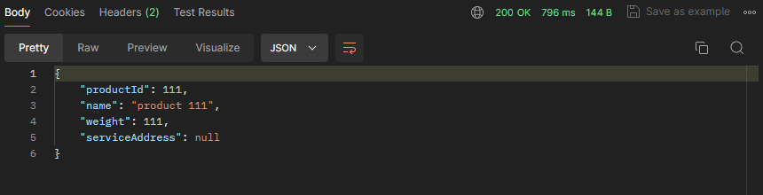
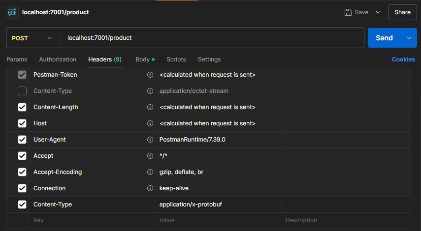
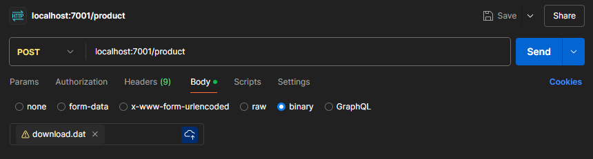
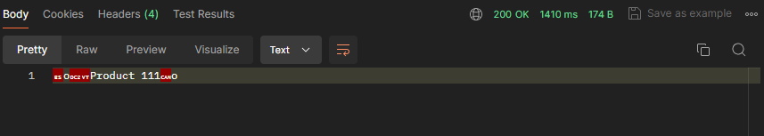
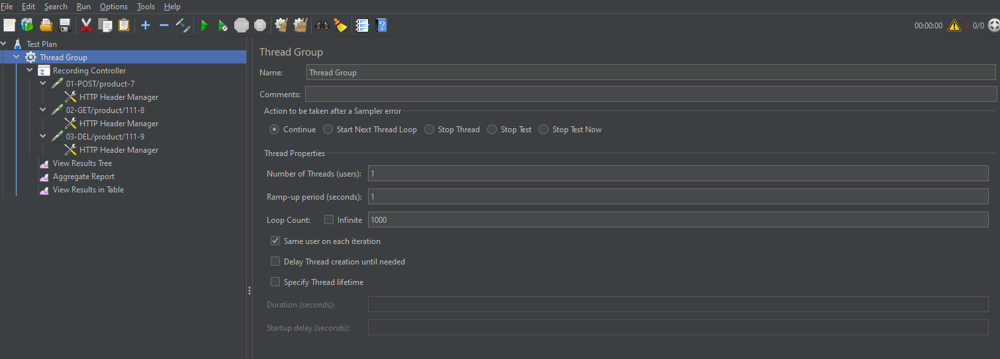
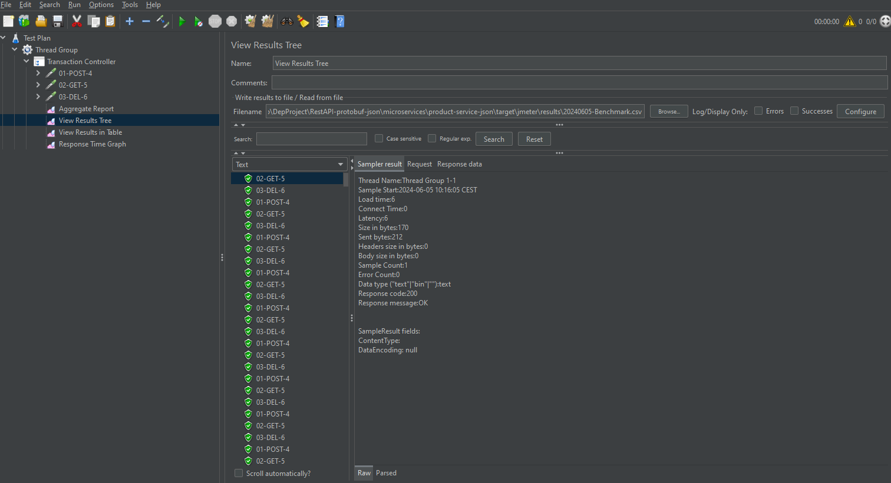
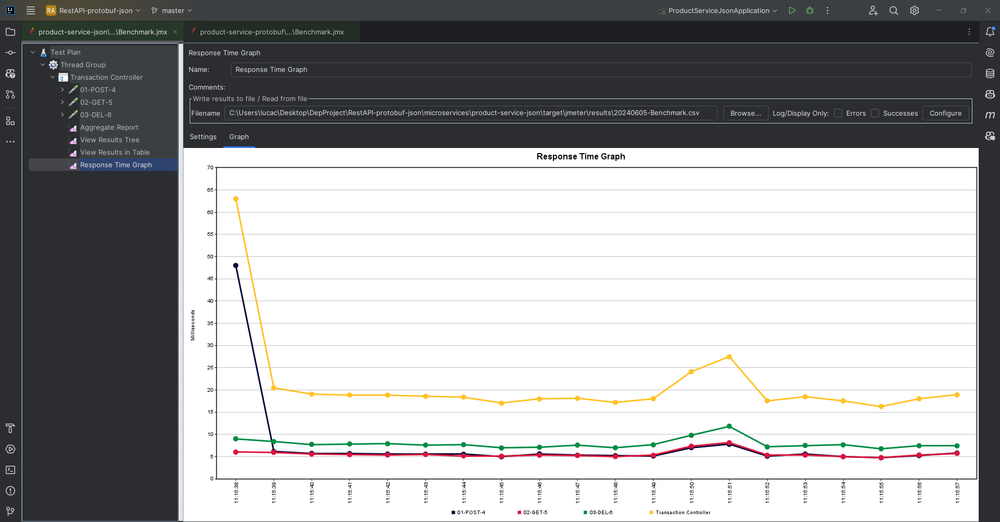
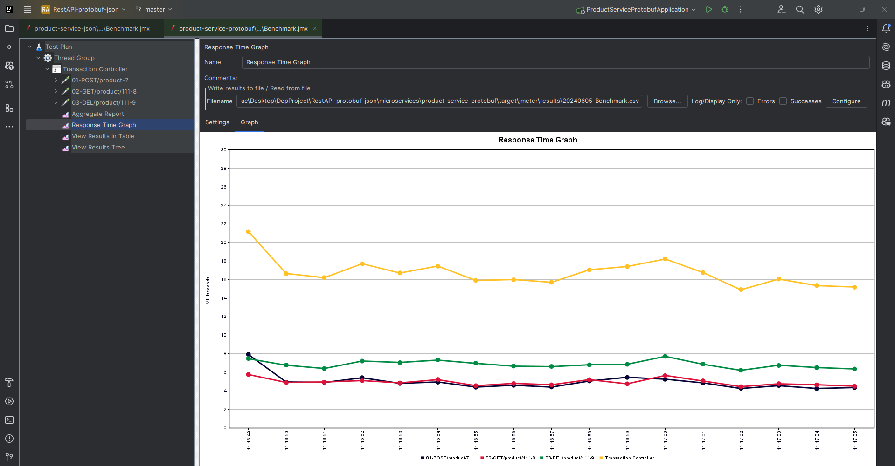
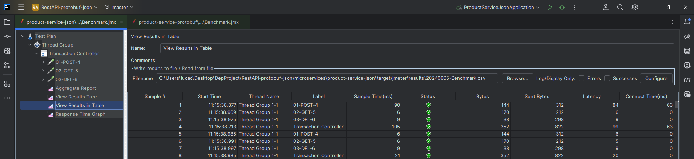

# Introduction to protobuf

In this guide, I introduce you to protobuf and show you how
to use it in your applications. I will cover the basics of protobuf,
including how to define messages and how to serialize and deserialize
data.

## What is protobuf?

Protobuf is a language-neutral, platform-neutral, extensible way
of serializing structured data for use in communications protocols,
data storage, and more. It is a binary format that is optimized for
speed and size. Protobuf is designed to be simple and efficient, and
it is widely used in many industries.

Protobuf is a great choice for serializing structured data because
it is fast, efficient, and easy to use. It is also extensible, which
means that you can add new fields to your data without breaking
existing code. Protobuf is a great choice for many applications,
including network communication, data storage, and more.

## How does protobuf work?

Protobuf works by defining a message format in a `.proto` file. This
file contains the definition of the message fields and their types.
Once you have defined your message format, you can use the `protoc`
compiler to generate code in your language of choice that can
serialize and deserialize data in that format.

Protobuf messages are serialized into a binary format that is
optimized for speed and size.

## Defining messages

To define a message in protobuf, you create a `.proto` file that
contains the definition of the message fields and their types. Here
is an example of a simple message definition:

```protobuf
syntax = "proto3";

message Person {
  string name = 1;
  int32 id = 2;
  string email = 3;
}
```

In this example, we define a message called `Person` with three
fields: `name`, `id`, and `email`. Each field has a type and a
unique field number.

## Generating code

Once you have defined your message format in a `.proto` file, you
can use the `protoc` compiler to generate code in your language of
choice that can serialize and deserialize data in that format. Here
is an example of how you might generate Java code from a `.proto`
file:

```bash
protoc --java_out=. person.proto
```

This command generates Java code from the `person.proto` file and
puts the generated code in the current directory.

You can download the `protoc` compiler from the gitHub repository
`https://github.com/protocolbuffers/protobuf/releases`.

## Serializing and deserializing data

Here is an example of how you might serialize and deserialize a 
`Person` message in Java:

```java 
// Serialize a Person message
Person person = Person.newBuilder()
  .setName("Alice")
  .setId(123)
  .setEmail("person@person.com")
    .build();
byte[] data = person.toByteArray();
    
// Deserialize a Person message
Person person = Person.parseFrom(data);
```

In this example, we use the `Person.newBuilder()` method to create
a new `Person` message, set its fields, and then call `build()` to
create the message. We then call `toByteArray()` to serialize the
message to a byte array. To deserialize the message, we call
`Person.parseFrom(data)`.

# Protobuf vs json

## Speed

Protobuf is faster than JSON because it is a binary format that is
optimized for speed. JSON is a text-based format that is slower
than protobuf because it requires parsing and serialization.

## Size

Protobuf is smaller than JSON because it is a binary format that is
optimized for size. JSON is a text-based format that is larger than
protobuf because it requires more space to store the data.

## Using protobuf and json

You can use protobuf and JSON in your applications by defining
messages in a `.proto` file and a `.json` file, respectively. You
can then use the `protoc` compiler to generate code in your language
of choice that can serialize and deserialize data in that format.

## Disadvantages of protobuf

- **Lack of resources**: you won't find that many resources (do not expect 
a very detailed documentation, nor too many blog posts).
- **Smaller community**: on Stack Overflow, for example, you will find 
roughly 1.500 questions marked with Protobuf tags. While JSON have more
than 180 thousand questions on this same platform.
- **Lack of support**: Google does not provide support for other programming
languages like Swift, R, Scala etc... but, sometimes, you can overcome
this issue with third party libraries, like Swift Protobuf provided by Apple.
- **Non-human readability**: JSON, as exchanged on text format and with simple
structure, is easy to be read and analyzed by humans. This is not the case
with a binary format.

# Project explanation

This project has  two microservices, **_both project will have the same 
functionality_**, but they will use different serialization formats. 
The first microservice will use **JSON** for serialization, and the second
project will use **protobuf**. In both are implemented a simple REST API 
that allows you to create, read, and delete `Product`. We can check the
performance of microservices, using jmeter to send requests, and see how
protobuf compares to JSON in terms of speed and size. 

I will focus on explaining the implementation differences of the two microservices.

## Product-service-json microservice

### Dependencies

- **_Spring Boot Starter Webflux_:** this dependency provides support for
  building web applications using Spring WebFlux.
- **_Springdoc OpenAPI Starter Common_:** this dependency provides support
  for generating OpenAPI documentation for Spring WebFlux applications.
- **_Spring WebMVC_:** this dependency provides support for building web
  applications using Spring WebMVC.
- **_Spring Boot Starter Data MongoDB_:** this dependency provides support
  for connecting to a MongoDB database.
- **_MapStruct_:** this dependency provides support for generating mapping
  code between Java beans.
- **_Test Dependencies_:** these dependencies provide support for testing
  the application.

### Plugin

- **_Spring Boot Maven Plugin_:** This plugin provides Spring Boot support in
  Maven. It allows you to package executable JAR or WAR archives and run
  an application "in-place".
- **_Maven Compiler Plugin_:** This plugin is used to compile the project's
  source code.
- **_Maven Surefire Plugin_:** This plugin is used to run the unit tests of
  the project.

### Message definition

The `Product` message is defined in the `Product` class in the `com.luca.product`
package. Here is the content of the `Product` class:

```java
public class Product {

    private int productId;
    private String name;
    private int weight;
    private String serviceAddress;

    public Product() {
    }

    public Product(int productId, String name, int weight, String serviceAddress) {
        this.productId = productId;
        this.name = name;
        this.weight = weight;
        this.serviceAddress = serviceAddress;
    } 
}
```

plus the setter and getter methods.

### Api implementation

This microservice is a simple REST API. The API is implemented using
Spring Boot and uses JSON for serialization. The API has three endpoints:
`/products`, `/products/{id}`, and `/products/{id}`. You can use these
endpoints respectively to create, read, and delete `Product`.

In the mapping of the endpoints, you have to specify the serialization format.

For example, to create a `Product` using protobuf, you must send a
request with the `Content-Type` header set to `application/json`:

```java
@PostMapping(
    value    = "/product",
    consumes = "application/json",
    produces = "application/json")
Product createProduct(@RequestBody Product body);
```

importing the `Product` class from the `src/main/java/com/luca/product/web/dto/`
directory:

```java
import com.luca.core.product.web.dto;
```

### Error handling

I have implemented a custom error handler, called `GlobalControllerExceptionHandler`,
that uses an `HttpErrorInfo` class to return an error message in JSON format
as follows:

```java
public class HttpErrorInfo {
    private final ZonedDateTime timestamp;
    private final String path;
    private final HttpStatus httpStatus;
    private final String message;

    public HttpErrorInfo() {
        timestamp = null;
        this.httpStatus = null;
        this.path = null;
        this.message = null;
    }

    public HttpErrorInfo(HttpStatus httpStatus, String path, String message) {
        timestamp = ZonedDateTime.now();
        this.httpStatus = httpStatus;
        this.path = path;
        this.message = message;
    }
}
```

plus the setter and getter methods.

The error handler is implemented using the `@RestControllerAdvice` annotation
and the `@ExceptionHandler` annotation. Here is the implementation of the error
handler:

```java
private HttpErrorInfo createHttpErrorInfo(
        HttpStatus httpStatus, ServerHttpRequest request, Exception ex) {

  final String path = request.getPath().pathWithinApplication().value();
  final String message = ex.getMessage();

  LOG.debug("Returning HTTP status: {} for path: {}, message: {}", httpStatus, path, message);
  return new HttpErrorInfo(httpStatus, path, message);
}
```

The error handler uses the `createHttpErrorInfo` method to create an `HttpErrorInfo`
message for the error and returns message as the response body.

## Product-service-protobuf microservice

### Dependencies

The microservice, to implement protobuf, uses the following dependencies:

```pomo.xml
<dependency>
            <groupId>com.google.protobuf</groupId>
            <artifactId>protobuf-java</artifactId>
            <version>4.27.0</version>
</dependency>
```
This dependency provides the necessary libraries to work with protobuf
in Java.

### Plugin

The microservice uses, in addition to the plugins already mentioned in
product-service-json microservice, the `protobuf-maven-plugin` plugin 
to generate Java code from the `.proto` file instead the protoc compiler.
Here is the configuration of the plugin in the `pom.xml` file:

```pom.xml
<plugin>
    <groupId>com.github.os72</groupId>
    <artifactId>protoc-jar-maven-plugin</artifactId>
    <version>3.14.0</version>
    <executions>
        <execution>
            <goals>
                <goal>run</goal>
            </goals>
            <phase>generate-sources</phase>
            <configuration>
                <protocVersion>3.14.0</protocVersion>
                <inputDirectories>
                    <include>src/main/resources</include>
                </inputDirectories>
                <outputTargets>
                    <outputTarget>
                        <type>java</type>
                        <outputDirectory>src/main/java</outputDirectory>
                    </outputTarget>
                </outputTargets>
            </configuration>
        </execution>
    </executions>
</plugin>
```

This plugin generates Java code from the `.proto` file in the
`src/main/protobuf/` directory and puts the generated code in the
`target/classes/{package_name_in_proto_file}` directory.

### Message definition

There are two `.proto` files in the `src/main/protobuf/` directory.

The file `product.proto` contains the definition of the `Product`
message. Here is the content of the `product.proto` file:

```protobuf
syntax = "proto3";

package com.luca.product;

option java_package = "com.luca.product.protobuf";
option java_outer_classname = "ProductProto";

message Product {
  int32 productId = 1;
  string name = 2;
  int32 weight = 3;
  string serviceAddress = 4;
}
```
The `Product` message has four fields: `productId`, `name`, `weight`,
and `serviceAddress`. Each field has a type and a unique field
number. The `Product` message is defined in the `com.luca.product`
package and is generated in the `com.luca.product.protobuf` package.

The file `ErrorInfo.proto` contains the definition of the `ErrorInfo` 
message. Here is the content of the `ErrorInfo.proto` file:

```protobuf
syntax = "proto3";

package com.luca.proto;

option java_package = "com.luca.util.protobuf";
option java_outer_classname = "ErrorInfoProto";

message ErrorInfo {
  string timestamp = 1;
  string path = 2;
  int32 httpStatus = 3;
  string message = 4;
}
```

The `ErrorInfo` message has four fields: `timestamp`, `path`, `httpStatus`,
and `message`. Each field has a type and a unique field number. The
`ErrorInfo` message is defined in the `com.luca.proto` package and is
generated in the `com.luca.util.protobuf` package.

### Api implementation

The API is implemented using Spring Boot and uses protobuf for
serialization. The API has three endpoints: `/products`, `/products/{id}`,
and `/products/{id}`. You can use these endpoints respectively to
create, read, and delete `Product`.

In the mapping of the endpoints, you have to specify the serialization
format.

For example, to create a `Product` using protobuf, you must send a
request with the `Content-Type` header set to `application/x-protobuf`:

```java
@PostMapping(
    value    = "/product",
    consumes = "application/x-protobuf",
    produces = "application/x-protobuf")
Product createProduct(@RequestBody Product body);
```

importing the `Product` class from the generated code by the protobuf
plugin:

```java
import com.luca.product.protobuf.ProductProto.Product;
```

### Error handling

I have implemented a custom error handler that returns an `ErrorInfo`
using protobuf because the error response, in Spring boot, is serialized
using json by default.

The error handler is implemented using the `@RestControllerAdvice` annotation
and the `@ExceptionHandler` annotation. Here is the implementation of the
error handler:

```java
private byte[] createHttpErrorInfo(
HttpStatus httpStatus, ServerHttpRequest request, Exception ex) {

    final String path = request.getPath().pathWithinApplication().value();
    final String message = ex.getMessage();

    LOG.debug("Returning HTTP status: {} for path: {}, message: {}", httpStatus, path, message);

    return ErrorInfo.newBuilder()
            .setTimestamp(ZonedDateTime.now().toString())
            .setPath(path)
            .setMessage(message)
            .setHttpStatus(httpStatus.value()).
            build( ).toByteArray();
}
```

The error handler uses the `createHttpErrorInfo` method to create an
`ErrorInfo` message for the error and returns the serialized `ErrorInfo`
message as the response body.

# Using api

Consider the following example of how to use the API to create a `Product`.

## Product-service-json

### Requests

#### Postman

To send requests to the API, you can use a tool like `Postman`.

To create a `Product`, you can send a `POST` request to the `/products`
endpoint with the following body for the `product-service-json` microservice:

```json
{
  "productId": 1,
  "name": "Product 1",
  "weight": 100
}
```

Here is an example:


#### Curl

You can also use curl to send requests to the API. Here is an example
of how you might create a `Product` using curl:

```bash
curl -X POST http://localhost:7002/product \
  -H "Content-Type: application/json" \
  -d '{
        "productId": 1,
        "name": "Product 1",
        "weight": 1
      }'
```

### Response

The API returns a `Product` message in JSON format. Here is an example:



## Product-service-protobuf

### Requests

#### Postman

To create a `Product`, you can send a POST request to the `/product`
endpoint with a binary body for the `product-serice-protobuf` microservice.

I advise you to use tools to like `https://www.protobufpal.com/` to
create the hexadecimal body and `https://gchq.github.io/CyberChef/#recipe=From_Hex('Auto')&input=MDg2ZjEyMGI1MDcyNmY2NDc1NjM3NDIwMzEzMTMxMTg2ZjIyMDA&oeol=VT`
to convert the hexadecimal body in binary and save it in a file.

You can also create the binary file using the `protoc` compiler:

```bash
protoc --encode=com.luca.product.protobuf.ProductProto.Product \
  src/main/resources/product.proto \
  <(echo 'productId: 1 name: "Product 1" weight: 1') \
  > product.bin
```

In `Postman`, you can import the file ad the request body and set the header
`Content-Type` to `application/x-protobuf`.

Here is an example:




#### Curl

You can also use curl to send requests to the API. Here is an example
of how you might create a `Product` using curl:

```bash
curl -X POST http://localhost:7001/product \
  -H "Content-Type: application/x-protobuf" \
  --data-binary @product.bin
```

The file `product.bin` contains the binary data of the `Product` message
and must be located in the same directory as the curl command. It can be
created using the method used in `Postman`.

### Response

The API returns a `Product` message in binary. Here is an example:



# Tests

## Product-service-json

The tests must be implemented in the JSON format.

Here is an example of a test that creates a `Product` with a `productId`
of `1` and verifies that the application returns an error message when a
duplicate `Product` is created:

```java
@Test
void duplicateError() {

    int productId = 1;

    postAndVerifyProduct(productId, OK);

    assertTrue(repository.findByProductId(productId).isPresent());

    postAndVerifyProduct(productId, UNPROCESSABLE_ENTITY)
      .jsonPath("$.path").isEqualTo("/product")
      .jsonPath("$.message").isEqualTo("Duplicate key, Product Id: " + productId);
}
```

## Product-service-protobuf

The tests must be implemented the protobuf format. 

Here is an example of the same previous test implemented in the protobuf format:

```java
@Test
void duplicateError() throws InvalidProtocolBufferException {

    int productId = 1;

    postAndVerifyProduct(productId, OK);

    assertTrue(repository.findByProductId(productId).isPresent());

    ErrorInfo errorInfo = ErrorInfo.newBuilder()
            .setPath("/product")
            .setMessage("Duplicate key, Product Id: " + productId)
            .build();

    byte[] a = postAndVerifyProduct(productId, UNPROCESSABLE_ENTITY).returnResult().getResponseBody();
    ErrorInfo error = ErrorInfo.parseFrom(a);
    System.out.println(error);
    assertEquals(errorInfo.getPath(), error.getPath());
    assertEquals(errorInfo.getMessage(), error.getMessage());
}
```

# Running the project

You can clone the repository, open the project in `IntelliJ IDEA`, and
build and run the project inside `IntelliJ IDEA` by launching the command
`mvn run` in the project root folder.

You can also run the microservices containerizing them with `Docker`
launching the commands:

- `mvn clean package` (clean useful in the case of a new build and package
  to create the jar files)
- `docker compose up --build -d` (to build and run the containers)
- `docker compose down` (to stop the containers).

# Performance test - Jmeter

The microservices will be tested using `Jmeter` to send requests to the
API and measure the performances. We will measure the
`response time`, the `throughput` and the `size of the response data` of the
API for both microservices.

There are two ways to run performance tests with `Jmeter`: using the `Jmeter`
GUI or using the `Jmeter` Maven plugin. In this project, I use the `Jmeter`
Maven plugin to run performance tests. The `Jmeter` Maven plugin allows you
to run performance tests from the project environment and store the results
in the project directory.

The plugin allows you to see the test plan and the results, you cannot configure 
the test plan from the plugin in `IntelliJ`.

So, in addition to the plugins already mentioned, the `jmeter-maven-plugin` plugin
is used to run performance tests from the project environment. Here is the
configuration of the plugin in the `pom.xml` file of each microservice:

```pom.xml
<plugin>
    <groupId>com.lazerycode.jmeter</groupId>
    <artifactId>jmeter-maven-plugin</artifactId>
    <version>3.7.0</version>
    <executions>
        <execution>
            <id>configuration</id>
            <goals>
                <goal>configure</goal>
            </goals>
        </execution>

        <execution>
            <id>jmeter-tests</id>
            <goals>
                <goal>jmeter</goal>
            </goals>
        </execution>
    </executions>
</plugin>
```

The plugin uses a file `.jmx` from `src/test/jmeter/` directory, that contains
the test plan for the performance test and store the result of the performance 
test in `target/jmeter/results`.

The test plan is created using `Jmeter` software and is configured to send
requests to the API and measures the `response time`, the `throughput` and 
the `size of the response data` of the API. Here the test plan for the 
performance test:



The test plan contains the following elements:

- ***Thread Group***: The thread group defines the number of threads
  and the number of requests to send to the API.
- ***HTTP Requests***: The HTTP requests sends a request to the API.
- ***View Results in Table***: The view results in table shows the
  response data of the API in a table format.
- ***View Results Tree***: The view results tree shows the response
  data of the API.
- ***Aggregate Report***: The aggregate report shows the response
  time (min, max, median, average), throughput of the API with 
  percentile errors and percentage error of requests.

For the test plan of protobuf microservice I used the `Recording`
template in `Jmeter` because it is necessary to set the body in a binary form.
So, with `Jmeter` as a proxy server, I set `Postman` to send the requests
to the proxy server, then I registered the requests sent by `Postman`  
in the test plan.

As you can see in the image above, the `Loop Count` is set to `1000`, in this way
the test plan do the set of requests `POST`, `GET`, `DELETE` 1000 times.

Then I added the `Transaction Controller` to track the number of bytes sent and moved 
all the requests to the `Transaction Controller` to measure the `size` of the message 
and added the `Response Time Graph`.

Here is the final test plan:


You can use the `Jmeter` plugin in `IntelliJ` to see the file `.jmx` like 
the test plan in `Jmeter` software.

To see the results of the performance test, you can use the `Jmeter` plugin
in `IntelliJ`, go to the kind of report you want to see, browse the file
`.csv` in the microservice `target/jmeter/results/` directory, and open the file.

Here is an example of the `View Result Tree` report: 



To run the performance tests for the first time you have to compile them, you can 
use the following command that compile and run the tests:

```bash
mvn clean verify
```

This command generates a report in the `target/jmeter/results/` in
each microservice directory.

If you want to run the tests for the singular microservice without compiling
them, you can move to the microservice directory and use:

```bash
mvn jmeter:jmeter
```

You can run also the tests from the GUI of `Jmeter` software, opening the
file `.jmx` in the `src/test/jmeter/` directory.

## Results

To have more reliable results, I ran the performance test for the single 
microservice, to avoid the overload of the system.

Here are the results of the performance test of the JSON and protobuf 
microservices. The `Transaction Controller` in the results is not 
significant for the metrics of `Response Time` and `Throughput`, it is used
to track the number of bytes sent.

- **_Json microservice:_**




- **_Protobuf microservice:_**




This metrics show that the protobuf microservice is faster than the JSON 
microservice. The protobuf microservice has a lower response time and a 
higher throughput than the JSON microservice.

The size of the response data of the protobuf microservice is smaller than
the JSON microservice. The images below show the size of the response data
of the JSON and protobuf microservices after a cycle (`POST`, `GET`, `DELETE`) 
of the benchmark .

- **_Json microservice:_**



- **_Protobuf microservice:_**


The results of performance test show that the protobuf microservice is faster 
and more efficient than the JSON microservice.

## Resources

- [Protocol Buffers](https://developers.google.com/protocol-buffers)
- [Protocol Buffers vs JSON](https://auth0.com/blog/beating-json-performance-with-protobuf/)
- [Protocol Buffers Java](https://protobuf.dev/getting-started/javatutorial/)
- [Protocol Buffers Maven Plugin](https://github.com/os72/protoc-jar-maven-plugin)
- [JMeter](https://jmeter.apache.org/)
- [JMeter Maven Plugin](https://github.com/jmeter-maven-plugin/jmeter-maven-plugin)


