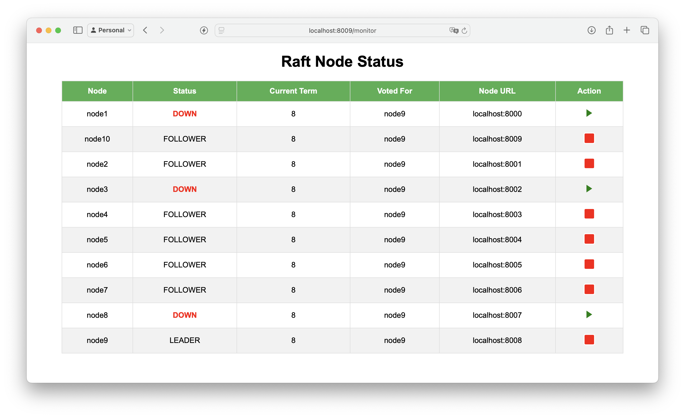

# Raft Implementation with Spring Boot

A Spring Boot application implementing the Raft consensus algorithm to manage a cluster of nodes. This project ensures
consistency and reliability through leader election and state replication. **This is a proof of concept designed to
demonstrate how the Raft algorithm operates.**

## Table of Contents

- [Features](#features)
- [Prerequisites](#prerequisites)
- [Installation](#installation)
- [Node Configuration](#node-configuration)
- [Running the Application](#running-the-application)
- [Docker](#docker)
- [Monitoring](#monitoring)
- [API Endpoints](#api-endpoints)
- [Testing](#testing)

## Features

- **Leader Election:** Automatically elects a leader among cluster nodes.
- **State Replication:** Maintains consistent state across all nodes.
- **Reactive Programming:** Utilizes Reactor for non-blocking operations.
- **API Documentation:** Integrated Swagger/OpenAPI for easy API exploration.
- **Monitoring:** Real-time status monitoring of all cluster nodes.

## Prerequisites

- **Java 17** or higher
- **Maven 3.9.9+**

## Installation

1. **Clone the Repository**

   ```bash
   git clone https://github.com/tede12/raft-implementation-with-spring-boot.git
   cd raft-implementation-with-spring-boot/code
   ```

2. **Build the Project**

   ```bash
   mvn clean install
   ```

### Node Configuration

Each node in the Raft cluster requires specific configuration properties:

- `node.id`: A unique identifier for the node (e.g., `node1`).
- `node.cluster-nodes`: A comma-separated list of all nodes in the cluster, including the current node's URL (e.g.,
  `localhost:8000,localhost:8001,localhost:8002`).

It's also possible to configure more properties for the Raft algorithm in the `application.properties` file:

```properties
# Raft Timeout Configurations (in milliseconds)
raft.electionTimeout.min=1500
raft.electionTimeout.max=3000
raft.heartbeatInterval=500
```

## Running the Application

To run a Raft cluster with multiple nodes, execute the application on different ports with unique node IDs. Open
separate terminal windows for each node and run the following commands:

```bash
# Node 1
mvn spring-boot:run -Dspring-boot.run.arguments="--server.port=8000 --node.id=node1 --node.cluster-nodes=localhost:8000,localhost:8001,localhost:8002"

# Node 2
mvn spring-boot:run -Dspring-boot.run.arguments="--server.port=8001 --node.id=node2 --node.cluster-nodes=localhost:8000,localhost:8001,localhost:8002"

# Node 3
mvn spring-boot:run -Dspring-boot.run.arguments="--server.port=8002 --node.id=node3 --node.cluster-nodes=localhost:8000,localhost:8001,localhost:8002"
```

## Docker

The project includes Docker support to containerize and deploy the Raft cluster easily. Follow the steps below to build
and run the application using Docker and Docker Compose.

### Building the Docker Image

The Dockerfile is located in the root directory of the project and uses multi-stage builds to compile and package the
application.

1. **Build the Docker Images:**

   Navigate to the project root directory and run:

   ```bash
   docker compose build
   ```

### Running the Application with Docker Compose

Use Docker Compose to start a Raft cluster with three nodes.

1. **Start the Containers:**

   ```bash
   docker compose up -d
   ```

2. **Verify the Containers:**

   Check the logs to ensure each node starts correctly.

   ```bash
   docker logs -f node1
   docker logs -f node2
   docker logs -f node3
   ```

### Node State Management

Each node in the Raft cluster can be in one of the following states:

- **Follower:** Passive state, waiting for instructions from the leader.
- **Candidate:** State entered when a node attempts to become a leader.
- **Leader:** The node responsible for managing the cluster and coordinating operations.
- **Down:** The node is not active or has failed.

The state of a node is persisted and can be retrieved using the `/raft/status` endpoint.

## Monitoring

To monitor the status of all nodes in the Raft cluster:

1. Navigate to the `/monitor` endpoint of any node. For example, if running on port `8000`:
   ```
   http://localhost:8000/monitor
   ```

<p align="center">
  
</p>

2. The monitoring page displays the status of all nodes, including their current state and term.
3. Only for debug purposes, in the page `/monitor` you can `stop`/`resume` a node, this will simulate a node failure and
   permit to see the behavior of the cluster.

<p align="center">
  
</p>

## API Endpoints

### Raft Operations (`/raft`)

- **Start Election**

    - **Endpoint:** `POST /raft/start-election`
    - **Description:** Initiates a new election in the Raft cluster.

- **Request Vote**

    - **Endpoint:** `POST /raft/request-vote`
    - **Description:** Handles vote requests from candidate nodes.
    - **Request Body:**
      ```json
      {
        "candidateId": "node2",
        "candidateTerm": 2
      }
      ```

- **Initialize Node**

    - **Endpoint:** `POST /raft/initialize`
    - **Description:** Initializes the node within the Raft cluster.

- **Receive Heartbeat**

    - **Endpoint:** `POST /raft/heartbeat`
    - **Description:** Receives a heartbeat signal from the leader node.

- **Get Node Status**

    - **Endpoint:** `GET /raft/status`
    - **Description:** Retrieves the current status of the node.

- **Stream Nodes Status**

    - **Endpoint:** `GET /raft/status-stream`
    - **Description:** Streams the status of all nodes using Server-Sent Events (SSE).

_(Only for debug purposes)_

- **Stop Node**

    - **Endpoint:** `GET /raft/stop`
    - **Description:** Stop the node

- **Resume Node**
    - **Endpoint:** `GET /raft/resume`
    - **Description:** Resume the node

## Testing

This project includes tests to verify the functionality of the Raft consensus algorithm implementation.

1. **Run Tests**

   ```bash
   mvn test
   ```