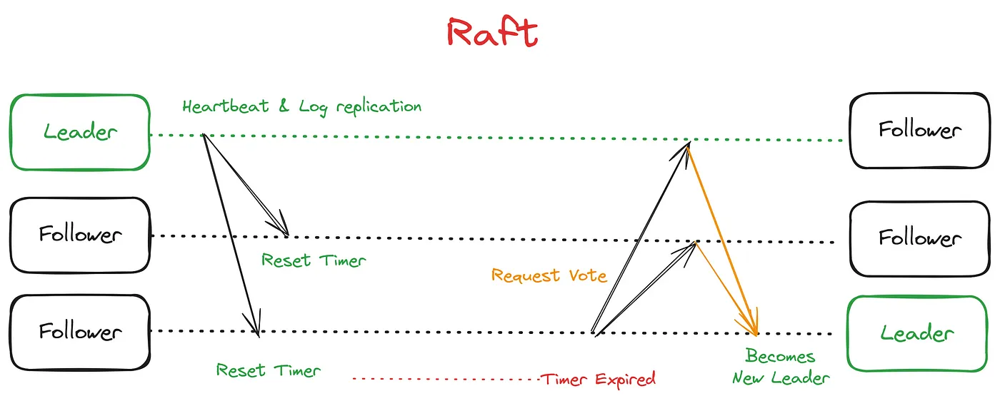
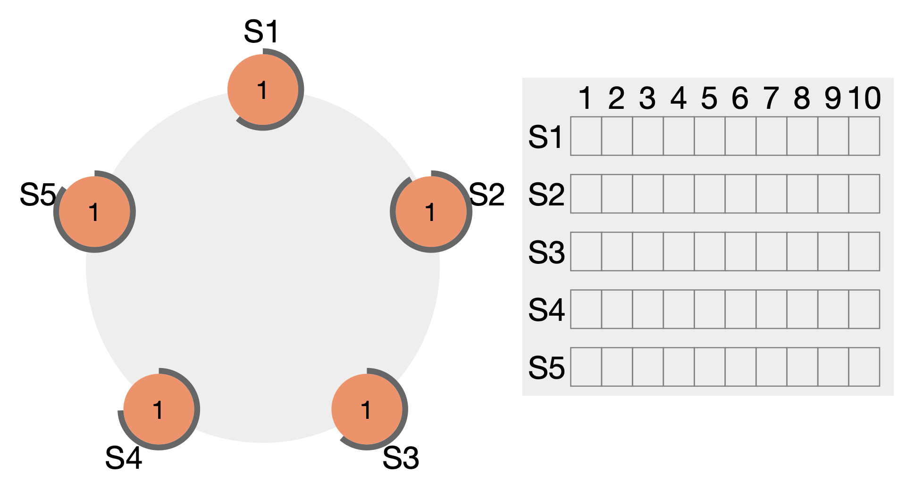
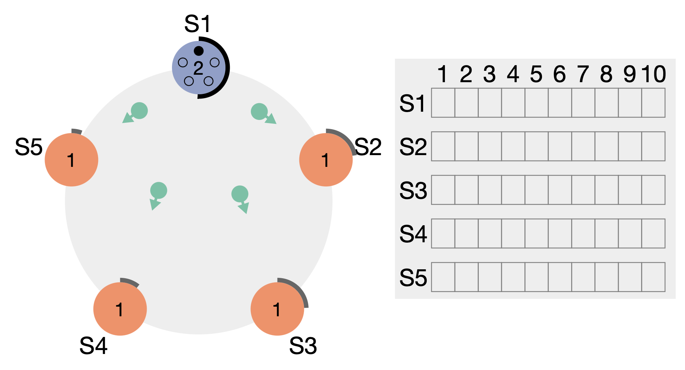
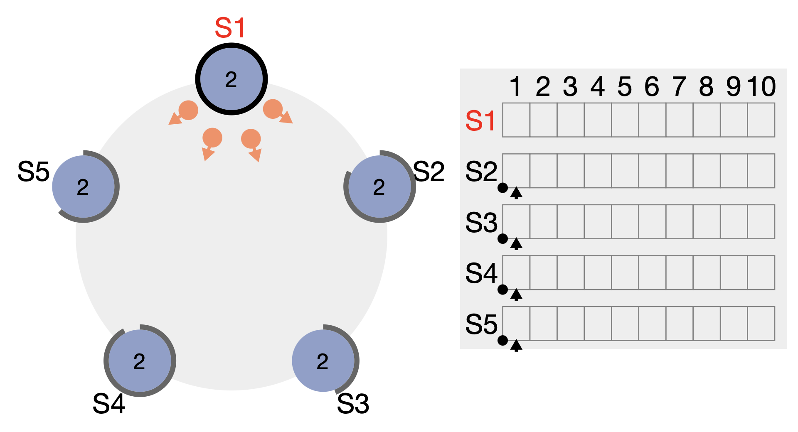
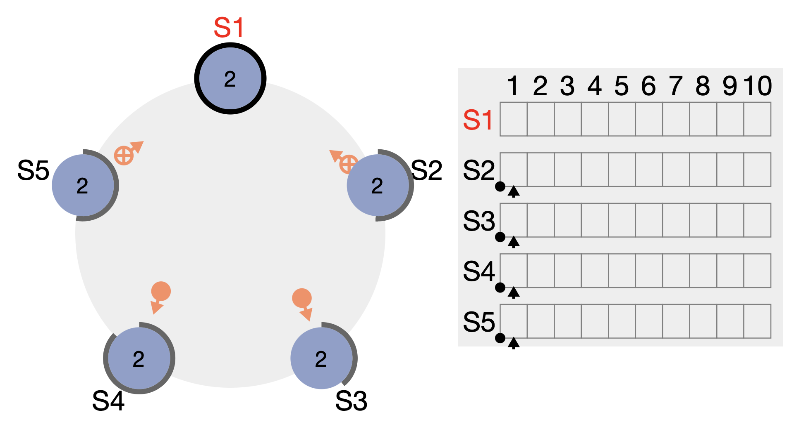
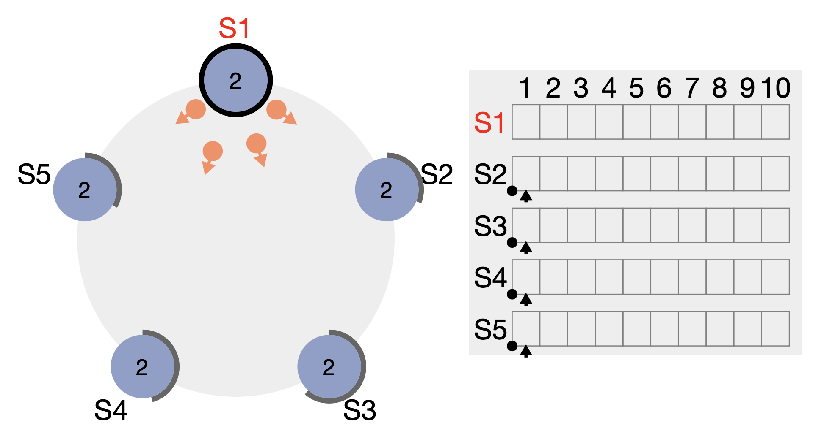
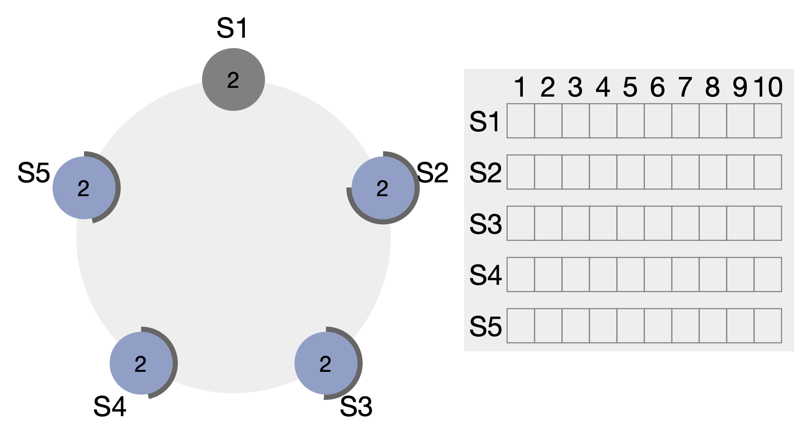
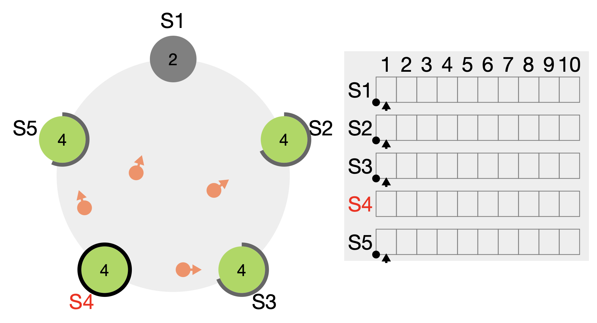
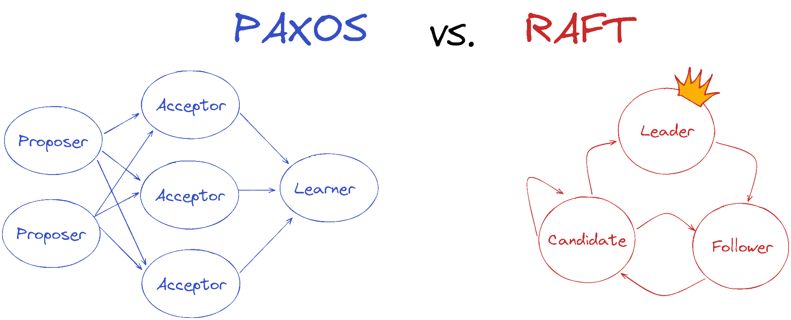

# Raft Consensus Algorithm - Theory

   

## Table of Contents

- [Introduction](#introduction)
- [Overview of Raft](#overview-of-raft)
- [Key Components](#key-components)
- [Detailed Mechanisms](#detailed-mechanisms)
- [Advantages of Raft](#advantages-of-raft)
- [Use Cases](#use-cases)
- [Conclusion](#conclusion)
- [References](#references)

---

## Introduction

In the realm of distributed systems, achieving consensus among multiple nodes is paramount for ensuring data
consistency, reliability, and fault tolerance. The **Raft Consensus Algorithm** stands out as a robust solution designed
to simplify the complexities associated with consensus mechanisms. Introduced by Diego Ongaro and John Ousterhout in
2013, Raft emphasizes understandability and ease of implementation without compromising on performance and reliability.

## Overview of Raft

Raft (Replicated and Fault-Tolerant) is a consensus algorithm that facilitates the coordination of replicated logs
across a cluster of nodes. Unlike pther consensus algorithms like Paxos, Raft is structured to be more comprehensible,
making it easier for developers to implement and reason about. The primary goal of Raft is to ensure that multiple nodes
in a distributed system agree on a shared state, even in the presence of failures.

_Figure 1: Summary of the Raft Consensus Process_

Raft achieves consensus through three core components:

1. **Leader Election**: Selecting a single node to act as the leader, responsible for managing the replicated log and
   coordinating actions among followers.
2. **Log Replication**: Ensuring that the leader's log entries are consistently replicated to follower nodes.
3. **Safety**: Guaranteeing that once a log entry is committed, it remains durable and consistent across all nodes.

## Key Components

### Leader Election

Leader election is the process by which Raft selects a single leader node from the cluster. The leader is responsible
for handling all client interactions, managing log replication, and maintaining the overall system's state. If the
current leader fails or becomes unreachable, Raft initiates a new election to select a replacement.

**Process:**

1. **Election Timeout**: Each follower node starts an election timer. If a follower does not receive a heartbeat
   (AppendEntries RPC) from the leader within this timeout, it becomes a candidate.
2. **Becoming a Candidate**: The candidate increments its current term and requests votes from other nodes by sending
   RequestVote RPCs.
3. **Voting**: Nodes respond to the RequestVote RPCs based on their current term and log state. A candidate needs votes
   from a majority of nodes to become the new leader.
4. **Leader Declaration**: Once a candidate receives the majority of votes, it becomes the leader and begins sending
   heartbeats to maintain authority.

### Log Replication

Once a leader is established, it is responsible for managing the replicated log. The leader receives client requests,
appends them to its log, and replicates these entries to follower nodes.

**Process:**

1. **Appending Entries**: The leader appends the client command to its log and sends AppendEntries RPCs to all followers
   to replicate the log entry.
2. **Acknowledgments**: Followers append the entries to their logs and acknowledge receipt to the leader.
3. **Commitment**: Once the leader receives acknowledgments from a majority of followers, it commits the entry and
   applies it to its state machine. The leader then notifies followers to commit the entry as well.
4. **Consistency**: Raft ensures that the leader's log is authoritative. If a follower's log is inconsistent with the
   leader's, the leader overwrites the follower's log to maintain consistency.

### Safety

Raft's safety mechanisms ensure that once a log entry is committed, it remains consistent across all nodes and cannot be
lost, even in the event of failures.

**Safety Properties:**

1. **Election Safety**: At most one leader can be elected in a given term, preventing split-brain scenarios.
2. **Log Matching**: If two logs contain an entry with the same index and term, then the logs are identical up to that
   point.
3. **Leader Append-Only**: A leader never overwrites or deletes entries in its log, maintaining a consistent history of
   operations.

## Detailed Mechanisms

### Election Process

The leader election process is central to Raft's ability to maintain a single authoritative leader within the cluster.
The process involves several steps to ensure that only one leader is active at any given time.

1. **Start as Follower**: Nodes begin in the follower state, waiting for heartbeats from the leader.
2. **Timeout and Candidate State**: If a follower does not receive a heartbeat within the election timeout, it
   transitions to the candidate state.
3. **Request Votes**: The candidate increments its term and sends RequestVote RPCs to all other nodes, requesting their
   votes.
4. **Voting Criteria**:
    - The candidate's term must be at least as large as the voter's current term.
    - The candidate's log must be at least as up-to-date as the voter's log.
5. **Majority Vote**: If the candidate receives votes from a majority of nodes, it becomes the leader.
6. **Handle Split Votes**: If no candidate receives a majority, nodes reset their election timers with randomized
   timeouts to reduce the likelihood of another split vote.

#### Phases of Leader Election

To visualize the leader election process, refer to the following phases:

1. **Phase 1: Initialization**

    - All nodes are in follower mode, waiting for heartbeats.
    - Each node has a different timeout before initiating an election.

   
   _Figure 2: Phase 1 - All nodes waiting with different timeouts_

2. **Phase 2: First Candidate Timeout**

    - The first node's timeout expires and it sends its candidacy to all nodes.
    - It votes for itself, gaining one vote.

   
   _Figure 3: Phase 2 - First node sends candidacy and votes for itself_

3. **Phase 3: Subsequent Timeouts and Voting**

    - Other nodes' timeouts expire and they send their votes to the first candidate.

   
   _Figure 4: Phase 3 - Other nodes timeout and send votes to node 1_

4. **Phase 4: Leader Declared**

    - Node 1 becomes the leader and starts sending heartbeats.

   
   _Figure 5: Phase 4 - Node 1 becomes leader and sends heartbeats_

5. **Phase 5: Heartbeat Acknowledgments**

    - Followers acknowledge the leader's heartbeats.

   
   _Figure 6: Phase 5 - Followers acknowledge heartbeats_

6. **Phase 6 & 7: Continued Heartbeats**

    - Leader continues sending heartbeats; followers continue to acknowledge.

   
   _Figure 7: Phase 6 - Continued heartbeats and acknowledgments_

   
   _Figure 8: Phase 7 - Further heartbeats and acknowledgments_

7. **Phase 8: Leader Failure**

    - Leader stops working; followers wait for heartbeats.

   
   _Figure 9: Phase 8 - Leader failure detected by followers_

8. **Phase 9: New Election Initiated**

    - Followers timeout and start new elections, sending out candidacies.

   
   _Figure 10: Phase 9 - Followers initiate new elections_

9. **Phase 10: New Leader Elected**

    - A new leader is elected after receiving majority votes.

   
   _Figure 11: Phase 10 - New leader elected after multiple terms_

### Handling Failures

Raft is designed to handle various failure scenarios gracefully to maintain system availability and consistency.

1. **Leader Failures**: If the leader fails, followers detect the absence of heartbeats and initiate a new election to
   elect a replacement leader.
2. **Network Partitions**: Raft ensures that only a leader with a majority of nodes can operate, preventing split-brain
   scenarios during network partitions.
3. **Old Leader Rejoining**: When an old leader rejoins the cluster, it recognizes the current leader through term
   comparisons and steps down to follower, ensuring only one active leader.

### Log Consistency

Maintaining log consistency is crucial for ensuring that all nodes have a coherent view of the system's state.

1. **Log Matching**: Raft ensures that if any two logs contain the same entry at the same index and term, then the logs
   are identical up to that entry.
2. **Conflict Resolution**: When a leader detects inconsistencies in a follower's log, it overwrites the conflicting
   entries to match its own log.
3. **Commit Index**: The leader tracks the highest log entry that has been committed (replicated to a majority). This
   ensures that committed entries are durable and applied consistently across all nodes.

## Advantages of Raft

   

Raft offers several benefits that make it a preferred choice for consensus in distributed systems:

- **Understandability**: Raft's design is straightforward, making it easier to comprehend and implement compared to
  other consensus algorithms like **Paxos**.
- **Modularity**: Raft breaks down the consensus process into manageable components (leader election, log replication,
  safety), enhancing clarity and maintainability.
- **Robustness**: Raft can handle various failure scenarios, including leader crashes and network partitions, ensuring
  system reliability.
- **Efficiency**: Raft minimizes the number of message exchanges required to achieve consensus, enhancing performance.

## Use Cases

Raft is widely adopted in various distributed systems to ensure data consistency and reliability:

- **Distributed Databases**: Systems like [etcd](https://etcd.io), [CockroachDB](https://www.cockroachlabs.com),
  and [TiDB](https://www.pingcap.com) use Raft for managing replicated logs and ensuring
  consistent state across nodes.
- **Distributed Key-Value Stores**: [Consul](https://www.consul.io) employs Raft for service discovery and configuration
  management.
- **Distributed File Systems**: Some distributed file systems leverage Raft to coordinate metadata operations and
  maintain consistency.

## Conclusion

The Raft Consensus Algorithm provides a robust, understandable, and efficient mechanism for achieving consensus in
distributed systems. By emphasizing clarity and modularity, Raft simplifies the complexities associated with consensus
protocols, making it accessible for developers and engineers to implement reliable distributed applications. Its proven
safety and fault-tolerance properties make Raft a foundational component in modern distributed architectures, ensuring
data consistency and system reliability across diverse use cases.

---

## References

- [In Search of an Understandable Consensus Algorithm (Raft)](https://raft.github.io/raft.pdf) by Diego Ongaro and John
  Ousterhout
- [HashiCorp Raft Documentation](https://developer.hashicorp.com/consul/docs/architecture/consensus)
- [Practical Raft: A Understanding of the Raft Consensus Algorithm](https://github.com/hashicorp/raft)
- [Raft: Consensus in Distributed Systems](https://raft.github.io/)
