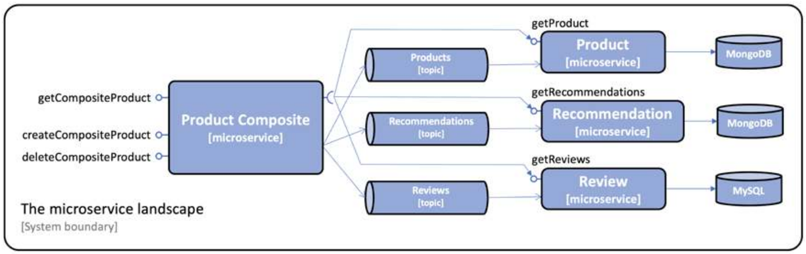

# Developing Reactive Microservices

In this chapter we will see why the need for reactivity (i.e. non-blocking operations) has surged in demand over the past few years. 
As already mentioned, the mutlithreaded model is not suited for applications that need to sustain massive quantities of traffic. That is why, over the recent years, concepts like **nonblocking** and **event-driven** programming arose.<br>
Further on in this chapter, we will analyse methods with which microservices can communicate together.

## A very high-level introduction to nonblocking programming
When we talk about _nonblocking programming_ we are describing a programming technique that enables developers to do multiple operations concurrently without blocking a certain thread. <br>
To understand what it means, let's define what "blocking" means first: an operation is blocking when it blocks (preempts from the CPU) the thread.<br>
There are scenarios where blocking is the right way to approach a problem, for example when dealing with shared resources (using a _mutex_ blocks the thread), however, there are certain operations that are blocking "by default" (but that can be made nonblocking) that limit the thorughput of our application, for example **reading data from file descriptors**. <br>
Imagine this scenario: we have a server application that accepts connections from clients on a given socket. <br>
We wrote this simple pseudo-code that handles incoming connections:
```
void main(){

    Socket s = new Socket(3000);
    
    while(true){

        Connection conn = s.accept();
        bytes[] b = conn.read(100);
        // do some stuff with the bytes
        // ...
    }

}
```
So far so good, right? We accept the request, we process it and then we are ready to accept more requests.<br>
This solution has some problems: 
- what happens if no data is available on the socket? The thread gets **blocked**, because read is a **blocking operation** by default;
- what happens if another connection arrives while I'm "doing some stuff with the bytes"? The connection has to **wait**, because we can't process it yet.
- ...

What can we do to tackle this problem?
 
### First solution: multithreading
The naive solution would be spawn a new thread for each connection we receive. This is what many web frameworks do (and what Spring Boot does by default).
<br>
So our pseudo-code changes:
```
void main(){

    Socket s = new Socket(3000);
    
    while(true){

        Connection conn = s.accept();
        Thread.spawn(processConnection(conn));

    }

}

void processConnection(Connection c){
    bytes[] b = conn.read(100);
    // do some stuff with the bytes
    // ...  
}
```
Well, that's nice, we solved all the issues we mentioned before! We can also serve up N requests **in parallel** (where N is the number of CPUs)! We also introduced _new_ issues, though: what happens if my server receives 400.000 simultaneous connections? The application spawns 400.000 threads! That's _a lot_ of threads, RAM and CPU usage! How can we solve this problem?

### Second solution: nonblocking programming
What if there was another solution that could accept more requests **within the same thread**? That would be nice, right?<br>
Let's imagine we could change the code to something like this:
```
async void main(){

    Socket s = new Socket(3000);
    
    while(true){

        Connection conn = s.accept();
        await processConnection(conn);

    }

}

async void processConnection(Connection c){
    bytes[] b = await conn.read(100);
    // do some stuff with the bytes
    // ...  
}

```
In our imaginary example, we changed the function signatures to be `async` and we call those functions with the `await` keyword. <br>
Async functions are implemented in many different ways, but every implementation share one common component: **an async runtime**.
<br>
The async runtime is generally composed by a (small) set of threads - a pool - that can receive async tasks. These tasks contain some work that can be stopped and resumed at any time. In our example, the task is created when `await`ing on `processConnection(conn)`. 

When a task is inserted inside the async runtime, a snapshot of its state is  memorized inside the executor. This snapshot will be used when the runtime executes the task itself.
<br>
Inserting the task inside the runtime yields the control back to the calling thread, so when we call `await` from a certain thread, the execution of the function in that thread terminates immediately (in our case, the thread goes instantly back "at the top" of the while loop). From now on, the execution of the function is no longer our thread's concern, because the executor is taking care of it.

In our example, when a connection hits our server, a task representing the execution of the `processConnection` function will be created inside the runtime and it will run until completion. <br>
Running a task until completion means that, if the function doesn't get suspended again (with another _await_), it will run until its return point.<br>
In our case, we have a **nonblocking** read (`await conn.read`), so this spawns another async task the same way we described before. Our read could terminate instantly (because maybe there's data already) or not: if it doesn't, the executor will temporarily drop the task and come back later, when the read _could_ be completed (thus, not running until the completion of the task).<br>
The main concept, here, is that many tasks get decomposed in smaller chunks that can be executed concurrently by the runtime itself, enabling, with a small thread-pool, applications to scale up to millions of concurrent requests.

An important takeoff from this brief explanation is that **async programming doesn't make blocking code magically async!** If you write blocking code inside an async function, that function **will block the executor's thread**, making your async function completely useless! That's why you need to keep your async functions "as-async-as-possible". For example:
```
async void megaLoop(){

    for(int i = 0; i < 1000000; i++){
        print("heyyyy");
    }

}
...
async void main(){

    Socket s = new Socket(3000);
    
    while(true){

        Connection conn = s.accept();
        await processConnection(conn);

    }

}

async void processConnection(Connection c){
    bytes[] b = await conn.read(100);
    await megaLoop();
    // do some stuff with the bytes
    // ...  
}

```
Since `megaLoop` doesn't contain any async code, that function will run **until completion**! So any executor thread that picks `megaLoop` up will have to run the for loop to its fullest before returning!

To sum this introduction up, let's make this real-life analogy: imagine you need to prepare lunch.
- Scenario 1 (multithreaded): you and your partner want to have lunch together. You stand at the stove and they get the table ready. With this analogy, the two of you can be seen as **two different threads** doing two tasks.
- Scenario 2 (async): you are single and you want to have lunch. You start cooking and, while waiting for the water to heat up, you also get the table ready with forks and all that stuff. You don’t wait for the water to reach boiling temperature to start setting the table up, but you “leave it aside for a while” and come back later, when you got the table ready! There is just one thread doing all the work, **you**!

## Non-blocking synchronous APIs and event-driven asynchronous services
When developing microservices, two types of communication can be used: **non-blocking** synchronous communication, or event-driven communication.
<br>
The former leverages **nonblocking programming** to perform, essentially, TCP (HTTP, gRCP) calls between microservices, whereas the latter uses more complex construct to offload tasks between microservices. 
<br>
Synchronous API calls are used:
- for read operations where an end user is waiting for a response;
- where the client platforms are more suitable for consuming synchronous APIs, for example,
mobile apps or SPA web applications;
- where the clients will connect to the service from other organizations – where it might be
hard to agree on a common messaging system to use across organizations.

For the system landscape in this course, we will use the following:
- The create, read, and delete services exposed by the product composite microservice will be
based on non-blocking synchronous APIs. The composite microservice is assumed to have
clients on both web and mobile platforms, as well as clients coming from other organizations
rather than the ones that operate the system landscape. Therefore, synchronous APIs seem
like a natural match.
- The read services provided by the core microservices will also be developed as non-blocking
synchronous APIs since there is an end user waiting for their responses.
- The create and delete services provided by the core microservices will be developed as
event-driven asynchronous services, meaning that they will listen for create and delete events
on topics dedicated to each microservice.
- The synchronous APIs provided by the composite microservices to create and delete aggregated
product information will publish create and delete events on these topics. If the publish opera-
tion succeeds, it will return with a 202 (Accepted) response; otherwise, an error response will
be returned. The 202 response differs from a normal 200 (OK) response – it indicates that the
request has been accepted, but not fully processed. Instead, the processing will be completed
asynchronously and independently of the 202 response.



## Developing non-blocking synchronous REST APIs
To make things nonblocking, Spring Boot leverages Project Reactor, an async runtime used to deal with async requests. <br>
Up until now, when we created a REST controller, every request we made to that controller would spawn a new thread, as described in a previous section.
<br>
As already mentioned, this model isn't suited for application that have to sustain a large number of requests (i.e. microservices!), so we need an async runtime to leverage the power of nonblocking programming. This way, requests will be served in an async fashion, using the minimum amount of threads needed to concurrently handle connections.
<br>
### Project Reactor
Project Reactor bases its foundations on two core datatypes: `Flux` and `Mono`. A `Flux` object is used to process a stream of 0...n elements whereas a `Mono`
object is used to process a stream that either is empty or returns at most one element. In other terms, we use `Flux` when we want to return a **collection** of items from a nonblocking function, whereas use use `Mono` when we want to return a **single** object.
To tell Project Reactor to `await` on a task we use the `.block()` method, available on both the `Flux` and the `Mono` objects.<br>
From now on, "nonblocking" and "reactive" will be used as synonyms. _Reactive_ programming is essentialy Spring Boot's way to implement nonblocking programming.

As a short introduction, let's look at the following code:
```
List<Integer> list = Flux.just(1, 2, 3, 4)
    .filter(n -> n % 2 == 0)
    .map(n -> n * 2)
    .log()
    .collectList().block();
```
- We initiate the stream with the integers 1, 2, 3, and 4 using the static helper method `Flux.just()`.
- Next, we filter out the odd numbers – we only allow even numbers to proceed through the stream. In this test, these are 2 and 4.
- Next, we transform (or map) the values in the stream by multiplying them by 2, so they become 4 and 8.
- Then, we log the data that flows through the stream after the map operation.
- We use the `collectList` method to collect all items from the stream into a `List`, emitted once
the stream completes.
- So far, we have only declared the processing of a stream. To actually get the stream processed, we need someone to subscribe to it. The final call to the `.block()` method will register a subscriber
that waits for the processing to complete.
- The resulting list is saved in a member variable named `list`.

### Non-blocking persistence using Spring Data for MongoDB
Spring Boot's persistence layer doesn't fully support reactive programming, in particular only MongoDB-enabled microservices can leverage nonblocking methods "natively".<br>
We can change the repository code to the following to enable nonblocking features on our database layer:
```
public interface ProductRepository extends ReactiveCrudRepository <ProductEntity, String> {
    Mono<ProductEntity> findByProductId(int productId);
}

public interface RecommendationRepository extends
ReactiveCrudRepository<RecommendationEntity, String> {
    Flux<RecommendationEntity> findByProductId(int productId);
}
```
<br>
When returning from API mappings that consume an async persistence layer (such as the MongoDB one) we can let Spring Boot decide when and “where” (i.e. on which thread of the async executor) to run our async operation.
<br>
We just need to map the return value to a reactive datatype and we’re done! Our old method becomes:

```
public Mono<Product> getProduct(int productId) {
    // ...

    return repository.findByProductId(productId)
        .switchIfEmpty(Mono.error(new NotFoundException("No product found for productId: " + productId)))
        .log(LOG.getName(), FINE)
        .map(e -> mapper.entityToApi(e))
        .map(e -> setServiceAddress(e));
}
```
- The method will return a `Mono` object, since there will be just ONE product. The processing
is triggered by the web framework, Spring WebFlux (which is based on Project Reactor), subscribing to the `Mono` object once it receives a request to this service (in a similar way as we mentioned before, the execution of the query to the persistence layer is “given” to Reactor);
- We use `switchIfEmpty` to return “early” from an async operation if a certain condition is met (here, if the query returns an empty set);
- We map the entity we got from the database to the actual model we want to return;
- We use `setServiceAddress()`, to set the DNS name and IP address of the microservices that processed the request in the serviceAddress field of the model object.

## Dealing with blocking endpoints
Since JPA is not reactive by nature, we need to change the code a little bit more when dealing with controllers that access blocking repositories. We can’t just set the return types of our handlers to a different datatype (`Mono`/`Flux`) and let the magic happen just like the previous case.<br>
This is because JPA is a thread-based library by default, meaning that when we execute a query to the database, a new thread is created because the non-blocking approach is not supported.<br>
Since we want control over the thread we create and we don’t want JPA to saturate the microservice, Spring Boot can offer a separate threadpool in which JPA-related threads can be run. This pool is **hard-limited**, meaning that the number of concurrent threads running inside the pool is capped at a certain amount.