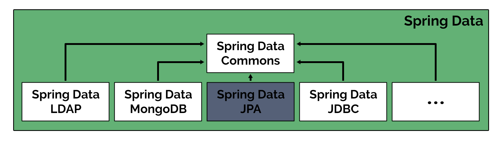

# The Java Persistence Ecosystem

In this lesson, we’ll give an overview of the persistence solutions in Java.

## Overview of Application Persistence

Persistence is an essential part of any system, but can also be tricky to get right. This is why there have been multiple approaches introduced over time, each with its own benefits and drawbacks.

In a general sense, persistence refers to the **permanent storage of data,** so that it outlives an application shutdown.

This can be done using various data structures, such as files, relational databases, NoSQL databases, object databases, etc.

## Java Persistence Solutions

Let’s go over the persistence options available in the Java ecosystem at a very high level.

You'll notice that the main aspect that differentiates these options is the level of abstraction over the database.

So let’s start with the Java standard that’s closest to accessing the database directly.

**JDBC**

This is the JDBC standard, and it’s also the oldest approach for working with databases in Java.

Using JDBC requires us to use SQL statements, which can be both an advantage and a disadvantage.

The main benefit is having **more control over the SQL that’s executed**, while the main drawback is that it requires more development effort than the next approaches we’ll discuss.

**JPA**

A higher-level alternative to the JDBC standard is the JPA standard (Jakarta Persistence API). This adds an additional layer of abstraction over the database, the basis of which is **the object-relational mapping (ORM) approach**.

**Note:** Before the transition from Java EE to Jakarta EE, JPA was originally named “Java Persistence API” so you might still find documentation referring to the spec under this name.

Basically, with JPA, we create a set of classes (entities) that map to the database tables and then interact with these classes instead of the database tables directly.

The main benefit and drawback of JPA are the opposite of the JDBC approach; we’re trading a lower development effort for less control over the database.

In addition, JPA frameworks have gradually added other features, like caching and transaction support.

Another important benefit with JPA is the ability to switch to a different database if needed, without changing the Java code.

However, we have to keep in mind that JPA is only the specification. We also need an implementation of the specification to work with, and there are multiple options available.

The reference implementation of JPA is EclipseLink, but **the most popular implementation is the Hibernate ORM** (Object Relational Mapping) framework.


**Spring Data JPA**

Spring is known for providing tools to speed up application development.

In the persistence space, **Spring Data takes the JPA abstraction one step further** and allows us to quickly generate repositories and queries.

Underneath, Spring Data JPA uses Hibernate by default, which we previously mentioned is the most popular JPA implementation. So we are still in the object-relational mapping world.

Let’s see a quick diagram to recap the solutions we’ve looked at so far, from the lowest to highest level of abstraction over the database:


Finally, it’s important to keep in mind that these options can also work together, and we shouldn’t be dogmatic about which option we choose.

Spring Data JPA still uses many of the same concepts and APIs as the JPA specification for defining entities, while also adding some powerful tools for querying and manipulating entities.


## Spring Data

First, let’s differentiate between Spring Data and Spring Data JPA.

Simply put, **Spring Data is a family of projects, all related to data access aspects**. The goal of this umbrella project is to offer a familiar and consistent Spring-based model for data access, while providing submodules to cover any specific scenario we might have to deal with.

Spring Data Commons is the core subproject. It’s the foundation for all the other modules, which include, among others:

- Spring Data JDBC
- Spring Data LDAP
- Spring Data MongoDB
- Spring Data Redis
- Spring Data JPA



## Spring Data JPA

**Spring Data JPA has the particular objective of providing convenient support for JPA-based data access layers.**

This persistence framework offers several useful features, but the most outstanding ones that make it a widely used solution are the possibility of easily implementing JPA-based repositories; reducing the boilerplate of writing, preparing, and executing queries; as well as paginating and auditing.

**We can have fully working data access functionality with only a few lines of code and without having to write a single SQL query.**

Furthermore, with Spring Data JPA, we can create a repository interface that includes different methods that follow a particular naming pattern, and **the framework will build up their implementation automatically for us**:

```
public interface ProjectRepository extends CrudRepository<Project, Long> {

  Iterable<Project> findByNameContaining(String name);

}
```

This is just a preview, as we'll get into that later in the course.

## Conclusions

Of course, every solution has some drawbacks. In this case, we’re delegating a lot of functionality to the framework, and whenever that happens, **we lose some control** over what’s finally executed.

If we add to this the fact that the library has to be flexible to adapt to many different scenarios, then we might find that **in some cases, this doesn’t represent the optimal solution from a performance perspective**.

This is actually a potential issue inherent to the ORM technique used by JPA.

It's worth mentioning that **this isn’t a common issue,** since it is, after all, a tested and well-designed solution that offers different alternatives to customize the behavior, and overcome most problems we might run into.

The takeaway here is that **this is a very powerful and useful solution**, suitable for most projects, and definitely better than writing a lot of boilerplate manually.

It provides the tools and flexibility to address most scenarios, but it’s important to understand this doesn’t mean all scenarios.

Simply put, **we don’t necessarily have to use only Spring Data JPA as our single solution** across the board.

There might be edge cases, a few exceptional queries, or persistence procedures where it makes sense to use a different approach. This could mean maybe lower level JPA customizations, or even some JDBC operations, and that’s totally fine.

**We have to be analytical to find the best tool for the job, and decide when it makes sense to mix different solutions.**

As you can imagine, this requires having a broad knowledge of the persistence framework features, and understanding what is going on behind the scenes, which is what we will pursue in this course.


## Resources
- [Spring Data Overview](https://spring.io/projects/spring-data)
- [Spring Data JPA Overview](https://spring.io/projects/spring-data-jpa)