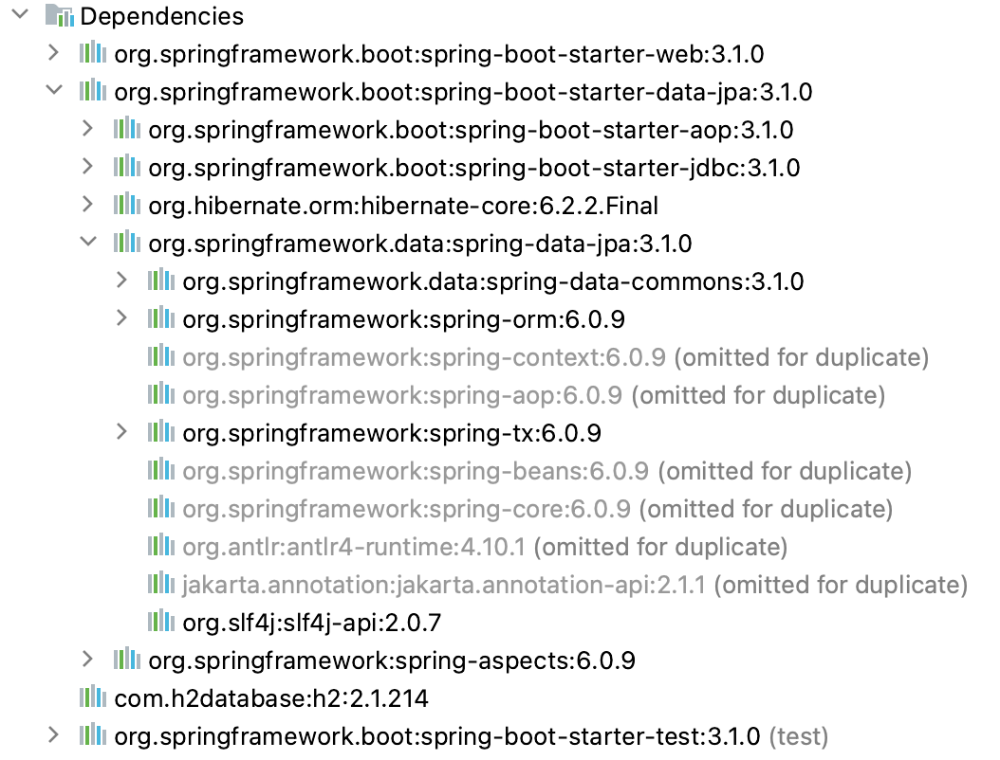

# Spring Data JPA Setup

In this lesson, we're going to learn how we can configure Spring Data JPA in our applications. Since Spring Boot greatly simplifies the configuration, we'll use it in our project, but we’ll also take a closer look to understand what exactly its auto-configuration process does under the hood.

The relevant module for this lesson is: [spring-data-jpa-setup-end](https://github.com/nbicocchi/spring-boot-course/tree/module5/spring-data-jpa-setup-end)

## Spring Data JPA Setup

As with most Spring projects, **Spring Boot offers a starter library** to bring in all the dependencies related to the persistence layer. This allows the auto-configuration functionality to effortlessly set up and use the persistence framework in our project.

As such, the first step is to add the starter dependency to our _pom.xml_ file:

```
<dependency>
    <groupId>org.springframework.boot</groupId>
    <artifactId>spring-boot-starter-data-jpa</artifactId>
</dependency>
```

If we launched our project with just this dependency, it would fail to start because it would try to configure a data source, and our project wouldn’t have any way to sort this out on its own:



However, we already have the H2 dependency in place:

```
<dependency>
    <groupId>com.h2database</groupId>
    <artifactId>h2</artifactId>
</dependency>
```

This will help **Spring Boot figure out that we’re using this embedded database engine**. In addition, it creates a database with a random name, and schemas determined by the definitions of our entities.

In order to have more control, let's specify some application properties related to the data source:

```
spring.h2.console.enabled=true
spring.datasource.url=jdbc:h2:mem:testdb
spring.datasource.username=sa
spring.datasource.password=
```

Instead of using a randomly generated database name, Spring Boot creates a database _testdb_ and grants access to it for a user _sa_. We’ll also enable the database console in order to connect to the database and inspect its contents.

## Spring Data JPA Dependencies

As we mentioned above, Spring Boot's starters automatically bring in all the required dependencies. Now let’s see these transitive dependencies in the case of Data JPA. We can do this either by using the IDE or running the _mvn dependency:tree_ command:


We can see that the starter includes the actual **_spring-data-jpa_ library, which contains all the functionality offered by the persistence framework**. As a transitive dependency, it also includes the **_spring-data-commons_ library, which contains the core Spring Data classes.**

In addition, the starter includes the **_spring-orm_ library, which gives support to the Object-Relational mapping technique**. In turn, it brings in the **_spring-jdbc_ library, as it provides support for all the necessary functionality of the lower-level interactions that JPA abstracts**.

The starter also includes some other dependencies to get everything configured out of the box and ready to use. For instance, since the persistence framework is agnostic to the JPA implementation, the starter adds in the hibernate-core library so that Spring Boot automatically configures Hibernate as the default implementation.

## Spring Data JPA Auto-Configuration

Now let's explain what Spring Boot does under the hood in order to get everything to work. To start with, it registers a _DataSource_ bean that gets configured to access the embedded H2 in-memory database.

Then the auto-configuration includes the **_@EnableJpaRepositories_ annotation, which enables the scanning of all Spring Data repositories** present on the classpath. We can use this annotation ourselves in the project if we need to customize the default behavior.

For example, let’s add a configuration file and the annotation to indicate explicitly which packages Spring Boot should scan while searching for the repositories:

```
@Configuration
@EnableJpaRepositories(basePackages = "com.baeldung.lsd.persistence.repository")
@EntityScan("com.baeldung.lsd.persistence.model")
public class AppConfig { 
    // ...
}
```

As we can see, in addition to scanning for the repositories, we added the _@EntityScan_ annotation as well, which serves to explicitly indicate the packages that should be scanned when looking for the entities.

We should stress that **these annotations are not mandatory in our project**. By default, the auto-configuration includes the same packages that Spring Boot uses to scan components, and these include the ones we just defined. In other projects though, this approach might be needed.

There are a few more JPA-related beans that the framework configures automatically. One of the most important is an _Entity Manager Factory_ bean. **_EntityManager_ is the interface used to interact with the persistence context**, so the factory is a central piece in the mechanism of the persistence framework. It gets created using the configured data source.

**Another important bean defined by the JPA configuration is a _PlatformTransactionManager_**. The corresponding interface defines the basic operations for the transactional data access management mechanism. Its implementations represent different strategies to perform these operations. In this case, the framework defines a JPA strategy using the _EntityManagerFactory_ bean.

**One more relevant annotation** **is** **_@EnableTransactionManagement_**, which Spring Boot auto-configuration defines for us when it detects the presence of a _PlatformTransactionManager_ bean in the context. It allows us to mark the corresponding methods as transactions at any application layer, and to handle all the involved data operations as a single unit of work.

## Resources
- [Introduction to Spring Data JPA](https://www.baeldung.com/the-persistence-layer-with-spring-data-jpa#using-spring-boot)
- [Spring Boot - Use Spring Data Repositories](https://docs.spring.io/spring-boot/docs/current/reference/htmlsingle/#howto-use-spring-data-repositories)
- [Spring Data JPA - JPA Repositories Configuration](https://docs.spring.io/spring-data/jpa/docs/current/reference/html/#jpa.java-config)
- [EnableJpaRepositories Annotation](https://docs.spring.io/spring-data/data-jpa/docs/current/api/org/springframework/data/jpa/repository/config/EnableJpaRepositories.html)
- [Spring Data Access - Transaction Management](https://docs.spring.io/spring-framework/docs/current/reference/html/data-access.html#transaction)
