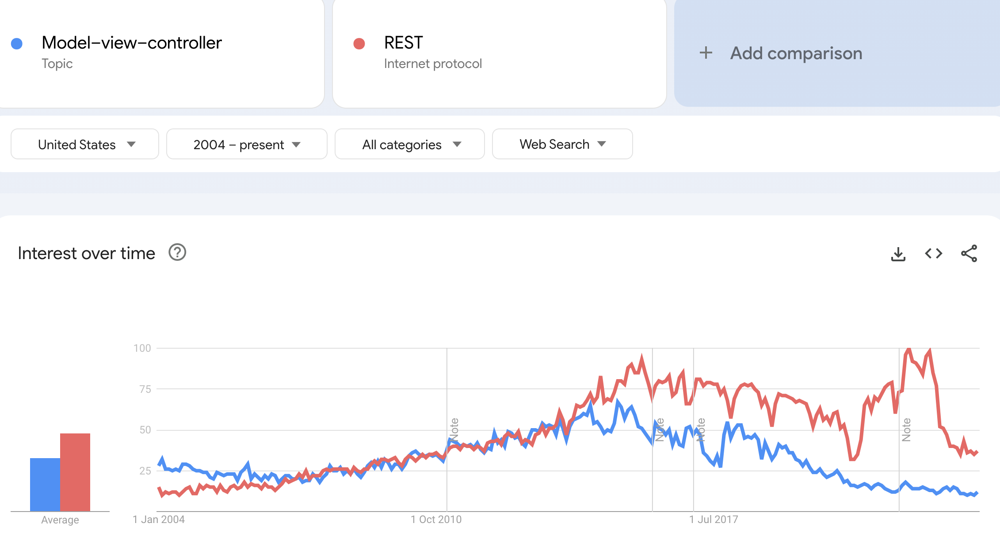

# An MVC-style Application vs a REST API

In this lesson, we’re going to talk about architectural styles of building a web application.

Specifically, we’ll discuss the REST style of web application and the more traditional Model - View - Controller style.

## MVC and REST

There are many architectural styles we can leverage for building a web application.

In this lesson, we’re going to focus on two very common ones to build up a high-level understanding of these, so that you can pick the right one for your particular application.

**We’re going to touch on traditional MVC and on the relatively newer REST style.**

## MVC

In a very simplified way, **the traditional MVC architectural pattern decouples the application into three main responsibilities**:

-   the model
-   the view
-   the controller

The interesting part here is that the view is used as a visual representation of the Model.

## REST

**REST simply returns the representation of the Resource / Model directly in whatever media type the client asks for**, without making any assumptions of how the data will be visually represented over on the client side.

That’s entirely the responsibility of the client, which is, for example, why this fits so well with JS-heavy clients, SPAs, etc.

Of course, REST means a lot more than just that, and we’ll explore REST in more detail in its own module.

But for now, that’s the core difference to keep in mind.

## Spring MVC

Now, let’s talk about the Spring take on all of this.

Spring MVC, as the name suggests, was first focused on the traditional style of MVC applications.

That’s because it was built before REST was as popular.

Then, when REST did become hugely popular: [Model-view-controller REST Google Search Trend](https://trends.google.com/trends/explore?date=all&geo=US&q=%2Fm%2F01q9vj,%2Fm%2F03nsxd)



**The core Spring team decided to add first-class REST support, as part of Spring MVC**, and not as a separate part of the framework.

## Examples

We’ll explore both the REST and the MVC architectural styles in their own separate modules

But, for now, let’s have a very quick look at a simple example implementation of the more traditional MVC-style architecture:

```
@GetMapping("/viewProjectPage")
public ModelAndView projectPage() {
    ModelAndView modelAndView = new ModelAndView("projectPage");
    modelAndView.addObject("message", "Baeldung");
    return modelAndView;
}
```

**Notice the URL and the return type here - _ModelAndView._** Also, the style of programming is tied to the framework.

This is just a very simple example; there’s a lot more to cover.

Now, if we have a look at a RESTful example:

```
@GetMapping("/project") 
public Project project() { 
    Project project = projectService.find...; 
    return project; 
}
```

Notice the URL here represents a Resource, and doesn't contain any verb, since **the verb is the HTTP verb defined in the mapping; in our case here - GET**.

Also, **the return type is directly the Resource**, as opposed to the framework-specific _ModelAndView_ from our previous example.

## Properties of the REST Architectural Style (extra)

Let’s look into a few more properties of the REST architectural style:

**REST security**

REST is not secure by default, but there are many security frameworks and protocols to choose from, when securing a REST API such as using HTTPS, Basic Authentication, JSON Web Tokens (JWT) or OAuth2.

**REST interoperability**

In REST the client and server are independent and do not rely on each other. This allows for the use of different technologies, as long as the client and server share the same API interface. This means we can consider REST to be interoperable.

**REST scalability**

An architectural constraint of REST which contributes to it being easily scalable is statelessness. This requires that each client request contains the necessary information for the server to process it without relying on previous client context.

A REST system also allows implementing caching for responses which can be reused for the same requests later; this can improve the performance.

Finally, a system built using REST can be split into multiple modules and allows adding functionality such as load balancing to distribute the load on the system.

## Resources
- [Model–View–Controller](https://en.wikipedia.org/wiki/Model%E2%80%93view%E2%80%93controller)

