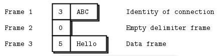

# Communication styles (ZeroMQ)

## Introduction

ZeroMQ (ØMQ, 0MQ, or zmq) is a high-performance asynchronous and brokerless messaging library designed to simplify the construction of distributed and parallel applications. It provides a uniform API that allows programmers to send and receive messages between different processes, devices, and networks, hiding the underlying complexity of network communication.

The main objectives of ZeroMQ are:

* **Ease of Use**: Provide a simple and intuitive API that simplifies inter-process communication.
* **High Performance**: Optimize message transmission speed by reducing latency and increasing throughput.
* **Scalability**: Enable the construction of applications that can easily scale across multiple nodes.
* **Flexibility**: Support various messaging patterns, such as request-reply, publish-subscribe, and more.
* **Portability**: Be compatible with numerous programming languages and platforms.

All the mechanism is simply based on sockets and their life cycle is quite simple: creation, configuration (setting parameters to identify socket's typology), binding/connecting, sending/receiving and destruction. Moreover, unlike traditional TCP connections, ZeroMQ supports multiple transports (inproc, ipc, tcp, pgm, epgm) and handles automatic reconnection if needed. ZeroMQ allows for asynchronous operations, where clients can start sending messages even before the server is up and running.

## Messaging patterns

### Preview

ZeroMQ uses specific messaging patterns to route and queue messages effectively. These patterns are implemented through pairs of sockets with matching types:

* **REQ-REP**&rarr;Connects clients to services, supporting remote procedure calls and task distribution. This pattern is synchronous by default, but we'll se later that its evolution (DEALER-ROUTER) make possible to maintain the client-server approach but in an async context.
* **PUSH-PULL**&rarr;Distributes tasks in a fan-out/fan-in pattern, suitable for parallel task distribution.
* **PUB-SUB**&rarr;Typical pub-sun approach with a publisher and N subscribers.
* **PAIR-PAIR**&rarr;Connects two sockets exclusively, typically within the same process.

In the following, we're going to exlpore in particular the REQ-REP and the PUB-SUB pattern.

### PUSH - PULL and PAIR - PAIR patterns

PUSH-PULL sockets simply involve producers sending messages via the PUSH socket and consumers reading from the PULL socket. This configuration is also recommended for load balancing because the PUSH socket distributes messages in a round-robin manner among the connected PULL sockets. We won't go into the specifics of this configuration as the following (DEALER-ROUTER) is quite similar.

PAIR-PAIR sockets are exclusively connected sockets, essentially implementing PUSH-PULL in both directions but only between the two endpoints. This is not particularly useful for us since we may need to communicate with multiple endpoints simultaneously.

### REQUEST - REPLY pattern

First of all we need to specify that this pattern builds one-to-one synchronous communications between nodes and data are exchanged in envelopes. Those are fundamental because they allow packaging data with an address without altering the data itself. This enables the creation of intermediaries like APIs and proxies that manage addresses independently of message content. Moreover, the envelope contains the return address for replies so it facilitates round-trip request-reply dialogs in a stateless ZeroMQ network. The good news is that REQ and REP sockets manage envelopes automatically, where developers typically don't interact directly with them.
The structure of the simplest possible REQ envelope is really simple: a delimiter frame (just empty) ad data.


Similarly the easiest REP envelop will be:


Anyway, as we've already said, this pattern is for synchronous communications, but we want to explore asynchronous communications (don't foget we want to interconnect microservices in a distributed architecture and synchronous behaviour is devil).
The evolution of REQ-REP is the DEALER-ROUTER combination which, in reality, is born for being a proxy between REQ and REP like in the following image.


The proxy does this, in pseudo-code:

```pseudocode
prepare context, frontend and backend sockets
while true:
    poll on both sockets
    if frontend had input:
        read all frames from frontend
        send to backend
    if backend had input:
        read all frames from backend
        send to frontend
```

The ROUTER socket, unlike other sockets, tracks every connection it has, and tells the caller about these. The way it tells the caller is to stick the connection identity in front of each message received. An identity, sometimes called an address, is just a binary string with no meaning except “this is a unique handle to the connection”. Then, when you send a message via a ROUTER socket, you first send an identity frame. So, the envelope that ROUTER socket delivers to DEALER socket is something like this:



Identities are a difficult concept to understand, but it’s essential if you want to become a ZeroMQ expert. The ROUTER socket invents a random identity for each connection with which it works. If there are three REQ sockets connected to a ROUTER socket, it will invent three random identities, one for each REQ socket.
Consequently, DEALER socket will reply to the ROUTER (after the communication with the REPLY) with the same reply envelope seen before, but with the identity.

In the example we'll see in the next guide, take advantage of ROUTER-DEALER combination's properties for defining an asynchronous communication between N dealers and 1 router (the interesting thing is that we could make the vice-versa without any problem). DEALER talking to ROUTER gives us asynchronous clients talking to asynchronous servers, where both sides have full control over the message formats. Because both DEALER and ROUTER can work with arbitrary message formats, if you hope to use these safely, you have to become a little bit of a protocol designer. At the very least you must decide whether you wish to emulate the REQ/REP reply envelope. It depends on whether you actually need to send replies or not.

Nice usage of ROUTER-DEALER pattern is for load balancing purposes. We've already said that DEALER and ROUTER sockets can bind/connect multiple endpoints simultaneously, so it's possible to have one dealer which delivers messages to multiple routers. In this configuration, we can notice (and in the next guide we'll see) that only one router take in handling the request coming from the dealer, like it has been ACKed.

### PUB - SUB pattern

This patter is born to make PUB sending each message to “all of many” (subs) with in the purpose of being very scalable. This means large volumes of data, sent rapidly to many recipients. To get scalability, PUB-SUB uses the same trick as push-pull, which is to get rid of back-chatter. This means that recipients don’t talk back to senders. There are some exceptions, e.g., SUB sockets will send subscriptions to PUB sockets, but it’s anonymous and infrequent. When we remove back-chatter, our overall message flow becomes much simpler, which lets us make simpler APIs, simpler protocols, and in general reach many more people. But we also remove any possibility to coordinate senders and receivers. What this means is:

* Publishers can’t tell when subscribers are successfully connected, both on initial connections, and on reconnections after network failures.

* Subscribers can’t tell publishers anything that would allow publishers to control the rate of messages they send. Publishers only have one setting, which is full-speed, and subscribers must either keep up or lose messages.

* Publishers can’t tell when subscribers have disappeared due to processes crashing, networks breaking, and so on.

The downside is that we actually need all of these if we want to do reliable multicast. The ZeroMQ pub-sub pattern will lose messages arbitrarily when a subscriber is connecting, when a network failure occurs, or just if the subscriber or network can’t keep up with the publisher. The upside is that there are many use cases where almost reliable multicast is just fine. When we need this back-chatter, we can either switch to using ROUTER-DEALER (which I tend to do for most normal volume cases), or we can add a separate channel for synchronization. 

In terms of reliability, typically failures are the following:

* Subscribers join late, so they miss messages the server already sent.
* Subscribers can fetch messages too slowly, so queues build up and then overflow.
* Subscribers can drop off and lose messages while they are away.
* Subscribers can crash and restart, and lose whatever data they already received.
* Networks can become overloaded and drop data (specifically, for PGM).
* Networks can become too slow, so publisher-side queues overflow and publishers crash.

ZeroMQ forces default limits on its internal buffers (the so-called high-water mark or HWM), so publisher crashes are rarer unless you deliberately set the HWM to infinite.

## Conclusions

In light of what we have seen, we can conclude that the ROUTER-DEALER is a non-standard configuration, but one that we can misuse to obtain interesting characteristics. We can see it as a PUB-SUB system where the first SUB to receive the message processes the result (this can be useful in very specific contexts).

As for the PUB-SUB system, we are in the classic context where we have the guarantee that all subscribers receive the messages, but only after subscribing. Indeed, if guarantees are needed for messages prior to the subscription, it is the developer's responsibility to implement synchronization mechanisms between publishers and subscribers (e.g., service discovery).

In this guide, we have tried to condense the key concepts of ZeroMQ, but if you want to go deeper, you can consult the [official documentation](https://zguide.zeromq.org/).